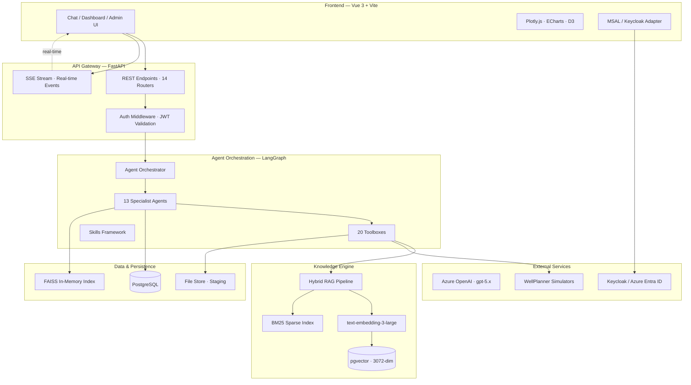
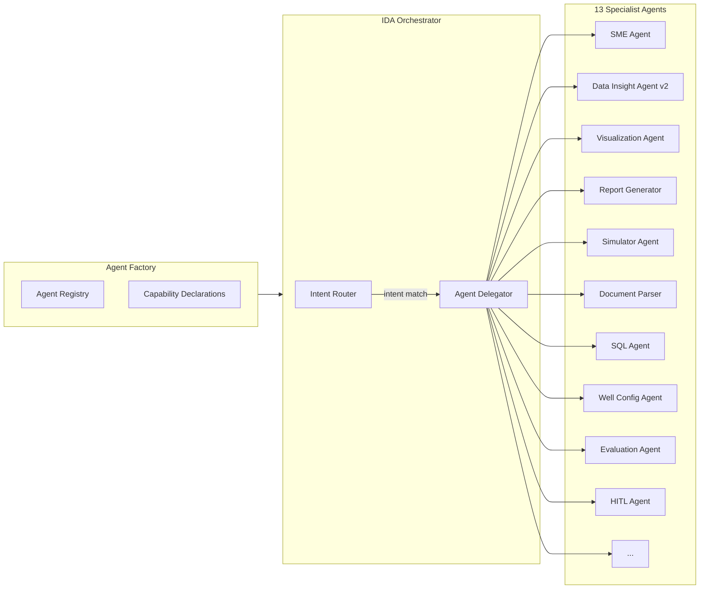
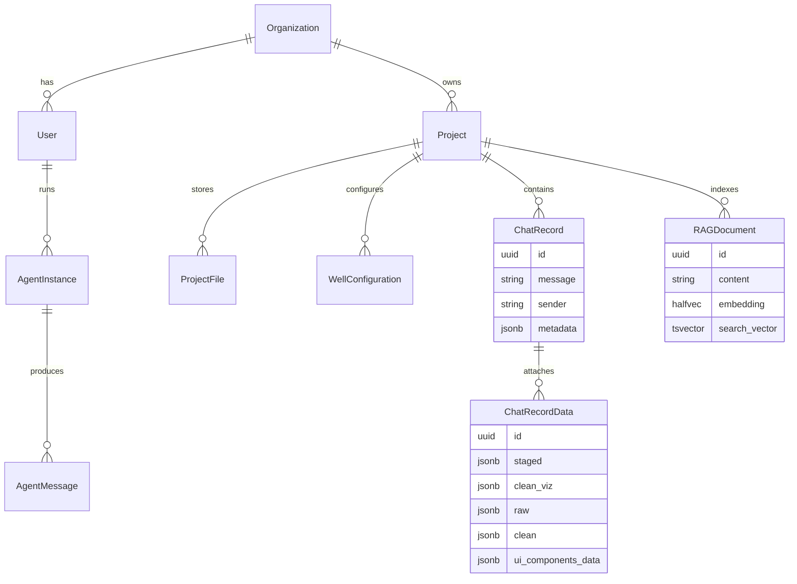
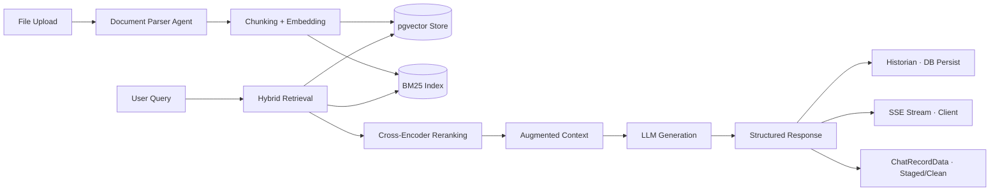
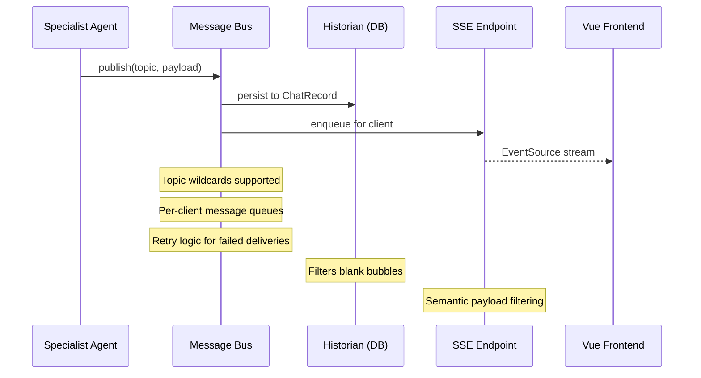
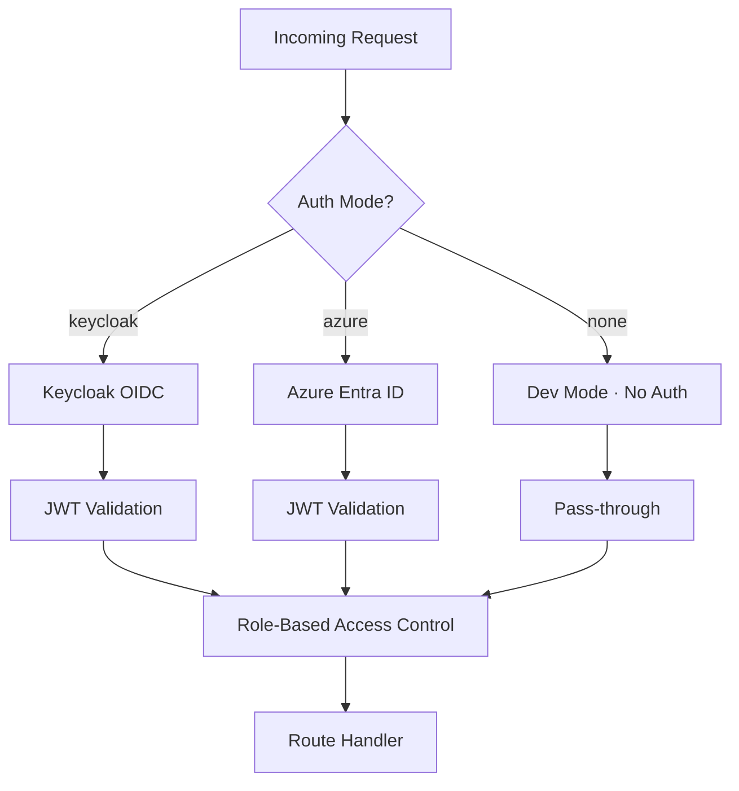
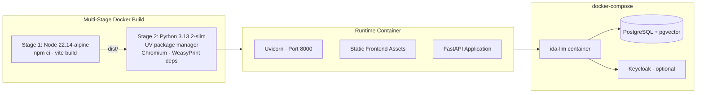

# IDA Platform — Engineering Analysis

> A comprehensive engineering analysis of the Intelligent Drilling Assistant (IDA) platform, examining its architecture, technology stack, and implementation through the lens of core software engineering disciplines: **requirements & design**, **modularity & composition**, **data architecture**, **reliability & observability**, **security**, **deployment & operations**, and **testing & quality assurance**.

---

## 1. System Architecture Overview

IDA is a **multi-agent LLM platform** for drilling engineering. It orchestrates specialist AI agents backed by Azure OpenAI models, a hybrid RAG knowledge engine, domain-specific simulators, and a reactive Vue 3 frontend — all deployed as a containerized monolith behind SSE-driven real-time messaging.



---

## 2. Technology Stack

### 2.1 Backend

| Layer | Technology | Version | Role |
|-------|-----------|---------|------|
| **Runtime** | Python | 3.13 | Application runtime |
| **Web Framework** | FastAPI | 0.115.11 | Async REST + SSE API |
| **ASGI Server** | Uvicorn | 0.34.0 | HTTP server |
| **LLM Orchestration** | LangChain | 0.3.20 | Model abstraction, chains |
| **Agent Graphs** | LangGraph | 0.3.34 | StateGraph-based agent execution |
| **LLM Provider** | LangChain-OpenAI | 0.3.8 | Azure OpenAI bindings |
| **ORM** | SQLModel | 0.0.24 | SQLAlchemy + Pydantic models |
| **Vector Store** | pgvector | 0.4.0 | PostgreSQL vector extension |
| **In-Memory Search** | FAISS-CPU | 1.10.0 | Fast approximate nearest neighbors |
| **Data Processing** | Pandas / NumPy / PyArrow | 2.2 / 2.2 / 20.0 | Tabular data pipeline |
| **PDF Generation** | WeasyPrint | 60.0 | HTML-to-PDF report rendering |
| **Document Parsing** | PyMuPDF4LLM, LlamaParse, PaddleOCR | — | Multi-format ingestion |
| **Charting (server)** | Plotly | 6.3.0 | Server-side chart generation |
| **Linting** | Ruff | 0.9.10 | Fast Python linter & formatter |
| **Migrations** | Alembic | 1.13.1 | Schema versioning |

### 2.2 Frontend

| Layer | Technology | Version | Role |
|-------|-----------|---------|------|
| **Framework** | Vue 3 (Composition API) | 3.5.17 | Reactive UI |
| **Build** | Vite | 6.3.5 | Dev server & bundler |
| **Language** | TypeScript | 5.8.3 | Type safety |
| **Styling** | Tailwind CSS | 4.1.11 | Utility-first CSS |
| **Charts** | Plotly.js / ECharts / D3 | 3.1 / 6.0 / 7.9 | Interactive visualization |
| **HTTP** | Axios | 1.10.0 | API client |
| **Auth** | MSAL-Browser | 4.27.0 | Azure Entra ID auth |
| **Testing** | Vitest | 4.1.0 | Unit & component tests |
| **Markdown** | markdown-it / KaTeX | — | Rich content rendering |

### 2.3 LLM Model Tiers

IDA employs a **tiered model strategy** to balance cost, latency, and capability:

| Tier | Model | Context | Cost (In/Out per 1M) | Use Case |
|------|-------|---------|----------------------|----------|
| `embeddings_default` | text-embedding-3-large | — | $0.172 / — | Vector embeddings |
| `micro_fast` | gpt-5-nano | — | $0.05 / $0.40 | Quick classifications |
| `micro_smart` | gpt-5-nano | — | $0.05 / $0.40 | Light reasoning |
| `balanced` | gpt-5-mini | — | $0.25 / $2.00 | General agent tasks |
| `context_master` | gpt-5.2 | 1M tokens | $2.50 / $15.00 | Large context analysis |
| `gemini` | Gemini-2.5-flash | — | — | Fallback / alt provider |

---

## 3. Modularity & Composition

### 3.1 Agent Architecture

IDA's agent system follows a **factory + capability** pattern. Each agent is a LangGraph `StateGraph` node graph, registered via `AgentFactory` and instantiated per-session.



**Key design properties:**

- **AgentBase** defines the contract: `capabilities`, `description`, `tools_filter`, graph construction
- **ToolsFilter** controls per-agent, per-node tool visibility — each graph node sees only its allowed toolboxes/tools
- **20 Toolboxes** provide composable tool bundles (RAG, project, data_visualization, simulation, SQL, skills, chat_record_data, etc.)
- **Skills Framework** enables dynamic, user-defined tool loading at runtime

### 3.2 Toolbox Composition

Tools are composed through a layered registration system:

```
common_tools.py  →  registers 20 toolboxes globally
       ↓
  AgentBase._get_tools()  →  applies ToolsFilter per graph node
       ↓
  LangGraph ToolNode  →  executes filtered tool set
```

Each toolbox is a self-contained class with `setup_dependencies()` for DI and `get_tools()` returning LangChain `StructuredTool` instances. This enables:

- **Isolation** — toolboxes don't depend on each other
- **Selective exposure** — agents see only relevant tools
- **Token safety** — e.g., `ChatRecordDataToolbox` uses discover-then-fetch pattern to prevent context overflow

---

## 4. Data Architecture

### 4.1 Database Layer

PostgreSQL serves as the single source of truth, with 24 model files covering:



**Key PostgreSQL features used:**

- **JSONB** — flexible schema for chat metadata, agent state, simulation results
- **HALFVEC (3072-dim)** — pgvector half-precision vectors for embedding storage
- **TSVECTOR** — full-text search indexes for document retrieval
- **Connection pooling** — configurable pool_size (default 5) + max_overflow (10)
- **Alembic migrations** — version-controlled schema evolution

### 4.2 Data Flow Pipeline



---

## 5. RAG Knowledge Engine

IDA implements a **hybrid retrieval-augmented generation** pipeline combining dense vector search with sparse lexical matching.

### 5.1 Pipeline Architecture

| Stage | Implementation | Details |
|-------|---------------|---------|
| **Embedding** | text-embedding-3-large | 3072-dimensional vectors |
| **Dense retrieval** | pgvector (HALFVEC) | Cosine similarity search |
| **Sparse retrieval** | BM25 (rank_bm25) | Term-frequency matching |
| **Reranking** | Cross-encoder | Learned relevance scoring |
| **Fallback** | FAISS-CPU | In-memory ANN index |

### 5.2 Knowledge Scopes

Documents are organized into five retrieval scopes, enabling context-aware search:

| Scope | Code | Purpose |
|-------|------|---------|
| General Domain Knowledge | `GDK` | Industry-wide drilling references |
| Organization Domain Knowledge | `ODK` | Company-specific standards |
| Project Domain Knowledge | `PDK` | Project-specific documents |
| Chat Context | `CHAT` | Conversation history |
| Test Data | `TEST` | Test fixtures |

---

## 6. Message Bus & Real-Time Communication

### 6.1 Internal Message Bus

The message bus is an **async queue-based pub/sub** system that decouples agent execution from API delivery:



**Design properties:**
- **Topic wildcards** — flexible subscription routing
- **Per-client queues** — isolated delivery channels
- **Sync wrappers** — bridge async bus to sync tool contexts
- **Historian layer** — DB persistence with semantic filtering (suppresses empty/forwarded-only messages)
- **SSE filtering** — payload-aware content gating at the API boundary

### 6.2 SSE Event Model

The frontend connects via `EventSource` to `/api/projects/{id}/events`. Events carry typed payloads:

- `agent_response` — LLM text chunks (streamed)
- `data_update` — staged/clean data attached to chat records
- `report_panel` — rendered report content
- `ui_components` — dynamic chart/table components
- `agent_status` — lifecycle events (thinking, tool_call, complete)

---

## 7. Simulator Integration

IDA connects to external drilling engineering simulators through a **connector pattern** with schema-driven validation.

| Connector | Domain | Purpose |
|-----------|--------|---------|
| `exp_springmass` | Experimental | Spring-mass physics model |
| `wellplanner_td` | Torque & Drag | Drillstring mechanics |
| `wellplanner_dht` | Downhole Temperature | Thermal modeling |
| `wellplanner_wce` | Well Control Event | Kick/blowout simulation |
| `wellplanner_kt` | Kill Technique | Well control procedures |

Each connector:
1. Declares an **input schema** (validated via Pydantic)
2. Sends parameters to the **WellPlanner API**
3. Receives structured results (time series, pressure profiles)
4. Returns data for agent post-processing and visualization

---

## 8. Security Architecture

### 8.1 Authentication

IDA supports three authentication modes, configured at deployment:



**Security layers:**
- **JWT validation** — token signature + expiry verification via middleware
- **RBAC** — role-based endpoint access (admin, user, viewer)
- **Organization isolation** — data scoped to tenant boundaries
- **API key management** — per-organization LLM API key storage
- **CORS** — configurable allowed origins
- **Input validation** — Pydantic models at every API boundary

### 8.2 LLM Safety

- **Prompt engineering** — system prompts enforce behavioral constraints
- **Cheatsheet system** — dynamic, context-aware instruction injection
- **Token budgeting** — tiered model selection + discover-then-fetch data patterns prevent context overflow
- **Output filtering** — historian and SSE layers suppress malformed/empty agent outputs

---

## 9. Deployment & Operations

### 9.1 Container Architecture



### 9.2 Build & Operations Tooling

The `Makefile` provides 20+ targets for the full development lifecycle:

| Category | Targets | Purpose |
|----------|---------|---------|
| **Build** | `build`, `build-frontend`, `build-image` | Application & container builds |
| **Run** | `run`, `run-dev`, `run-frontend` | Local development servers |
| **Database** | `run-migration`, `migration` | Alembic schema management |
| **Test** | `run-tests`, `run-single-test` | Backend test execution |
| **Quality** | `lint`, `lint-check` | Ruff linting & formatting |
| **Deploy** | `push-image`, `push-image-latest` | Container registry push |
| **Ops** | `docker-up`, `docker-down`, `clean` | Docker Compose lifecycle |

### 9.3 Configuration Hierarchy

```
Environment Variables (IDA_*)  →  highest priority
         ↓
  config.yaml (local-datastore/)  →  deployment config
         ↓
  Hardcoded defaults  →  fallback values
```

Key configuration domains: database, authentication, LLM providers, simulator endpoints, agent thread pool sizing, LangSmith tracing.

---

## 10. Testing & Quality Assurance

### 10.1 Test Strategy

| Layer | Framework | Scope | Runner |
|-------|-----------|-------|--------|
| **Backend unit** | Python unittest | DB, RAG, services, toolboxes | `make run-tests` |
| **Frontend unit** | Vitest + happy-dom | Composables, utilities | `npm run test` |
| **Component** | @vue/test-utils | Vue component behavior | Vitest |
| **Lint** | Ruff (backend), ESLint (frontend) | Static analysis | `make lint` |
| **Pre-commit** | Husky + lint-staged | Automated quality gates | Git hooks |

### 10.2 Quality Controls

- **Type safety** — TypeScript (frontend) + Pydantic (backend) enforce structural contracts
- **Schema validation** — every API boundary validates via Pydantic models
- **Migration safety** — Alembic manages schema changes with up/down reversibility
- **Semantic filtering** — runtime guards against empty/malformed agent outputs at DB and SSE layers

---

## 11. Architectural Patterns Summary

| Pattern | Where Applied | Benefit |
|---------|--------------|---------|
| **Factory + Registry** | Agent creation via AgentFactory | Dynamic agent instantiation, capability-driven routing |
| **StateGraph (DAG)** | LangGraph agent execution | Deterministic, debuggable agent workflows |
| **Toolbox Composition** | 20 toolboxes via ToolsFilter | Selective tool exposure, token safety |
| **Discover-then-Fetch** | ChatRecordDataToolbox | Prevents context overflow with large datasets |
| **Hybrid Retrieval** | RAG (dense + sparse + rerank) | Precision + recall in knowledge search |
| **Pub/Sub Message Bus** | Agent → Historian → SSE → Client | Decoupled async event delivery |
| **Tiered Model Selection** | 6 LLM tiers (nano → 5.2) | Cost/capability optimization |
| **Multi-stage Docker** | Node build → Python runtime | Minimal production image |
| **Config Hierarchy** | Env > YAML > defaults | Flexible deployment configuration |
| **Connector Pattern** | 5 simulator connectors | Schema-validated external integration |

---

## 12. Engineering Assessment

### Strengths

1. **Deep modularity** — the toolbox/agent/skills layering enables feature composition without cross-cutting changes
2. **Token-aware architecture** — tiered models + discover-then-fetch patterns address LLM context limits structurally
3. **Hybrid RAG** — combining dense vectors, sparse BM25, and cross-encoder reranking delivers strong retrieval quality
4. **Real-time reactivity** — SSE + message bus + Vue composables create a responsive user experience
5. **Flexible auth** — three-mode authentication (Keycloak / Azure / none) supports diverse deployment scenarios
6. **Single-container simplicity** — multi-stage Docker build produces one deployable artifact with frontend baked in

### Areas for Engineering Attention

1. **Test coverage depth** — current test infrastructure exists but coverage breadth across 13 agents and 20 toolboxes could be expanded
2. **Horizontal scaling** — single-container architecture with in-memory state (message bus queues, FAISS indexes) limits horizontal scaling without architectural changes
3. **Observability** — LangSmith tracing is available but structured logging, metrics (Prometheus), and distributed tracing could be formalized
4. **Schema evolution** — heavy JSONB usage provides flexibility but reduces queryability and makes schema documentation critical
5. **Simulator coupling** — connector pattern is clean but external API availability is a runtime dependency with limited fallback

---

*Generated from static analysis of the IDA-LLM codebase. All version numbers reflect `pyproject.toml` and `package.json` declarations.*
