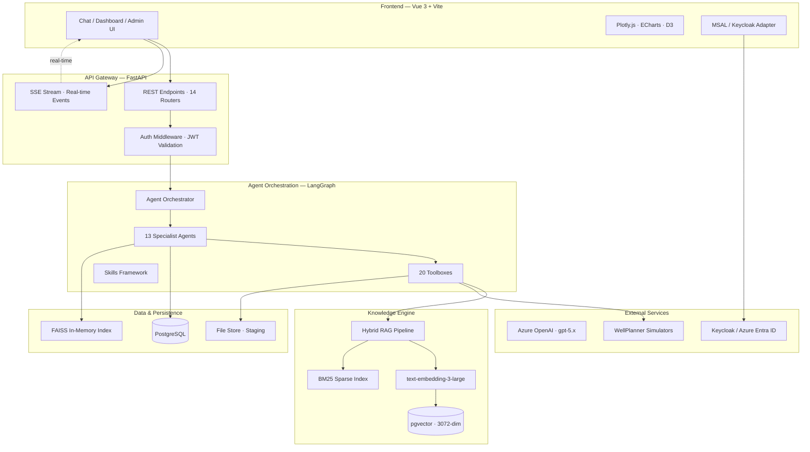
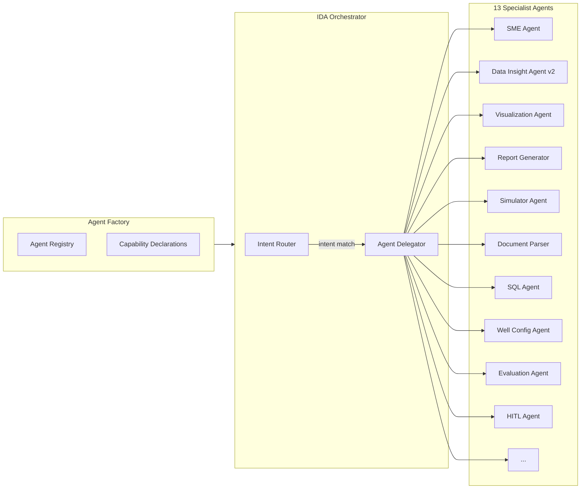
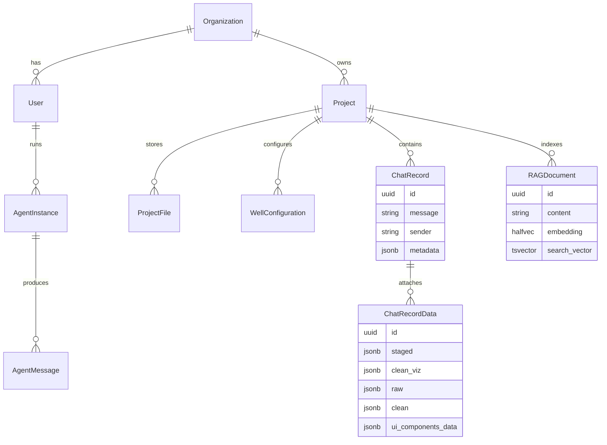
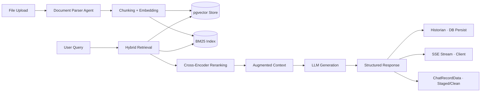
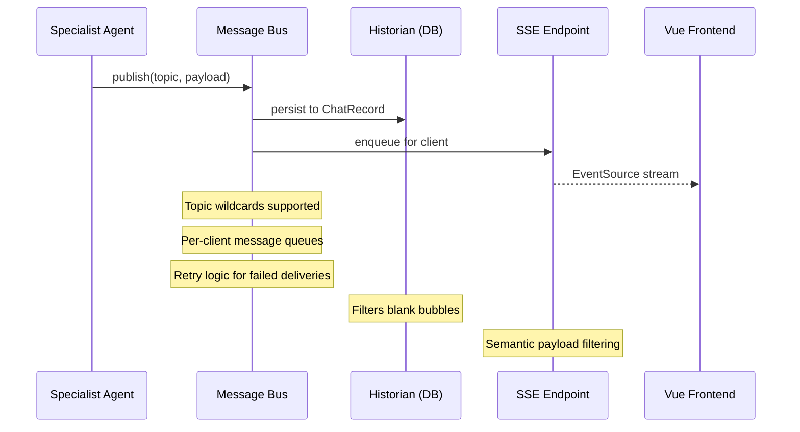
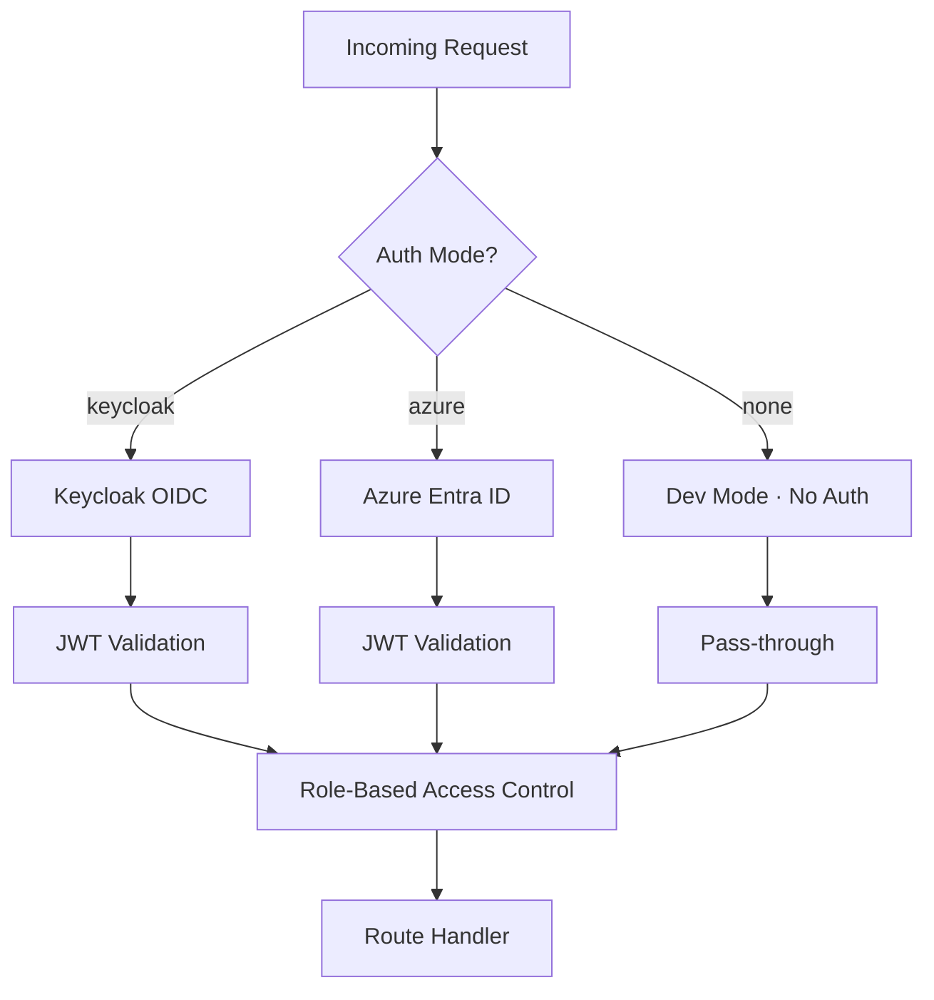
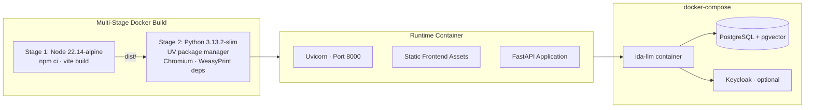

# IDA Platform — Harness Engineering Analysis

> A harness-engineering analysis of the Intelligent Drilling Assistant (IDA) platform, examining the infrastructure that runs, controls, evaluates, and operationalizes model behavior. In this framing, the model is only one component. The main subject is the **execution harness** around it: **orchestration**, **step execution**, **input/output validation**, **tool integration**, **state management**, **retry/timeout behavior**, **logging/tracing**, and **evaluation/testing pipelines**.

---

## 1. Harness Architecture Overview

IDA is a **multi-agent LLM platform** for drilling engineering, but from a harness-engineering perspective it is more specifically a **controlled execution environment** around model-backed workers. The platform makes those workers usable in production by supplying an orchestrator, bounded execution graphs, tool wrappers, validation layers, persistent state capture, retrieval controls, and streaming delivery paths. In practical terms, the value of the system comes from the fact that model behavior is wrapped in deterministic scaffolding rather than exposed raw.



### 1.1 What Harness Engineering Means Here

In this document, **harness engineering** means the engineering of the system around the model that makes LLM behavior operationally usable:

- **Orchestration** — how workflows are decomposed, delegated, and sequenced
- **Execution control** — how steps are run, retried, timed out, and terminated
- **Validation** — how inputs and outputs are typed, parsed, and checked
- **Tool integration** — how external capabilities are exposed through controlled wrappers
- **State discipline** — what is persisted, streamed, filtered, or replayed
- **Observability** — what is logged, traced, and measured during execution
- **Evaluation hooks** — where quality, correctness, and regressions can be measured

This is different from adjacent disciplines:

| Area | Primary Focus |
|------|---------------|
| **Model engineering** | Training, fine-tuning, or serving base models |
| **Prompt engineering** | Designing prompts and prompt templates |
| **Harness engineering** | Running, controlling, evaluating, and integrating model-driven systems |

Under that definition, IDA is best understood as a layered harness with four major concerns:

1. **Interaction harness** — frontend, API, auth, SSE
2. **Execution harness** — orchestrator, specialist agents, graph nodes, tools, skills
3. **Knowledge harness** — retrieval, embeddings, vector/sparse search, reranking
4. **Operational harness** — persistence, simulator integration, deployment, tracing, evaluation, tests

---

## 2. Technology Stack Through the Harness Lens

### 2.1 Backend

| Layer | Technology | Version | Role |
|-------|-----------|---------|------|
| **Runtime** | Python | 3.13 | Application runtime |
| **Web Framework** | FastAPI | 0.115.11 | Async REST + SSE API |
| **ASGI Server** | Uvicorn | 0.34.0 | HTTP server |
| **LLM Orchestration** | LangChain | 0.3.20 | Model abstraction, chains |
| **Agent Graphs** | LangGraph | 0.3.34 | StateGraph-based agent execution |
| **LLM Provider** | LangChain-OpenAI | 0.3.8 | Azure OpenAI bindings |
| **ORM** | SQLModel | 0.0.24 | SQLAlchemy + Pydantic models |
| **Vector Store** | pgvector | 0.4.0 | PostgreSQL vector extension |
| **In-Memory Search** | FAISS-CPU | 1.10.0 | Fast approximate nearest neighbors |
| **Data Processing** | Pandas / NumPy / PyArrow | 2.2 / 2.2 / 20.0 | Tabular data pipeline |
| **PDF Generation** | WeasyPrint | 60.0 | HTML-to-PDF report rendering |
| **Document Parsing** | PyMuPDF4LLM, LlamaParse, PaddleOCR | — | Multi-format ingestion |
| **Charting (server)** | Plotly | 6.3.0 | Server-side chart generation |
| **Linting** | Ruff | 0.9.10 | Fast Python linter & formatter |
| **Migrations** | Alembic | 1.13.1 | Schema versioning |

### 2.2 Frontend

| Layer | Technology | Version | Role |
|-------|-----------|---------|------|
| **Framework** | Vue 3 (Composition API) | 3.5.17 | Reactive UI |
| **Build** | Vite | 6.3.5 | Dev server & bundler |
| **Language** | TypeScript | 5.8.3 | Type safety |
| **Styling** | Tailwind CSS | 4.1.11 | Utility-first CSS |
| **Charts** | Plotly.js / ECharts / D3 | 3.1 / 6.0 / 7.9 | Interactive visualization |
| **HTTP** | Axios | 1.10.0 | API client |
| **Auth** | MSAL-Browser | 4.27.0 | Azure Entra ID auth |
| **Testing** | Vitest | 4.1.0 | Unit & component tests |
| **Markdown** | markdown-it / KaTeX | — | Rich content rendering |

### 2.3 LLM Model Tiers

IDA employs a **tiered model strategy** to balance cost, latency, and capability:

| Tier | Model | Context | Cost (In/Out per 1M) | Use Case |
|------|-------|---------|----------------------|----------|
| `embeddings_default` | text-embedding-3-large | — | $0.172 / — | Vector embeddings |
| `micro_fast` | gpt-5-nano | — | $0.05 / $0.40 | Quick classifications |
| `micro_smart` | gpt-5-nano | — | $0.05 / $0.40 | Light reasoning |
| `balanced` | gpt-5-mini | — | $0.25 / $2.00 | General agent tasks |
| `context_master` | gpt-5.2 | 1M tokens | $2.50 / $15.00 | Large context analysis |
| `gemini` | Gemini-2.5-flash | — | — | Fallback / alt provider |

From a harness perspective, tiering is not just a cost decision. It is an **execution policy mechanism**: different workflow steps can be assigned different reasoning budgets, latency profiles, and failure fallback paths.

---

## 3. Execution Harness: Modularity & Composition

### 3.1 Agent Architecture

IDA's agent system follows a **factory + capability** pattern. From a harness perspective, this is the primary execution shell: each agent is not just a prompt wrapper, but a bounded LangGraph `StateGraph` with explicit node transitions, controlled tool access, and session-scoped instantiation via `AgentFactory`.



**Harness properties:**

- **AgentBase** defines the contract: `capabilities`, `description`, `tools_filter`, graph construction
- **ToolsFilter** controls per-agent, per-node tool visibility — each graph node sees only its allowed toolboxes/tools
- **20 Toolboxes** provide composable tool bundles (RAG, project, data_visualization, simulation, SQL, skills, chat_record_data, etc.)
- **Skills Framework** enables dynamic, user-defined tool loading at runtime

This matters for harness engineering because it converts free-form model execution into **policy-constrained execution**. An agent can only act through the graph edges and tool surfaces exposed to it.

In effect, IDA already implements the core harness pattern the user described:

- **Planner/delegator** behavior in the orchestrator
- **Executor** behavior in graph nodes and tool invocations
- **Validator** behavior through typed schemas, filtered tool exposure, and response shaping
- **State manager** behavior through persistent chat records, agent runs, and attached data payloads

### 3.2 Toolbox Composition

Tools are composed through a layered registration system:

```
common_tools.py  →  registers 20 toolboxes globally
       ↓
  AgentBase._get_tools()  →  applies ToolsFilter per graph node
       ↓
  LangGraph ToolNode  →  executes filtered tool set
```

Each toolbox is a self-contained class with `setup_dependencies()` for DI and `get_tools()` returning LangChain `StructuredTool` instances. In harness terms, toolboxes are the **actuation layer**: they define what an agent is allowed to do to the outside world.

This enables:

- **Isolation** — toolboxes don't depend on each other
- **Selective exposure** — agents see only relevant tools
- **Token safety** — e.g., `ChatRecordDataToolbox` uses discover-then-fetch pattern to prevent context overflow

The recent `ChatRecordDataToolbox` pattern is especially significant as harness engineering: it changes data access from uncontrolled payload injection to a two-stage contract of **catalog first, fetch second**.

### 3.3 Step Runner, Validation, and Failure Handling

Although the codebase is not labeled with a single "step runner" abstraction, the harness behavior is present across the LangGraph node structure, tool wrappers, and service layer boundaries:

- **Step execution** is performed by graph nodes that encapsulate distinct reasoning or tool-use stages
- **Input validation** is handled via Pydantic and SQLModel schemas at API, config, and tool boundaries
- **Output shaping** is enforced through structured tool schemas, persisted chat record structures, and UI component payload formats
- **Failure handling** is distributed across message-bus retries, filtered stream delivery, and guarded tool exposure
- **Timeout/retry policy** is present in specific subsystems, but not yet elevated into a single unified workflow policy layer

This is an important distinction: IDA already has many harness behaviors, but some of them are **embedded in components** rather than surfaced as a first-class, centralized runtime control plane.

---

## 4. State Harness: Data Architecture

### 4.1 Database Layer

PostgreSQL serves as the single source of truth. In harness terms, it is the **state ledger** for agent execution, user interaction, retrieval assets, and simulator outputs.

The schema spans 24 model files covering:



**Key PostgreSQL features used:**

- **JSONB** — flexible schema for chat metadata, agent state, simulation results
- **HALFVEC (3072-dim)** — pgvector half-precision vectors for embedding storage
- **TSVECTOR** — full-text search indexes for document retrieval
- **Connection pooling** — configurable pool_size (default 5) + max_overflow (10)
- **Alembic migrations** — version-controlled schema evolution

### 4.2 Data Flow Pipeline



---

## 5. Knowledge Harness: RAG Control Plane

IDA implements a **hybrid retrieval-augmented generation** pipeline combining dense vector search with sparse lexical matching. From a harness perspective, this is the mechanism that bounds model reasoning with curated, ranked, and source-scoped evidence.

### 5.1 Pipeline Architecture

| Stage | Implementation | Details |
|-------|---------------|---------|
| **Embedding** | text-embedding-3-large | 3072-dimensional vectors |
| **Dense retrieval** | pgvector (HALFVEC) | Cosine similarity search |
| **Sparse retrieval** | BM25 (rank_bm25) | Term-frequency matching |
| **Reranking** | Cross-encoder | Learned relevance scoring |
| **Fallback** | FAISS-CPU | In-memory ANN index |

### 5.2 Knowledge Scopes

Documents are organized into five retrieval scopes, enabling context-aware search:

| Scope | Code | Purpose |
|-------|------|---------|
| General Domain Knowledge | `GDK` | Industry-wide drilling references |
| Organization Domain Knowledge | `ODK` | Company-specific standards |
| Project Domain Knowledge | `PDK` | Project-specific documents |
| Chat Context | `CHAT` | Conversation history |
| Test Data | `TEST` | Test fixtures |

---

## 6. Runtime Harness: Message Bus & Real-Time Communication

### 6.1 Internal Message Bus

The message bus is an **async queue-based pub/sub** system that decouples agent execution from API delivery. In harness terms, it is the runtime coordination layer that turns internal agent events into persisted, filtered, and streamable user-visible state.



**Harness properties:**
- **Topic wildcards** — flexible subscription routing
- **Per-client queues** — isolated delivery channels
- **Sync wrappers** — bridge async bus to sync tool contexts
- **Historian layer** — DB persistence with semantic filtering (suppresses empty/forwarded-only messages)
- **SSE filtering** — payload-aware content gating at the API boundary

This is an important harness boundary because the system does not trust raw agent emissions to be directly user-facing. Messages are normalized and filtered twice: once on persistence and once on stream delivery.

### 6.2 Logging, Tracing, and Runtime Visibility

For harness engineering, execution visibility matters as much as execution itself. IDA currently exposes several runtime visibility mechanisms:

- **Historian persistence** records user-visible interaction state
- **SSE event streaming** exposes incremental execution state to clients
- **LangSmith tracing hooks** provide model and chain observability when enabled
- **Database-backed run state** allows agent instance lifecycle inspection

The architecture therefore supports basic runtime tracing, but it is still stronger on **state capture** than on **operational telemetry**. A mature harness would typically add explicit metrics for queue depth, tool latency, model latency, failure rates, and retry counts.

### 6.3 SSE Event Model

The frontend connects via `EventSource` to `/api/projects/{id}/events`. Events carry typed payloads:

- `agent_response` — LLM text chunks (streamed)
- `data_update` — staged/clean data attached to chat records
- `report_panel` — rendered report content
- `ui_components` — dynamic chart/table components
- `agent_status` — lifecycle events (thinking, tool_call, complete)

---

## 7. External Execution Harness: Simulator Integration

IDA connects to external drilling engineering simulators through a **connector pattern** with schema-driven validation. In harness terms, these connectors are controlled escape hatches to deterministic engineering computation.

| Connector | Domain | Purpose |
|-----------|--------|---------|
| `exp_springmass` | Experimental | Spring-mass physics model |
| `wellplanner_td` | Torque & Drag | Drillstring mechanics |
| `wellplanner_dht` | Downhole Temperature | Thermal modeling |
| `wellplanner_wce` | Well Control Event | Kick/blowout simulation |
| `wellplanner_kt` | Kill Technique | Well control procedures |

Each connector:
1. Declares an **input schema** (validated via Pydantic)
2. Sends parameters to the **WellPlanner API**
3. Receives structured results (time series, pressure profiles)
4. Returns data for agent post-processing and visualization

---

## 8. Guardrail Harness: Security & Policy Enforcement

### 8.1 Authentication

IDA supports three authentication modes, configured at deployment:



**Harness layers:**
- **JWT validation** — token signature + expiry verification via middleware
- **RBAC** — role-based endpoint access (admin, user, viewer)
- **Organization isolation** — data scoped to tenant boundaries
- **API key management** — per-organization LLM API key storage
- **CORS** — configurable allowed origins
- **Input validation** — Pydantic models at every API boundary

### 8.2 LLM Safety

- **Prompt engineering** — system prompts enforce behavioral constraints
- **Cheatsheet system** — dynamic, context-aware instruction injection
- **Token budgeting** — tiered model selection + discover-then-fetch data patterns prevent context overflow
- **Output filtering** — historian and SSE layers suppress malformed/empty agent outputs

These controls show that the platform already treats LLM outputs as **untrusted intermediate artifacts** until they pass through the surrounding harness.

---

## 9. Operational Harness: Deployment & Operations

### 9.1 Container Architecture



### 9.2 Build & Operations Tooling

The `Makefile` provides 20+ targets for the full development lifecycle:

| Category | Targets | Purpose |
|----------|---------|---------|
| **Build** | `build`, `build-frontend`, `build-image` | Application & container builds |
| **Run** | `run`, `run-dev`, `run-frontend` | Local development servers |
| **Database** | `run-migration`, `migration` | Alembic schema management |
| **Test** | `run-tests`, `run-single-test` | Backend test execution |
| **Quality** | `lint`, `lint-check` | Ruff linting & formatting |
| **Deploy** | `push-image`, `push-image-latest` | Container registry push |
| **Ops** | `docker-up`, `docker-down`, `clean` | Docker Compose lifecycle |

### 9.3 Configuration Hierarchy

```
Environment Variables (IDA_*)  →  highest priority
         ↓
  config.yaml (local-datastore/)  →  deployment config
         ↓
  Hardcoded defaults  →  fallback values
```

Key configuration domains: database, authentication, LLM providers, simulator endpoints, agent thread pool sizing, LangSmith tracing.

From a harness-engineering standpoint, the configuration stack is critical because it determines the behavior envelope of the system without code changes: model tier selection, auth mode, tracing, persistence, and connector endpoints are all runtime-controllable.

### 9.4 Operational Control Surface

Viewed strictly through the harness lens, operations in IDA are largely about controlling execution behavior in production:

- selecting the auth regime
- selecting provider/model tiers
- enabling or disabling tracing
- configuring DB and migration behavior
- controlling simulator endpoints and credentials
- tuning thread-pool and worker behavior

That makes the configuration layer part of the harness itself, not merely deployment plumbing.

---

## 10. Verification Harness: Testing & Quality Assurance

### 10.1 Test Strategy

| Layer | Framework | Scope | Runner |
|-------|-----------|-------|--------|
| **Backend unit** | Python unittest | DB, RAG, services, toolboxes | `make run-tests` |
| **Frontend unit** | Vitest + happy-dom | Composables, utilities | `npm run test` |
| **Component** | @vue/test-utils | Vue component behavior | Vitest |
| **Lint** | Ruff (backend), ESLint (frontend) | Static analysis | `make lint` |
| **Pre-commit** | Husky + lint-staged | Automated quality gates | Git hooks |

### 10.2 Quality Controls

- **Type safety** — TypeScript (frontend) + Pydantic (backend) enforce structural contracts
- **Schema validation** — every API boundary validates via Pydantic models
- **Migration safety** — Alembic manages schema changes with up/down reversibility
- **Semantic filtering** — runtime guards against empty/malformed agent outputs at DB and SSE layers

The current verification harness is solid at the structural level, but still uneven at the behavioral level. The codebase has the pieces needed for strong harness verification, yet most evidence points to **unit and integration confidence**, not a full **agent-evaluation harness** with systematic scenario replay, prompt regression suites, or tool-usage trace assertions.

### 10.3 Evaluation Harness Maturity

Using the user's definition, this is the clearest place where harness engineering can still expand. A stronger evaluation harness for IDA would include:

1. **Prompt/agent regression suites** — fixed scenario sets with expected behavioral envelopes
2. **Workflow replay** — rerunning historical tasks against new prompts, tools, or models
3. **Trace-based assertions** — checking not just the final answer, but which tools were called and in what order
4. **Structured output scoring** — validating charts, reports, and data payloads against schemas and quality rules
5. **Failure injection** — simulator outage, malformed tool output, token overflow, and auth failure scenarios

That is the difference between a system that can run and a system that can be **safely evolved**.

---

## 11. Harness Patterns Summary

| Harness Pattern | Where Applied | Harness Value |
|---------|--------------|---------|
| **Factory + Registry** | Agent creation via AgentFactory | Centralized control over what workers exist and when they can be instantiated |
| **StateGraph (DAG)** | LangGraph agent execution | Converts stochastic reasoning into bounded, inspectable execution paths |
| **Toolbox Composition** | 20 toolboxes via ToolsFilter | Restricts actuation surfaces to task-relevant operations |
| **Discover-then-Fetch** | ChatRecordDataToolbox | Prevents uncontrolled context injection from large datasets |
| **Hybrid Retrieval** | RAG (dense + sparse + rerank) | Grounds generation in ranked evidence rather than raw model recall |
| **Pub/Sub Message Bus** | Agent → Historian → SSE → Client | Separates generation, persistence, and delivery into controllable stages |
| **Tiered Model Selection** | 6 LLM tiers (nano → 5.2) | Matches capability and risk profile to task class |
| **Multi-stage Docker** | Node build → Python runtime | Stabilizes runtime packaging and deployment reproducibility |
| **Config Hierarchy** | Env > YAML > defaults | Makes harness behavior tunable without changing code |
| **Connector Pattern** | 5 simulator connectors | Wraps external deterministic engines behind validated interfaces |

---

## 12. Harness Engineering Assessment

### Strengths

1. **Strong execution containment** — LangGraph state machines, factory registration, and tool filters give IDA a real execution harness instead of prompt-only agents
2. **Controlled actuation surfaces** — toolbox composition limits what agents can touch and creates a clean place to enforce policy
3. **Evidence-bounded reasoning** — hybrid RAG and scoped knowledge domains reduce dependence on unconstrained model recall
4. **Stateful runtime accountability** — historian persistence plus SSE filtering produce an inspectable chain from agent event to user-visible output
5. **Practical guardrails already exist** — auth modes, semantic output suppression, model tiering, and schema validation form a credible baseline harness
6. **Operational simplicity** — a single deployable backend/frontend artifact lowers the risk surface for early-stage operations

### Areas for Harness Attention

1. **Evaluation harness depth** — the system would benefit from explicit agent regression suites, scenario replay, golden traces, and tool-call assertions
2. **Runtime observability** — LangSmith helps, but production harnessing would be stronger with structured logs, metrics, latency budgets, and failure dashboards
3. **Scale-out semantics** — in-memory queues and FAISS-backed state introduce friction for horizontally scaled or multi-worker execution
4. **State contract clarity** — heavy JSONB use is flexible, but harnesses become easier to validate when critical state has stricter typed contracts
5. **External dependency hardening** — simulator connectors and provider APIs need clearer fallback, retry, and degradation strategies to keep the harness stable under partial failure

### Bottom Line

IDA is not merely an AI application with multiple agents. It is already a meaningful **LLM harness system**: the codebase wraps generative behavior in orchestration logic, graph-based execution, tool restrictions, typed boundaries, retrieval controls, state persistence, stream filtering, and deployment-time policy.

Using the stricter definition of harness engineering, IDA's center of gravity is not the prompt alone and not the model alone. It is the **system that runs the model safely**. The next maturity step is therefore not adding raw capability first; it is strengthening the **evaluation, observability, retry/timeout policy, and failure-management harness** around the capability that already exists.

---

*Generated from static analysis of the IDA-LLM codebase. All version numbers reflect `pyproject.toml` and `package.json` declarations.*
