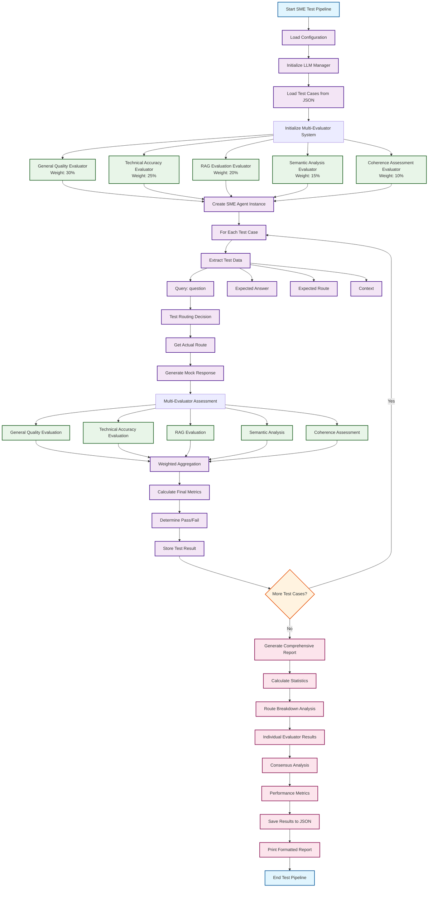

# SME Agent Test Workflow

## Mermaid Workflow Diagram

## Detailed Workflow Description

### Phase 1: Initialization
1. **Start SME Test Pipeline**: Begin automated testing process
2. **Load Configuration**: Load LLM and evaluation settings from config.yaml
3. **Initialize LLM Manager**: Set up Azure OpenAI connections
4. **Load Test Cases**: Read predefined Q&A pairs from JSON file
5. **Initialize Multi-Evaluator System**: Set up 5 specialized evaluators

### Phase 2: Evaluator Setup
- **General Quality Evaluator** (30% weight): Assesses correctness, completeness, relevancy, coherence
- **Technical Accuracy Evaluator** (25% weight): Validates oil & gas domain knowledge
- **RAG Evaluation Evaluator** (20% weight): Measures context precision, recall, faithfulness
- **Semantic Analysis Evaluator** (15% weight): Analyzes meaning similarity and concept alignment
- **Coherence Assessment Evaluator** (10% weight): Evaluates structure and readability

### Phase 3: Test Execution
1. **Create SME Agent**: Initialize agent with mocked dependencies
2. **For Each Test Case**: Iterate through all test cases
3. **Extract Test Data**: Parse question, expected answer, route, and context
4. **Test Routing**: Determine which route the agent would take
5. **Generate Response**: Create mock response based on routing decision
6. **Multi-Evaluator Assessment**: Run all 5 evaluators in parallel

### Phase 4: Evaluation & Aggregation
1. **Individual Evaluations**: Each evaluator provides specialized assessment
2. **Weighted Aggregation**: Combine results using configurable weights
3. **Calculate Final Metrics**: Compute overall scores and confidence levels
4. **Determine Pass/Fail**: Apply thresholds to determine test success
5. **Store Results**: Save individual test results

### Phase 5: Reporting
1. **Generate Comprehensive Report**: Create detailed analysis
2. **Calculate Statistics**: Compute averages, success rates, trends
3. **Route Breakdown**: Analyze performance by routing category
4. **Individual Evaluator Results**: Show detailed evaluator assessments
5. **Consensus Analysis**: Measure agreement between evaluators
6. **Performance Metrics**: Track execution times and efficiency
7. **Save & Display**: Export to JSON and print formatted report

## Key Features

- **Parallel Processing**: Multiple evaluators run simultaneously
- **Weighted Scoring**: Configurable importance for different evaluation aspects
- **Comprehensive Metrics**: 10+ evaluation dimensions
- **Robust Error Handling**: Fallback mechanisms for evaluator failures
- **Detailed Reporting**: Complete audit trail and analysis
- **Scientific Rigor**: Statistically sound aggregation methods
