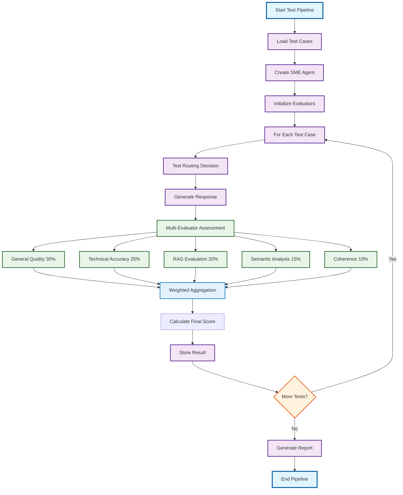

# Phase 4: Build Automatic Test Workflow

## Mermaid Test Workflow Diagram

## Detailed Workflow Description

### Phase 1: Build Dataset (100 Test Cases)
**Purpose**: Create comprehensive test dataset covering all SME agent capabilities

**Test Case Distribution**:
- **RAG Cases (35%)**: Domain knowledge questions requiring retrieval from knowledge base
- **File Cases (35%)**: Questions about uploaded documents requiring file interpretation
- **General Cases (20%)**: General knowledge questions not requiring domain expertise
- **Meta Cases (10%)**: Questions about Ida's identity, capabilities, and role

**Dataset Creation Process**:
1. **For RAG/General/Meta Cases**:
   - Ask Ida directly to get initial answers
   - Human-in-loop review and validation
   - Modify answers if needed for accuracy
   - Wrap in standardized JSON format

2. **For File Cases**:
   - Upload specific files (e.g., NNM101.pdf)
   - Ask Ida file-related questions
   - Human-in-loop review and validation
   - Modify answers if needed for accuracy
   - Wrap in standardized JSON format

### Phase 2: Design Metrics
**Purpose**: Define comprehensive evaluation criteria for both functionality and routing

**Agent Functionality Metrics**:
- **Context Precision (RAG)**: Relevance of retrieved context chunks
- **Context Recall (RAG)**: Completeness of context retrieval
- **Faithfulness (RAG/File)**: Grounding in provided context without hallucination
- **Semantic Similarity (All)**: Cosine similarity between generated and expected answers
- **Answer Correctness (All)**: Factual accuracy and correctness
- **Answer Completeness (All)**: Thoroughness in addressing all question aspects
- **Answer Relevancy (All)**: Directness in addressing the specific question
- **Overall Score**: Weighted average of all metrics

**Agent Routing Metrics**:
- **Routing Accuracy**: Correct routing decisions / Total routing decisions

### Phase 3: Design Evaluators
**Purpose**: Implement multi-LLM evaluation system with specialized evaluators

**Multi-LLM Evaluator System**:
- **General Quality Evaluator** (30% weight): Correctness, completeness, relevancy, coherence
- **Technical Accuracy Evaluator** (25% weight): Oil & gas domain knowledge and terminology
- **RAG Evaluation Evaluator** (20% weight): Context precision, recall, faithfulness
- **Semantic Analysis Evaluator** (15% weight): Meaning similarity and concept alignment
- **Coherence Assessment Evaluator** (10% weight): Structure, clarity, organization

**Key Features**:
- Each evaluator uses specialized LLM models
- Weighted aggregation of results
- Confidence scoring for each evaluation
- Detailed reasoning for audit trail

### Phase 4: Build Automatic Test Workflow
**Purpose**: Implement automated testing pipeline with comprehensive evaluation

**Test Execution Process**:
1. **Load Test Cases**: Read 100 test cases from JSON
2. **Create SME Agent**: Initialize agent with mocked dependencies
3. **Initialize Answer Comparison Service**: Set up multi-evaluator system
4. **For Each Test Case**:
   - Extract test data (question, expected answer, route, context)
   - Test routing decision accuracy
   - Generate response
   - Run multi-evaluator assessment
   - Calculate weighted metrics
   - Determine pass/fail status
   - Store results

### Phase 5: Further Improvement
**Purpose**: Continuous enhancement based on test results

**Enhancement Strategies**:
- Analyze test results for patterns and weaknesses
- Refine evaluator weights based on performance
- Update test cases based on new requirements
- Improve SME agent based on identified issues
- Iterate on evaluation criteria and thresholds

## Key Features

- **Comprehensive Coverage**: Tests all SME agent capabilities (RAG, File, General, Meta)
- **Human-in-Loop Validation**: Ensures high-quality test dataset
- **Multi-LLM Evaluation**: Specialized evaluators for different aspects
- **Weighted Aggregation**: Scientifically sound result combination
- **Detailed Reporting**: Complete analysis and audit trail
- **Continuous Improvement**: Framework for ongoing enhancement
- **Robust Error Handling**: Fallback mechanisms for reliability
