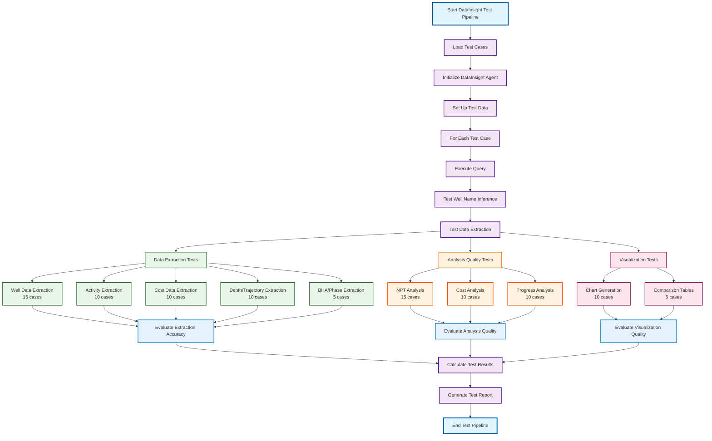

# DataInsight Agent Testing Framework

## Overview

This framework provides a comprehensive approach to testing the DataInsight agent's data extraction and analysis accuracy. The DataInsight agent specializes in drilling data analysis with 20+ specialized tools for extraction, analysis, and visualization.

## Purpose

The DataInsight agent can:
- Extract comprehensive drilling data from DDR reports
- Perform specialized analysis (NPT, cost, phase, BHA, trajectory)
- Generate visualizations and comparisons
- Provide insights across multiple wells and time periods

The testing framework focuses on **data extraction accuracy** and **analysis quality** to ensure the agent provides reliable drilling insights.

## Test Case Distribution (100 total)

### **Data Extraction Tests (50 cases)**

#### **1. Activity Data Extraction (15 cases)**
**Tool**: `tool_extract_drilling_activities`
**Test Fields**:
- **Event Count Accuracy**: Compare extracted event count with ground truth
- **NPT Classification**: Verify correct identification of NPT vs productive events
- **Activity Categorization**: Test accuracy of activity type classification
- **Duration Extraction**: Validate duration field extraction and calculation
- **Time Range Filtering**: Test date range filtering functionality
- **Well Association**: Verify correct well-to-event mapping
- **Cost Integration**: Test daily cost extraction from events
- **Data Structure**: Validate output table structure and completeness

**Quantitative Metrics**:
- Event extraction completeness: `(extracted_events / expected_events) * 100`
- NPT classification accuracy: `(correct_npt_classifications / total_events) * 100`
- Duration calculation accuracy: `1 - |extracted_duration - expected_duration| / expected_duration`
- Data structure completeness: `(present_fields / required_fields) * 100`

#### **2. Progress/Depth Data Extraction (15 cases)**
**Tool**: `tool_extract_depth_data`
**Test Fields**:
- **Depth Step Extraction**: Validate MD/TVD data extraction
- **Progress Table Generation**: Test detailed progress table creation
- **Time Sequence Validation**: Verify chronological ordering of depth steps
- **Depth Calculation Accuracy**: Test depth increment calculations
- **Date Range Filtering**: Validate time-based filtering
- **Well Trajectory Mapping**: Test trajectory data extraction
- **Data Serialization**: Validate object-to-dict conversion

**Quantitative Metrics**:
- Depth extraction accuracy: `1 - |extracted_depth - expected_depth| / expected_depth`
- Progress table completeness: `(extracted_steps / expected_steps) * 100`
- Time sequence correctness: Binary (1 if chronological, 0 if not)
- Data serialization success: `(successful_conversions / total_objects) * 100`

#### **3. Cost Data Extraction (10 cases)**
**Tool**: `tool_extract_cost_data`
**Test Fields**:
- **Daily Cost Extraction**: Validate daily cost field extraction
- **Cumulative Cost Calculation**: Test cumulative cost computation
- **Cost Per Depth Calculation**: Verify cost per depth metrics
- **Date Range Filtering**: Test time-based cost filtering
- **Well Cost Association**: Validate cost-to-well mapping
- **Cost Summary Integration**: Test cost summary data extraction

**Quantitative Metrics**:
- Cost extraction accuracy: `1 - |extracted_cost - expected_cost| / expected_cost`
- Cumulative calculation correctness: `1 - |calculated_cumulative - expected_cumulative| / expected_cumulative`
- Cost per depth accuracy: `1 - |calculated_cpd - expected_cpd| / expected_cpd`

#### **4. General Well Data Extraction (5 cases)**
**Tool**: `tool_extract_general_well_data`
**Test Fields**:
- **Well Information Extraction**: Test well name, location, operator extraction
- **Rig Information**: Validate rig details extraction
- **Well Status**: Test well status and date extraction
- **RAG Service Integration**: Test RAG-based extraction fallback
- **Data Formatting**: Validate markdown table generation

**Quantitative Metrics**:
- Information extraction completeness: `(extracted_fields / expected_fields) * 100`
- RAG service success rate: `(successful_rag_calls / total_calls) * 100`
- Data formatting accuracy: Binary (1 if valid markdown, 0 if not)

#### **5. Phase Information Extraction (5 cases)**
**Tool**: `tool_extract_phase_info`
**Test Fields**:
- **Drilling Phase Table**: Validate drilling phase information extraction
- **Completion Phase Table**: Test completion phase data extraction
- **Mud Information Table**: Verify mud data extraction
- **JSON Response Parsing**: Test JSON response handling
- **RAG Query Accuracy**: Validate RAG query construction

**Quantitative Metrics**:
- Phase table completeness: `(extracted_phases / expected_phases) * 100`
- JSON parsing success rate: `(successful_parses / total_responses) * 100`
- RAG query accuracy: `(successful_queries / total_queries) * 100`

### **Analysis Quality Tests (30 cases)**

#### **1. NPT Analysis (15 cases)**
**Tool**: `tool_generate_npt_analysis`
**Test Fields**:
- **Overview Table Generation**: Test NPT overview table creation
- **Daily Summary Generation**: Validate daily NPT summary creation
- **Statistics Calculation**: Test NPT statistics computation
- **Well Summary Creation**: Verify per-well NPT summaries
- **Activity Type Analysis**: Test activity categorization
- **Cost Integration**: Validate NPT cost calculations

**Quantitative Metrics**:
- Table generation accuracy: `(correct_table_entries / expected_entries) * 100`
- Statistics calculation accuracy: `1 - |calculated_stat - expected_stat| / expected_stat`
- Summary completeness: `(generated_summaries / expected_summaries) * 100`
- Cost calculation accuracy: `1 - |calculated_cost - expected_cost| / expected_cost`

#### **2. Phase Cost Analysis (10 cases)**
**Tool**: `tool_generate_phase_cost_analysis`
**Test Fields**:
- **Phase Cost Calculation**: Test phase-specific cost calculations
- **Time Analysis**: Validate phase time calculations
- **Variance Analysis**: Test planned vs actual variance calculations
- **LLM Integration**: Validate LLM-based analysis generation
- **Table Formatting**: Test markdown table generation

**Quantitative Metrics**:
- Phase cost accuracy: `1 - |calculated_phase_cost - expected_phase_cost| / expected_phase_cost`
- Time calculation accuracy: `1 - |calculated_time - expected_time| / expected_time`
- Variance calculation correctness: `1 - |calculated_variance - expected_variance| / expected_variance`
- LLM response quality: Manual scoring (1-10 scale)

#### **3. Mud Phase Analysis (5 cases)**
**Tool**: `tool_generate_mud_phase_analysis`
**Test Fields**:
- **Mud Property Extraction**: Test mud density, viscosity extraction
- **Phase Correlation**: Validate mud-to-phase correlation
- **Volume Calculations**: Test mud volume calculations
- **Property Analysis**: Validate mud property analysis
- **LLM Integration**: Test LLM-based mud analysis

**Quantitative Metrics**:
- Mud property accuracy: `1 - |extracted_property - expected_property| / expected_property`
- Phase correlation accuracy: `(correct_correlations / total_correlations) * 100`
- Volume calculation accuracy: `1 - |calculated_volume - expected_volume| / expected_volume`

### **Comparison Analysis Tests (20 cases)**

#### **1. NPT Comparison (7 cases)**
**Tool**: `tool_generate_npt_comparison`
**Test Fields**:
- **Well Comparison Table**: Test NPT comparison table generation
- **Performance Metrics**: Validate performance calculation
- **Activity Analysis**: Test activity type comparison
- **Statistical Analysis**: Validate statistical comparisons

**Quantitative Metrics**:
- Comparison table accuracy: `(correct_comparisons / expected_comparisons) * 100`
- Performance metric accuracy: `1 - |calculated_metric - expected_metric| / expected_metric`
- Statistical analysis correctness: Manual validation

#### **2. Cost Comparison (7 cases)**
**Tool**: `tool_generate_cost_comparison`
**Test Fields**:
- **Cost Comparison Table**: Test cost comparison table generation
- **Cost Efficiency Analysis**: Validate cost efficiency calculations
- **Trend Analysis**: Test cost trend identification
- **Statistical Analysis**: Validate cost statistics

**Quantitative Metrics**:
- Cost comparison accuracy: `(correct_cost_comparisons / expected_comparisons) * 100`
- Efficiency calculation accuracy: `1 - |calculated_efficiency - expected_efficiency| / expected_efficiency`
- Trend analysis correctness: Manual validation

#### **3. General Comparison (6 cases)**
**Tool**: `tool_generate_general_comparison`
**Test Fields**:
- **Multi-metric Comparison**: Test comprehensive comparison generation
- **Performance Ranking**: Validate well performance ranking
- **Summary Statistics**: Test summary statistics generation
- **Insight Generation**: Validate key insights extraction

**Quantitative Metrics**:
- Multi-metric accuracy: `(correct_metrics / expected_metrics) * 100`
- Ranking accuracy: `(correct_rankings / expected_rankings) * 100`
- Summary completeness: `(generated_summaries / expected_summaries) * 100`

## Detailed Test Case Examples

### **Data Extraction Test Cases**

#### **Activity Data Extraction Example**
```json
{
  "id": "activity_extract_001",
  "query": "Extract all drilling activities for well 15_9_19_A from 2024-01-01 to 2024-01-31",
  "expected_tool": "tool_extract_drilling_activities",
  "test_wells": ["15_9_19_A"],
  "date_range": {"start": "2024-01-01", "end": "2024-01-31"},
  "ground_truth": {
    "total_events": 45,
    "npt_events": 12,
    "productive_events": 33,
    "total_npt_hours": 18.5,
    "activity_types": ["drilling", "tripping", "wait on weather", "equipment repair"],
    "expected_duration_sum": 168.0
  },
  "test_fields": {
    "event_count_accuracy": {
      "metric": "completeness",
      "formula": "(extracted_events / expected_events) * 100",
      "threshold": 95.0
    },
    "npt_classification_accuracy": {
      "metric": "classification",
      "formula": "(correct_npt_classifications / total_events) * 100",
      "threshold": 90.0
    },
    "duration_calculation_accuracy": {
      "metric": "calculation",
      "formula": "1 - |extracted_duration - expected_duration| / expected_duration",
      "threshold": 0.95
    },
    "data_structure_completeness": {
      "metric": "structure",
      "formula": "(present_fields / required_fields) * 100",
      "threshold": 100.0,
      "required_fields": ["day", "start_time", "end_time", "duration", "activity", "is_npt", "wellbore"]
    }
  },
  "category": "activity_extraction",
  "test_focus": "comprehensive_activity_validation"
}
```

#### **Cost Data Extraction Example**
```json
{
  "id": "cost_extract_001",
  "query": "Extract cost data for well 15_9_19_A",
  "expected_tool": "tool_extract_cost_data",
  "test_wells": ["15_9_19_A"],
  "ground_truth": {
    "total_daily_costs": 31,
    "total_cumulative_cost": 1250000.50,
    "average_daily_cost": 40322.60,
    "cost_per_depth": 357.14,
    "expected_daily_costs": [45000, 42000, 38000, 41000, 39000]
  },
  "test_fields": {
    "cost_extraction_accuracy": {
      "metric": "accuracy",
      "formula": "1 - |extracted_cost - expected_cost| / expected_cost",
      "threshold": 0.95,
      "fields": ["daily_cost", "cumulative_cost"]
    },
    "cumulative_calculation_correctness": {
      "metric": "calculation",
      "formula": "1 - |calculated_cumulative - expected_cumulative| / expected_cumulative",
      "threshold": 0.98
    },
    "cost_per_depth_accuracy": {
      "metric": "calculation",
      "formula": "1 - |calculated_cpd - expected_cpd| / expected_cpd",
      "threshold": 0.90
    },
    "date_range_filtering": {
      "metric": "filtering",
      "formula": "(correct_date_filtered_records / total_records) * 100",
      "threshold": 100.0
    }
  },
  "category": "cost_extraction",
  "test_focus": "cost_calculation_accuracy"
}
```

#### **Progress/Depth Data Extraction Example**
```json
{
  "id": "progress_extract_001",
  "query": "Extract drilling progress data for well 15_9_19_A",
  "expected_tool": "tool_extract_depth_data",
  "test_wells": ["15_9_19_A"],
  "ground_truth": {
    "total_depth_steps": 25,
    "max_depth_md": 3500.25,
    "max_depth_tvd": 3200.50,
    "expected_depth_sequence": [0, 100, 250, 500, 750, 1000],
    "expected_time_sequence": ["2024-01-01T00:00:00Z", "2024-01-02T08:00:00Z", "2024-01-03T16:00:00Z"]
  },
  "test_fields": {
    "depth_extraction_accuracy": {
      "metric": "accuracy",
      "formula": "1 - |extracted_depth - expected_depth| / expected_depth",
      "threshold": 0.95,
      "fields": ["MD", "TVD"]
    },
    "progress_table_completeness": {
      "metric": "completeness",
      "formula": "(extracted_steps / expected_steps) * 100",
      "threshold": 100.0
    },
    "time_sequence_correctness": {
      "metric": "sequence",
      "formula": "binary_check(chronological_order)",
      "threshold": 1.0
    },
    "data_serialization_success": {
      "metric": "serialization",
      "formula": "(successful_conversions / total_objects) * 100",
      "threshold": 100.0
    }
  },
  "category": "progress_extraction",
  "test_focus": "depth_and_progress_accuracy"
}
```

### **Analysis Quality Test Cases**

#### **NPT Analysis Example**
```json
{
  "id": "npt_analysis_001",
  "query": "Generate comprehensive NPT analysis for well 15_9_19_A",
  "expected_tool": "tool_generate_npt_analysis",
  "test_wells": ["15_9_19_A"],
  "ground_truth": {
    "expected_total_events": 12,
    "expected_total_hours": 18.5,
    "expected_activity_types": 4,
    "expected_table_entries": 12,
    "expected_daily_summaries": 5
  },
  "test_fields": {
    "table_generation_accuracy": {
      "metric": "table_accuracy",
      "formula": "(correct_table_entries / expected_entries) * 100",
      "threshold": 100.0
    },
    "statistics_calculation_accuracy": {
      "metric": "calculation",
      "formula": "1 - |calculated_stat - expected_stat| / expected_stat",
      "threshold": 0.95,
      "statistics": ["total_hours", "total_events", "unique_activities"]
    },
    "summary_completeness": {
      "metric": "completeness",
      "formula": "(generated_summaries / expected_summaries) * 100",
      "threshold": 100.0
    },
    "cost_calculation_accuracy": {
      "metric": "calculation",
      "formula": "1 - |calculated_cost - expected_cost| / expected_cost",
      "threshold": 0.90
    }
  },
  "category": "npt_analysis",
  "test_focus": "comprehensive_npt_analysis"
}
```

#### **Phase Cost Analysis Example**
```json
{
  "id": "phase_cost_analysis_001",
  "query": "Analyze phase costs for wells 15_9_19_A and 15_9_19_B",
  "expected_tool": "tool_generate_phase_cost_analysis",
  "test_wells": ["15_9_19_A", "15_9_19_B"],
  "ground_truth": {
    "expected_phases": ["Conductor", "Surface", "Intermediate", "Production"],
    "expected_phase_costs": {
      "15_9_19_A": {"Conductor": 150000, "Surface": 300000, "Intermediate": 500000, "Production": 300000},
      "15_9_19_B": {"Conductor": 140000, "Surface": 280000, "Intermediate": 480000, "Production": 290000}
    },
    "expected_variance_calculations": true
  },
  "test_fields": {
    "phase_cost_accuracy": {
      "metric": "calculation",
      "formula": "1 - |calculated_phase_cost - expected_phase_cost| / expected_phase_cost",
      "threshold": 0.90
    },
    "time_calculation_accuracy": {
      "metric": "calculation",
      "formula": "1 - |calculated_time - expected_time| / expected_time",
      "threshold": 0.85
    },
    "variance_calculation_correctness": {
      "metric": "calculation",
      "formula": "1 - |calculated_variance - expected_variance| / expected_variance",
      "threshold": 0.90
    },
    "llm_response_quality": {
      "metric": "quality",
      "formula": "manual_scoring_1_to_10",
      "threshold": 7.0,
      "criteria": ["table_formatting", "analysis_depth", "insight_relevance"]
    }
  },
  "category": "phase_cost_analysis",
  "test_focus": "phase_cost_calculation_accuracy"
}
```

### **Comparison Analysis Test Cases**

#### **NPT Comparison Example**
```json
{
  "id": "npt_comparison_001",
  "query": "Compare NPT performance between wells 15_9_19_A, 15_9_19_B, and 15_9_19_C",
  "expected_tool": "tool_generate_npt_comparison",
  "test_wells": ["15_9_19_A", "15_9_19_B", "15_9_19_C"],
  "ground_truth": {
    "expected_comparison_metrics": ["total_events", "total_hours", "avg_hours_per_event", "activity_breakdown"],
    "expected_well_rankings": ["15_9_19_B", "15_9_19_A", "15_9_19_C"],
    "expected_performance_insights": 3
  },
  "test_fields": {
    "comparison_table_accuracy": {
      "metric": "table_accuracy",
      "formula": "(correct_comparisons / expected_comparisons) * 100",
      "threshold": 100.0
    },
    "performance_metric_accuracy": {
      "metric": "calculation",
      "formula": "1 - |calculated_metric - expected_metric| / expected_metric",
      "threshold": 0.95
    },
    "statistical_analysis_correctness": {
      "metric": "analysis",
      "formula": "manual_validation",
      "threshold": 1.0,
      "criteria": ["correct_rankings", "valid_insights", "accurate_statistics"]
    }
  },
  "category": "npt_comparison",
  "test_focus": "multi_well_npt_comparison"
}
```

## Evaluation Metrics

### **Data Extraction Accuracy**
1. **Completeness**: Percentage of expected data fields extracted
2. **Accuracy**: Correctness of extracted values
3. **Consistency**: Data format and structure consistency
4. **Coverage**: Percentage of wells/time periods covered

### **Analysis Quality**
1. **Calculation Accuracy**: Correctness of mathematical calculations
2. **Insight Relevance**: Relevance of generated insights
3. **Comparison Validity**: Accuracy of comparative analyses
4. **Trend Identification**: Correct identification of patterns and trends

### **Visualization Quality**
1. **Chart Accuracy**: Correctness of generated charts
2. **Data Representation**: Proper representation of data in visualizations
3. **Chart Completeness**: All expected chart types generated
4. **Visual Clarity**: Readability and clarity of visualizations

## Analysis Testing Methods

### **Quantitative Analysis Testing**

#### **1. NPT Analysis Testing**
**Based on**: `generate_overview_table()`, `generate_daily_npt_summary()`, `generate_npt_comparison_table()`

**Test Methods**:
- **Table Generation Accuracy**: Validate markdown table structure and content
- **Statistics Calculation**: Test `safe_float()` function accuracy for duration and cost calculations
- **Activity Categorization**: Verify NPT activity classification against predefined list
- **Cost Integration**: Test daily cost extraction and summation
- **Well Comparison Logic**: Validate multi-well comparison calculations

**Quantitative Metrics**:
```python
def test_npt_analysis_accuracy():
    # Test overview table generation
    overview_accuracy = validate_table_structure(overview_table, expected_columns)
    
    # Test statistics calculations
    duration_accuracy = 1 - abs(calculated_total_hours - expected_total_hours) / expected_total_hours
    cost_accuracy = 1 - abs(calculated_total_cost - expected_total_cost) / expected_total_cost
    
    # Test activity classification
    classification_accuracy = (correct_npt_classifications / total_events) * 100
    
    # Test daily summary generation
    daily_summary_completeness = (generated_daily_summaries / expected_daily_summaries) * 100
    
    return {
        "overview_accuracy": overview_accuracy,
        "duration_accuracy": duration_accuracy,
        "cost_accuracy": cost_accuracy,
        "classification_accuracy": classification_accuracy,
        "daily_summary_completeness": daily_summary_completeness
    }
```

#### **2. Cost Analysis Testing**
**Based on**: `generate_cost_comparison_table()`, `generate_cost_summary_table()`

**Test Methods**:
- **Cost Calculation Accuracy**: Test daily and cumulative cost calculations
- **Efficiency Metrics**: Validate cost per depth and cost per day calculations
- **Comparison Logic**: Test multi-well cost comparison algorithms
- **Statistical Analysis**: Verify cost trend and variance calculations

**Quantitative Metrics**:
```python
def test_cost_analysis_accuracy():
    # Test cost extraction accuracy
    daily_cost_accuracy = 1 - abs(extracted_daily_cost - expected_daily_cost) / expected_daily_cost
    cumulative_accuracy = 1 - abs(calculated_cumulative - expected_cumulative) / expected_cumulative
    
    # Test cost per depth calculation
    cpd_accuracy = 1 - abs(calculated_cpd - expected_cpd) / expected_cpd
    
    # Test comparison table accuracy
    comparison_accuracy = (correct_cost_comparisons / expected_comparisons) * 100
    
    # Test efficiency calculations
    efficiency_accuracy = 1 - abs(calculated_efficiency - expected_efficiency) / expected_efficiency
    
    return {
        "daily_cost_accuracy": daily_cost_accuracy,
        "cumulative_accuracy": cumulative_accuracy,
        "cpd_accuracy": cpd_accuracy,
        "comparison_accuracy": comparison_accuracy,
        "efficiency_accuracy": efficiency_accuracy
    }
```

#### **3. Progress Analysis Testing**
**Based on**: `extract_progress_events_deterministic()`, `generate_progress_chart_data()`

**Test Methods**:
- **Depth Extraction Accuracy**: Validate MD/TVD data extraction
- **Time Sequence Validation**: Test chronological ordering of depth steps
- **Progress Calculation**: Verify depth increment and rate calculations
- **Data Serialization**: Test object-to-dict conversion accuracy

**Quantitative Metrics**:
```python
def test_progress_analysis_accuracy():
    # Test depth extraction
    depth_accuracy = 1 - abs(extracted_depth - expected_depth) / expected_depth
    
    # Test time sequence
    time_sequence_correctness = 1 if is_chronological(depth_steps) else 0
    
    # Test progress table completeness
    progress_completeness = (extracted_steps / expected_steps) * 100
    
    # Test data serialization
    serialization_success = (successful_conversions / total_objects) * 100
    
    return {
        "depth_accuracy": depth_accuracy,
        "time_sequence_correctness": time_sequence_correctness,
        "progress_completeness": progress_completeness,
        "serialization_success": serialization_success
    }
```

#### **4. Chart Data Generation Testing**
**Based on**: `generate_npt_pie_chart_data()`, `generate_progress_chart_data()`, `generate_cost_vs_time_chart_data()`

**Test Methods**:
- **Data Structure Validation**: Test Plotly.js data structure generation
- **Chart Configuration**: Validate chart layout and configuration
- **Data Aggregation**: Test data grouping and aggregation logic
- **Visualization Accuracy**: Verify chart data matches source data

**Quantitative Metrics**:
```python
def test_chart_generation_accuracy():
    # Test data structure
    data_structure_valid = validate_plotly_data_structure(chart_data)
    
    # Test data accuracy
    data_accuracy = 1 - abs(chart_values - source_values).sum() / source_values.sum()
    
    # Test configuration completeness
    config_completeness = (present_config_fields / required_config_fields) * 100
    
    # Test layout accuracy
    layout_accuracy = validate_layout_structure(layout, expected_layout_fields)
    
    return {
        "data_structure_valid": data_structure_valid,
        "data_accuracy": data_accuracy,
        "config_completeness": config_completeness,
        "layout_accuracy": layout_accuracy
    }
```

### **LLM-Based Analysis Testing**

#### **1. Phase Cost Analysis Testing**
**Tool**: `tool_generate_phase_cost_analysis`
**LLM Integration**: Uses `analysis_llm` for comprehensive analysis

**Test Methods**:
- **Prompt Engineering Validation**: Test system and user prompt construction
- **Response Parsing**: Validate JSON response parsing and error handling
- **Analysis Quality**: Test LLM-generated analysis depth and accuracy
- **Table Formatting**: Validate markdown table generation

**Quantitative Metrics**:
```python
def test_phase_cost_analysis_llm():
    # Test prompt construction
    prompt_quality = validate_prompt_structure(system_prompt, user_prompt)
    
    # Test LLM response quality
    response_quality = evaluate_llm_response(response, criteria=[
        "table_formatting", "analysis_depth", "insight_relevance", "calculation_accuracy"
    ])
    
    # Test JSON parsing
    parsing_success = 1 if json_parsing_successful else 0
    
    # Test analysis completeness
    analysis_completeness = (generated_analysis_sections / expected_sections) * 100
    
    return {
        "prompt_quality": prompt_quality,
        "response_quality": response_quality,
        "parsing_success": parsing_success,
        "analysis_completeness": analysis_completeness
    }
```

#### **2. Mud Phase Analysis Testing**
**Tool**: `tool_generate_mud_phase_analysis`
**LLM Integration**: Uses `analysis_llm` for mud property analysis

**Test Methods**:
- **Mud Data Extraction**: Test mud property extraction from raw data
- **Phase Correlation**: Validate mud-to-phase correlation logic
- **LLM Analysis Quality**: Test LLM-generated mud analysis
- **Volume Calculations**: Verify mud volume calculations

**Quantitative Metrics**:
```python
def test_mud_phase_analysis_llm():
    # Test mud data extraction
    mud_extraction_accuracy = (extracted_mud_entries / expected_mud_entries) * 100
    
    # Test property accuracy
    property_accuracy = 1 - abs(extracted_property - expected_property) / expected_property
    
    # Test phase correlation
    correlation_accuracy = (correct_phase_correlations / total_correlations) * 100
    
    # Test LLM analysis quality
    llm_analysis_quality = evaluate_llm_response(mud_analysis, criteria=[
        "technical_accuracy", "property_analysis", "volume_calculations"
    ])
    
    return {
        "mud_extraction_accuracy": mud_extraction_accuracy,
        "property_accuracy": property_accuracy,
        "correlation_accuracy": correlation_accuracy,
        "llm_analysis_quality": llm_analysis_quality
    }
```

### **RAG Service Integration Testing**

#### **1. General Well Data Extraction Testing**
**Tool**: `tool_extract_general_well_data`
**RAG Integration**: Uses RAG service for data extraction

**Test Methods**:
- **RAG Query Construction**: Test query building and search filter application
- **Response Processing**: Validate RAG response handling and fallback logic
- **Data Formatting**: Test markdown table generation
- **Fallback Mechanism**: Test direct extraction when RAG fails

**Quantitative Metrics**:
```python
def test_rag_integration():
    # Test RAG service success rate
    rag_success_rate = (successful_rag_calls / total_rag_calls) * 100
    
    # Test query construction
    query_quality = validate_query_structure(rag_query, expected_components)
    
    # Test response processing
    response_processing_success = (successful_responses / total_responses) * 100
    
    # Test fallback mechanism
    fallback_success = (successful_fallbacks / total_fallbacks) * 100
    
    return {
        "rag_success_rate": rag_success_rate,
        "query_quality": query_quality,
        "response_processing_success": response_processing_success,
        "fallback_success": fallback_success
    }
```

## Practical Data Extraction Accuracy Testing

### **1. Ground Truth Comparison Method**

#### **Setup Ground Truth Data**
```python
# Create known test datasets with verified values
ground_truth_data = {
    "well_15_9_19_A": {
        "total_cost": 1250000.50,
        "drilling_days": 45,
        "max_depth": 3500.25,
        "npt_hours": 12.5,
        "activities": [
            {"date": "2024-01-15", "activity": "Drilling", "duration": 8.0},
            {"date": "2024-01-16", "activity": "NPT - Equipment", "duration": 2.5}
        ]
    }
}
```

#### **Extract Data and Compare**
```python
def test_data_extraction_accuracy():
    # 1. Query the DataInsight agent
    query = "Extract all data for well 15_9_19_A"
    agent_response = datainsight_agent.process_query(query)
    
    # 2. Extract actual values from agent response
    extracted_data = parse_agent_response(agent_response)
    
    # 3. Compare with ground truth
    accuracy_scores = {}
    
    # Test numerical accuracy
    for field in ["total_cost", "drilling_days", "max_depth", "npt_hours"]:
        expected = ground_truth_data["well_15_9_19_A"][field]
        actual = extracted_data.get(field, 0)
        accuracy = 1 - abs(expected - actual) / expected
        accuracy_scores[field] = accuracy
    
    # Test activity extraction completeness
    expected_activities = ground_truth_data["well_15_9_19_A"]["activities"]
    actual_activities = extracted_data.get("activities", [])
    completeness = len(actual_activities) / len(expected_activities)
    accuracy_scores["activity_completeness"] = completeness
    
    return accuracy_scores
```

### **2. Cross-Validation Method**

#### **Compare Multiple Data Sources**
```python
def test_cross_validation_accuracy():
    # 1. Extract data using DataInsight agent
    agent_data = extract_via_agent("well_15_9_19_A")
    
    # 2. Extract same data using direct database queries
    db_data = extract_via_direct_db_query("well_15_9_19_A")
    
    # 3. Compare key metrics
    comparison_results = {
        "cost_accuracy": compare_values(agent_data["total_cost"], db_data["total_cost"]),
        "depth_accuracy": compare_values(agent_data["max_depth"], db_data["max_depth"]),
        "activity_count_accuracy": compare_values(
            len(agent_data["activities"]), 
            len(db_data["activities"])
        )
    }
    
    return comparison_results

def compare_values(expected, actual, tolerance=0.01):
    """Compare values with tolerance for floating point differences"""
    if expected == 0:
        return 1.0 if actual == 0 else 0.0
    return 1.0 if abs(expected - actual) / expected <= tolerance else 0.0
```

### **3. Field-by-Field Validation**

#### **Test Each Data Field Individually**
```python
def test_field_by_field_accuracy():
    test_cases = [
        {
            "field": "total_cost",
            "expected_value": 1250000.50,
            "tolerance": 0.01,  # 1% tolerance
            "test_query": "What is the total cost for well 15_9_19_A?"
        },
        {
            "field": "drilling_days",
            "expected_value": 45,
            "tolerance": 0.0,  # Exact match required
            "test_query": "How many drilling days for well 15_9_19_A?"
        },
        {
            "field": "npt_events",
            "expected_count": 3,
            "tolerance": 0.0,
            "test_query": "List all NPT events for well 15_9_19_A"
        }
    ]
    
    results = {}
    for test_case in test_cases:
        # Extract value using agent
        agent_response = datainsight_agent.process_query(test_case["test_query"])
        extracted_value = parse_field_value(agent_response, test_case["field"])
        
        # Calculate accuracy
        if test_case["field"] == "npt_events":
            accuracy = 1.0 if len(extracted_value) == test_case["expected_count"] else 0.0
        else:
            accuracy = calculate_accuracy(extracted_value, test_case["expected_value"], test_case["tolerance"])
        
        results[test_case["field"]] = accuracy
    
    return results
```

### **4. Time-Series Data Validation**

#### **Test Temporal Data Accuracy**
```python
def test_time_series_accuracy():
    # 1. Extract time-series data
    query = "Show daily drilling progress for well 15_9_19_A"
    agent_response = datainsight_agent.process_query(query)
    time_series_data = parse_time_series(agent_response)
    
    # 2. Validate time series properties
    accuracy_metrics = {
        "date_sequence_accuracy": validate_date_sequence(time_series_data["dates"]),
        "value_continuity": validate_value_continuity(time_series_data["values"]),
        "trend_accuracy": validate_trend_accuracy(time_series_data["values"]),
        "missing_data_detection": validate_missing_data_detection(time_series_data)
    }
    
    return accuracy_metrics

def validate_date_sequence(dates):
    """Check if dates are in correct chronological order"""
    sorted_dates = sorted(dates)
    return 1.0 if dates == sorted_dates else 0.0
```

### **5. Comprehensive Test Implementation**

#### **Complete Test Suite**
```python
class DataInsightAccuracyTester:
    def __init__(self, datainsight_agent, ground_truth_data):
        self.agent = datainsight_agent
        self.ground_truth = ground_truth_data
    
    def run_comprehensive_accuracy_test(self, test_wells):
        results = {
            "extraction_accuracy": {},
            "analysis_accuracy": {},
            "visualization_accuracy": {}
        }
        
        for well in test_wells:
            # Test data extraction
            extraction_results = self.test_data_extraction(well)
            results["extraction_accuracy"][well] = extraction_results
            
            # Test analysis accuracy
            analysis_results = self.test_analysis_accuracy(well)
            results["analysis_accuracy"][well] = analysis_results
            
            # Test visualization accuracy
            viz_results = self.test_visualization_accuracy(well)
            results["visualization_accuracy"][well] = viz_results
        
        return results
    
    def test_data_extraction(self, well):
        # Test well data extraction
        query = f"Extract all data for well {well}"
        agent_data = self.agent.process_query(query)
        
        # Compare with ground truth
        ground_truth = self.ground_truth[well]
        
        accuracy_scores = {}
        for field in ["total_cost", "drilling_days", "max_depth", "npt_hours"]:
            expected = ground_truth[field]
            actual = self.extract_field_value(agent_data, field)
            accuracy_scores[field] = self.calculate_accuracy(actual, expected)
        
        return accuracy_scores
    
    def calculate_accuracy(self, actual, expected, tolerance=0.01):
        if expected == 0:
            return 1.0 if actual == 0 else 0.0
        return max(0, 1 - abs(expected - actual) / expected)
```

### **6. Key Metrics to Track**

#### **Quantitative Accuracy Metrics**
- **Numerical Accuracy**: Percentage of correct numerical values
- **Completeness**: Percentage of expected fields extracted
- **Precision**: Decimal place accuracy for floating point numbers
- **Consistency**: Format consistency across extractions

#### **Qualitative Accuracy Metrics**
- **Data Integrity**: Logical consistency of extracted data
- **Relationship Accuracy**: Correct relationships between data fields
- **Context Preservation**: Proper context maintained in extractions

#### **Performance Metrics**
- **Extraction Speed**: Time taken for data extraction
- **Memory Usage**: Resource consumption during extraction
- **Error Rate**: Percentage of failed extractions

## Test Workflow

### **Phase 1: Test Case Creation**
1. **Prepare Test Queries**: Create queries for each test category
2. **Define Expected Results**: Specify expected tools, data types, and accuracy levels
3. **Set Up Ground Truth Data**: Create verified test datasets with known values
4. **Set Up Test Data**: Ensure test wells and data are available
5. **Create JSON Test Cases**: Format test cases with all required fields

### **Phase 2: Test Execution**
1. **Load Test Cases**: Read test cases from JSON
2. **Initialize DataInsight Agent**: Set up agent with test data
3. **Execute Ground Truth Tests**: Run ground truth comparison tests
4. **Execute Cross-Validation Tests**: Run cross-validation with database queries
5. **Execute Field-by-Field Tests**: Run individual field validation tests
6. **Execute Time-Series Tests**: Run temporal data validation tests
7. **Capture Results**: Record actual tools used, data extracted, and analysis generated

### **Phase 3: Evaluation**
1. **Ground Truth Comparison**: Compare extracted data with verified ground truth
2. **Cross-Validation Analysis**: Compare agent results with direct database queries
3. **Field-by-Field Assessment**: Evaluate individual field extraction accuracy
4. **Time-Series Validation**: Assess temporal data accuracy and consistency
5. **Analysis Quality Assessment**: Evaluate analysis accuracy and relevance
6. **Visualization Assessment**: Check chart accuracy and completeness
7. **Generate Comprehensive Report**: Create detailed test results with accuracy metrics

## Key Testing Focus Areas

### **Data Extraction Accuracy**
- **Well Name Recognition**: Correct identification of well names from queries
- **Data Completeness**: All relevant data fields extracted
- **Data Accuracy**: Correct values extracted from DDR reports
- **Time Range Handling**: Proper handling of date/time filters

### **Analysis Quality**
- **Mathematical Accuracy**: Correct calculations in analyses
- **Statistical Validity**: Proper statistical methods used
- **Comparative Analysis**: Accurate comparisons between wells/periods
- **Trend Analysis**: Correct identification of patterns and trends

### **Tool Selection Accuracy**
- **Appropriate Tool Usage**: Correct tools selected for each query type
- **Tool Parameter Accuracy**: Proper parameters passed to tools
- **Tool Chaining**: Correct sequence of tool executions
- **Error Handling**: Proper handling of tool failures

### **Output Quality**
- **Response Completeness**: All expected outputs generated
- **Response Accuracy**: Correct and relevant information provided
- **Response Format**: Proper formatting and structure
- **Response Clarity**: Clear and understandable responses

## Success Criteria

### **Data Extraction Tests**
- **Completeness**: ≥95% of expected data fields extracted
- **Accuracy**: ≥90% of extracted values correct
- **Consistency**: 100% consistent data format

### **Analysis Tests**
- **Calculation Accuracy**: ≥95% of calculations correct
- **Insight Relevance**: ≥90% of insights relevant and useful
- **Comparison Validity**: ≥90% of comparisons accurate

### **Visualization Tests**
- **Chart Accuracy**: ≥85% of charts generated correctly
- **Data Representation**: ≥90% of data properly represented
- **Visual Clarity**: ≥85% of charts clear and readable

## Practical Implementation Guide

### **Step 1: Set Up Ground Truth Data**
```python
# Create ground truth data for test wells
ground_truth_data = {
    "well_15_9_19_A": {
        "total_cost": 1250000.50,
        "drilling_days": 45,
        "max_depth": 3500.25,
        "npt_hours": 12.5,
        "activities": [
            {"date": "2024-01-15", "activity": "Drilling", "duration": 8.0},
            {"date": "2024-01-16", "activity": "NPT - Equipment", "duration": 2.5}
        ]
    },
    "well_15_9_19_B": {
        "total_cost": 1180000.75,
        "drilling_days": 42,
        "max_depth": 3200.50,
        "npt_hours": 8.5,
        "activities": [
            {"date": "2024-01-20", "activity": "Drilling", "duration": 8.0},
            {"date": "2024-01-21", "activity": "NPT - Weather", "duration": 1.5}
        ]
    }
}
```

### **Step 2: Create Test Cases**
```python
# Create test cases for each category
test_cases = [
    {
        "id": "extract_001",
        "query": "Extract all data for well 15_9_19_A",
        "expected_tools": ["extract_general_well_data"],
        "expected_data_types": ["activities", "costs", "progress", "phases"],
        "test_wells": ["15_9_19_A"],
        "expected_accuracy": 0.95,
        "category": "data_extraction",
        "test_focus": "extraction_completeness"
    },
    {
        "id": "npt_001",
        "query": "Analyze NPT events for well 15_9_19_A in the last month",
        "expected_tools": ["generate_npt_analysis"],
        "expected_analysis": ["npt_summary", "event_breakdown", "time_analysis"],
        "test_wells": ["15_9_19_A"],
        "expected_accuracy": 0.90,
        "category": "npt_analysis",
        "test_focus": "analysis_quality"
    }
]
```

### **Step 3: Run Comprehensive Tests**
```python
# Initialize the tester
tester = DataInsightAccuracyTester(datainsight_agent, ground_truth_data)

# Run comprehensive accuracy tests
test_wells = ["15_9_19_A", "15_9_19_B", "15_9_19_C"]
results = tester.run_comprehensive_accuracy_test(test_wells)

# Generate detailed report
report = generate_test_report(results)
print(f"Overall Accuracy: {report['overall_accuracy']:.2%}")
print(f"Extraction Accuracy: {report['extraction_accuracy']:.2%}")
print(f"Analysis Accuracy: {report['analysis_accuracy']:.2%}")
print(f"Visualization Accuracy: {report['visualization_accuracy']:.2%}")
```

### **Step 4: Monitor and Improve**
```python
# Track accuracy over time
accuracy_history = track_accuracy_trends(results)

# Identify improvement areas
improvement_areas = identify_improvement_areas(results)

# Update test cases based on findings
update_test_cases(improvement_areas)
```

## Continuous Improvement

### **Test Case Refinement**
- Update test cases based on new agent capabilities
- Add edge cases and boundary conditions
- Refine expected results based on actual performance

### **Metric Enhancement**
- Add new evaluation metrics as needed
- Improve accuracy measurement methods
- Enhance quality assessment criteria

### **Agent Improvement**
- Identify common failure patterns
- Suggest agent improvements based on test results
- Track performance improvements over time

This comprehensive testing framework ensures the DataInsight agent provides accurate, reliable, and high-quality drilling data analysis capabilities.

## Mermaid Test Workflow Diagram



## Key Testing Phases

### **Phase 1: Data Extraction Testing (50%)**
- **Well Data Extraction**: Test comprehensive data extraction from DDR reports
- **Activity Extraction**: Test drilling activity sequence extraction
- **Cost Data Extraction**: Test financial data extraction accuracy
- **Depth/Trajectory Extraction**: Test technical data extraction
- **BHA/Phase Extraction**: Test specialized drilling data extraction

### **Phase 2: Analysis Quality Testing (35%)**
- **NPT Analysis**: Test Non-Productive Time analysis accuracy
- **Cost Analysis**: Test cost analysis and comparison quality
- **Progress Analysis**: Test drilling progress analysis accuracy

### **Phase 3: Visualization Testing (15%)**
- **Chart Generation**: Test visualization accuracy and completeness
- **Comparison Tables**: Test comparison table generation quality

## Success Metrics

- **Data Extraction Accuracy**: ≥95% completeness, ≥90% accuracy
- **Analysis Quality**: ≥95% calculation accuracy, ≥90% insight relevance
- **Visualization Quality**: ≥85% chart accuracy, ≥90% data representation
