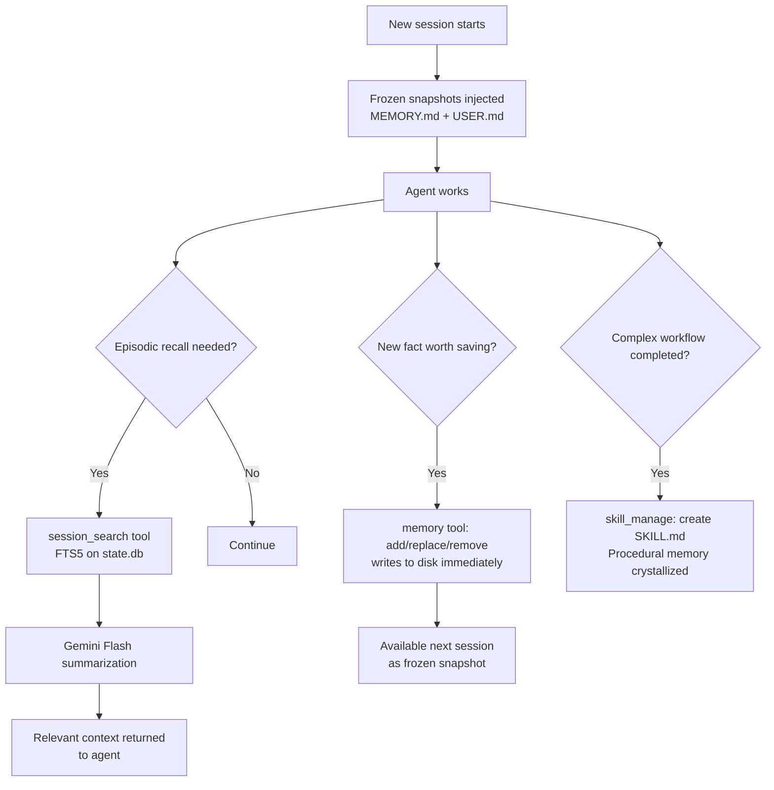
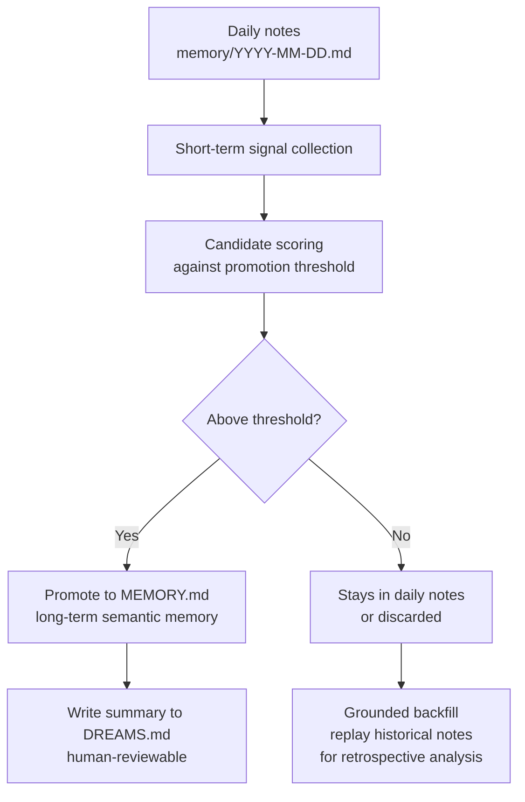
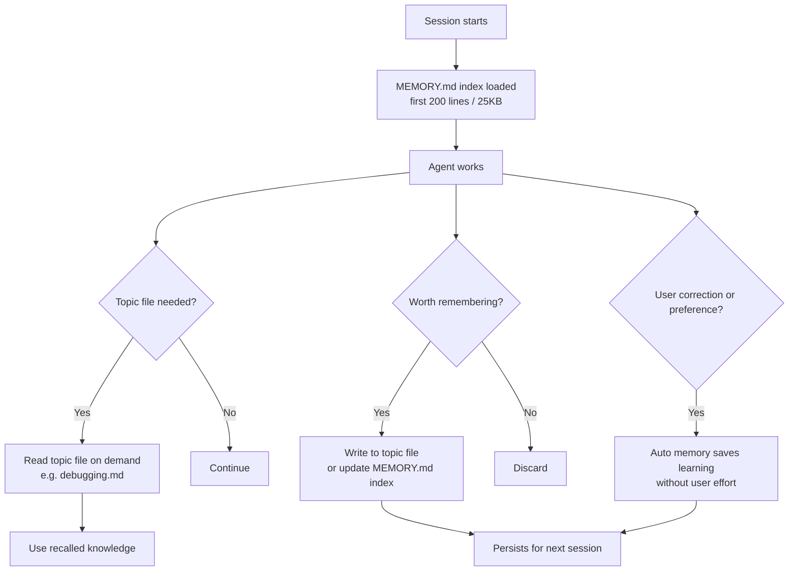
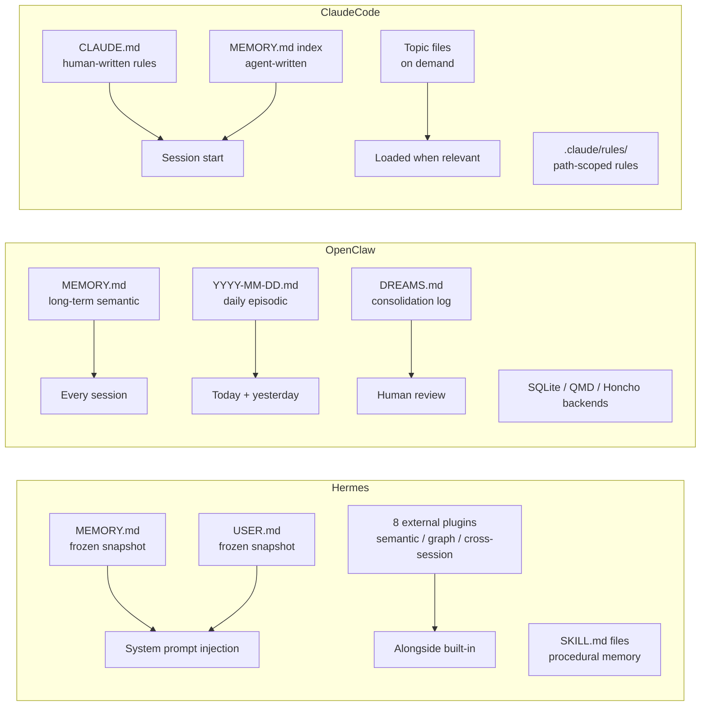

# Agent Memory Management — External & Episodic Layers
*Comparative analysis: Hermes (Nous Research), OpenClaw, Claude Code*

---

## Framework

Memory in agentic systems is divided into four layers:

| Layer | What it is | Persists across sessions? |
|---|---|---|
| **In-context** | Active context window — conversation, injected files | No |
| **External** | Persistent storage outside the model — files, DBs, vector stores | Yes |
| **Episodic** | Memory of specific past events and conversations | Yes |
| **Parametric** | Knowledge baked into model weights at training time | Yes (immutable) |

This document covers **External** and **Episodic** only.

---

## 1. Hermes (Nous Research)

### External Memory

Hermes maintains two built-in persistent memory files, both injected as frozen
snapshots into the system prompt at session start:

| File | Content | Size limit |
|---|---|---|
| `MEMORY.md` | Agent's personal notes — environment facts, conventions, learned facts | 2,200 chars (~800 tokens) |
| `USER.md` | User profile — preferences, communication style, expectations | 1,375 chars (~500 tokens) |

Both live in `~/.hermes/memories/`. The frozen snapshot approach is a deliberate
performance optimization: it preserves LLM **prefix caching**. Changes made
during a session persist to disk immediately but are not reflected in the
in-prompt block until the next session.

Memory is managed via a dedicated tool with three operations:

```
add     → insert new entries
replace → update existing entries via substring matching
remove  → delete obsolete entries
```

**External plugin ecosystem (8 providers):**

Hermes extends its external memory layer via plugins that operate *alongside*
built-in memory — never replacing it:

| Plugin | Capability |
|---|---|
| Honcho | Cross-session user modeling |
| Mem0 | Semantic memory with user-level graph |
| OpenViking | Long-term structured memory |
| Hindsight | Conversation-aware memory |
| Holographic | Associative memory retrieval |
| RetainDB | Relational persistent context |
| ByteRover | Distributed memory |
| Supermemory | Knowledge graph + search |

**Skills as procedural external memory:**

Hermes treats SKILL.md files (`~/.hermes/skills/`) as a form of external
procedural memory. The agent can create, update, and delete its own skills
after completing complex workflows (5+ tool calls) or discovering non-trivial
solutions — crystallizing episodic experience into reusable procedure.

### Episodic Memory

Episodic memory in Hermes is handled by the `session_search` tool, which queries
a SQLite database (`~/.hermes/state.db`) using FTS5 full-text search. Matched
conversation snippets are summarized using Gemini Flash before being returned
to the agent.



**Key design choices:**
- Frozen snapshot = prefix cache preservation (performance)
- Episodic search is explicit and on-demand — agent decides when to query history
- Episodic→procedural path via skill creation is unique to Hermes

---

## 2. OpenClaw

### Design Principle

OpenClaw's architecture rests on a single constraint: **files are the single
source of truth**. *"What's not written to a file doesn't exist."* This is an
architectural rule, not a preference — all long-term agent state must be
persisted to Markdown files on disk. The payoff is full transparency: any file
can be opened, edited, and version-controlled. The cost is that complex
relational queries and fast exact-match lookups are weaker than a database.

### External Memory

Three memory files serve distinct roles, mapping to two time horizons:

| File | Role | Load behavior |
|---|---|---|
| `MEMORY.md` | Long-term distilled facts, preferences, decisions | Every session |
| `memory/YYYY-MM-DD.md` | Short-term daily log — all context, append-only | Today + yesterday auto-loaded |
| `DREAMS.md` | Consolidation summaries, human-reviewable | On demand / human review |

All files live in the agent workspace (`~/.openclaw/workspace` by default).

**Two-layer design — solving the context window tension:**

The short-term layer (daily notes) ensures nothing is lost. The long-term layer
(MEMORY.md) ensures high-value facts are always in context. The trade-off is
that promoting short-term → long-term requires an active distillation step;
memory quality depends on that process running correctly.

**Storage backends:**

| Backend | Mechanism | Features |
|---|---|---|
| Builtin (default) | SQLite via `sqlite-vec` | Hybrid keyword + vector search |
| QMD | Local sidecar | Reranking + query expansion |
| Honcho | Cloud service | Cross-session user modeling, multi-agent awareness |

**Retrieval tools:**

- `memory_search` — hybrid search: **semantic (vector) + BM25 keyword** run in
  parallel, results merged. Semantic handles paraphrase; BM25 handles exact
  token matches (e.g. specific API names, field codes). Vector index stored in
  SQLite via `sqlite-vec` — no standalone vector database required.
- `memory_get` — direct file read by path or line range

### Context Compaction — Memory Flush

Long sessions accumulate conversation history that eventually overflows the
context window. When compaction is triggered, the conversation history is
replaced by a summary — but any fact that existed *only* in conversation history
is lost. OpenClaw's solution is **Memory Flush**:

```
Compaction detected (approaching context limit)
        ↓
Silent Memory Flush agent turn
        ↓
Agent writes all important in-context state to memory/YYYY-MM-DD.md
        ↓
Compaction executes (conversation history summarized)
        ↓
Session continues — file-persisted facts survive intact
```

This turns "files are the single source of truth" from a manual discipline into
a system-level guarantee. Files are never touched by compaction; only
conversation history is compressed.

This is a critical safety net for a known failure pattern: user tells the agent
a rule mid-conversation → agent acknowledges → compaction fires → rule disappears
→ agent silently violates it in later turns.

### Episodic Memory — The Dreaming System

OpenClaw's most distinctive feature is its explicit **episodic-to-semantic
consolidation pipeline**, called *Dreaming*:



**Daily notes as the episodic layer:**

Daily notes (`YYYY-MM-DD.md`) function as the explicit episodic store —
date-stamped, session-specific, running context. Yesterday's and today's notes
load automatically. Older notes exist on disk but are not auto-loaded; they are
accessible via `memory_search` or `memory_get`.

**Dreaming — episodic to semantic consolidation:**

1. The Dreaming system collects signals from short-term (daily) notes
2. Each candidate is scored against a promotion threshold
3. Qualified items are written into `MEMORY.md` (semantic/long-term layer)
4. A human-reviewable summary is written to `DREAMS.md`
5. Items that don't qualify remain as episodic notes or are discarded

**Grounded backfill:**

Historical daily notes can be replayed as standalone files for retrospective
analysis without triggering automatic promotion — giving the agent access to
episodic history without polluting long-term memory.

**Key design choices:**
- Explicit consolidation pipeline with human oversight (DREAMS.md)
- No hidden state — full transparency by design
- Daily notes = episodic layer with clear time-based scoping
- Promotion threshold prevents noise from accumulating in long-term memory
- **Dreaming is experimental and off by default.** The hard problem: deciding
  what is "worth" long-term retention requires contextual judgment that is
  difficult to encode as rules. Human-in-the-loop via DREAMS.md review is the
  current fallback.

---

## 3. Claude Code

### External Memory

Claude Code separates external memory into two complementary systems with
different authors:

| System | Author | Content | Scope |
|---|---|---|---|
| `CLAUDE.md` files | Human | Instructions, rules, conventions | Project / user / org / managed policy |
| Auto memory (`memory/`) | Claude | Learnings, patterns, debugging insights | Per project (machine-local) |

**CLAUDE.md — human-authored external memory:**

CLAUDE.md files are loaded into context at session start. Four scope levels
apply in order of increasing specificity:

```
Managed policy    /etc/claude-code/CLAUDE.md        (org-wide, cannot be excluded)
User              ~/.claude/CLAUDE.md               (all projects, personal)
Project           ./CLAUDE.md or ./.claude/CLAUDE.md (team-shared via git)
Local             ./CLAUDE.local.md                 (personal + project, gitignored)
```

All discovered files concatenate — they do not override each other. More
specific locations take precedence when instructions conflict. Files in
subdirectories load on demand when Claude reads files in those directories.

`.claude/rules/*.md` provides path-scoped modular rules — a rule can declare
`paths: ["src/api/**/*.ts"]` to load only when Claude touches matching files.

**Auto memory — agent-authored external memory:**

```
~/.claude/projects/<project>/memory/
├── MEMORY.md           ← index, first 200 lines loaded every session
├── debugging.md        ← topic file, loaded on demand
├── api-conventions.md  ← topic file, loaded on demand
└── ...
```

`MEMORY.md` acts as a concise index. Claude moves detailed notes into topic
files to keep the index short. Topic files are not loaded at startup — they
are read on demand when the agent determines they are relevant.

### Episodic Memory

Claude Code's episodic memory is embodied in the **auto memory topic files**.
Claude accumulates experience across sessions by writing what it discovers —
build commands, debugging patterns, architecture decisions, code style
preferences — into topic files. The `MEMORY.md` index tracks what is stored
where.



**Subagent episodic memory:**

Subagents can maintain their own auto memory directories, enabling specialist
agents to accumulate domain-specific episodic knowledge independently of the
main agent.

**Key design choices:**
- Dual authorship: human instructions (CLAUDE.md) + agent learnings (auto memory)
- Index-first loading: `MEMORY.md` concise index + on-demand topic files
  (progressive disclosure, context-efficient)
- No explicit consolidation pipeline — Claude decides what to write based on
  whether it would be useful in a future session
- Machine-local and per-project scoping

---

## Comparative Analysis

### External Memory



| Dimension | Hermes | OpenClaw | Claude Code |
|---|---|---|---|
| **Storage** | Flat files + SQLite + plugins | Flat files + SQLite (sqlite-vec)/QMD/Honcho | Flat files |
| **Load strategy** | Frozen snapshot at start | Full load at start | Index at start, topics on demand |
| **Author** | Agent | Agent | Human (CLAUDE.md) + Agent (auto memory) |
| **Scope** | Single user, global | Workspace | Project / user / org / managed policy |
| **External plugins** | 8 providers | 3 backends | None (file-based only) |
| **Size management** | Hard char limits per file | Promotion threshold gates LT memory | 200-line / 25KB index cap |
| **Prefix cache optimization** | Yes (frozen snapshot) | No | Implicit (loaded as context) |
| **Compaction safety** | None | Memory Flush (pre-compaction write to disk) | None |

### Episodic Memory

| Dimension | Hermes | OpenClaw | Claude Code |
|---|---|---|---|
| **Episodic store** | SQLite state.db (FTS5) | Daily notes YYYY-MM-DD.md | Auto memory topic files |
| **Retrieval** | Explicit `session_search` tool | BM25 + semantic (sqlite-vec) hybrid | On-demand file read |
| **Consolidation** | Manual (agent writes to MEMORY.md) | Dreaming pipeline (experimental, off by default) | Agent decides at session end |
| **Human oversight** | None | DREAMS.md review | Editable markdown files |
| **Episodic → Semantic path** | Agent-driven + skill crystallization | Dreaming threshold scoring | Agent-driven (topic files) |
| **Time-based scoping** | No | Yes (date-stamped daily notes) | No (project-scoped) |
| **Retrospective access** | FTS search across all history | Grounded backfill replay | File read by path |

### Consolidation Pipelines

```mermaid
flowchart TD
    subgraph Hermes ["Hermes — Manual + Skill crystallization"]
        HE[Episodic: SQLite FTS] -->|Agent decides| HL[Long-term: MEMORY.md]
        HE -->|5+ tool calls or novel solution| HS[Procedural: SKILL.md]
    end

    subgraph OpenClaw ["OpenClaw — Dreaming pipeline"]
        OE[Episodic: daily notes YYYY-MM-DD.md] --> OD[Dreaming: score candidates]
        OD -->|Above threshold| OL[Long-term: MEMORY.md]
        OD -->|Below threshold| OX[Discard / stay in daily notes]
        OL --> OR[DREAMS.md: human-reviewable log]
    end

    subgraph ClaudeCode ["Claude Code — Index + on-demand"]
        CE[Episodic: topic files e.g. debugging.md] -->|Agent writes| CI[MEMORY.md index]
        CI -->|On demand| CR[Topic file read]
        CE -->|User correction| CA[Auto memory update]
    end
```



---

## Implications for IDA

IDA's current context architecture maps onto this framework as follows:

| IDA Layer | Equivalent in framework |
|---|---|
| `ContextApi` | In-context (ephemeral, within one chain) |
| Chat record data / staged | Episodic (session-scoped, not persistent) |
| Playbook | Episodic (conversation-scoped summary) |
| `agent_memory` (PROJECT/ORG/GLOBAL) | External (persistent) |

**The gap:** IDA has the infrastructure for external + episodic persistence
(`agent_memory`, playbook) but sub-agents don't write to it. IDA today behaves
like an agent with no episodic memory — it forgets findings between sessions.

**What each agent's approach suggests for IDA:**

- **From Hermes:** Consider a frozen-snapshot injection of project memory at
  session start (e.g. PROJECT-scoped `agent_memory` entries injected into the
  system prompt). Use skills as procedural memory — already doing this.

- **From OpenClaw:** A Dreaming-style consolidation step at session end could
  promote significant findings from the playbook into long-term `agent_memory`.
  Human-reviewable consolidation (equivalent to DREAMS.md) would give engineers
  visibility into what IDA has learned about their wells. More urgently: IDA's
  `ContextCompressor` is analogous to OpenClaw's compaction — any facts that
  live only in conversation history are lost when it fires. A Memory Flush step
  before compression (write playbook + key findings to `agent_memory` before
  compacting) would close this gap and is lower-effort than a full Dreaming
  pipeline.

- **From Claude Code:** The index + on-demand topic file pattern maps well to
  IDA's skill system. A well-structured `agent_memory` with a lightweight index
  entry per well (loaded at session start) + detailed topic entries (loaded on
  demand) would be context-efficient.
