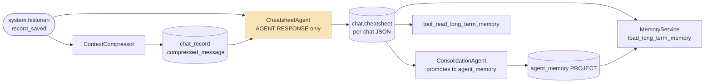
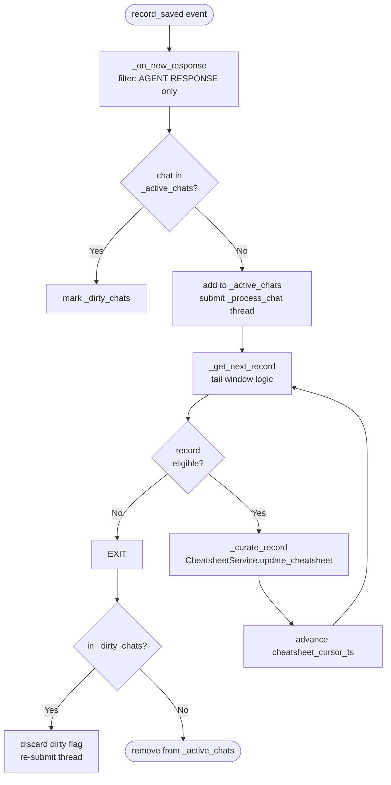
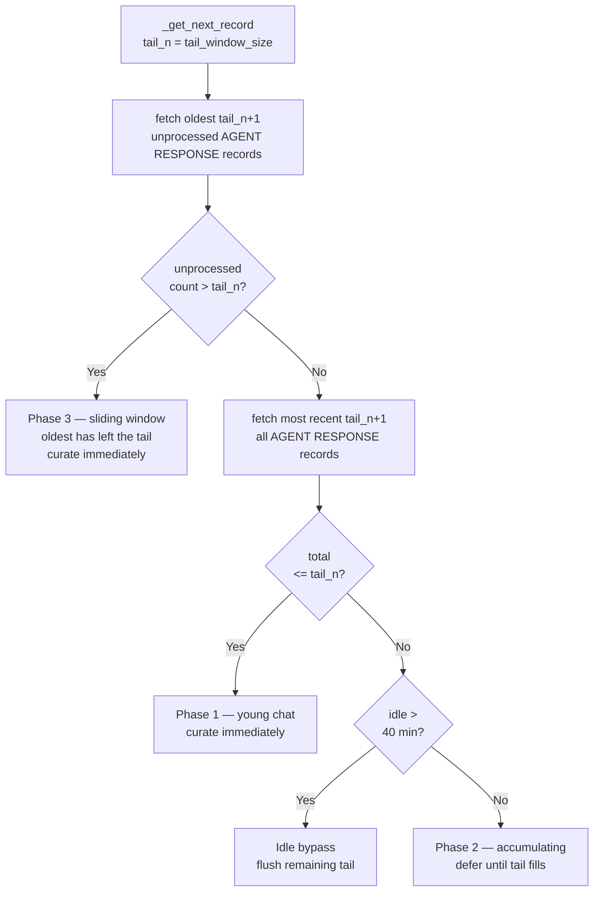

# Cheatsheet

**Location:** `backend/app/agents/workers/cheatsheet_agent.py`, `backend/app/services/cheatsheet/`

---

## Motivation

Within a session, the agent needs to remember what was established in earlier turns. The short-term window covers only the tail of the conversation — findings confirmed in turn 3 are gone from context by turn 15. Injecting the full transcript is not a solution: it grows without bound and is dominated by reasoning steps, tool outputs, and intermediate text that carry no durable signal.

What is needed is a representation that accumulates only the confirmed findings — stripped of the surrounding conversation — and stays compact regardless of how long the session runs. The cheatsheet is that representation: a typed, incrementally updated record of verified data points, data quality observations, and operational insights, injected at bounded cost into every subsequent turn.

---

## Role in the Memory Pipeline

`CheatsheetAgent` is the second capture stage. It fires after `ContextCompressor` has indexed and optionally compressed new records, reads each agent response, and updates the per-chat cheatsheet.


```mermaid
flowchart LR
    RS(["system.historian\nrecord_saved"])

    RS --> CC["ContextCompressor"]
    RS --> CSA["CheatsheetAgent\nAGENT RESPONSE only"]

    CC --> CR[("chat_record\n.compressed_message")]
    CR --> CSA

    CSA --> CS[("chat.cheatsheet\nper-chat JSON")]

    CS --> CONS["ConsolidationAgent\npromotes to agent_memory"]
    CS --> MS["MemoryService\nload_long_term_memory"]
    CS --> TOOL["tool_read_long_term_memory"]

    CONS --> AM[("agent_memory PROJECT")]
    AM --> MS

    style CSA fill:#f9e4b7,stroke:#e6a817
```

`chat.cheatsheet` is consumed by three downstream stages:
- `MemoryService.load_long_term_memory` — injected into every system prompt as session context
- `tool_read_long_term_memory` — on-demand access during agent reasoning
- `ConsolidationAgent` — source for promoting verified findings to persistent project memory

---

## Schema

The cheatsheet is a JSON blob stored on the `chat` row. Three typed buckets:

```json
{
  "data_insights":   [{"content": "NPT: 54.2 hrs (12.1%)", "confidence": "verified", "entity": "NNM-101", "record_id": 847}],
  "key_facts":       [{"id": "kf_3a1b2c", "content": "WellView export truncated at 3200m", "confidence": "inferred", "record_id": 801}],
  "lessons_learned": [{"id": "ll_9f8e7d", "content": "Pre-treat with LCM before depleted zones", "confidence": "inferred", "entity": "NNM-101"}]
}
```

| Bucket | Contents | Keyed by |
|---|---|---|
| `data_insights` | Per-entity numeric findings: NPT, ROP, depth, cost | `entity` + metric — no stable `id` |
| `key_facts` | Data quality gaps, user knowledge gaps, workflow context | Stable `id` (`kf_*`) |
| `lessons_learned` | Actionable operational insights | Stable `id` (`ll_*`) |

**Confidence model:**

| Value | Meaning |
|---|---|
| `verified` | Value appears verbatim in a tool result block |
| `inferred` | Derived from agent narrative, not a tool result |
| `conflicted` | Same entity + metric has two different values; both entries preserved |

`data_insights` entries are keyed by entity + metric — the curator updates them in-place. `key_facts` and `lessons_learned` entries carry a stable `id` stamped by `CheatsheetService`, never by the LLM, enabling in-place updates (Replace) and removals (Delete) across turns without duplication.

---

## Implementation

### Trigger

`CheatsheetAgent` subscribes to `system.historian.record_saved` and fires only on AGENT RESPONSE records (`sender_role=AGENT`, `msg_type=RESPONSE`). A 120-second fallback poll covers records missed across restarts.

Each eligible event spawns a per-chat thread. If a new response arrives while a thread is already running for the same chat, the chat is marked in `_dirty_chats` and the thread re-submits itself on exit. No events are dropped.


```mermaid
flowchart TD
    EV(["record_saved event"]) --> CB["_on_new_response\nfilter: AGENT RESPONSE only"]
    CB --> ACTIVE{chat in\n_active_chats?}
    ACTIVE -- Yes --> DIRTY["mark _dirty_chats"]
    ACTIVE -- No --> SUBMIT["add to _active_chats\nsubmit _process_chat thread"]

    SUBMIT --> LOOP["_get_next_record\ntail window logic"]
    LOOP --> REC{record\neligible?}
    REC -- No --> EXIT
    REC -- Yes --> CURATE["_curate_record\nCheatsheetService.update_cheatsheet"]
    CURATE --> ADVANCE["advance cheatsheet_cursor_ts"]
    ADVANCE --> LOOP

    EXIT --> REDIRTY{in _dirty_chats?}
    REDIRTY -- Yes --> RESUBMIT["discard dirty flag\nre-submit thread"]
    REDIRTY -- No --> DONE(["remove from _active_chats"])
```

### Tail window

The cheatsheet is a curated summary, not a log. Curating every exchange as it arrives would produce a cheatsheet biased toward the most recent turn and miss the broader pattern. The tail window defers curation of recent exchanges until enough context has accumulated.


```mermaid
flowchart TD
    A["_get_next_record\ntail_n = tail_window_size"] --> B["fetch oldest tail_n+1\nunprocessed AGENT RESPONSE records"]
    B --> C{unprocessed\ncount > tail_n?}
    C -- Yes --> PHASE3["Phase 3 — sliding window\noldest has left the tail\ncurate immediately"]

    C -- No --> D["fetch most recent tail_n+1\nall AGENT RESPONSE records"]
    D --> E{total\n<= tail_n?}
    E -- Yes --> PHASE1["Phase 1 — young chat\ncurate immediately"]

    E -- No --> F{idle >\n40 min?}
    F -- Yes --> IDLE["Idle bypass\nflush remaining tail"]
    F -- No --> PHASE2["Phase 2 — accumulating\ndefer until tail fills"]
```

| Phase | Condition | Action |
|---|---|---|
| **1 — young** | total records ≤ `tail_n` | Curate each exchange immediately |
| **2 — accumulating** | total > `tail_n`, unprocessed ≤ `tail_n` | Defer — wait for the tail to fill |
| **3 — sliding window** | unprocessed > `tail_n` | Oldest unprocessed has left the tail — curate immediately |
| **Idle bypass** | last response > 40 min ago | Flush all remaining tail records regardless of phase |

Default `tail_n`: **6**. Configurable via `agent_config["tail_window_size"]`.

The 40-minute idle bypass is what allows `ConsolidationAgent` (which fires at 60 minutes idle) to always read a fully settled cheatsheet.

### Curation

`CheatsheetService.update_cheatsheet` runs one LLM call per eligible exchange:

1. Load current `chat.cheatsheet` JSON (or `{}` if empty)
2. LLM call with `[user_query, agent_response, current_cheatsheet]` → updated cheatsheet JSON
3. Parse and validate with `parse_cheatsheet`; if unparseable, keep previous cheatsheet
4. Stamp stable `id` on new `key_facts` and `lessons_learned` entries (`kf_*`, `ll_*`)
5. Stamp `record_id` on all new entries; existing entries carry their `record_id` forward
6. Save via `project_service.save_chat_cheatsheet`
7. Advance `cheatsheet_cursor_ts`

The curator reads `record.compressed_message or record.message` — it uses the compressor's summary when available.

Model: `CONTEXT_MASTER`. Curation requires understanding the full exchange in context of the existing cheatsheet; a reasoning-capable model is appropriate here.

### Cursor

`cheatsheet_cursor_ts` is a per-chat timestamp column on the `chat` row. It advances to the processed record's timestamp after each successful curation. The fallback poll queries for chats where the most recent AGENT RESPONSE is newer than `cheatsheet_cursor_ts`.

---

## Consumption

### `MemoryService.load_long_term_memory`

```python
raw = self._project_service.get_chat_cheatsheet(chat_id)
result = render_to_markdown(parse_cheatsheet(raw))
```

Rendered as markdown and injected into every system prompt. All session findings — from turn 1 to the current turn — are available to the agent in ~2 KB regardless of session length. Conflicted entries are prefixed `[CONFLICTED]` so the agent knows the value is contested.

### `ConsolidationAgent`

Reads `chat.cheatsheet` after the session goes idle (60 min) or the cursor gap exceeds 3 hours. Promotes entries by confidence filter:

| Bucket | Filter | Target |
|---|---|---|
| `data_insights` | `confidence == "verified"` | `entity_{key}` in `agent_memory` |
| `key_facts` | `confidence in ("verified", "inferred")` | `project_facts` in `agent_memory` |
| `lessons_learned` | all entries | `project_lessons` in `agent_memory` |

The cheatsheet is the only input `ConsolidationAgent` reads — no direct access to `chat_record`.

### `tool_read_long_term_memory`

On-demand tool available during agent reasoning. Returns the same `render_to_markdown` output as `load_long_term_memory`. Used when an agent needs to re-check session findings mid-chain without relying on what was injected at prompt build time.
