# Dynamic Cheatsheet System (DC-CU)

## Overview

The Dynamic Cheatsheet System implements a **Consult → Generate → Curate** (DC-CU) workflow to maintain adaptive, per-chat memory. Each chat maintains a curated cheatsheet containing:

- **Knowledge Points**: Core concepts, facts, and domain-specific information
- **Data Insights**: Important insights from data analysis (cost analysis, NPT analysis, progress analysis, etc.)
- **Errors & Lessons**: Mistakes encountered and how they were resolved

The cheatsheet is **shared across all agents** in the same chat, enabling knowledge transfer and consistency.

---

## Architecture

### System Components

```
┌─────────────────────────────────────────────────────────────────┐
│                     Dynamic Cheatsheet System                   │
├─────────────────────────────────────────────────────────────────┤
│                                                                  │
│  ┌──────────────────┐         ┌──────────────────┐            │
│  │ CheatsheetService│         │ DynamicCheatsheet │            │
│  │  (Service Layer) │────────▶│   (Core Logic)   │            │
│  └──────────────────┘         └──────────────────┘            │
│         │                              │                        │
│         │                              │                        │
│         ▼                              ▼                        │
│  ┌──────────────────┐         ┌──────────────────┐            │
│  │   Agents         │         │  ProjectService  │            │
│  │  (SME, DataInsight│         │  (Database)      │            │
│  │   ReportGen, Viz)│         │  chat.playbook   │            │
│  └──────────────────┘         └──────────────────┘            │
│         │                                                       │
│         │                                                       │
│         ▼                                                       │
│  ┌──────────────────┐                                          │
│  │ CheatsheetAgent │                                          │
│  │ (Continuous)    │                                          │
│  └──────────────────┘                                          │
│                                                                  │
└─────────────────────────────────────────────────────────────────┘
```

### Component Responsibilities

1. **`DynamicCheatsheet`**: Core class implementing DC-CU workflow
   - `consult()`: Loads cheatsheet from database
   - `generate()`: Generates answer using cheatsheet (optional, agents can use their own prompts)
   - `curate()`: Updates cheatsheet based on exchange

2. **`CheatsheetService`**: Service layer providing easy access for agents
   - `get_cheatsheet()`: Retrieves current cheatsheet
   - `update_cheatsheet()`: Updates cheatsheet after exchange

3. **`CheatsheetAgent`**: Continuous background agent
   - Automatically detects new chat exchanges
   - Updates cheatsheets without manual intervention

4. **Storage**: `chat.playbook` field in database
   - One cheatsheet per chat (shared across all agents)
   - Persisted as plain text string

---

## DC-CU Workflow

### Consult → Generate → Curate Cycle


### Detailed Flow

#### 1. CONSULT Phase

When an agent receives a user query:

```python
# Agent retrieves cheatsheet
cheatsheet = cheatsheet_service.get_cheatsheet(chat_id, project_id)
# Returns: "(empty)" or current cheatsheet content
```

**Storage Location**: `chat.playbook` field in database

#### 2. GENERATE Phase

Agent injects cheatsheet into system prompt:

```python
system_message += f"""
---
CHEATSHEET (Main knowledge points, All Data Insights from previous exchanges):
{cheatsheet}
---

CRITICAL: Use the Main knowledge points and All Data Insights from the cheatsheet 
to guide your tool selection and responses when applicable. Some questions might 
be answered with cheatsheet only without using tools.
"""
```

Agent then generates answer using tools and LLM.

#### 3. CURATE Phase

**Automatic (via CheatsheetAgent)**:
- `CheatsheetAgent` runs continuously in background
- Detects new agent responses
- Finds preceding user query
- Calls `cheatsheet_service.update_cheatsheet()`

**Process**:
1. Load current cheatsheet
2. Send exchange (user query + agent answer) to curator LLM
3. Curator extracts:
   - Knowledge Points
   - Data Insights (e.g., "Cost for NNM102 is $869,982.00")
   - Errors & Lessons
4. Compress and consolidate with previous cheatsheet
5. Save updated cheatsheet to `chat.playbook`

---

## Cheatsheet Content Structure

### Format

```markdown
### Knowledge Points
- [Core concepts, facts, and domain-specific information]
- [All previous knowledge points preserved and compressed]

### Data Insights
- [Important insights from data analysis]
- [Specific well data: "Cost for NNM102 is $869,982.00"]
- [Analysis results: trends, metrics, findings]

### Errors & Lessons
- [Errors encountered and how they were resolved]
- [Lessons learned from mistakes]
```

### Example Cheatsheet

```markdown
### Knowledge Points
- ROP (Rate of Penetration) measures feet per hour of downhole drilling progress, distinct from surface speed
- Cost analysis evaluates drilling expenses and budget performance

### Data Insights
- Cost for NNM102 is $869,982.00 total, with average daily cost of $289,994.00 (3 days of data)
- NPT for NNM101 is 100 hours and caused 1million USD of cost
- The drilling depth for NNM101 is 1000 meters and the ROP is 10 meters per hour

### Errors & Lessons
- Confusion between ROP and surface speed - always clarify which metric is being discussed
```

---

## Agent Integration

### How Agents Use Cheatsheet

All agents (SME, DataInsight, ReportGenerator, Viz) follow the same pattern:

```python
class MyAgent(AgentBase):
    def __init__(self, ..., cheatsheet_service: Optional[CheatsheetService] = None):
        self.cheatsheet_service = cheatsheet_service
    
    def tool_orchestrator(self, state):
        # CONSULT: Get cheatsheet
        cheatsheet = "(empty)"
        if self.cheatsheet_service and self.chat_id and self.project_id:
            cheatsheet = self.cheatsheet_service.get_cheatsheet(
                chat_id=self.chat_id,
                project_id=self.project_id,
            )
        
        # Inject into system message
        if cheatsheet and cheatsheet != "(empty)":
            system_message += f"""
---
CHEATSHEET (Main knowledge points, All Data Insights):
{cheatsheet}
---
CRITICAL: Use the cheatsheet to guide your responses...
"""
        
        # Agent generates answer using tools and LLM
        # (CheatsheetAgent automatically updates cheatsheet in background)
```

### Integration Points

```mermaid
graph LR
    A[User Query] --> B[Agent Receives Query]
    B --> C[Agent Calls get_cheatsheet]
    C --> D[CheatsheetService]
    D --> E[Load from chat.playbook]
    E --> F[Return to Agent]
    F --> G[Agent Injects in System Prompt]
    G --> H[Agent Generates Answer]
    H --> I[Agent Sends Answer]
    I --> J[CheatsheetAgent Detects Exchange]
    J --> K[CheatsheetAgent Calls update_cheatsheet]
    K --> L[Curator LLM Extracts Info]
    L --> M[Save Updated Cheatsheet]
    
    style C fill:#e1f5ff
    style K fill:#e8f5e9
```



---

## Automatic Maintenance (CheatsheetAgent)

### How It Works

`CheatsheetAgent` is a **continuous agent** that runs in the background:


### Processing Logic

1. **Polling**: Checks for new agent responses every `poll_interval` seconds (default: 10s)
2. **Exchange Detection**: Finds user query that preceded each agent response
3. **Update**: Calls `cheatsheet_service.update_cheatsheet()` with:
   - User query
   - Agent answer
   - Current cheatsheet
4. **Tracking**: Uses in-memory tracking to avoid reprocessing same exchanges

### State Tracking

- **In-Memory**: `_processed_records: Dict[tuple[int, int], int]`
  - Key: `(chat_id, project_id)`
  - Value: Last processed `record_id`
- **No Persistent State**: Resets on agent restart (processes from beginning)

---

## Curator Prompt

The curator LLM extracts information using `CURATOR_PROMPT`:

### What Gets Extracted

1. **Knowledge Points**:
   - Core concepts, principles, theories
   - Key facts and important context

2. **Data Insights**:
   - Analysis results (cost, NPT, progress)
   - Specific well data (e.g., "Cost for NNM102 is $869,982.00")
   - Important file names or well names
   - Key metrics, trends, anomalies

3. **Errors & Lessons**:
   - Tool failures, incorrect assumptions
   - How errors were resolved
   - Lessons learned

### Update Strategy

- **Always preserve** previous cheatsheet content
- **Compress and consolidate** when adding new information
- **Incremental updates only** - never replace entire cheatsheet
- **Extract from informative exchanges** - skip trivial exchanges

### Output Format

Curator LLM must wrap response in `<cheatsheet>...</cheatsheet>` tags:

```xml
<cheatsheet>
### Knowledge Points
- [Updated content]

### Data Insights
- [Updated content]

### Errors & Lessons
- [Updated content]
</cheatsheet>
```

---

## Generator Prompt

The generator prompt (`GENERATOR_PROMPT`) guides agents on how to use the cheatsheet:

### Key Sections

1. **Analysis & Strategy**: Analyze question and cheatsheet, identify patterns
2. **Solution Development**: Present clear, logical steps
3. **Tool Usage & Data Analysis**: Guidelines for using tools
4. **Response Format**: Clear, comprehensive answers

### Placeholders

- `[[QUESTION]]`: User's query
- `[[CHEATSHEET]]`: Current cheatsheet content

**Note**: Agents typically use their own prompts and inject the cheatsheet directly, rather than using the generator prompt template.

---

## Storage

### Database Schema

```python
class Chat(Base):
    id: int
    project_id: int
    playbook: str  # Cheatsheet stored here
    # ... other fields
```

### Persistence Flow


---

## Key Design Decisions

### 1. One Cheatsheet Per Chat

- **Rationale**: Knowledge is shared across all agents in a conversation
- **Benefit**: Agents learn from each other's exchanges
- **Storage**: `chat.playbook` field

### 2. Automatic Maintenance

- **Rationale**: Eliminates need for agents to manually call `update_cheatsheet()`
- **Implementation**: `CheatsheetAgent` as continuous background service
- **Benefit**: Consistent updates, no code changes needed in production agents

### 3. Service-Based Architecture

- **Rationale**: Easy dependency injection, testable, modular
- **Components**: `CheatsheetService` → `DynamicCheatsheet` → `ProjectService`
- **Benefit**: Agents only need `CheatsheetService`, not full implementation

### 4. Category-Based Organization

- **Structure**: Knowledge Points, Data Insights, Errors & Lessons
- **Rationale**: Clear separation, easy to find relevant information
- **Not Agent-Wise**: Unified structure regardless of which agent generated the content

---

## Usage Examples

### Example 1: Cost Analysis Exchange

**User Query**: "Show cost analysis for well NNM102"

**Agent Answer**: 
```
## 💰 Cost Analysis for Well NNM102
Total Cost: $869,982.00
Average Daily Cost: $289,994.00
3 days of data available...
```

**Curator Extracts**:
```markdown
### Data Insights
- Cost for NNM102 is $869,982.00 total, with average daily cost of $289,994.00 (3 days of data)
- Well NNM102 cost analysis shows consistent daily costs with slight increase on last day
```

### Example 2: Knowledge Exchange

**User Query**: "What is the difference between ROP and drilling speed?"

**Agent Answer**: "ROP (Rate of Penetration) measures feet per hour drilled. I initially confused it with surface speed, but they're different - ROP is downhole progress."

**Curator Extracts**:
```markdown
### Knowledge Points
- ROP measures feet per hour of downhole drilling progress, distinct from surface speed

### Errors & Lessons
- Confusion between ROP and surface speed - always clarify which metric is being discussed
```

---

## Configuration

### CheatsheetAgent Settings

In `agent_config`:
```json
{
  "poll_interval": 10  // Seconds between polling cycles
}
```

### LLM Models

- **Generator LLM**: `LLMModelType.MICRO_SMART` (for `generate()` method, rarely used)
- **Curator LLM**: `LLMModelType.MICRO_SMART` (for extracting and updating cheatsheet)

---

## Troubleshooting

### Cheatsheet Not Updating

1. **Check CheatsheetAgent is running**: Look for logs like "CheatsheetAgent is running"
2. **Check exchange detection**: Verify user query is found before agent response
3. **Check curator response**: Curator LLM must return `<cheatsheet>...</cheatsheet>` tags
4. **Check database**: Verify `chat.playbook` is being updated

### Disabling Cheatsheet

To disable for testing:

1. **Comment out CheatsheetAgent** in `backend/app/agents/factory/registry.py`:
   ```python
   # AGENT_CLASSES = [..., CheatsheetAgent, ...]
   ```

2. **Disable CheatsheetService** in `backend/app/cheatsheet/cheatsheet_service.py`:
   ```python
   def get_cheatsheet(self, chat_id: int, project_id: int) -> str:
       return "(empty)"  # Always return empty
   
   def update_cheatsheet(self, ...):
       return  # Do nothing
   ```

---

## Files Reference

### Core Files

- `backend/app/cheatsheet/cheatsheet.py`: `DynamicCheatsheet` class
- `backend/app/cheatsheet/cheatsheet_service.py`: `CheatsheetService` class
- `backend/app/agents/workers/cheatsheet_agent.py`: Continuous agent for automatic updates
- `backend/app/cheatsheet/cheatsheet_curator_prompt.py`: Curator prompt template
- `backend/app/cheatsheet/cheatsheet_generator_prompt.py`: Generator prompt template

### Agent Integration

- `backend/app/agents/workers/subject_matter_expert.py`: SME agent integration
- `backend/app/agents/workers/datainsight.py`: DataInsight agent integration
- `backend/app/agents/workers/report_generator.py`: ReportGenerator agent integration
- `backend/app/agents/workers/viz_agent.py`: Viz agent integration

### Database

- `backend/app/db/project.py`: `ProjectService.update_chat_playbook()` method

---

## Future Enhancements

Potential improvements:

1. **Semantic Search**: Retrieve relevant cheatsheet sections based on query similarity
2. **Cheatsheet Compression**: Automatic compression when cheatsheet exceeds token limits
3. **Version History**: Track cheatsheet changes over time
4. **Cross-Chat Learning**: Share insights across chats (with user permission)
5. **Validation**: Verify extracted information before adding to cheatsheet

---

## References

- **DC-CU Paper**: Dynamic Cheatsheet with Consult → Generate → Curate workflow
- **Implementation**: Based on simplified string-based approach with template-driven prompts
