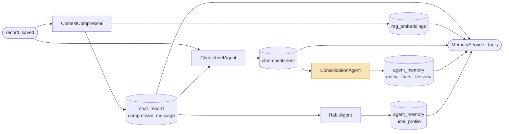
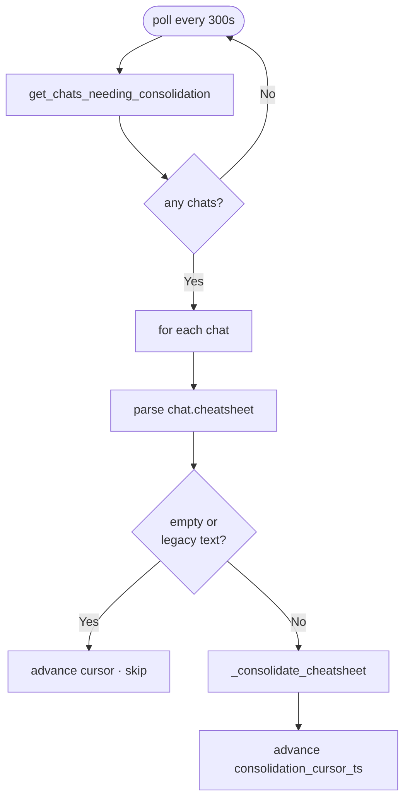
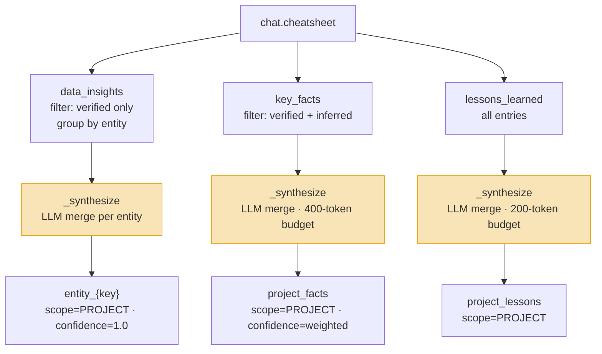

# Consolidation Agent

**Location:** `backend/app/agents/workers/consolidation_agent.py`

---

## Motivation

The cheatsheet is per-chat and ephemeral. When a session ends, the findings it contains — confirmed well characteristics, identified data quality issues, transferable operational lessons — disappear from the memory system. The next session starts with no knowledge of what was established before.

Many of those findings are durable: a confirmed NPT figure for NNM-101 does not stop being true when the chat closes. The memory design needs a mechanism to extract the findings that have lasting value from each completed session and write them to a store that persists across sessions. `ConsolidationAgent` is that mechanism.

---

## Role in the Memory Pipeline

`ConsolidationAgent` is the third capture stage. It runs after the session goes idle, reads `chat.cheatsheet`, and promotes verified entries to PROJECT-scoped `agent_memory`.



`agent_memory PROJECT` is consumed by `MemoryService.load_project_memory` (injected into the system prompt at session start) and `tool_read_project_memory` (on-demand retrieval during reasoning).

---

## Implementation

### Trigger

`ConsolidationAgent` is a `CONTINUOUS` agent polling every 300 seconds. On each poll it queries for chats where consolidation is due:

- `cheatsheet_cursor_ts > consolidation_cursor_ts` — unprocessed cheatsheet content exists, AND
- either `now − last_response_ts > 60 min` (session idle), OR `cheatsheet_cursor_ts − consolidation_cursor_ts > 3 h` (long active session)

The 60-minute idle threshold is 20 minutes after the cheatsheet idle flush (40 min), ensuring the cheatsheet is fully settled before consolidation reads it. The 3-hour cursor gap fires mid-session so project memory does not stall on long active conversations.



### Promotion paths

Each cheatsheet bucket has its own promotion filter and target memory slot:

| Bucket | Filter | Target | Confidence |
|---|---|---|---|
| `data_insights` | `confidence == "verified"` | `entity_{key}` per entity | `1.0` |
| `key_facts` | `confidence in ("verified", "inferred")` | `project_facts` | weighted avg (verified=1.0, inferred=0.7) |
| `lessons_learned` | all entries | `project_lessons` | `None` |

`inferred` key_facts are included because data quality gaps and user knowledge gaps have value even without direct tool confirmation. `inferred` data_insights are excluded — numeric claims without tool grounding must not enter permanent memory.



### Synthesis

Each bucket merges new candidates with the existing memory record via LLM (`MICRO_SMART`). The synthesis prompt instructs the model to:

- Merge duplicates — keep the most specific version
- Resolve numerical conflicts — append `"(values vary: X, Y)"` when unresolvable
- Drop entries fully subsumed by a more detailed one
- Preserve every distinct fact not covered by others
- Stay within the token budget (400 for `project_facts`, 200 for `project_lessons`)

Falls back to case-insensitive deduplication (`_dedupe`) if no LLM is available.

### Entity key normalisation

`data_insights` entries are grouped by entity before promotion. Entity names are normalised to a canonical key: separators stripped, lowercased.

```
NNM-101  →  nnm101
NNM_101  →  nnm101
NNM 101  →  nnm101
```

Each unique key maps to one `agent_memory` record named `entity_{key}`. Successive sessions accumulate insights into the same record via synthesis.

### Cursor

`consolidation_cursor_ts` is a per-chat timestamp column on the `chat` row. It advances to `now` after each successful consolidation run. The poll query compares it against `cheatsheet_cursor_ts` to detect unprocessed cheatsheet content.

---

## Consumption

### `MemoryService.load_project_memory`

```python
results = self._memory_store.search_objects(
    query=query, project_id=project_id, scope=MemoryScope.PROJECT, limit=top_k
)
```

FTS search (PostgreSQL `plainto_tsquery`) over `content_text` of all PROJECT-scoped memory records. Returns the top-K hits formatted as `[{memory_type}] {name}\n{content_text}`. Injected into the system prompt before the agent starts reasoning — gives agents cross-session context without any tool call.

### `tool_read_project_memory`

On-demand access during agent reasoning. Same FTS search, `top_k` up to 20. USER_PROFILE entries are excluded so user preferences do not contaminate analytical results.
