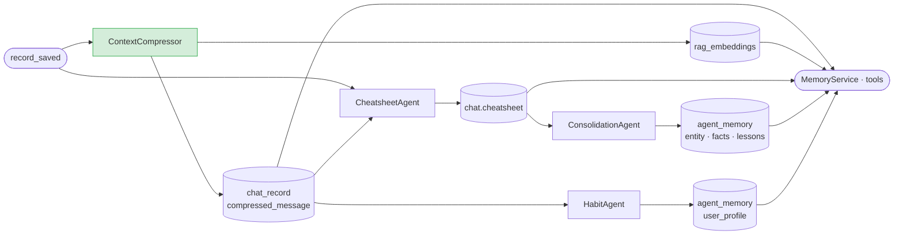
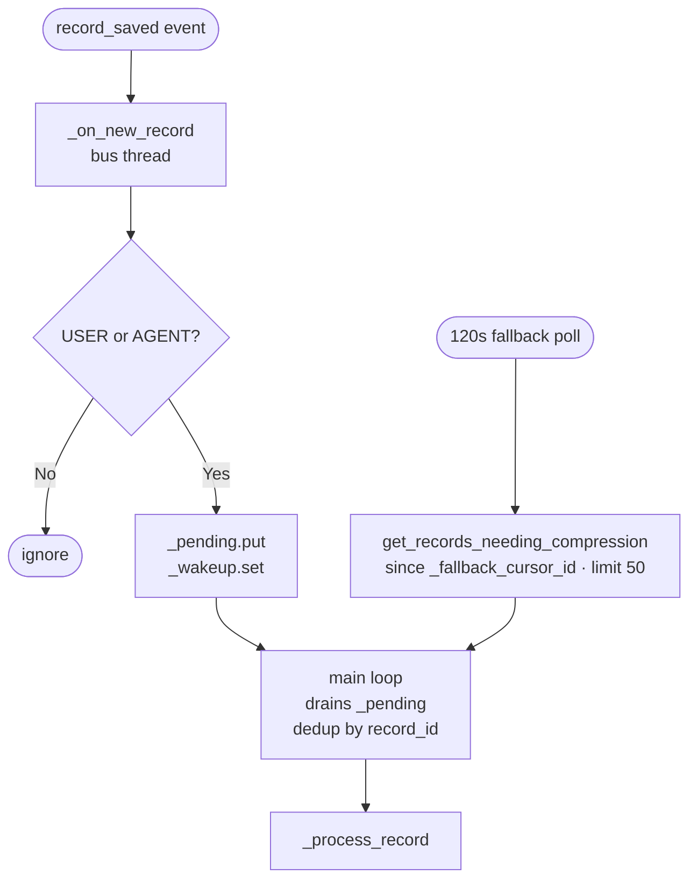
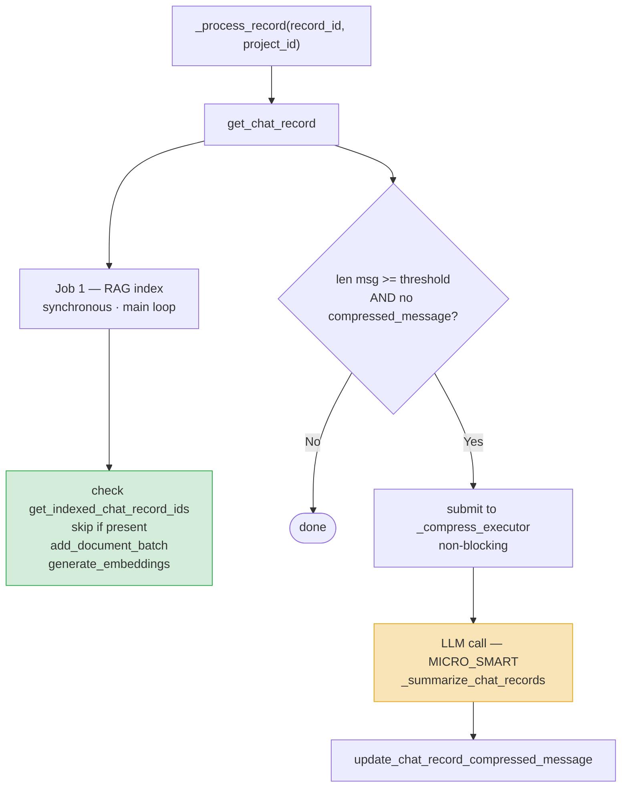
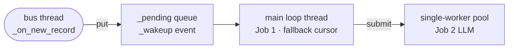
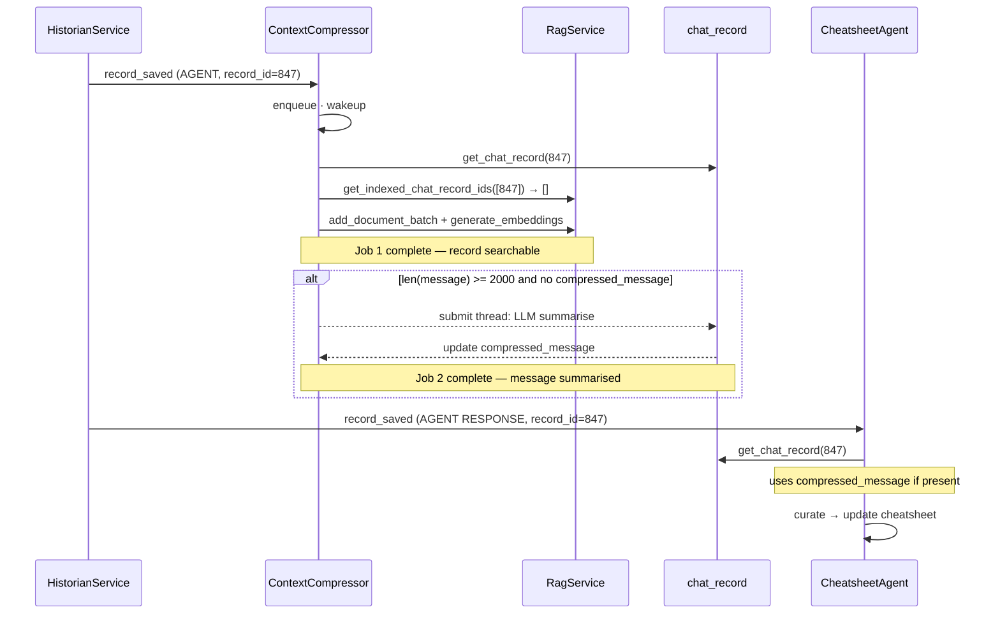

# Context Compressor

**Location:** `backend/app/agents/workers/context_compressor.py`

---

## Motivation

The memory design stores every conversation record in full fidelity (`chat_record.message`) so nothing is lost. But full fidelity and context usability are in conflict: a record that is complete for archival is often too large to inject into a prompt or too noisy to curate accurately. The same record needs two representations — the original for completeness, and a bounded summary for use as live memory.

The memory design also requires that the full conversation history be retrievable by query, not just by recency. The short-term window covers only the tail of a session; anything beyond it must be reachable through search. For search to work, records must be indexed as embeddings — a step that does not happen automatically on write.

`ContextCompressor` is the capture agent that resolves both gaps: it produces the bounded summary representation in-place on the record, and it indexes every record into the retrieval store.

---

## Role in the Memory Pipeline

`ContextCompressor` is the first capture stage. It fires on every USER and AGENT record — earlier than `CheatsheetAgent` (AGENT RESPONSE only) and far earlier than `ConsolidationAgent` and `HabitAgent` (idle poll).



`compressed_message` is consumed by `CheatsheetAgent` (cleaner curation input) and `MemoryService.load_short_term_memory` (bounded context cost per turn). `rag_embeddings` is consumed by `tool_search_chat_history` — the only path for retrieving turns beyond the short-term window. Both consumers use `compressed_message or message` and degrade gracefully if the compressor has not yet run.

---

## Implementation

### Trigger

`ContextCompressor` is a `CONTINUOUS` agent subscribing to `system.historian.record_saved`. The callback (`_on_new_record`) runs in the message bus thread and enqueues `(record_id, project_id)` pairs for processing by the main loop. Only USER and AGENT records are enqueued; AGENT_STEP, TOOL, and SYSTEM records are ignored.

A 120-second fallback poll (`_fallback_poll`) re-scans records missed across restarts. The fallback cursor (`_fallback_cursor_id`) is **in-memory only** and resets to 0 on restart. Both jobs are idempotent, so full re-scans cause no harm.



### Per-record processing

Each record triggers two independent jobs.



**Job 1 — RAG indexing** runs synchronously in the main loop. The RAG index is current before the next record arrives.

**Job 2 — compression** is submitted to a single-worker `ThreadPoolExecutor` (`_compress_executor`). LLM calls block for 2–5 seconds; offloading them prevents the main loop from stalling on indexing the next record. A single worker serialises compression requests from this agent instance.

### Idempotency

| Job | Guard |
|---|---|
| RAG indexing | `get_indexed_chat_record_ids` — skips records already embedded |
| Compression | `record.compressed_message is not None` — skips records already compressed |

### Compression prompt

Prompt name: `context_compressor_prompt`. Registered at startup via `register_default_prompt`; overridable via the prompt store without a code change.

Instructions to the LLM:
- Preserve all key technical details, decisions, and conclusions
- Retain domain terminology (drilling, well operations, energy industry)
- Keep all numerical data, measurements, and specifications verbatim
- Summarise each well or file separately when multiple are present
- Target: **≤ 300 words**

Model: `MICRO_SMART` (gpt-4.1-nano). Chosen for speed and large context window; compression is mechanical and does not require reasoning capability.

### Threading model



Three threads at most: the shared bus callback thread, the main loop thread, and the single compression worker. The main loop never blocks on an LLM call.

### Configuration

| Parameter | Default | Source |
|---|---|---|
| `compression_threshold` | `2000` chars | `agent_config["compression_threshold"]` |
| Fallback poll interval | `120` s | `FALLBACK_POLL_INTERVAL` constant |
| LLM model | `MICRO_SMART` | `self.model_type` |

---

## Consumption

### `MemoryService.load_short_term_memory`

```python
text_ = (r.compressed_message or r.message or "").strip()
```

Each exchange contributes ≤ 300 words to the prompt budget. Without this bound, the short-term window would need to shrink as sessions grow — the alternative to compression is fewer turns in context.

### `CheatsheetAgent._curate_record`

```python
agent_response = record.compressed_message or record.message or ""
```

The curator LLM receives a clean summary rather than raw tool output. The same fallback applies when retrieving the preceding user query. If compression has not yet run (Job 2 is still pending), the agent falls back to the raw message and will use `compressed_message` on the next curation cycle via the 120-second fallback poll.

### `tool_search_chat_history`

```
Hybrid (semantic + keyword) search over RAG-indexed chat records.
Input:  query (str), top_k (int, default 8, max 20)
Output: "[record_id={id}]\n{content}" excerpts, separated by "---"
Filter: source_type=CHAT, project_id
```

Without Job 1, the RAG index contains only document uploads. Chat history beyond the short-term window is unreachable by any tool. Job 1 is what makes prior conversation turns findable by query.

---

## Sequence: new agent response



Job 1 finishes synchronously in the compressor's main loop before `CheatsheetAgent` begins processing the same event. Job 2 is a race: `CheatsheetAgent` may read `message` on the first curation pass if the response is long. The 120-second fallback poll ensures a second pass uses `compressed_message`.
