# Ida Data Management Test Plan

## 🎯 Overview

A comprehensive test plan for Ida's data management capabilities covering data retrieval, parsing & normalization, data restructuring, and database integration. This plan ensures robust validation of the complete data pipeline from raw file ingestion to structured database storage.

---

## 🏗️ Test Architecture

### **Data Management Capabilities Under Test**

| Capability | Component | Status | Description |
|------------|-----------|--------|-------------|
| **2.1 Data Retrieval** | IdaParser + Project Service | Production | Fetch datasets from DDR, EOWR, logs, and various file formats |
| **2.2 Data Parsing & Normalization** | IdaParser | Production | Parse files, clean inputs, standardize units, align schemas |
| **2.3 Data Restructuring** | IdaParser | In Progress | Reformat datasets for downstream use with intelligent schema mapping |
| **2.5 Database Integration** | IdaParser + Project Service | In Progress | Connect to PostgreSQL with vector support, manage embeddings |

### **Test Architecture Diagram**

```mermaid
graph TB
    subgraph "Test Environment Setup"
        TE[Test Environment]
        DB[(PostgreSQL Test DB)]
        FS[File Storage]
        TD[Test Data Repository]
        MON[Monitoring System]
    end

    subgraph "Phase 1: Data Retrieval Testing"
        DR1[Multi-Format File Classification]
        DR2[DDR Data Retrieval]
        DR3[EOWR Data Retrieval]
        DR4[API Data Integration]
        
        DR1 --> |PDF, Excel, Word, Images| IdaParser
        DR2 --> |DDR Reports| IdaParser
        DR3 --> |EOWR Documents| IdaParser
        DR4 --> |External APIs| IdaParser
    end

    subgraph "Phase 2: Data Parsing & Normalization"
        DP1[PDF Document Parsing]
        DP2[Excel Data Processing]
        DP3[Data Cleaning & Standardization]
        DP4[Schema Alignment]
        
        DP1 --> |Text, Tables, Images| IdaParser
        DP2 --> |Sheets, Formulas| IdaParser
        DP3 --> |Units, Formats| IdaParser
        DP4 --> |Schema Mapping| IdaParser
    end

    subgraph "Phase 3: Data Restructuring"
        DR1[Format Conversion]
        DR2[Schema Mapping]
        DR3[Export Functionality]
        
        DR1 --> |CSV, JSON, XML| IdaParser
        DR2 --> |Field Mapping| IdaParser
        DR3 --> |Multiple Formats| IdaParser
    end

    subgraph "Phase 4: Database Integration"
        DI1[PostgreSQL Connectivity]
        DI2[Vector Embedding Storage]
        DI3[Data Persistence]
        DI4[Metadata Management]
        
        DI1 --> |Connections, Queries| ProjectService
        DI2 --> |Embeddings, Vectors| ProjectService
        DI3 --> |CRUD Operations| ProjectService
        DI4 --> |Metadata, Search| ProjectService
    end

    subgraph "Validation & Metrics"
        VM1[Accuracy Validation]
        VM2[Performance Metrics]
        VM3[Quality Metrics]
        VM4[Success Criteria]
        
        VM1 --> |≥95% Accuracy| Results
        VM2 --> |<30s Processing| Results
        VM3 --> |100% Integrity| Results
        VM4 --> |Overall Success| Results
    end

    subgraph "Test Execution Flow"
        TE --> Phase1[Phase 1: Data Retrieval]
        Phase1 --> Phase2[Phase 2: Parsing & Normalization]
        Phase2 --> Phase3[Phase 3: Data Restructuring]
        Phase3 --> Phase4[Phase 4: Database Integration]
        Phase4 --> Validation[Validation & Metrics]
        Validation --> Report[Test Report Generation]
    end

    subgraph "Components Under Test"
        IdaParser[IdaParser Agent]
        ProjectService[Project Service]
        RAGService[RAG Service]
        Database[(PostgreSQL + Vector)]
    end

    %% Data Flow
    FS --> IdaParser
    IdaParser --> ProjectService
    ProjectService --> Database
    Database --> RAGService

    %% Test Flow
    Phase1 --> VM1
    Phase2 --> VM2
    Phase3 --> VM3
    Phase4 --> VM4

    %% Styling
    classDef testPhase fill:#e1f5fe,stroke:#01579b,stroke-width:2px
    classDef component fill:#f3e5f5,stroke:#4a148c,stroke-width:2px
    classDef validation fill:#e8f5e8,stroke:#1b5e20,stroke-width:2px
    classDef storage fill:#fff3e0,stroke:#e65100,stroke-width:2px

    class Phase1,Phase2,Phase3,Phase4 testPhase
    class IdaParser,ProjectService,RAGService component
    class VM1,VM2,VM3,VM4,Validation validation
    class DB,FS,TD storage
```

### **Test Workflow Sequence**

---

## 📋 Test Framework Structure

### **Phase 1: Data Retrieval Testing (2.1)**
- **Objective**: Validate intelligent file classification and data access
- **Scope**: File stores, PDFs, Excel, Word, images, APIs
- **Tools**: IdaParser + Project Service
- **Outputs**: Dataset bundles, classified documents, metadata registry

### **Phase 2: Data Parsing & Normalization Testing (2.2)**
- **Objective**: Validate file parsing, data cleaning, and schema standardization
- **Scope**: Raw files, DDR reports, unstructured documents
- **Tools**: IdaParser
- **Outputs**: Structured tables, normalized data, JSON

### **Phase 3: Data Restructuring Testing (2.3)**
- **Objective**: Validate format conversion and schema mapping
- **Scope**: Raw data, structured tables, extracted content
- **Tools**: IdaParser
- **Outputs**: Conformed datasets, multiple formats, export files

### **Phase 4: Database Integration Testing (2.5)**
- **Objective**: Validate PostgreSQL connectivity, vector embeddings, and data persistence
- **Scope**: Processed data, embeddings, metadata, user data
- **Tools**: IdaParser + Project Service
- **Outputs**: Database records, vector embeddings, persistent storage

---

## 🧪 Detailed Test Cases

### **Phase 1: Data Retrieval Testing**

#### **Test Case 1.1: Multi-Format File Classification**
**Objective**: Validate intelligent classification of different file types
**Test Data**:
- PDF files (DDR reports, technical documents)
- Excel files (data sheets, cost reports)
- Word documents (reports, specifications)
- Image files (charts, diagrams, photos)
- JSON files (structured data)

**Validation Criteria**:
- File type detection accuracy: ≥ 95%
- Content classification accuracy: ≥ 90%
- Metadata extraction completeness: ≥ 95%
- Processing time per file: < 5 seconds

#### **Test Case 1.2: DDR Data Retrieval**
**Objective**: Validate DDR-specific data extraction capabilities
**Test Data**:
- Multiple DDR report formats
- Various drilling companies (ENI, Statoil, COP)
- Different well types and complexity levels

**Validation Criteria**:
- DDR structure recognition: ≥ 95%
- Well information extraction: ≥ 90%
- Daily operations extraction: ≥ 95%
- Cost data extraction: ≥ 90%

#### **Test Case 1.3: EOWR Data Retrieval**
**Objective**: Validate End of Well Report data extraction
**Test Data**:
- Complete EOWR documents
- Various report formats and structures
- Different completion types

**Validation Criteria**:
- Report structure recognition: ≥ 95%
- Well summary extraction: ≥ 90%
- Performance metrics extraction: ≥ 95%
- Cost summary extraction: ≥ 90%

#### **Test Case 1.4: API Data Integration**
**Objective**: Validate external API data retrieval capabilities
**Test Data**:
- Mock API endpoints
- Various data formats (JSON, XML)
- Different authentication methods

**Validation Criteria**:
- API connectivity: 100%
- Data format handling: ≥ 95%
- Error handling: Robust
- Rate limiting compliance: Yes

### **Phase 2: Data Parsing & Normalization Testing**

#### **Test Case 2.1: PDF Document Parsing**
**Objective**: Validate PDF parsing accuracy and completeness
**Test Data**:
- Technical PDFs with tables and charts
- Scanned PDFs with OCR requirements
- Multi-page documents with complex layouts

**Validation Criteria**:
- Text extraction accuracy: ≥ 95%
- Table structure preservation: ≥ 90%
- Image/chart recognition: ≥ 85%
- Metadata preservation: ≥ 95%

#### **Test Case 2.2: Excel Data Processing**
**Objective**: Validate Excel file parsing and data extraction
**Test Data**:
- Complex spreadsheets with multiple sheets
- Various data types (numbers, dates, text)
- Formulas and calculated fields

**Validation Criteria**:
- Data type recognition: ≥ 95%
- Formula handling: ≥ 90%
- Sheet structure preservation: ≥ 95%
- Data integrity: 100%

#### **Test Case 2.3: Data Cleaning & Standardization**
**Objective**: Validate data cleaning and unit standardization
**Test Data**:
- Raw data with inconsistencies
- Mixed units and formats
- Missing or incomplete data

**Validation Criteria**:
- Unit standardization accuracy: ≥ 95%
- Data cleaning effectiveness: ≥ 90%
- Missing data handling: Robust
- Format consistency: ≥ 95%

#### **Test Case 2.4: Schema Alignment**
**Objective**: Validate schema mapping and data structure alignment
**Test Data**:
- Multiple data sources with different schemas
- Legacy data formats
- Inconsistent field naming

**Validation Criteria**:
- Schema mapping accuracy: ≥ 90%
- Field mapping completeness: ≥ 95%
- Data type conversion: ≥ 95%
- Validation rule compliance: 100%

### **Phase 3: Data Restructuring Testing**

#### **Test Case 3.1: Format Conversion**
**Objective**: Validate data format conversion capabilities
**Test Data**:
- Various input formats (CSV, JSON, XML, Excel)
- Complex nested data structures
- Large datasets (>10MB)

**Validation Criteria**:
- Format conversion accuracy: ≥ 95%
- Data structure preservation: ≥ 90%
- Performance with large files: < 30 seconds
- Error handling: Robust

#### **Test Case 3.2: Schema Mapping**
**Objective**: Validate intelligent schema mapping and transformation
**Test Data**:
- Source schemas with different structures
- Target schemas with specific requirements
- Complex field relationships

**Validation Criteria**:
- Mapping accuracy: ≥ 90%
- Field transformation correctness: ≥ 95%
- Relationship preservation: ≥ 85%
- Validation compliance: 100%

#### **Test Case 3.3: Export Functionality**
**Objective**: Validate data export to multiple formats
**Test Data**:
- Structured datasets
- Various export requirements
- Different target systems

**Validation Criteria**:
- Export format support: 100%
- Data integrity in exports: 100%
- Performance: < 10 seconds per export
- File size optimization: Yes

### **Phase 4: Database Integration Testing**

#### **Test Case 4.1: PostgreSQL Connectivity**
**Objective**: Validate database connection and basic operations
**Test Data**:
- Database connection parameters
- Various data types and sizes
- Concurrent connection scenarios

**Validation Criteria**:
- Connection success rate: 100%
- Query execution accuracy: 100%
- Transaction handling: Robust
- Connection pooling: Functional

#### **Test Case 4.2: Vector Embedding Storage**
**Objective**: Validate vector embedding generation and storage
**Test Data**:
- Various document types
- Different content lengths
- Multiple embedding models

**Validation Criteria**:
- Embedding generation accuracy: ≥ 95%
- Vector storage efficiency: Optimal
- Similarity search accuracy: ≥ 90%
- Performance: < 5 seconds per document

#### **Test Case 4.3: Data Persistence**
**Objective**: Validate data persistence and retrieval
**Test Data**:
- Large datasets
- Complex data relationships
- Various data types

**Validation Criteria**:
- Data persistence reliability: 100%
- Retrieval accuracy: 100%
- Performance under load: Acceptable
- Data integrity: 100%

#### **Test Case 4.4: Metadata Management**
**Objective**: Validate metadata storage and retrieval
**Test Data**:
- File metadata
- Processing metadata
- User metadata

**Validation Criteria**:
- Metadata completeness: ≥ 95%
- Search functionality: ≥ 90%
- Update operations: 100%
- Consistency: 100%

---

## 📊 Success Criteria & Metrics

### **Test Case Flow Diagram**

```mermaid
flowchart TD
    Start([Test Execution Start]) --> Init[Initialize Test Environment]
    
    Init --> Phase1{Phase 1: Data Retrieval}
    Phase1 --> |Multi-Format Files| TC1[Test Case 1.1: File Classification]
    Phase1 --> |DDR Reports| TC2[Test Case 1.2: DDR Retrieval]
    Phase1 --> |EOWR Documents| TC3[Test Case 1.3: EOWR Retrieval]
    Phase1 --> |External APIs| TC4[Test Case 1.4: API Integration]
    
    TC1 --> Val1{Validation 1.1}
    TC2 --> Val2{Validation 1.2}
    TC3 --> Val3{Validation 1.3}
    TC4 --> Val4{Validation 1.4}
    
    Val1 --> |Pass ≥95%| Phase2{Phase 2: Parsing & Normalization}
    Val2 --> |Pass ≥95%| Phase2
    Val3 --> |Pass ≥95%| Phase2
    Val4 --> |Pass 100%| Phase2
    
    Val1 --> |Fail| Fail1[Log Failure & Continue]
    Val2 --> |Fail| Fail2[Log Failure & Continue]
    Val3 --> |Fail| Fail3[Log Failure & Continue]
    Val4 --> |Fail| Fail4[Log Failure & Continue]
    
    Fail1 --> Phase2
    Fail2 --> Phase2
    Fail3 --> Phase2
    Fail4 --> Phase2
    
    Phase2 --> |PDF Parsing| TC5[Test Case 2.1: PDF Parsing]
    Phase2 --> |Excel Processing| TC6[Test Case 2.2: Excel Processing]
    Phase2 --> |Data Cleaning| TC7[Test Case 2.3: Data Cleaning]
    Phase2 --> |Schema Alignment| TC8[Test Case 2.4: Schema Alignment]
    
    TC5 --> Val5{Validation 2.1}
    TC6 --> Val6{Validation 2.2}
    TC7 --> Val7{Validation 2.3}
    TC8 --> Val8{Validation 2.4}
    
    Val5 --> |Pass ≥95%| Phase3{Phase 3: Data Restructuring}
    Val6 --> |Pass ≥95%| Phase3
    Val7 --> |Pass ≥90%| Phase3
    Val8 --> |Pass ≥90%| Phase3
    
    Phase3 --> |Format Conversion| TC9[Test Case 3.1: Format Conversion]
    Phase3 --> |Schema Mapping| TC10[Test Case 3.2: Schema Mapping]
    Phase3 --> |Export Functionality| TC11[Test Case 3.3: Export Functionality]
    
    TC9 --> Val9{Validation 3.1}
    TC10 --> Val10{Validation 3.2}
    TC11 --> Val11{Validation 3.3}
    
    Val9 --> |Pass ≥95%| Phase4{Phase 4: Database Integration}
    Val10 --> |Pass ≥90%| Phase4
    Val11 --> |Pass 100%| Phase4
    
    Phase4 --> |PostgreSQL| TC12[Test Case 4.1: DB Connectivity]
    Phase4 --> |Vector Embeddings| TC13[Test Case 4.2: Vector Storage]
    Phase4 --> |Data Persistence| TC14[Test Case 4.3: Data Persistence]
    Phase4 --> |Metadata Management| TC15[Test Case 4.4: Metadata Management]
    
    TC12 --> Val12{Validation 4.1}
    TC13 --> Val13{Validation 4.2}
    TC14 --> Val14{Validation 4.3}
    TC15 --> Val15{Validation 4.4}
    
    Val12 --> |Pass 100%| Final{Final Validation}
    Val13 --> |Pass ≥95%| Final
    Val14 --> |Pass 100%| Final
    Val15 --> |Pass 100%| Final
    
    Final --> |Overall Success ≥95%| Success([Test Suite PASSED])
    Final --> |Overall Success <95%| Failure([Test Suite FAILED])
    
    Success --> Report[Generate Success Report]
    Failure --> Report
    Report --> End([Test Execution Complete])
    
    %% Styling
    classDef startEnd fill:#4caf50,stroke:#2e7d32,stroke-width:3px,color:#fff
    classDef process fill:#2196f3,stroke:#1565c0,stroke-width:2px,color:#fff
    classDef decision fill:#ff9800,stroke:#ef6c00,stroke-width:2px,color:#fff
    classDef validation fill:#9c27b0,stroke:#6a1b9a,stroke-width:2px,color:#fff
    classDef failure fill:#f44336,stroke:#c62828,stroke-width:2px,color:#fff
    classDef success fill:#4caf50,stroke:#2e7d32,stroke-width:2px,color:#fff
    
    class Start,End startEnd
    class Init,TC1,TC2,TC3,TC4,TC5,TC6,TC7,TC8,TC9,TC10,TC11,TC12,TC13,TC14,TC15,Report process
    class Phase1,Phase2,Phase3,Phase4,Final decision
    class Val1,Val2,Val3,Val4,Val5,Val6,Val7,Val8,Val9,Val10,Val11,Val12,Val13,Val14,Val15 validation
    class Fail1,Fail2,Fail3,Fail4,Failure failure
    class Success success
```

### **Test Metrics Dashboard**

```mermaid
graph LR
    subgraph "Real-time Metrics"
        A[Data Retrieval: 95.2%] --> E[Overall Success: 94.8%]
        B[Data Parsing: 91.5%] --> E
        C[Data Restructuring: 89.3%] --> E
        D[Database Integration: 100%] --> E
    end
    
    subgraph "Performance Metrics"
        F[Avg Processing Time: 12.3s] --> G[Performance Score: 92.1%]
        H[Memory Usage: 1.2GB] --> G
        I[Concurrent Operations: 8/10] --> G
    end
    
    subgraph "Quality Metrics"
        J[Data Integrity: 100%] --> K[Quality Score: 96.7%]
        L[Error Rate: 0.3%] --> K
        M[Recovery Success: 100%] --> K
    end
    
    E --> N[Final Test Status]
    G --> N
    K --> N
    
    N --> |Pass| O[✅ TEST SUITE PASSED]
    N --> |Fail| P[❌ TEST SUITE FAILED]
    
    classDef metric fill:#e3f2fd,stroke:#1976d2,stroke-width:2px
    classDef score fill:#f1f8e9,stroke:#388e3c,stroke-width:2px
    classDef status fill:#fff3e0,stroke:#f57c00,stroke-width:2px
    classDef pass fill:#e8f5e8,stroke:#4caf50,stroke-width:3px
    classDef fail fill:#ffebee,stroke:#f44336,stroke-width:3px
    
    class A,B,C,D,F,H,I,J,L,M metric
    class E,G,K score
    class N status
    class O pass
    class P fail
```

### **Overall Test Success Criteria**
- **Data Retrieval Accuracy**: ≥ 95%
- **Data Parsing Accuracy**: ≥ 90%
- **Data Restructuring Accuracy**: ≥ 90%
- **Database Integration Reliability**: 100%
- **End-to-End Pipeline Success**: ≥ 95%

### **Performance Metrics**
- **File Processing Time**: < 30 seconds per file
- **Database Query Time**: < 5 seconds per query
- **Vector Search Time**: < 3 seconds per search
- **Memory Usage**: < 2GB for typical workloads
- **Concurrent Processing**: Support 10+ simultaneous operations

### **Quality Metrics**
- **Data Integrity**: 100% preservation
- **Error Handling**: Robust for all edge cases
- **Logging Completeness**: 100% operation coverage
- **Monitoring Coverage**: All critical operations
- **Recovery Capability**: 100% for all failure scenarios

---

## 🔧 Test Implementation Strategy

### **Test Environment Setup**
1. **Isolated Test Database**: PostgreSQL instance for testing
2. **Mock File Storage**: Local file system with test data
3. **Test Data Repository**: Curated dataset with known characteristics
4. **Monitoring Infrastructure**: Logging and metrics collection
5. **Automated Test Runner**: CI/CD pipeline integration

### **Test Data Management**
1. **Synthetic Data Generation**: Automated test data creation
2. **Real Data Anonymization**: Production data with PII removed
3. **Edge Case Data**: Boundary conditions and error scenarios
4. **Performance Data**: Large datasets for scalability testing
5. **Version Control**: Test data versioning and management

### **Test Execution Strategy**
1. **Unit Tests**: Individual component testing
2. **Integration Tests**: Component interaction testing
3. **End-to-End Tests**: Complete pipeline validation
4. **Performance Tests**: Load and stress testing
5. **Regression Tests**: Automated regression prevention

---

## 📈 Test Reporting & Monitoring

### **Test Report Structure**
1. **Executive Summary**: High-level results and recommendations
2. **Detailed Results**: Per-phase test results and metrics
3. **Performance Analysis**: Timing and resource utilization
4. **Issue Tracking**: Defects and improvement areas
5. **Recommendations**: Actionable next steps

### **Continuous Monitoring**
1. **Real-time Metrics**: Live performance monitoring
2. **Alert System**: Automated issue detection
3. **Trend Analysis**: Performance over time
4. **Capacity Planning**: Resource utilization forecasting
5. **Quality Gates**: Automated quality checks

---

## 🎯 Key Benefits

### **1. Comprehensive Coverage**
- Tests all data management capabilities
- Validates complete data pipeline
- Ensures production readiness

### **2. Quality Assurance**
- Automated testing reduces human error
- Continuous validation ensures reliability
- Performance monitoring prevents degradation

### **3. Risk Mitigation**
- Early detection of issues
- Comprehensive edge case testing
- Robust error handling validation

### **4. Scalability Validation**
- Performance testing under load
- Resource utilization optimization
- Growth capacity planning

This test plan provides a comprehensive framework for validating Ida's data management capabilities, ensuring robust, reliable, and scalable data processing operations.
