# Ida Dynamic Modeling Test Plan

## 🎯 Overview

A comprehensive test plan for Ida's Dynamic Modeling capabilities, specifically focusing on T&D (Torque and Drag) modeling. This plan ensures robust validation of the complete simulation pipeline from well configuration input to comprehensive torque and drag analysis results.

---

## 🏗️ Test Architecture

### **Dynamic Modeling Capabilities Under Test**

| Capability | Component | Status | Description |
|------------|-----------|--------|-------------|
| **5.1 T&D Modeling** | Simulator Agent + SimulationToolbox + WellplannerTD Connector | Production | Simulate torque and drag behaviors with comprehensive analysis |

### **Test Architecture Diagram**

### **Test Workflow Sequence**

```mermaid
sequenceDiagram
    participant TestRunner as Test Runner
    participant TestEnv as Test Environment
    participant SimAgent as Simulator Agent
    participant SimToolbox as Simulation Toolbox
    participant WPTD as WellplannerTD Connector
    participant WPEngine as WellPlanner Engine
    participant Validator as Validation Engine
    participant Reporter as Test Reporter

    Note over TestRunner,Reporter: Phase 1: Well Configuration Testing
    TestRunner->>TestEnv: Setup test well configurations
    TestRunner->>SimAgent: Execute configuration validation tests
    SimAgent->>TestEnv: Validate well configs and BHA data
    SimAgent->>Validator: Return configuration validation results
    Validator->>TestRunner: Validate configuration accuracy (≥95%)

    Note over TestRunner,Reporter: Phase 2: T&D Simulation Testing
    TestRunner->>SimAgent: Execute T&D simulation tests
    SimAgent->>SimToolbox: Process simulation requests
    SimToolbox->>WPTD: Execute torque and drag simulations
    WPTD->>WPEngine: Run WellPlanner simulations
    WPEngine->>WPTD: Return simulation results
    WPTD->>Validator: Return T&D analysis results
    Validator->>TestRunner: Validate simulation accuracy (≥95%)

    Note over TestRunner,Reporter: Phase 3: Results Processing Testing
    TestRunner->>SimToolbox: Execute results processing tests
    SimToolbox->>TestEnv: Process depth/time based results
    SimToolbox->>Validator: Return processed results
    Validator->>TestRunner: Validate results processing (≥90%)

    Note over TestRunner,Reporter: Phase 4: Analysis & Optimization Testing
    TestRunner->>SimAgent: Execute analysis and optimization tests
    SimAgent->>TestEnv: Analyze drilling efficiency and BHA optimization
    SimAgent->>Validator: Return analysis results
    Validator->>TestRunner: Validate analysis quality (≥90%)

    Note over TestRunner,Reporter: Validation & Reporting
    TestRunner->>Validator: Aggregate all test results
    Validator->>Reporter: Generate comprehensive report
    Reporter->>TestRunner: Return final test report
```

---

## 📋 Test Framework Structure

### **Phase 1: Well Configuration Testing (5.1)**
- **Objective**: Validate well configuration processing and parameter setup
- **Scope**: Well configuration, simulation parameters, BHA data
- **Tools**: Simulator Agent + SimulationToolbox
- **Outputs**: Validated configurations, parameter sets, BHA specifications

### **Phase 2: T&D Simulation Testing (5.1)**
- **Objective**: Validate torque and drag simulation execution
- **Scope**: Well configuration, simulation parameters, BHA data
- **Tools**: Simulator Agent + SimulationToolbox + WellplannerTD Connector
- **Outputs**: Depth/time based results, torque profiles, drag analysis

### **Phase 3: Results Processing Testing (5.1)**
- **Objective**: Validate simulation results processing and visualization
- **Scope**: Simulation results, torque profiles, drag analysis
- **Tools**: SimulationToolbox + WellplannerTD Connector
- **Outputs**: Processed results, visualizations, analysis charts

### **Phase 4: Analysis & Optimization Testing (5.1)**
- **Objective**: Validate drilling efficiency analysis and BHA optimization
- **Scope**: Simulation results, performance metrics, optimization parameters
- **Tools**: Simulator Agent + SimulationToolbox
- **Outputs**: Efficiency analysis, BHA recommendations, optimization insights

---

## 🧪 Detailed Test Cases

### **Phase 1: Well Configuration Testing**

#### **Test Case 1.1: Well Configuration Validation**
**Objective**: Validate well configuration data processing and validation
**Test Data**:
- Complete well configurations with all required parameters
- Partial configurations with missing parameters
- Invalid configurations with incorrect parameter values
- Edge cases with extreme parameter values

**Validation Criteria**:
- Configuration completeness: ≥ 95%
- Parameter validation accuracy: ≥ 95%
- Error handling for invalid configs: 100%
- Processing time per configuration: < 5 seconds

#### **Test Case 1.2: BHA Data Processing**
**Objective**: Validate BHA (Bottom Hole Assembly) data processing
**Test Data**:
- Various BHA configurations (drill pipe, collars, stabilizers)
- Different BHA lengths and diameters
- Complex BHA assemblies with multiple components
- BHA data with missing or incomplete information

**Validation Criteria**:
- BHA data extraction accuracy: ≥ 95%
- Component recognition accuracy: ≥ 90%
- Data structure preservation: ≥ 95%
- Processing time per BHA: < 3 seconds

#### **Test Case 1.3: Simulation Parameters Setup**
**Objective**: Validate simulation parameter configuration and validation
**Test Data**:
- Friction coefficients (casing axial, openhole axial)
- Flow rate parameters
- Drilling parameters (WOB, RPM, ROP)
- Formation properties and wellbore geometry

**Validation Criteria**:
- Parameter validation accuracy: ≥ 95%
- Range checking effectiveness: 100%
- Default value assignment: ≥ 90%
- Parameter optimization suggestions: ≥ 85%

#### **Test Case 1.4: Configuration Completeness Check**
**Objective**: Validate complete configuration readiness for simulation
**Test Data**:
- Complete configurations ready for simulation
- Incomplete configurations missing critical parameters
- Over-specified configurations with redundant data
- Mixed valid/invalid parameter combinations

**Validation Criteria**:
- Completeness detection accuracy: ≥ 95%
- Missing parameter identification: ≥ 90%
- Configuration readiness assessment: ≥ 95%
- Error message clarity: ≥ 90%

### **Phase 2: T&D Simulation Testing**

#### **Test Case 2.1: Torque vs Depth Analysis**
**Objective**: Validate torque calculation and depth-based analysis
**Test Data**:
- Various well trajectories (vertical, directional, horizontal)
- Different drilling scenarios (rotating off bottom, drilling with WOB)
- Multiple friction coefficient scenarios
- Various BHA configurations

**Validation Criteria**:
- Torque calculation accuracy: ≥ 95%
- Depth correlation accuracy: ≥ 95%
- Scenario differentiation: ≥ 90%
- Simulation execution time: < 60 seconds

#### **Test Case 2.2: Drag Analysis**
**Objective**: Validate drag force calculation and analysis
**Test Data**:
- Different wellbore geometries and trajectories
- Various friction scenarios
- Different drilling operations (tripping, drilling, reaming)
- Multiple weight-on-bit scenarios

**Validation Criteria**:
- Drag calculation accuracy: ≥ 95%
- Force distribution accuracy: ≥ 90%
- Operation-specific analysis: ≥ 90%
- Results consistency: ≥ 95%

#### **Test Case 2.3: Friction Modeling**
**Objective**: Validate friction coefficient modeling and application
**Test Data**:
- Different formation types and properties
- Various mud systems and properties
- Different casing and openhole scenarios
- Temperature and pressure variations

**Validation Criteria**:
- Friction modeling accuracy: ≥ 90%
- Formation-specific modeling: ≥ 85%
- Environmental factor consideration: ≥ 80%
- Model validation against known cases: ≥ 90%

#### **Test Case 2.4: Simulation Execution**
**Objective**: Validate complete T&D simulation execution
**Test Data**:
- Complete well configurations
- Various simulation scenarios
- Different parameter combinations
- Edge cases and boundary conditions

**Validation Criteria**:
- Simulation success rate: ≥ 95%
- Execution time consistency: < 60 seconds
- Resource utilization efficiency: Optimal
- Error handling robustness: 100%

### **Phase 3: Results Processing Testing**

#### **Test Case 3.1: Depth/Time Based Results**
**Objective**: Validate depth and time-based result processing
**Test Data**:
- Simulation results with depth/time data
- Various time step configurations
- Different depth intervals
- Multiple simulation runs

**Validation Criteria**:
- Data extraction accuracy: ≥ 95%
- Time series consistency: ≥ 95%
- Depth correlation accuracy: ≥ 95%
- Data structure integrity: 100%

#### **Test Case 3.2: Torque Profile Generation**
**Objective**: Validate torque profile generation and visualization
**Test Data**:
- Torque vs depth data
- Multiple torque scenarios
- Different visualization requirements
- Various chart formats

**Validation Criteria**:
- Profile generation accuracy: ≥ 95%
- Visualization quality: Professional
- Data point accuracy: ≥ 95%
- Chart completeness: 100%

#### **Test Case 3.3: Drag Analysis Results**
**Objective**: Validate drag analysis result processing
**Test Data**:
- Drag force data across different depths
- Various drag scenarios
- Different analysis requirements
- Multiple result formats

**Validation Criteria**:
- Result processing accuracy: ≥ 95%
- Analysis completeness: ≥ 90%
- Data interpretation accuracy: ≥ 90%
- Result format consistency: 100%

#### **Test Case 3.4: Data Visualization**
**Objective**: Validate data visualization and chart generation
**Test Data**:
- Various chart types (line, bar, scatter plots)
- Different data visualization requirements
- Multiple output formats
- Interactive visualization needs

**Validation Criteria**:
- Visualization accuracy: ≥ 95%
- Chart quality: Professional
- Interactive functionality: ≥ 90%
- Export format support: 100%

### **Phase 4: Analysis & Optimization Testing**

#### **Test Case 4.1: Drilling Efficiency Analysis**
**Objective**: Validate drilling efficiency analysis and metrics
**Test Data**:
- Various drilling scenarios and performance data
- Different efficiency metrics and KPIs
- Multiple well types and configurations
- Historical performance data

**Validation Criteria**:
- Efficiency calculation accuracy: ≥ 90%
- Metric relevance: ≥ 85%
- Analysis depth: Comprehensive
- Insight generation quality: ≥ 85%

#### **Test Case 4.2: BHA Optimization**
**Objective**: Validate BHA optimization recommendations
**Test Data**:
- Various BHA configurations
- Different optimization objectives
- Multiple constraint scenarios
- Performance improvement targets

**Validation Criteria**:
- Optimization accuracy: ≥ 85%
- Recommendation relevance: ≥ 90%
- Constraint handling: ≥ 90%
- Performance improvement potential: ≥ 80%

#### **Test Case 4.3: Performance Metrics**
**Objective**: Validate performance metrics calculation and analysis
**Test Data**:
- Various performance indicators
- Different measurement scenarios
- Multiple benchmarking criteria
- Historical performance comparisons

**Validation Criteria**:
- Metric calculation accuracy: ≥ 95%
- Benchmarking effectiveness: ≥ 85%
- Trend analysis quality: ≥ 90%
- Comparative analysis accuracy: ≥ 85%

#### **Test Case 4.4: Recommendation Generation**
**Objective**: Validate actionable recommendation generation
**Test Data**:
- Various analysis results
- Different recommendation types
- Multiple priority levels
- Various implementation scenarios

**Validation Criteria**:
- Recommendation quality: ≥ 85%
- Actionability: ≥ 90%
- Priority ranking accuracy: ≥ 80%
- Implementation feasibility: ≥ 85%

---

## 📊 Success Criteria & Metrics

### **Test Case Flow Diagram**

```mermaid
flowchart TD
    Start([Test Execution Start]) --> Init[Initialize Test Environment]
    
    Init --> Phase1{Phase 1: Well Configuration}
    Phase1 --> |Config Validation| TC1[Test Case 1.1: Well Config Validation]
    Phase1 --> |BHA Processing| TC2[Test Case 1.2: BHA Data Processing]
    Phase1 --> |Parameter Setup| TC3[Test Case 1.3: Simulation Parameters]
    Phase1 --> |Completeness Check| TC4[Test Case 1.4: Configuration Completeness]
    
    TC1 --> Val1{Validation 1.1}
    TC2 --> Val2{Validation 1.2}
    TC3 --> Val3{Validation 1.3}
    TC4 --> Val4{Validation 1.4}
    
    Val1 --> |Pass ≥95%| Phase2{Phase 2: T&D Simulation}
    Val2 --> |Pass ≥95%| Phase2
    Val3 --> |Pass ≥95%| Phase2
    Val4 --> |Pass ≥95%| Phase2
    
    Val1 --> |Fail| Fail1[Log Failure & Continue]
    Val2 --> |Fail| Fail2[Log Failure & Continue]
    Val3 --> |Fail| Fail3[Log Failure & Continue]
    Val4 --> |Fail| Fail4[Log Failure & Continue]
    
    Fail1 --> Phase2
    Fail2 --> Phase2
    Fail3 --> Phase2
    Fail4 --> Phase2
    
    Phase2 --> |Torque Analysis| TC5[Test Case 2.1: Torque vs Depth]
    Phase2 --> |Drag Analysis| TC6[Test Case 2.2: Drag Analysis]
    Phase2 --> |Friction Modeling| TC7[Test Case 2.3: Friction Modeling]
    Phase2 --> |Simulation Execution| TC8[Test Case 2.4: Simulation Execution]
    
    TC5 --> Val5{Validation 2.1}
    TC6 --> Val6{Validation 2.2}
    TC7 --> Val7{Validation 2.3}
    TC8 --> Val8{Validation 2.4}
    
    Val5 --> |Pass ≥95%| Phase3{Phase 3: Results Processing}
    Val6 --> |Pass ≥95%| Phase3
    Val7 --> |Pass ≥90%| Phase3
    Val8 --> |Pass ≥95%| Phase3
    
    Phase3 --> |Depth/Time Results| TC9[Test Case 3.1: Depth/Time Results]
    Phase3 --> |Torque Profiles| TC10[Test Case 3.2: Torque Profile Generation]
    Phase3 --> |Drag Results| TC11[Test Case 3.3: Drag Analysis Results]
    Phase3 --> |Data Visualization| TC12[Test Case 3.4: Data Visualization]
    
    TC9 --> Val9{Validation 3.1}
    TC10 --> Val10{Validation 3.2}
    TC11 --> Val11{Validation 3.3}
    TC12 --> Val12{Validation 3.4}
    
    Val9 --> |Pass ≥95%| Phase4{Phase 4: Analysis & Optimization}
    Val10 --> |Pass ≥95%| Phase4
    Val11 --> |Pass ≥95%| Phase4
    Val12 --> |Pass ≥95%| Phase4
    
    Phase4 --> |Efficiency Analysis| TC13[Test Case 4.1: Drilling Efficiency]
    Phase4 --> |BHA Optimization| TC14[Test Case 4.2: BHA Optimization]
    Phase4 --> |Performance Metrics| TC15[Test Case 4.3: Performance Metrics]
    Phase4 --> |Recommendations| TC16[Test Case 4.4: Recommendation Generation]
    
    TC13 --> Val13{Validation 4.1}
    TC14 --> Val14{Validation 4.2}
    TC15 --> Val15{Validation 4.3}
    TC16 --> Val16{Validation 4.4}
    
    Val13 --> |Pass ≥90%| Final{Final Validation}
    Val14 --> |Pass ≥85%| Final
    Val15 --> |Pass ≥95%| Final
    Val16 --> |Pass ≥85%| Final
    
    Final --> |Overall Success ≥90%| Success([Test Suite PASSED])
    Final --> |Overall Success <90%| Failure([Test Suite FAILED])
    
    Success --> Report[Generate Success Report]
    Failure --> Report
    Report --> End([Test Execution Complete])
    
    %% Styling
    classDef startEnd fill:#4caf50,stroke:#2e7d32,stroke-width:3px,color:#fff
    classDef process fill:#2196f3,stroke:#1565c0,stroke-width:2px,color:#fff
    classDef decision fill:#ff9800,stroke:#ef6c00,stroke-width:2px,color:#fff
    classDef validation fill:#9c27b0,stroke:#6a1b9a,stroke-width:2px,color:#fff
    classDef failure fill:#f44336,stroke:#c62828,stroke-width:2px,color:#fff
    classDef success fill:#4caf50,stroke:#2e7d32,stroke-width:2px,color:#fff
    
    class Start,End startEnd
    class Init,TC1,TC2,TC3,TC4,TC5,TC6,TC7,TC8,TC9,TC10,TC11,TC12,TC13,TC14,TC15,TC16,Report process
    class Phase1,Phase2,Phase3,Phase4,Final decision
    class Val1,Val2,Val3,Val4,Val5,Val6,Val7,Val8,Val9,Val10,Val11,Val12,Val13,Val14,Val15,Val16 validation
    class Fail1,Fail2,Fail3,Fail4,Failure failure
    class Success success
```

### **Test Metrics Dashboard**

### **Overall Test Success Criteria**
- **Well Configuration Accuracy**: ≥ 95%
- **T&D Simulation Accuracy**: ≥ 95%
- **Results Processing Accuracy**: ≥ 95%
- **Analysis & Optimization Quality**: ≥ 90%
- **End-to-End Pipeline Success**: ≥ 90%

### **Performance Metrics**
- **Simulation Execution Time**: < 60 seconds per simulation
- **Configuration Processing Time**: < 5 seconds per configuration
- **Results Processing Time**: < 10 seconds per result set
- **Memory Usage**: < 2GB for typical workloads
- **Concurrent Simulations**: Support 8+ simultaneous simulations

### **Quality Metrics**
- **Data Integrity**: 100% preservation
- **Simulation Accuracy**: ≥ 95% against known test cases
- **Error Handling**: Robust for all edge cases
- **Logging Completeness**: 100% operation coverage
- **Recovery Capability**: 100% for all failure scenarios

---

## 🔧 Test Implementation Strategy

### **Test Environment Setup**
1. **Isolated Test Environment**: Dedicated simulation environment
2. **WellPlanner Engine**: Test instance with known configurations
3. **Test Data Repository**: Curated dataset with known characteristics
4. **Monitoring Infrastructure**: Logging and metrics collection
5. **Automated Test Runner**: CI/CD pipeline integration

### **Test Data Management**
1. **Synthetic Well Configurations**: Automated test data creation
2. **Real Well Data Anonymization**: Production data with sensitive information removed
3. **Edge Case Data**: Boundary conditions and error scenarios
4. **Performance Data**: Large datasets for scalability testing
5. **Version Control**: Test data versioning and management

### **Test Execution Strategy**
1. **Unit Tests**: Individual component testing
2. **Integration Tests**: Component interaction testing
3. **End-to-End Tests**: Complete simulation pipeline validation
4. **Performance Tests**: Load and stress testing
5. **Regression Tests**: Automated regression prevention

---

## 📈 Test Reporting & Monitoring

### **Test Report Structure**
1. **Executive Summary**: High-level results and recommendations
2. **Detailed Results**: Per-phase test results and metrics
3. **Performance Analysis**: Timing and resource utilization
4. **Issue Tracking**: Defects and improvement areas
5. **Recommendations**: Actionable next steps

### **Continuous Monitoring**
1. **Real-time Metrics**: Live performance monitoring
2. **Alert System**: Automated issue detection
3. **Trend Analysis**: Performance over time
4. **Capacity Planning**: Resource utilization forecasting
5. **Quality Gates**: Automated quality checks

---

## 🎯 Key Benefits

### **1. Comprehensive Coverage**
- Tests all T&D modeling capabilities
- Validates complete simulation pipeline
- Ensures production readiness

### **2. Quality Assurance**
- Automated testing reduces human error
- Continuous validation ensures reliability
- Performance monitoring prevents degradation

### **3. Risk Mitigation**
- Early detection of simulation issues
- Comprehensive edge case testing
- Robust error handling validation

### **4. Scalability Validation**
- Performance testing under load
- Resource utilization optimization
- Growth capacity planning

This test plan provides a comprehensive framework for validating Ida's Dynamic Modeling capabilities, specifically focusing on T&D modeling to ensure robust, reliable, and scalable simulation operations.
