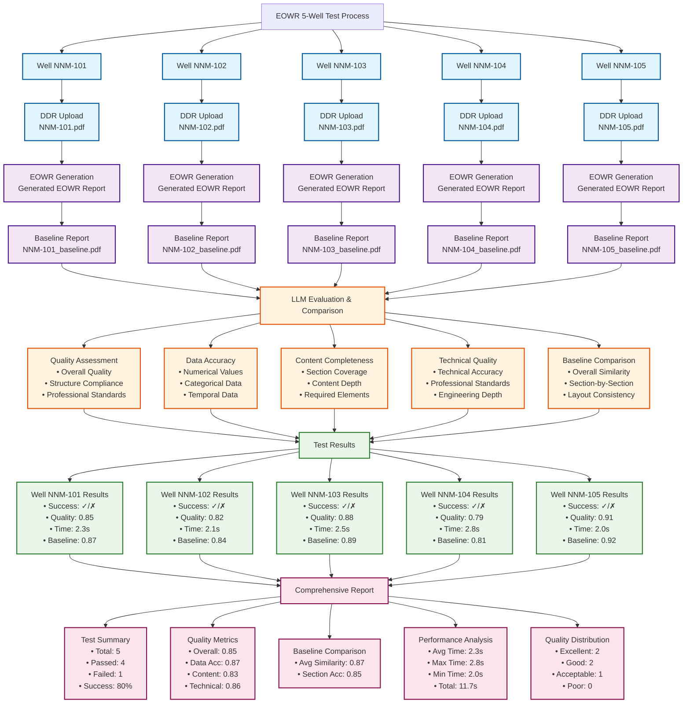

# EOWR 5-Well Test Process Diagram

## Process Flow

## Key Components

### 1. Data Input
- **DDR Files**: 5 Daily Drilling Reports (PDF format)
- **Baseline Reports**: 5 corresponding baseline EOWR reports (PDF format)
- **Configuration**: Test parameters and expected content

### 2. EOWR Generation
- **Individual Processing**: Each well processed separately
- **Data Extraction**: Extract data from DDR files
- **Report Generation**: Create comprehensive EOWR reports
- **Visualization**: Generate charts and visualizations

### 3. LLM Evaluation
- **Quality Assessment**: Overall quality evaluation
- **Data Accuracy**: Compare against source data
- **Content Completeness**: Assess section coverage
- **Technical Quality**: Evaluate technical accuracy
- **Baseline Comparison**: Compare with baseline reports

### 4. Test Results
- **Individual Results**: Per-well test results
- **Quality Scores**: Multiple quality metrics
- **Performance Metrics**: Generation times
- **Baseline Comparison**: Similarity scores

### 5. Comprehensive Report
- **Test Summary**: Overall pass/fail statistics
- **Quality Metrics**: Average scores across all metrics
- **Baseline Analysis**: Comparison with baseline reports
- **Performance Analysis**: Timing and performance data
- **Quality Distribution**: Distribution of quality scores

## Success Criteria

- **Success Rate**: ≥ 80% of tests pass
- **Average Quality**: ≥ 80% overall quality score
- **Baseline Similarity**: ≥ 85% similarity to baseline reports
- **Performance**: All wells generate within 5 minutes
- **No Critical Errors**: No major errors during execution
