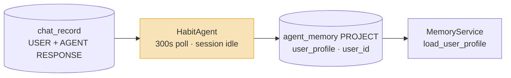
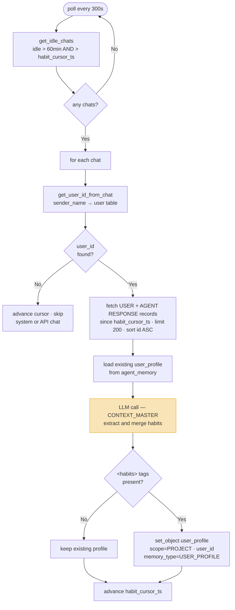

# Habit Agent

**Location:** `backend/app/agents/workers/habit_agent.py`

---

## Motivation

The memory design captures what is known about the *project* — well data, data quality issues, operational lessons. But there is a second kind of knowledge that accumulates across sessions: knowledge about the *user*. How they structure questions, which output formats they prefer, what they already know, how they respond to uncertainty.

This knowledge cannot be extracted reliably per-exchange. A single request for metric units may be task-specific; the same preference appearing across multiple exchanges is a habit. Distinguishing stable preferences from one-off requests requires a view of the full session. The memory design therefore needs a mechanism that reads the completed session transcript and distils persistent behavioral patterns into a user model available to the agent in future sessions.

---

## Role in the Memory Pipeline

`HabitAgent` runs in parallel with `ConsolidationAgent`, both firing at session idle. Where `ConsolidationAgent` extracts domain findings from the cheatsheet, `HabitAgent` extracts behavioral patterns from the raw transcript. The two agents write to distinct slots in `agent_memory` and never interact.



`user_profile` is consumed exclusively by `MemoryService.load_user_profile`, injected into the system prompt before each session. It is explicitly excluded from `tool_read_project_memory` so user preferences do not contaminate analytical results.

---

## Implementation

### Trigger

`HabitAgent` is a `CONTINUOUS` agent polling every 300 seconds (configurable via `agent_config["poll_interval"]`). On each poll it queries for chats where:

- `max(agent_response_ts) < now − 60 min` — session is idle, AND
- `max(agent_response_ts) > habit_cursor_ts` — new exchanges exist since the last run

The 60-minute idle threshold matches `ConsolidationAgent`, ensuring both post-session agents fire after the session has fully settled.



### Transcript assembly

USER messages and AGENT RESPONSE records since the last `habit_cursor_ts` are fetched, merged, and sorted by `record_id` ascending. Agent turns use `compressed_message or message`. The transcript is formatted as alternating `User:` / `Assistant:` lines and passed to the LLM together with the existing profile.

System and API chats have no USER records with an identifiable `sender_name`. `get_user_id_from_chat` resolves `sender_name` (user email) to a `user_id` via a join to the `user` table. If no `user_id` is found, the cursor is advanced and the chat is silently skipped.

### Profile dimensions

The LLM extracts observations across five dimensions:

| Dimension | What it captures |
|---|---|
| **Query style** | Targeting precision, batching, specificity, follow-up pattern |
| **Interaction style** | Correction behavior, tolerance for ambiguity, initiative preference |
| **Output preferences** | Units, format (prose / table / chart), verbosity, numeric precision |
| **Domain focus** | Primary metrics, depth of analysis, comparison style |
| **Expertise signals** | Terms used fluently, concepts needing explanation, verification behavior |

Only dimensions with observable evidence are included. Dimensions with no entries are omitted entirely.

### Update strategy

The LLM merges the new session observations with the existing profile:

| Observation | Action |
|---|---|
| Confirms an existing entry | Leave unchanged — no duplication |
| Strengthens an existing entry | Append `(confirmed)` or strengthen phrasing |
| Contradicts an existing entry | Soften: `"sometimes prefers X, but also Y in context Z"` |
| New pattern | Add under the appropriate dimension |

A habit requires either the same pattern appearing across two or more exchanges, or a single explicit correction of Ida's default behavior. One-off task-specific requests are never captured.

### Cursor

`habit_cursor_ts` is a per-chat timestamp column on the `chat` row. It advances to `latest_ts` (the most recent agent response timestamp in the idle query) after each run, whether or not a profile update was written.

---

## Consumption

### `MemoryService.load_user_profile`

```python
mem = self._memory_store.get_object(
    agent_id="habit_agent", name="user_profile",
    scope=MemoryScope.PROJECT, project_id=project_id, user_id=user_id
)
return mem.content_text
```

Point read by `(agent_id, name, scope, project_id, user_id)`. Returns `content_text` directly — the profile text written by the LLM. Injected into every system prompt before the agent starts reasoning.

The profile is scoped per `(project_id, user_id)`: preferences observed on one project do not carry over to another. A user's communication style on a shallow gas well project may differ from their style on a deep HP/HT project.
