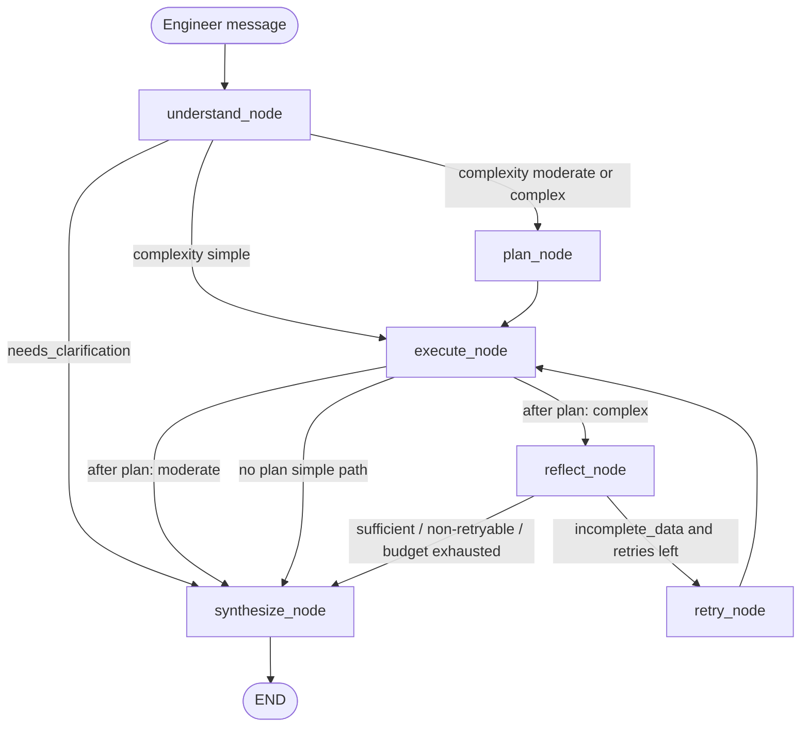
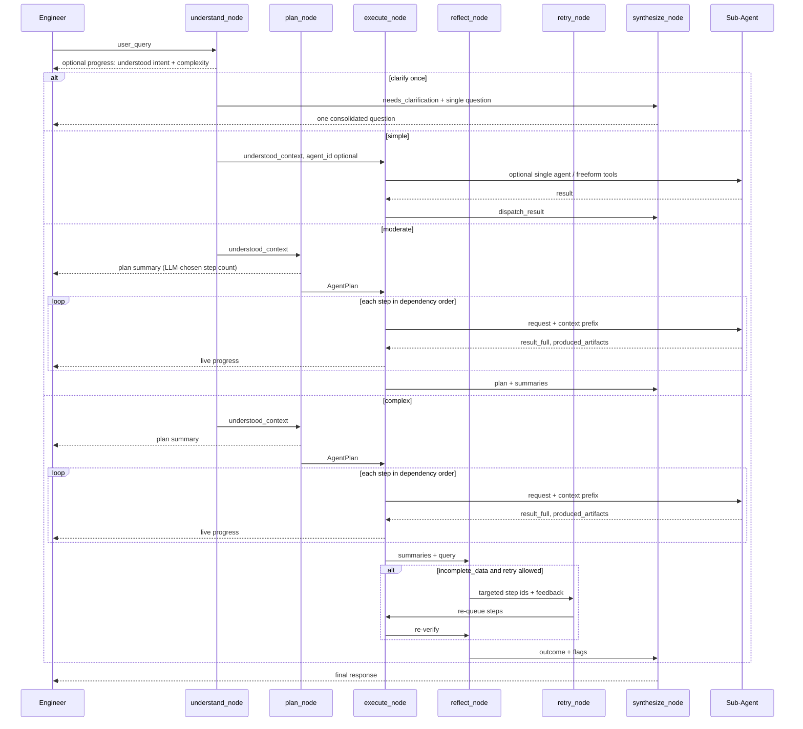
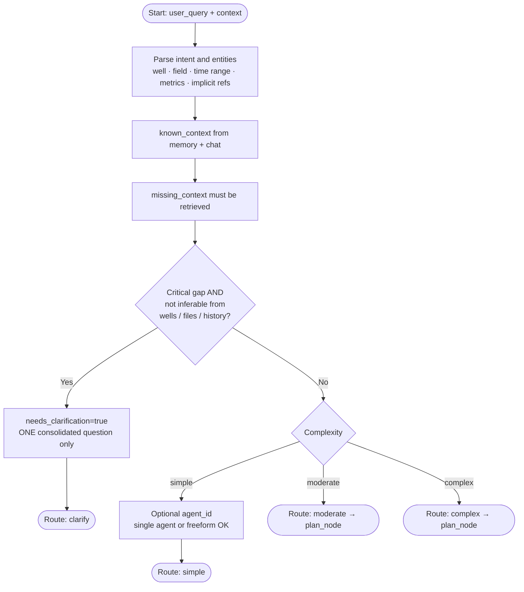
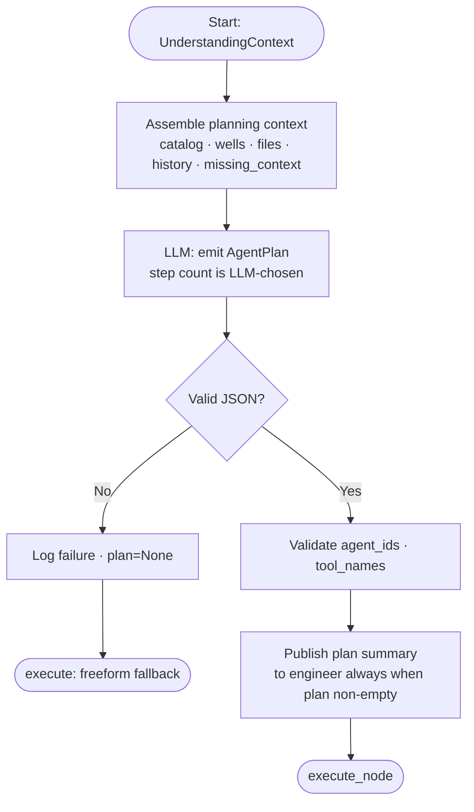
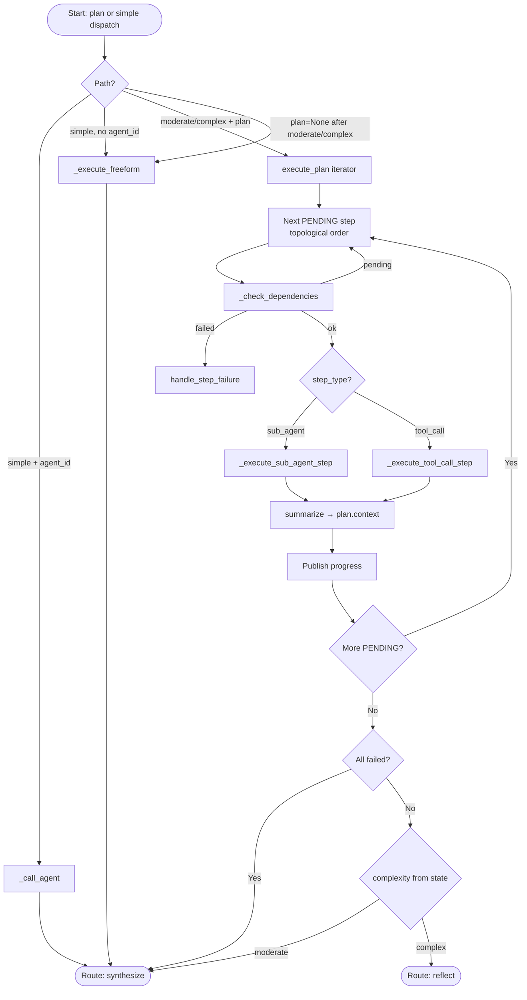
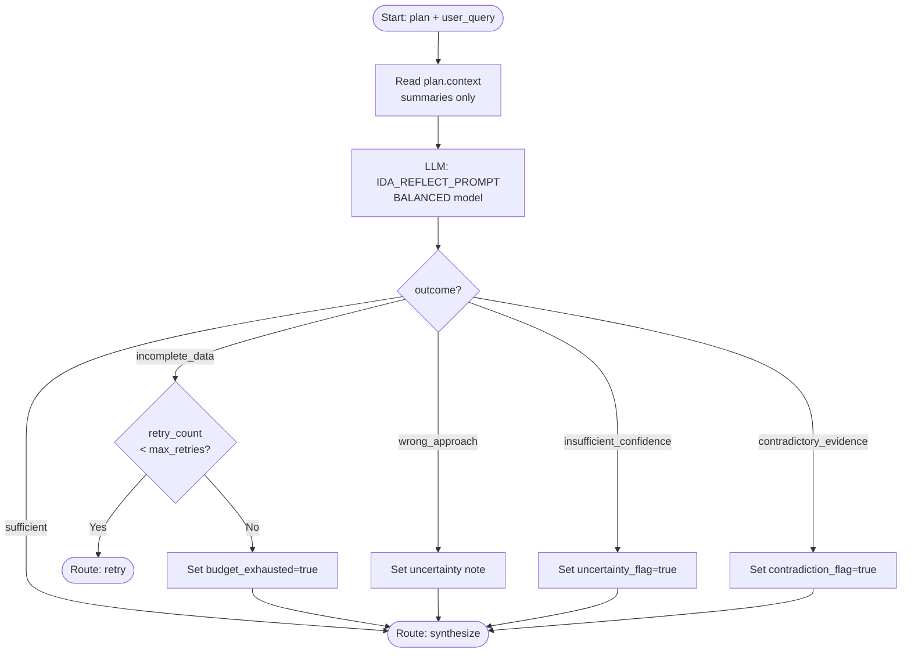
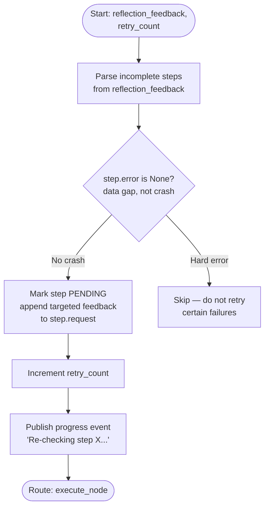
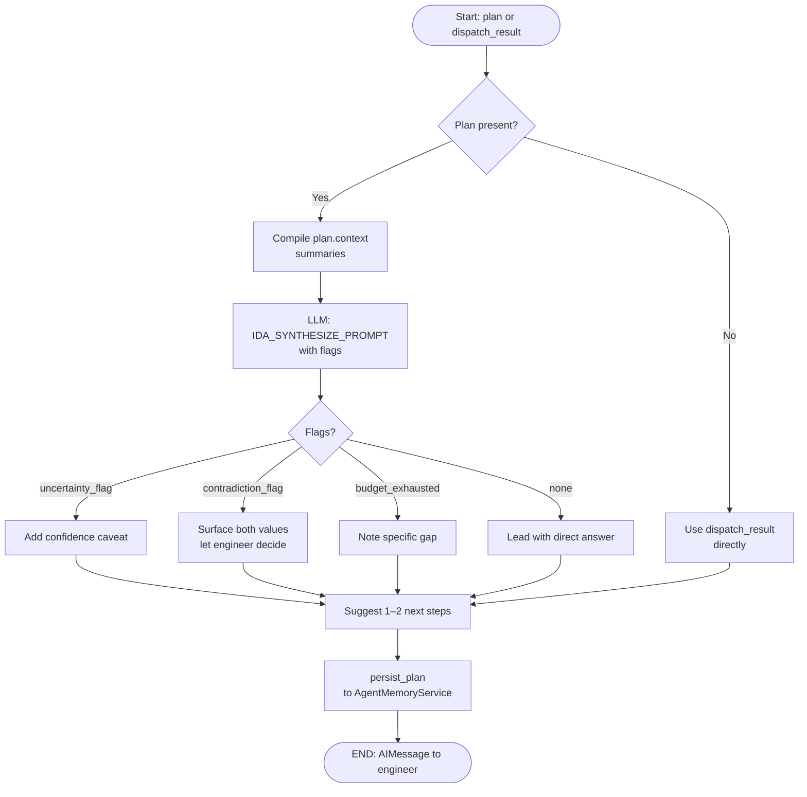

# Ida Agent — Implementation Plan

> Last updated: 2026-03-30
> Status: Living document — ⚠️ recommendation, 🔲 deferred, 🐛 known bug fixed in this revision

---

## 1. Architecture Overview

Ida is a **meta-agent**: it does not answer questions directly. It **understands** the engineer’s request (intent, entities, memory vs. retrieval gaps), **plans** when the task needs structured steps, **executes** against specialists, optionally **reflects** and **retries** (complex only), then **synthesises** a final response.

```
Engineer Request
      │
      ▼
┌──────────────────────────────────────────────────────┐
│                       IDA AGENT                      │
│                                                      │
│  Understand → [Plan] → Execute → [Reflect] → Synth  │
│                    ↑                  │              │
│                    └──── Retry ───────┘ (complex)    │
└──────────────────────────────────────────────────────┘
         │            │           │           │
         ▼            ▼           ▼           ▼
   DataInsight     SMEAgent  Simulator  ReportGenerator
   (analysis)      (domain)  (sim runs) (documents)
                                  │
                              EOWRAgent
```

### 1.1 Two cognitive nodes: `understand_node` and `plan_node`

| Node | Responsibility |
|------|----------------|
| **`understand_node`** | Parse **intent**, **entities** (well, field, time range, metrics, implicit references like “the last well”), and **implicit context**. Split **known** facts (memory, chat history) vs **must retrieve**. Classify **complexity**: `simple` \| `moderate` \| `complex`. If **critical** information is missing and cannot be inferred, set **`needs_clarification`** and emit **one** consolidated question — **never** a multi-question interrogation. |
| **`plan_node`** | Runs when routing needs a plan (**`moderate`** or **`complex`**). The **LLM chooses how many steps** the task needs — **no** fixed cap or recommended count in prompts. Output is **`AgentPlan`** at an abstraction where the **execute** layer (orchestrator / programmatic executor) can reliably turn each step into tool calls or `tool_call_agent_sync` **without** micromanaging internals of sub-agents. |

**`plan_node` is skipped for `simple`** (direct dispatch or freeform execute).

**IDAParser is NOT orchestrated by Ida.** It is a file-processing pipeline triggered by upload events. Ida checks file status and routes to analysis agents once processing is confirmed complete.

### 1.2 End-to-end LangGraph (high level)



**Reflection** runs only on the **`complex`** path (multi-step, multi-source orchestration). **`moderate`** uses a plan but skips `reflect_node` by default to limit latency; optional future flag could enable reflect for moderate.

---

## 2. LangGraph Workflow

### 2.1 End-to-end sequence



### 2.2 Routing map (ASCII)

```
                    ┌────────────────────────────┐
                    │      understand_node       │
                    │  intent · entities ·       │
                    │  known vs retrieve ·       │
                    │  simple|moderate|complex   │
                    │  clarify ONCE if critical  │
                    └──────────────┬─────────────┘
                                   │
           ┌───────────┬───────────┼───────────┬───────────┐
           ▼           ▼           ▼           ▼           │
      clarify      simple     moderate     complex       │
           │           │           │           │         │
           ▼           │           ▼           ▼         │
    synthesize         │      plan_node   plan_node      │
    (one question)     │           │           │         │
                       │           └─────┬─────┘         │
                       │                 ▼               │
                       │           execute_node          │
                       │                 │               │
                       │     ┌──────────┴──────────┐    │
                       │     ▼                     ▼    │
                       │  moderate path        complex │
                       │     │                 reflect  │
                       │     │                     │    │
                       │     │              retry?──────┤
                       │     │                     │    │
                       └─────┴─────────────────────┴────┘
                                   ▼
                            synthesize_node → END
```

### 2.3 Node responsibilities

| Node | Input → Output |
|------|----------------|
| `understand_node` | query + project/chat/memory context → `UnderstandingContext`: intent, entities, `known_context` / `missing_context`, `complexity` ∈ {`simple`,`moderate`,`complex`}, optional `agent_id`, optional **single** `clarification_question` |
| `plan_node` | `UnderstandingContext` + catalog → `AgentPlan`: LLM-chosen steps at **execution-ready abstraction**; validate agent IDs / tool names; **always** publish a short plan summary to the engineer before execution |
| `execute_node` | plan (moderate/complex) or direct args (simple) → step results, `produced_artifacts`, `plan.context` summaries |
| `reflect_node` | plan summaries + original query → `ReflectionOutcome`. **`complex` path only** (default). |
| `retry_node` | reflection outcome + **`RetryConfig`** → re-mark steps, increment counter; budget from **configurable** `max_retries` |
| `synthesize_node` | results + flags → final answer + optional memory persist |

---

## 3. Node Diagrams

### `understand_node`



**Output fields (handoff to `plan_node` / `execute_node`):**
- `complexity`: `"simple"` \| `"moderate"` \| `"complex"`
- `understood_context` / `UnderstandingContext`: intent, entities, known vs missing lists
- `agent_id`: optional; strongest for **`simple`** when one catalog agent clearly owns the task
- `needs_clarification`: bool — if true, **`clarification_question`** must be a **single** user-facing question (no bullet lists of asks)
- Never emit multiple clarification turns from this node; one pass, then route to synthesize

**Complexity — prompt heuristics (LLM decides; not hard-coded):**

| Signal | Tends toward |
|--------|----------------|
| One agent, one pass, definitional or single lookup | `simple` |
| Several dependent steps **or** two specialists **or** one source + light synthesis | `moderate` |
| Multi-step **and** multi-source, cross-well benchmarks, root-cause spanning data + docs + SME | `complex` |

When unsure between `moderate` and `complex`, prefer **`complex`** if failure modes are costly; prefer **`moderate`** if a short plan (even one step) is enough.

---

### `plan_node`



**Abstraction level (critical):** Each step is a **work package** the execute layer can implement as one orchestrator action:
- **`sub_agent`**: `objective` + `request` = self-contained task string (not a script, but **specific enough** that `tool_call_agent_sync` or the executor LLM can call the right agent without guessing).
- **`tool_call`**: only for **bounded** lookups with fully known arguments (whitelist).
- Avoid splitting work that a **single** specialist would naturally do in one run (e.g. five micro-steps of “retrieve NPT” for the same well). Prefer **fewer, larger** steps over many trivial ones.
- **`depends_on`** expresses true ordering; empty means parallelizable in a future implementation.

**Step count:** The **LLM alone** decides how many steps are required. Prompts must **not** suggest a target number (no “prefer 2–3”, no “max 4”). Guidance is qualitative only: *minimum steps that fully answer the request*, at the abstraction above.

---

### `execute_node`



---

### `reflect_node`



---

### `retry_node`



---

### `synthesize_node`



---

## 4. Two-Level Reflection

Sub-agents (DataInsight, SME) already have their own internal reflection. That reflection asks: *"Is my domain analysis correct? Does this make physical sense?"*

Ida's `reflect_node` asks a different question: *"Did the combination of all step outputs actually answer the original question?"* It is a goal-achievement check, not a data-quality check. Ida's reflect prompt must not redo domain analysis — it reads only the summaries.

```
┌────────────────────────────────────────────────┐
│  IDA REFLECT  (complex only)                   │
│  "Was the user's question answered?"           │
│  Cheap model (BALANCED). Reads summaries only. │
└────────────────────────────────────────────────┘
              ▲ built on top of
┌────────────────────────────────────────────────┐
│  SUB-AGENT REFLECT  (already implemented)      │
│  DataInsight: physical sanity, data gaps       │
│  SME: confidence, citation quality             │
└────────────────────────────────────────────────┘
```

**Why complex only (default)?** **`simple`** and **`moderate`** either have no multi-step combination or a shorter chain where extra latency from reflect is often unjustified. **`complex`** is where combined partial outputs most often miss the overall intent; **`moderate`** can opt in to reflect later via config if product requires it.

---

## 5. Data Models

### New file: `backend/app/agents/planning/models.py`

```python
from __future__ import annotations
from datetime import datetime
from enum import StrEnum
from typing import Any, Dict, List, Optional
from pydantic import BaseModel, Field
import uuid


class PlanStepStatus(StrEnum):
    PENDING     = "pending"
    IN_PROGRESS = "in_progress"
    COMPLETED   = "completed"
    FAILED      = "failed"
    SKIPPED     = "skipped"


class PlanStepType(StrEnum):
    SUB_AGENT = "sub_agent"   # call a specialist agent via orchestrator
    TOOL_CALL = "tool_call"   # lightweight direct toolbox call, no agent overhead

# LLM_REASONING removed: synthesize_node already handles end-of-plan reasoning.
# HITL removed: clarification belongs at understand_node time (the "clarify" route).


class PlanStatus(StrEnum):
    DRAFT       = "draft"
    IN_PROGRESS = "in_progress"
    COMPLETED   = "completed"
    FAILED      = "failed"


class ReflectionOutcome(StrEnum):
    SUFFICIENT              = "sufficient"
    INCOMPLETE_DATA         = "incomplete_data"         # targeted retry allowed
    WRONG_APPROACH          = "wrong_approach"          # surface note; no retry
    INSUFFICIENT_CONFIDENCE = "insufficient_confidence" # surface uncertainty; no retry
    CONTRADICTORY_EVIDENCE  = "contradictory_evidence"  # contradiction IS the finding


class RetryConfig(BaseModel):
    """Injectable retry policy — load from agent config, global config, or env (no literals in nodes)."""
    max_retries: int = 1                              # max targeted re-execute attempts after reflect
    retryable_outcomes: List[str] = ["incomplete_data"]  # ReflectionOutcome values that may trigger retry_node


class ArtifactRef(BaseModel):
    type: str                   # file | data_record | embedding | chat_message | state_mutation
    name: str
    ref: Dict[str, Any] = {}    # {file_id: ...} | {record_ids: [...]} | {chat_record_id: ...}


class UnderstandingContext(BaseModel):
    """Structured output of understand_node — passed to plan_node and execute_node."""
    intent_summary: str                   # one sentence describing the goal
    entities: Dict[str, Any] = {}         # {"wells": [...], "fields": [...], "time_range": {...}}
    known_context: List[str] = []         # facts already in memory or chat history
    missing_context: List[str] = []       # what must be retrieved to answer the question
    complexity: str = "simple"            # "simple" | "moderate" | "complex"
    agent_id: Optional[str] = None        # set for simple known-agent dispatch
    needs_clarification: bool = False
    clarification_question: Optional[str] = None


class PlanStep(BaseModel):
    id: str
    title: str
    description: str = ""
    step_type: PlanStepType = PlanStepType.SUB_AGENT

    # SUB_AGENT: agent_id from catalog, request = natural language task
    agent_id: Optional[str] = None

    # TOOL_CALL: "toolbox_name.tool_name", request = JSON-encoded tool args
    tool_name: Optional[str] = None

    request: str = ""
    objective: str = ""
    depends_on: List[str] = []
    status: PlanStepStatus = PlanStepStatus.PENDING
    result_summary: Optional[str] = None   # ≤500 chars — passed to reflect + synthesize
    result_full: Optional[str] = None      # full output — stored but not forwarded
    produced_artifacts: List[ArtifactRef] = []
    error: Optional[str] = None
    retry_count: int = 0


class AgentPlan(BaseModel):
    plan_id: str = Field(default_factory=lambda: str(uuid.uuid4()))
    session_id: str = ""
    title: str
    summary: str                            # markdown — published to engineer before execution
    steps: List[PlanStep]
    status: PlanStatus = PlanStatus.DRAFT
    context: Dict[str, str] = {}            # {step_id: result_summary} — lightweight
    produced_artifacts: List[ArtifactRef] = []
    targeted_retry_steps: List[str] = []    # step IDs queued for targeted retry
```

### `IdaAgentState` additions — `backend/app/agents/workers/state.py`

```python
# Add to IdaAgentState TypedDict:
understood_context:  NotRequired[Optional[Dict]]  # UnderstandingContext serialised
plan:                NotRequired[Optional[Dict]]
reflection_outcome:  NotRequired[Optional[str]]
reflection_feedback: NotRequired[Optional[str]]
retry_count:         NotRequired[int]             # starts at 0
budget_exhausted:    NotRequired[bool]
uncertainty_flag:    NotRequired[bool]
contradiction_flag:  NotRequired[bool]
produced_artifacts:  NotRequired[List[Dict]]
```

---

### Example: `AgentPlan` for a complex query

> *"Compare NPT on Well-A and Well-B and explain what drove the cost difference."*

```json
{
  "plan_id": "3f7a...",
  "title": "NPT and cost comparison: Well-A vs Well-B",
  "summary": "Retrieve NPT events and cost breakdowns for both wells, then compare drivers.",
  "status": "draft",
  "steps": [
    {
      "id": "s1",
      "title": "Get NPT events — Well-A",
      "step_type": "sub_agent",
      "agent_id": "data_insight_agent",
      "request": "Retrieve and summarise all NPT events for Well-A, including category, duration, and phase.",
      "objective": "Full NPT event list for Well-A",
      "depends_on": []
    },
    {
      "id": "s2",
      "title": "Get NPT events — Well-B",
      "step_type": "sub_agent",
      "agent_id": "data_insight_agent",
      "request": "Retrieve and summarise all NPT events for Well-B, including category, duration, and phase.",
      "objective": "Full NPT event list for Well-B",
      "depends_on": []
    },
    {
      "id": "s3",
      "title": "Cost breakdown comparison",
      "step_type": "sub_agent",
      "agent_id": "data_insight_agent",
      "request": "Compare daily and cumulative costs for Well-A and Well-B. Identify the largest cost category differences.",
      "objective": "Cost delta by category between the two wells",
      "depends_on": ["s1", "s2"]
    },
    {
      "id": "s4",
      "title": "SME root-cause analysis",
      "step_type": "sub_agent",
      "agent_id": "sme_agent",
      "request": "Given the NPT profiles and cost differences retrieved above, explain the primary drivers of the cost gap between Well-A and Well-B.",
      "objective": "Root-cause explanation grounded in NPT and cost data",
      "depends_on": ["s3"]
    }
  ]
}
```

Key points:
- `s1` and `s2` have no `depends_on` — they can run independently (parallel in future)
- `s3` depends on both `s1` and `s2`; `execute_node` injects their summaries as context prefix
- `s4` depends on `s3`; routes to `sme_agent` for synthesis-level reasoning
- Step count is LLM-determined — 4 steps here because the task genuinely needs them
- A `tool_call` step (e.g. `mem_storage.get_project_memory`) would appear as step 0 only if prior analysis is worth checking first

---

## 6. File-by-File Implementation

### 6.1 `backend/app/agents/planning/mixin.py`

`IdaAgent` inherits `PlanningMixin`. All planning logic lives here; LangGraph nodes are thin wrappers. `summary_llm` (BALANCED) and `reflect_llm` are initialised in `init_agent()`. `retry_config: RetryConfig` is injected at construction and stored on `self`.

```python
class PlanningMixin:

    # ── Lifecycle — called directly by LangGraph nodes ────────────────────

    def understand_request(self, user_request: str) -> UnderstandingContext:
        """Parse intent, entities (well, field, time range, metric), and implicit context.
        Identify what is known from memory/history vs. what must be retrieved.
        Classify complexity: simple | moderate | complex (see doc §2.3 / §7).
        Set needs_clarification=True and provide a SINGLE question if critical info is
        missing AND cannot be inferred from available context.
        Returns UnderstandingContext. Uses IDA_UNDERSTAND_PROMPT (BALANCED model)."""

    def generate_plan(self, ctx: UnderstandingContext) -> Optional[AgentPlan]:
        """Build planning context (catalog, wells, files, chat history, understood_context).
        Call LLM with IDA_PLAN_PROMPT. LLM decides the number of steps needed.
        Validate agent_ids against catalog whitelist and tool_names against _PLANNABLE_TOOLS.
        Publish plan summary whenever a non-empty plan is validated.
        Returns AgentPlan or None on parse failure — execute falls back to freeform."""

    def approve_plan(self, plan: AgentPlan) -> AgentPlan:
        """Auto-approves by default. Publishes plan.summary as a streaming message to
        the engineer before execution begins so they see Ida's intent. No blocking gate."""

    def execute_plan(self, plan: AgentPlan) -> AgentPlan:
        """Iterate steps in depends_on topological order. For each PENDING step:
        call _check_dependencies → if ok, call execute_step; on failure call handle_step_failure.
        Accumulate result_summary into plan.context[step.id].
        Set plan.status = COMPLETED | FAILED on exit."""

    def execute_step(self, plan: AgentPlan, step: PlanStep) -> PlanStep:
        """Dispatch to _execute_sub_agent_step or _execute_tool_call_step by step_type.
        Clear step.produced_artifacts before execution to prevent retry duplication."""

    def handle_step_failure(self, plan: AgentPlan, step: PlanStep) -> str:
        """LLM decides: 'replan' | 'skip' | 'abort' | 'ask_user'.
        Hard errors (timeout, exception) → 'skip' immediately; no retry on certain failures.
        Data-gap failures (step.error is None) → eligible for 'replan'."""

    def synthesize_response(self, plan: AgentPlan) -> str:
        """Compile plan.context summaries into final response via IDA_SYNTHESIZE_PROMPT.
        Pass uncertainty_flag, contradiction_flag, budget_exhausted to guide tone."""

    def verify_outcome(self, plan: AgentPlan, user_request: str) -> Dict:
        """Goal-achievement check: did the combination of all step outputs answer the question?
        Returns {outcome: ReflectionOutcome, feedback: str, confidence: str}.
        Uses IDA_REFLECT_PROMPT with BALANCED model. Complex queries only."""

    def publish_plan_event(self, plan: AgentPlan, step: Optional[PlanStep], event_name: str):
        """Publish progress event to message bus — visible as streaming update in UI."""

    def persist_plan(self, plan: AgentPlan):
        """Save completed plan to AgentMemoryService for audit and retry-failure memory."""

    # ── Context & prompt building ─────────────────────────────────────────

    def _build_catalog_text(self) -> str:
        """Format agent catalog for {agent_catalog} prompt placeholder."""

    def _build_plannable_tools_text(self) -> str:
        """Format _PLANNABLE_TOOLS whitelist for {tool_catalog} prompt placeholder.
        This list also serves as the validation whitelist for tool_call steps."""

    def _get_catalog_agents(self) -> list[dict]:
        """Return [{agent_id, name}] from AgentOrchestratorToolbox._build_catalog().
        Used to validate agent_ids in LLM-generated plans."""

    def _context_prefix(self, step: PlanStep, plan: AgentPlan) -> str:
        """Prepend plan.context[dep_id] summaries to step.request before dispatch.
        Each step receives awareness of prior step findings without passing full outputs."""

    # ── Result handling ───────────────────────────────────────────────────

    def summarize_step_result(self, text: str, objective: str = "", max_chars: int = 500) -> str:
        """Tiered: pass-through if fits → extract lines with numbers/objective keywords
        → LLM summarise (BALANCED, 2–3 sentences) → hard truncate as last resort.
        🐛 Hard truncation alone loses almost all meaning for 5–50k char sub-agent outputs."""

    # ── Dependency resolution ─────────────────────────────────────────────

    def _check_dependencies(self, step: PlanStep, plan: AgentPlan) -> str:
        """Returns 'ok' | 'failed' | 'pending'.
        🐛 Replaces _dependencies_met which treated FAILED same as PENDING,
        allowing downstream steps to run after a hard dependency failure."""

    # ── Step dispatch internals ───────────────────────────────────────────

    def _execute_sub_agent_step(self, step: PlanStep, plan: AgentPlan) -> PlanStep:
        """Call agent via tool_call_agent_sync with _context_prefix injected into request.
        Populate step.result_full, result_summary, status, error, produced_artifacts."""

    def _execute_tool_call_step(self, step: PlanStep, plan: AgentPlan) -> PlanStep:
        """Direct toolbox call (step.tool_name format: 'toolbox.tool_name').
        Parse step.request as JSON args; merge standard passthrough params."""

    def _call_agent(self, agent_id: str, request: str, state: dict) -> dict:
        """Single direct agent dispatch for simple queries (no plan context needed)."""

    def _execute_freeform(self, state: dict) -> Command:
        """Fallback when generate_plan returns None (LLM parse failure).
        Runs a single LLM call with full tool loop — no step structure.
        🐛 Was previously referenced but never defined; caused runtime crash."""

    # ── JSON parsing ──────────────────────────────────────────────────────

    @staticmethod
    def _parse_json_response(text: str) -> dict:
        """Strip markdown fences, extract first {...} block, parse JSON.
        Returns {} on failure. Used in every node that reads LLM JSON output."""
```

**Curated tool whitelist** — module-level constant in `mixin.py`. Only these three tools are valid for `tool_call` steps:

```python
_PLANNABLE_TOOLS = [
    {"tool_name": "project.get_files_metadata",    "description": "List uploaded files and processing status."},
    {"tool_name": "mem_storage.get_project_memory", "description": "Retrieve prior analysis stored for this project."},
    {"tool_name": "rag.search_documents",           "description": "Keyword/semantic search over project documents."},
]
```

---

### 6.2 `backend/app/agents/workers/ida.py` — LangGraph Nodes

`IdaAgent(PlanningMixin)` — nodes are thin wrappers; all logic lives in the mixin.
`retry_config` is stored as `self.retry_config: RetryConfig` (set in `init_agent` or constructor).

#### `understand_node`
🐛 Clarification check must short-circuit before routing to plan or execute.

```python
def understand_node(self, state: dict) -> Command:
    user_query = state.get("user_query", "")
    ctx: UnderstandingContext = self.understand_request(user_query)

    if ctx.needs_clarification:
        return Command(
            update={
                "understood_context": ctx.model_dump(),
                "complexity": "clarify",
                "dispatch_result": ctx.clarification_question,
            }
        )

    return Command(
        update={
            "understood_context": ctx.model_dump(),
            "complexity": ctx.complexity,     # "simple" | "moderate" | "complex"
            "agent_id": ctx.agent_id,
        }
    )
```

#### `plan_node`
Runs for **`moderate`** and **`complex`** only (skipped for **`simple`**).

```python
def plan_node(self, state: dict) -> Command:
    ctx = UnderstandingContext(**state["understood_context"])
    plan: Optional[AgentPlan] = self.generate_plan(ctx)
    plan = self.approve_plan(plan) if plan else None
    return Command(update={"plan": plan.model_dump() if plan else None})
```

#### `execute_node`

```python
def execute_node(self, state: dict) -> Command:
    complexity = state.get("complexity", "simple")
    plan_dict  = state.get("plan")
    agent_id   = state.get("agent_id")
    ctx_dict   = state.get("understood_context", {})

    if complexity == "simple":
        # 🐛 Guard: if no agent_id, fall back to direct LLM response
        result = self._call_agent(agent_id, ...) if agent_id else self._execute_freeform(state)
        return Command(update={"dispatch_result": result, "phase": "synthesize"})

    plan = AgentPlan(**plan_dict) if plan_dict else None
    plan = self.execute_plan(plan) if plan else self._execute_freeform(state)

    all_errored = plan and all(s.status == PlanStepStatus.FAILED for s in plan.steps)
    # Reflect only for complex; moderate goes straight to synthesize
    route = (
        "reflect"
        if (complexity == "complex" and not all_errored)
        else "synthesize"
    )
    return Command(update={"plan": plan.model_dump() if plan else None, "phase": route})
```

#### `reflect_node`

```python
def reflect_node(self, state: dict) -> Command:
    plan   = AgentPlan(**state["plan"]) if state.get("plan") else None
    result = self.verify_outcome(plan, state["user_query"])
    return Command(
        update={
            "reflection_outcome":  result["outcome"],
            "reflection_feedback": result["feedback"],
            "uncertainty_flag":    result["outcome"] == ReflectionOutcome.INSUFFICIENT_CONFIDENCE,
            "contradiction_flag":  result["outcome"] == ReflectionOutcome.CONTRADICTORY_EVIDENCE,
        }
    )
```

#### `retry_node`
Retry budget is driven by `self.retry_config`.

```python
def retry_node(self, state: dict) -> Command:
    outcome     = state.get("reflection_outcome")
    retry_count = state.get("retry_count", 0)
    feedback    = state.get("reflection_feedback", "")

    if (
        outcome not in self.retry_config.retryable_outcomes
        or retry_count >= self.retry_config.max_retries
    ):
        return Command(update={"budget_exhausted": True}, goto="synthesize")

    plan = AgentPlan(**state["plan"])
    # Only retry steps with no hard error (data gap, not crash)
    # 🐛 Hard-errored steps (step.error is not None) must not be retried
    for step in plan.steps:
        if step.id in plan.targeted_retry_steps and step.error is None:
            step.status = PlanStepStatus.PENDING
            step.request = f"{step.request}\n\nAdditional guidance: {feedback}"

    return Command(
        update={"plan": plan.model_dump(), "retry_count": retry_count + 1},
        goto="execute",
    )
```

#### `synthesize_node`

```python
def synthesize_node(self, state: dict) -> Command:
    plan    = AgentPlan(**state["plan"]) if state.get("plan") else None
    content = self.synthesize_response(plan) if plan else state.get("dispatch_result", "")
    self.persist_plan(plan)
    return Command(update={"messages": [..., AIMessage(content=content)]}, goto=END)
```

#### LangGraph wiring

```python
def _compile_graph(self):
    builder = StateGraph(IdaAgentState)
    builder.add_node("understand", self.understand_node)
    builder.add_node("plan",       self.plan_node)
    builder.add_node("execute",    self.execute_node)
    builder.add_node("reflect",    self.reflect_node)
    builder.add_node("retry",      self.retry_node)
    builder.add_node("synthesize", self.synthesize_node)
    builder.set_entry_point("understand")

    builder.add_conditional_edges(
        "understand",
        lambda s: s.get("complexity"),
        {
            "simple": "execute",
            "moderate": "plan",
            "complex": "plan",
            "clarify": "synthesize",
        },
    )
    builder.add_edge("plan", "execute")
    builder.add_conditional_edges(
        "execute",
        lambda s: s.get("phase"),
        {"reflect": "reflect", "synthesize": "synthesize"},
    )
    builder.add_conditional_edges(
        "reflect",
        self._route_after_reflect,
        {"sufficient": "synthesize", "retry": "retry", "synthesize": "synthesize"},
    )
    builder.add_edge("retry",     "execute")
    builder.add_edge("synthesize", END)
    return builder.compile(name="ida_agent")
```

---

### 6.3 `backend/app/agents/utils/ida_prompts.py`

**`IDA_UNDERSTAND_PROMPT`** — intent parsing and classification only:

```
You are Ida, an AI assistant for drilling engineers.

Available agents: {agent_catalog}
Project wells:    {available_wells}
Project files:    {available_files}
Recent chat:      {chat_history}
Memory notes:     {project_memory}
User request:     {user_query}

Your job: understand the request deeply before deciding how to answer it.

Step 1 — Parse intent and entities:
  Extract: intent (what the engineer wants), well names, field names, time ranges,
  metrics (NPT, cost, ROP, etc.), and any implicit context (e.g. "the last well" = most
  recent well in the project).

Step 2 — Identify known vs. unknown:
  known_context:   facts already present in chat history or memory notes.
  missing_context: information that must be retrieved to answer the question.
  These inform the plan_node's step design — surface them accurately.

Step 3 — Classify complexity (three levels):
  "simple"   — one specialist or a direct LLM answer suffices; no structured plan.
  "moderate" — needs a plan (possibly a single step): dependent sub-tasks, two sources,
               or clear sequencing, but not full multi-source root-cause campaigns.
  "complex"  — multi-step and multi-source, cross-well, or heavy synthesis; warrants
               post-execute reflection and optional retry.

  When unsure between moderate and complex, prefer "complex" if mistakes are costly.

Step 4 — Clarification (at most once):
  If critical information is missing AND cannot be inferred from wells, files, or history,
  set needs_clarification=true and write ONE consolidated question that unblocks the task.
  Do not emit a list of separate questions. Do not interrogate.

Return ONLY valid JSON:
{
  "intent_summary":          "...",
  "entities": {
    "wells":      [...],
    "fields":     [...],
    "time_range": {"start": null, "end": null},
    "metrics":    [...]
  },
  "known_context":           [...],
  "missing_context":         [...],
  "complexity":              "simple" | "moderate" | "complex",
  "agent_id":                null,
  "needs_clarification":     false,
  "clarification_question":  null
}
```

**`IDA_PLAN_PROMPT`** — step generation only (runs after `understand_node`):

```
You are Ida, an AI assistant for drilling engineers.

Available agents: {agent_catalog}
Project wells:    {available_wells}
Project files:    {available_files}
Understood intent:   {intent_summary}
Known context:       {known_context}
Missing context:     {missing_context}
User request:        {user_query}

Generate a plan to answer the engineer's request.

Rules:
  - Use the **minimum number of steps** that fully satisfy the request. **Do not** target a
    specific count (no “aim for 2–3 steps”, no hard maximum). One step is valid if it is enough.
  - Each step must have: id, title, step_type, agent_id or tool_name, request, objective, depends_on.
  - depends_on: step ids that must complete first. Empty = parallelizable later.
  - Each step must be at an abstraction the execute layer can implement as one orchestrator
    action (clear objective + self-contained request; avoid fragmenting work a single agent would do once).

step_type options:
  "sub_agent"  — call a specialist agent (analysis, reasoning, comparison, domain expertise).
                 Set agent_id to the exact id from the agent catalog.
                 Set request to a natural language task description.
                 Default: use this for anything requiring intelligence.

  "tool_call"  — call an infrastructure tool directly. Use ONLY for bounded lookups where
                 arguments are fully known and no reasoning is needed.
                 Set tool_name to one of the pre-approved tools below.
                 Set request to a JSON object of tool arguments.

Pre-approved tool_call tools (ONLY these are valid):
{tool_catalog}

Return ONLY valid JSON:
{
  "title":   "...",
  "summary": "...",
  "steps": [
    {
      "id":          "s1",
      "title":       "...",
      "step_type":   "sub_agent" | "tool_call",
      "agent_id":    "...",
      "tool_name":   null,
      "request":     "...",
      "objective":   "...",
      "depends_on":  []
    }
  ]
}
```

**`IDA_REFLECT_PROMPT`**:

```
Original question: {user_query}
Plan:             {plan_summary}
Step objectives:  {step_objectives}
Step results:     {step_result_summaries}

Did the results collectively answer the original question?

Return JSON:
{
  "outcome": "sufficient" | "incomplete_data" | "wrong_approach" |
             "insufficient_confidence" | "contradictory_evidence",
  "feedback": "one sentence — exactly what is missing or conflicting",
  "confidence": "high" | "medium" | "low",
  "retry_steps": ["s1", ...]   // only for incomplete_data: step ids to re-run
}

Outcome definitions:
  sufficient              — question is answered, grounded, coverage complete
  incomplete_data         — specific steps did not retrieve everything needed
                            (name the step and what is missing in feedback; list ids in retry_steps)
  wrong_approach          — wrong agent or reasoning path; answer is off-target
  insufficient_confidence — plausible but evidence is too thin to rely on
  contradictory_evidence  — two steps returned conflicting values for the same fact
```

**`IDA_SYNTHESIZE_PROMPT`**:

```
Engineer's question: {user_query}
Step results:        {step_result_summaries}
Uncertainty:         {uncertainty_flag}
Contradiction:       {contradiction_flag}
Budget exhausted:    {budget_exhausted}

Write the final response:
- Lead with the direct answer
- Support with evidence (describe findings; never dump raw JSON or tables)
- If uncertainty: state confidence limitation explicitly
- If contradiction: present both values with sources; let the engineer decide
- If budget_exhausted: add one sentence noting the specific gap
- Suggest 1–2 relevant next steps
- Do not use filler like "Based on the analysis..."
```

---

### 6.4 `backend/app/agents/tools/toolbox/agent_orchestrator_toolbox.py` — Extension

Surface `produced_artifacts` in `tool_call_agent_sync` response:

```python
produced_artifacts = []
if response_payload and hasattr(response_payload, "data"):
    produced_artifacts = (response_payload.data or {}).get("produced_artifacts", [])

return json.dumps({
    "success":            True,
    "agent_id":           agent_id,
    "trace_id":           child_trace_id,
    "session_id":         child_session_id,
    "final_text":         final_text,
    "payload":            payload_dict,
    "produced_artifacts": produced_artifacts,
})
```

Extend `tool_get_agent_catalog` to include artifact declarations:

```python
catalog_entry["artifacts"] = agent.contracts.get("artifacts", {})
```

---

### 6.5 Agent Contracts — Artifact Declarations

Add `artifacts` to each agent's `contracts` JSONB field. Additive — no migration required.

**DataInsightAgent:**
```json
"artifacts": {
  "produces": [
    {"type": "chat_message", "name": "analysis_result", "guaranteed": true},
    {"type": "chat_message", "name": "charts",          "guaranteed": false}
  ]
}
```

**ReportGeneratorAgent:**
```json
"artifacts": {
  "produces": [
    {"type": "file",         "name": "report_file",    "guaranteed": false},
    {"type": "chat_message", "name": "report_content", "guaranteed": true}
  ]
}
```

**SimulatorAgent:**
```json
"artifacts": {
  "produces": [
    {"type": "data_record",  "name": "simulation_run",  "guaranteed": true},
    {"type": "chat_message", "name": "result_summary",  "guaranteed": true}
  ]
}
```

---

## 7. Complexity routing

| Complexity | `plan_node`? | Typical `execute` | Reflect? | Retry? | Node path |
|------------|--------------|-------------------|----------|--------|-----------|
| `clarify` | No | — | No | No | understand → synthesize (**one** question) |
| `simple` (freeform) | No | LLM + tools | No | No | understand → execute → synthesize |
| `simple` (known agent) | No | `_call_agent` | No | No | understand → execute → synthesize |
| `moderate` | Yes | plan iterator | No (default) | No | understand → plan → execute → synthesize |
| `complex` | Yes | plan iterator | Yes | Up to **`RetryConfig.max_retries`** | understand → plan → execute → reflect → [retry →] synthesize |

**Why three tiers?** **`simple`** avoids planning latency for obvious single-shot work. **`moderate`** admits a **plan** (LLM-chosen step count, including a single step) without paying for **reflect/retry** on every multi-step job. **`complex`** is reserved for **multi-step, multi-source** orchestration where goal-achievement checking and **configurable retry** add value.

**Plan step count** is never fixed by routing tier: **`plan_node`** always decides how many steps, subject only to validation and the abstraction rules in §3 (`plan_node`).

---

## 8. Context Management

Multi-step plans accumulate results. Passing full sub-agent outputs through `plan.context` will exhaust the context window on later steps.

**Rule:** two result tiers per step:
- `step.result_full` — full sub-agent output; stored in `PlanStep`, never forwarded
- `step.result_summary` — ≤500 chars; written to `plan.context[step.id]`; passed to reflect + synthesize

`PlanningMixin.summarize_step_result(text, objective)` handles this with a tiered strategy:
1. Pass through if already ≤500 chars
2. Extract headline + lines containing numbers/percentages/objective keywords
3. LLM summarize (2–3 sentences, BALANCED model) if extraction is still too long
4. Hard truncate as last resort

🐛 The original plan used hard truncation as the *primary* strategy. For real sub-agent outputs (DataInsight NPT analysis across 5 wells = 5–50k chars), truncation at 500 chars discards essentially all meaning.

`synthesize_node` uses only `plan.context` (summaries). Full data is accessible through charts and data references in `ChatRecordData`, not through Ida's text response.

---

## 9. Graceful Degradation

Sub-agent errors must not trigger the reflection retry loop.

```
Sub-agent exception / timeout
  → step.status = FAILED, step.error = message
  → continue to next independent step
  → skip reflect
  → synthesize with:
    "Step [X] was unavailable: [error].
     Here is what I retrieved from the other steps."

reflect outcome == "wrong_approach"
  → synthesize with:
    "I may have taken a suboptimal approach. Here is my best answer: ..."

reflect outcome == "insufficient_confidence"
  → synthesize with explicit confidence statement

reflect outcome == "contradictory_evidence"
  → contradiction IS the primary finding; surface both values with sources
```

---

## 10. Retry budget (configurable)

Retries are **fully configurable** — no magic numbers in node code.

**`RetryConfig`** (see §5 `models.py`) should be built from **agent config**, **global config**, or **environment**, for example:

```python
# Defaults; override per deployment / YAML / DB agent row
retry_config = RetryConfig(
    max_retries=1,  # e.g. IDA_IDA_MAX_REFLECT_RETRIES
    retryable_outcomes=["incomplete_data"],
)
ida_agent = IdaAgent(..., retry_config=retry_config)
```

**Suggested configuration surface:**
- `max_retries: int` — maximum **targeted** re-execution loops after `incomplete_data` (0 disables retry).
- `retryable_outcomes: List[str]` — which `ReflectionOutcome` values may trigger `retry_node`.
- Optional future: `max_retry_elapsed_seconds` (wall-clock cap; see §13).

Load the same pattern as other agents: **`get_global_config()`**, **`AgentConfig` JSON**, or constructor kwargs so tests can inject `RetryConfig(max_retries=0)`.

| Reflection Outcome | Action |
|---|---|
| `sufficient` | → synthesize |
| `incomplete_data` (retry_count < max_retries) | Append reflect feedback to step request; re-run incomplete steps only |
| `incomplete_data` (retry_count ≥ max_retries) | → synthesize with gap note; budget_exhausted=True |
| `wrong_approach` | → synthesize with limitation note |
| `insufficient_confidence` | → synthesize with uncertainty statement |
| `contradictory_evidence` | → surface both values; let engineer decide |

Live progress: `"Re-checking [step title] with a more targeted query..."` — engineer always sees something.

---

## 11. Implementation Order

### Phase 1 — Foundation
1. Create `backend/app/agents/planning/models.py` — `PlanStep`, `AgentPlan`, `UnderstandingContext`, `RetryConfig`
2. Update `state.py` — add `understood_context` and other new `IdaAgentState` fields
3. Create `backend/app/agents/utils/ida_prompts.py` — `IDA_UNDERSTAND_PROMPT`, `IDA_PLAN_PROMPT`, `IDA_REFLECT_PROMPT`, `IDA_SYNTHESIZE_PROMPT`

### Phase 2 — Core Loop
4. Refactor `ida.py` with reference implementations above:
   - `understand_node` — parse, classify, clarify
   - `plan_node` — LLM step generation with validation
   - `execute_node` — programmatic step executor with dependency ordering
   - `reflect_node` — goal-achievement check
   - `retry_node` — configurable targeted step retry
   - `synthesize_node` — structured output with flags
5. LangGraph wiring (6-node graph)

### Phase 3 — Planning Mixin
6. Create `backend/app/agents/planning/mixin.py` — `PlanningMixin` with all lifecycle methods
7. Wire `IdaAgent(PlanningMixin)` in `ida.py`

### Phase 4 — Artifact Model
8. Update `agent_orchestrator_toolbox.py` — surface `produced_artifacts`
9. Update `tool_get_agent_catalog` — include artifact declarations
10. Add artifact declarations to each agent's `capabilities()`

### Phase 5 — Observability
11. Retry logging to message bus events (retry_count, outcome, what changed)
12. Plan summary published as non-final message before execution whenever `plan_node` produces a non-empty plan
13. Live progress per step during execution

---

## 12. Key design decisions

**Separated `understand_node` and `plan_node`.** Understanding (intent, entities, memory vs. retrieval, **one-shot clarify**) is separate from planning (execution-ready steps). Split prompts stay focused; `understand_node` can skip `plan_node` for **`simple`** or short-circuit on clarify.

**Three complexity tiers: `simple` \| `moderate` \| `complex`.** Distinguishes *no plan*, *plan without reflect/retry*, and *plan with reflect/retry*. **`moderate`** is not “plan with exactly N steps” — step count remains **LLM-decided** in `plan_node`.

**Clarify once.** Critical missing information → **one** consolidated question, then `synthesize_node`. No multi-turn interrogation from `understand_node`.

**LLM-determined step count — no suggested counts in prompts.** No “prefer 2–3”, no “max 4”. Only *minimum steps that answer the request* at the right **abstraction** (§3 `plan_node`).

**Plan abstraction for executable downstream behavior.** Steps are packages the execute layer maps to **one** sub-agent call or **one** whitelisted tool call, with `request` / `objective` explicit enough for stable orchestration.

**Configurable retry.** `RetryConfig` (`max_retries`, `retryable_outcomes`) loaded from config/env, not literals in graph nodes.

**`UnderstandingContext` as a typed handoff.** Passing a structured `UnderstandingContext` from `understand_node` to `plan_node` (rather than raw state fields) makes the handoff explicit and gives `plan_node` a richer context to build from — particularly `missing_context`, which directly informs what steps are needed.

**Two step types, not four.** `LLM_REASONING` is redundant — `synthesize_node` handles end-of-plan reasoning, and mid-plan synthesis belongs in the next step's context prefix. `HITL` belongs at classification time (the `clarify` route). Two types keep the planning LLM's decision space simple.

**Context passed forward as summaries, not truncations.** `plan.context` holds summaries produced by `summarize_step_result`. For real sub-agent outputs (often 5–50k chars), hard truncation at 500 chars discards almost all meaning.

**Two-level reflection.** Sub-agents own data quality and domain sanity. Ida owns goal achievement. Ida's reflect is intentionally shallow — reads summaries only.

**Complex-only reflection.** Adds latency. Only adds value when multiple steps might collectively miss the goal despite each step appearing to succeed individually.

**Max-retries configurable, default 1, no re-plan.** Bounds worst-case latency. Re-plan rarely fixes the root cause. Surfacing the limitation honestly is more useful.

**IDAParser excluded.** File processing is a system pipeline, not a conversational task.

---

## 13. Open Recommendations

⚠️ **Step-level timeout.** `_execute_sub_agent_step` relies on the orchestrator's internal 600s timeout. Add a `timeout_seconds: Optional[int]` field to `PlanStep` (default 120s) and wrap `_execute_step` calls accordingly.

⚠️ **`synthesize_node` LLM pass for simple responses.** Currently the response for simple-direct queries is the raw sub-agent output, bypassing the synthesize prompt's formatting rules. Running it through the synthesize LLM gives consistent formatting. Trade-off: one extra LLM call on every simple request.

⚠️ **Wall-clock retry cap.** Even with `max_retries=1`, a slow sub-agent + retry cycle could exceed acceptable UX wait time. A total elapsed-time cap (suggested: 90s) as a hard cutoff to synthesize regardless of retry budget.

⚠️ **User-triggered re-plan.** "Try a different approach" / "dig deeper" maps cleanly to an explicit re-plan path, user-initiated rather than automatic. Worthwhile UX feature; not in Phase 1.

⚠️ **Parallel step execution.** Steps with empty `depends_on` could run concurrently. Current design is sequential. Parallelism would meaningfully improve latency for plans with independent steps.

⚠️ **Plan approval gate.** For plans with many steps, optionally show the plan and ask "does this look right?" before executing. Could be opt-in via `RetryConfig` or project config.

⚠️ **Reflect model validation.** `BALANCED` is the recommended model for `reflect_node` and `summary_llm`. May need `CONTEXT_MASTER` initially; downgrade after validation against real queries.

🔲 **Memory of failed approaches.** Write retry failures to `AgentMemoryService` so Ida avoids repeating them in future sessions.

🔲 **Retry limits per capability area.** Real-time operations may warrant tighter limits than planning tasks. Use single global `RetryConfig` for now.
