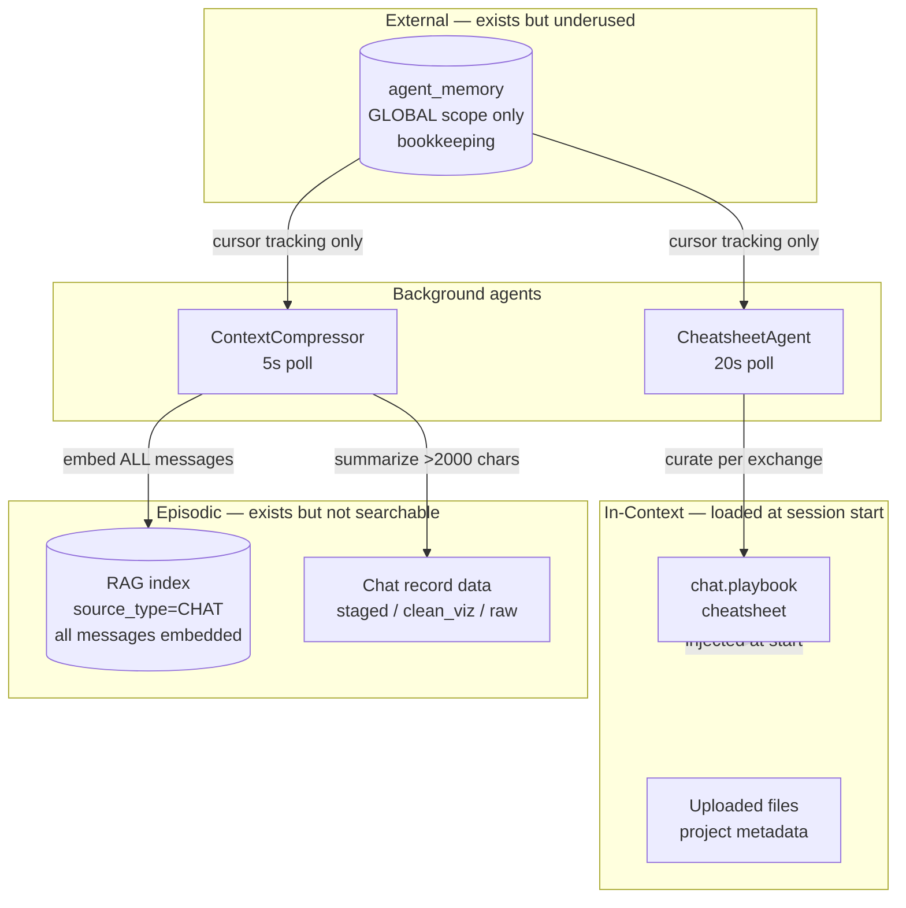
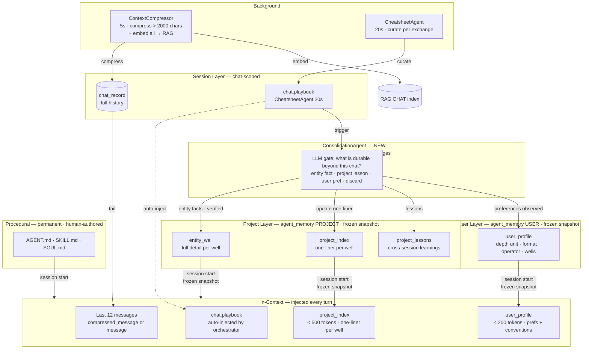
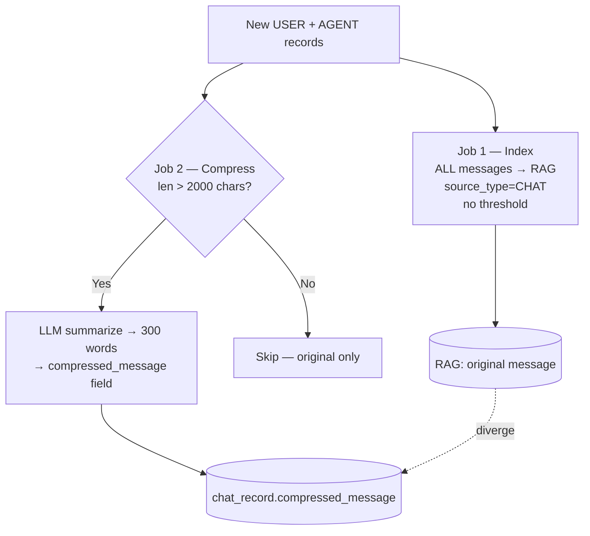
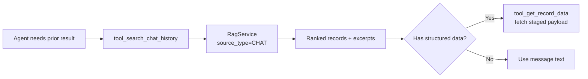
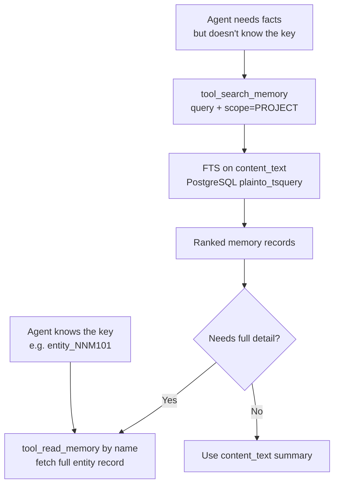
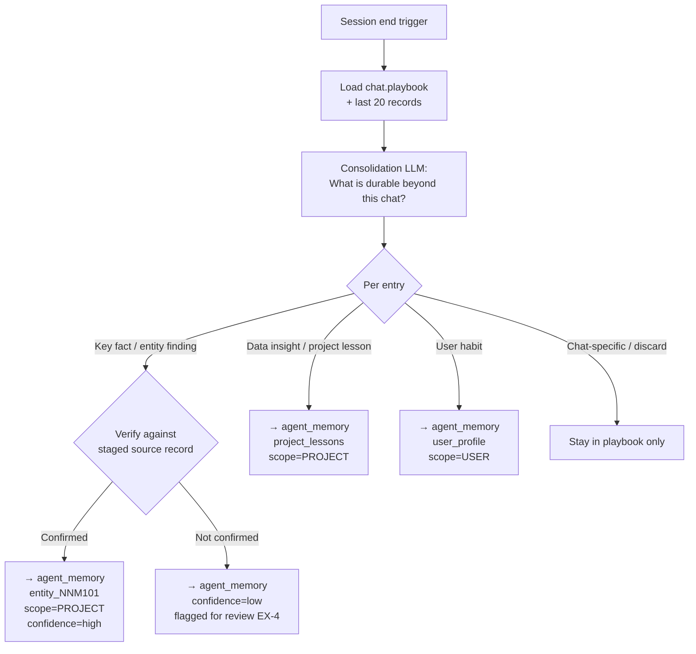
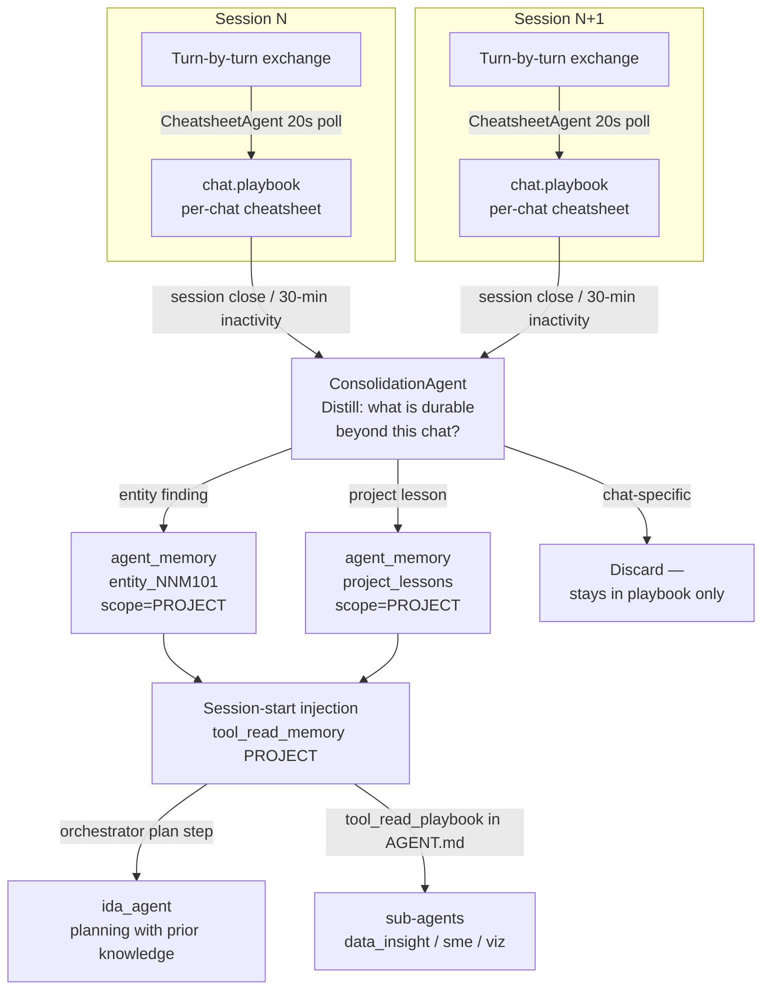

# IDA Memory Gap Analysis

*Benchmarked against Hermes (Nous Research), OpenClaw, and Claude Code*

---

## Memory Layer Framework

| Layer | Definition | Persists across sessions? |
|---|---|---|
| **In-context** | Active context window — injected files, current conversation | No |
| **Episodic** | Memory of specific past events and conversations | Yes |
| **External** | Persistent structured storage — files, DB, vector index | Yes |
| **Parametric** | Knowledge baked into model weights | Yes (immutable) |

This document covers **Episodic** and **External** gaps only.

---

## Current Architecture



### What works
- Cheatsheet (`chat.playbook`) accumulates structured knowledge within a chat via dedicated curator LLM — three buckets: **key facts** (confirmed well characteristics, data quality), **data insights** (findings from tool results), **user habits** (preferences, conventions observed this session)
- ContextCompressor indexes every USER + AGENT message into RAG (`source_type=CHAT`)
- Chat record data toolbox gives structured access to staged results and visualizations
- `agent_memory` DB table with PROJECT / ORG / GLOBAL scopes is built and operational

### What doesn't
The architecture has no episodic retrieval path and no external persistence path. Everything resets between chats. Both the RAG index and `agent_memory` exist but are either incomplete or never written to by sub-agents.

---

## Proposed Architecture



**Key differences from today:**
- `chat.playbook` auto-injected every turn (not tool-called)
- `ConsolidationAgent` promotes playbook findings to PROJECT + USER memory at session end
- All PROJECT + USER memory injected as frozen snapshots at session start — IDA remembers across sessions
- Frozen snapshot preserves prefix cache (no retrieval overhead per turn)

---

## Infrastructure: ContextCompressor

Before addressing gaps, understanding ContextCompressor is essential — it underpins
both the episodic and external memory systems.

It runs continuously (5s poll) and does **two separate jobs**:



**Critical bugs — fix before building on top:**

| Bug | Impact | Severity |
|---|---|---|
| No dedup on re-index | Restart re-processes already-embedded records — duplicate RAG embeddings degrade search ranking | Medium |
| RAG indexes original, not compressed | After compression runs, RAG still holds the noisy original — search returns degraded content | Medium |
| Sub-agents ignore `compressed_message` | Only `ida.py` reads `compressed_message or message`. All sub-agents read raw `message` — compression is invisible to them | Medium |
| Two jobs share one cursor | A compression failure still advances the cursor — failed compressions are silently skipped forever | Low |

**Additional structural issue — compression is lossy for structured data:**
The 300-word summary prompt is designed for prose. When the agent response contains
Markdown tables (NPT breakdowns, cost tables, ROP by section), the LLM summarizes
them to bullet points — the precise numeric values that would be most useful for
recall are lost. The RAG index stores the original table-heavy message, but as a
single noisy blob with no awareness of entity/metric structure.

---

## Episodic Memory Gaps

Episodic memory = ability to recall specific past events and conversations.

### EP-1 — Chat History Is Tail-Only, Not Searchable

**Current state:**
Every sub-agent independently loads recent history as a fixed tail of N records.
No agent can search history by content.

| Agent | Depth | Truncation |
|---|---|---|
| `ida.py` | last 12 records | full (uses `compressed_message` when available) |
| `datainsight.py` | last 4 messages | 200 chars each |
| `simulator_agent.py` | tail=5 | 200 chars |
| `subject_matter_expert.py` | tail=10 | — |
| `eowr_agent.py`, `report_generator.py` | varies | — |

Problems:
- Tail-only — "find the turn where we analyzed NNM-101's NPT" is impossible
- Inconsistent depth — agents disagree on what "recent" means
- No centralized abstraction — changing history loading requires editing every agent
- Cross-chat retrieval is absent entirely

**What's already in place:** ContextCompressor embeds every message into RAG with
`source_type=CHAT`. The embedding infrastructure exists. The gap is a missing
retrieval tool.

**Solution:**

*A — `ChatHistoryService` (centralize loading):*
```python
class ChatHistoryService:
    def load_tail(self, chat_id, limit=12) -> List[BaseMessage]:
        # uses compressed_message when available

    def search(self, query, project_id, chat_id=None,
               top_k=10, start_date=None, end_date=None) -> List[ChatRecord]:
        # RagService with source_type=CHAT filter

    def load_relevant(self, query, chat_id, top_k=5) -> List[BaseMessage]:
        # retrieve by relevance, not recency
```

All agents call `ChatHistoryService` — eliminates inconsistency and gives
every agent search capability for free.

*B — `tool_search_chat_history` in `chat_record_data_toolbox.py`:*
```python
def tool_search_chat_history(
    query: str,
    project_id: int,
    chat_id: Optional[int] = None,      # None = project-wide (covers EP-3)
    data_types: Optional[List[str]] = None,
    top_k: int = 10,
    start_date: Optional[str] = None,
    end_date: Optional[str] = None,
) -> str: ...
```

Uses `RagService(source_type=CHAT, project_id=...)` — no new embedding needed.



*C — Update AGENT.md files:*
Add to each sub-agent: before asking the user to confirm data already established,
call `tool_search_chat_history` first.

---

### EP-2 — No Content Search Over Agent Memory

**Current state:**
Within a session, the cheatsheet is injected into context and the agent reads
it directly — no tool needed. But across sessions, facts promoted to
`agent_memory` (PROJECT scope) are only retrievable by exact key:

```python
tool_read_memory(name="entity_NNM101", scope=PROJECT)
```

There is no `tool_search_memory`. If the agent doesn't know the key — or
wants to answer "which wells had NPT above 10%?" — it cannot search by content.
`tool_list_memories` returns all records without filtering; loading all of them
to scan is not scalable as the project grows.

**Solution — `tool_search_memory` backed by FTS:**

Requires EX-5's `content_text` field. Once that column exists:

```python
def tool_search_memory(
    query: str,
    project_id: int,
    scope: AgentMemoryScope = AgentMemoryScope.PROJECT,
    memory_type: Optional[str] = None,   # e.g. "entity", "lesson", "user_pref"
    top_k: int = 10,
) -> str: ...
# SQL: WHERE content_text @@ plainto_tsquery(query) AND scope = scope
```



**Relationship to EX-3:**
EX-3 handles *structure and budget* — what to store in PROJECT memory and how
to keep each entry compact so the frozen snapshot stays within token budget.
EP-2 handles *search* — how to query facts when the key is unknown or the query
spans multiple entities. Both are needed: EX-3 for snapshot compactness,
EP-2 for content discovery.

---

### EP-3 — No Cross-Chat Retrieval

Covered by `tool_search_chat_history(chat_id=None)` from EP-1 —
project-wide search across all chats using existing RAG embeddings.

---

### EP-4 — No End-of-Session Consolidation

**Current state:**
The CheatsheetAgent curates turn-by-turn. There is no session-end event
that promotes session conclusions to persistent memory. Compare to
OpenClaw's Dreaming pipeline.

**Solution — ConsolidationAgent** (extends CheatsheetAgent, triggered on
session close or 30-minute inactivity):



**Verification before write:** entity findings must be cross-checked against
the staged source record from the same turn before promotion to `agent_memory`.
An unverified fact written to PROJECT scope will surface confidently in future
sessions — a wrong value is worse than a missing one.

---

## External Memory Gaps

External memory = persistent structured storage reused across sessions.

### EX-1 — Cheatsheet Does Not Cross Session Boundaries

**Current state:**
The cheatsheet (`chat.playbook`) is scoped to a single chat. A new chat in
the same project starts blank. PROJECT-scoped `agent_memory` exists but
nothing writes to it. IDA forgets everything between sessions.

**Additional insight — sub-agents don't read the playbook either:**
Even within a session, only the orchestrator (`ida_agent`) references
`tool_read_playbook`. Sub-agents (`data_insight_agent`, `sme_agent`, etc.)
never load the cheatsheet. The curated knowledge is only used by the
orchestrator's planning step — not by the agents doing the actual work.

**Solution:**



*Session persistence* — ConsolidationAgent (EP-4) writes to PROJECT-scoped
`agent_memory` at session end.

*Session start injection* — orchestrator reads PROJECT memories before
answering first query:
```
# ida_agent AGENT.md — plannable step:
tool_read_memory(name="entity_<well>", scope=PROJECT, project_id=...)
```

*Sub-agent access* — add `tool_read_playbook` call to each sub-agent's
AGENT.md so they benefit from accumulated knowledge within the session.

---

### EX-2 — No User Profile

**Implementation note:** EX-2 is not a new component. ConsolidationAgent (EP-4)
already has a "user habits" bucket. EX-2 is a single routing change: write
"user habits" to USER scope instead of PROJECT scope. Requires EX-5 USER scope
(already in the schema migration) and a one-line update to the ConsolidationAgent
prompt. The ~3 month timeline is soak time, not coding time.

**Current state:**
No persistent record of user preferences, depth units, operator conventions,
or recurring workflows. Hermes solves this with `USER.md` (injected every
session). Claude Code uses user-scoped CLAUDE.md.

**Solution:**
ConsolidationAgent routes detected user habits to `agent_memory` (USER scope).
Written when user states a preference or the agent detects a consistent pattern:

```python
{
  "depth_unit": "m",
  "preferred_output": "concise_tables",
  "operator": "ENI Congo",
  "primary_wells": ["NNM-101", "NNM-102"],
  "terminology_overrides": {"NPT": "lost time"},
  "last_active_project": 42
}
```

Inject as a lightweight block at session start alongside the project index.
Expose as a user-editable panel equivalent to Hermes' `USER.md`.

---

### EX-3 — No Structured Project Memory

**Implementation note:** EX-3 is not a new component. It is a refinement of how
ConsolidationAgent (EP-4) structures its PROJECT writes — one compact index entry
per well + one entity detail record per well, both kept within token budget at
write time. The ~3 month timeline is soak time to validate what structure actually
works with real project data, not coding time.

**Current state:**
The full cheatsheet injects into context every turn regardless of query scope.
As the project accumulates wells, context cost grows linearly.

**Two-tier frozen snapshot:**

Once promoted to `agent_memory` PROJECT scope, both tiers are injected as
frozen snapshots at every session start — no per-turn retrieval, prefix cache
preserved. Token budget is enforced at *write time*.

*Tier 1 — Project index (`agent_memory` PROJECT scope, key: `project_index`, target < 500 tokens):*
```markdown
### Active Wells
- NNM-101: 45 days, NPT 12% — details: entity_NNM101
- NNM-102: in progress

### Project Knowledge
- Operator NPT threshold: >5% triggers review
- WellView exports use metres for this project

### Lessons
- tool_retrieve_data must precede tool_analyze_data
```

*Tier 2 — Entity detail records (`agent_memory` PROJECT scope, frozen snapshot):*
```python
name = "entity_NNM101"
scope = PROJECT
memory_type = "entity_insight"
object = {
    "well": "NNM-101",
    "npt_total_hours": 54.2,
    "npt_pct": 12.1,
    "main_npt_causes": ["stuck pipe", "equipment failure"],
    "rop_by_section": {"26in": 13.9, "17.5in": 11.8},
    "data_quality_notes": "WellView export missing mud log sheet",
    "last_updated_chat": 42,
    "confidence": 0.92
}
```

**ConsolidationAgent write strategy:**
- Session end → promote one-liner per well to Tier 1 `project_index` in `agent_memory`
- Verified entity findings → upsert Tier 2 entity detail record in `agent_memory`
- Each entry kept compact at write time — total PROJECT snapshot stays within token budget

---

### EX-4 — Cheatsheet Accuracy Cannot Be Verified

**Current state:**
The curator LLM can misinterpret data. Wrong values persist due to the
APPEND-ONLY rule. No human review. No confidence tagging. No source tracing.

**Solutions:**

1. **Source tagging** — tag each Data Insight entry with the chat record ID
   it derived from. Enables tracing suspect values back to the source turn.

2. **Confidence tiers:**
   - `[verified]` — value from a tool result with clear source
   - `[inferred]` — derived by curator from partial data
   - `[conflicted]` — conflicts with prior entry; both shown with sources

3. **Cheatsheet review UI** — `/cheatsheet` command showing current content
   with edit/delete, equivalent to Claude Code's `/memory`.

4. **Conflict detection** — curator must surface conflicting values with
   sources rather than silently resolving them.

---

### EX-5 — agent_memory Schema Is Under-Specified

**Current schema problems:**

| Problem | Detail |
|---|---|
| No `memory_type` field | User profiles, entity insights, bookkeeping all land in the same JSONB — no way to query by type |
| No FTS on content | Only `name` is indexed — content search requires expensive JSONB operators |
| No `user_id` scope | No per-user memory within a project — user profiles must use naming conventions |
| No versioning | `set_object` overwrites silently — wrong values have no recovery path |
| No size tracking | JSONB grows unboundedly — no context budget enforcement |

**Proposed schema (additive migration — all new fields nullable):**

```python
class AgentMemoryScope(StrEnum):
    GLOBAL = "GLOBAL"
    PROJECT = "PROJECT"
    ORG = "ORG"
    USER = "USER"                        # new — per-user across projects

class AgentMemoryType(StrEnum):
    USER_PROFILE = "user_profile"        # USER scope
    PROJECT_SUMMARY = "project_summary"  # PROJECT scope
    ENTITY_INSIGHT = "entity_insight"    # PROJECT scope — per-well/file
    LESSON_LEARNED = "lesson_learned"    # PROJECT / ORG scope
    BOOKKEEPING = "bookkeeping"          # GLOBAL — background agent state
    KNOWLEDGE = "knowledge"              # ORG / GLOBAL — domain facts

class AgentMemoryModel(SQLModel, table=True):
    # existing fields unchanged
    id, name, description, agent_id, scope, project_id, org_id, object, created_at, updated_at

    # new fields
    memory_type: AgentMemoryType = Field(index=True)
    user_id: Optional[int] = Field(default=None, foreign_key="user.id")
    content_text: Optional[str]          # FTS-indexed flat text, auto-populated from object
    confidence: Optional[float]          # 0.0–1.0
    size_chars: Optional[int]            # context budget tracking
    version: int = Field(default=1)      # incremented on each update
```

**`content_text` enables PostgreSQL FTS on memory content:**
```sql
SELECT * FROM agent_memory
WHERE scope = 'PROJECT' AND project_id = 42
  AND to_tsvector('english', content_text) @@ plainto_tsquery('NNM-101 NPT');
```

Migration: backfill `memory_type='bookkeeping'` for all existing records —
they are all bookkeeping entries today. All new columns nullable with defaults,
no data loss.

---

## Backend Evaluation — QMD, Honcho, Others

| Backend | What it adds | Dependency | IDA fit |
|---|---|---|---|
| **QMD** | Local-first sidecar, reranking, query expansion | External process | Re-evaluate if EP-2 FTS search quality is insufficient |
| **Honcho** | Cross-session user modeling, multi-agent awareness | Cloud service | Re-evaluate if USER profile grows too complex for flat agent_memory records |
| **Mem0** | Semantic memory graph, automatic fact extraction | Cloud / self-hosted | Re-evaluate if ConsolidationAgent entity extraction proves too complex |
| **Qdrant / Weaviate** | Dedicated vector DB, high-throughput ANN at scale | External process | Re-evaluate if PostgreSQL RAG CHAT index hits performance limits |

**Recommendation: defer all external backends.**
- The RAG service already embeds all chat history. The gap is a missing retrieval tool, not a missing backend.
- Drilling data is sensitive — cloud backends (Honcho, Mem0 cloud) require operator approval.
- Fix the ContextCompressor dedup bug first — a duplicate-polluted index degrades any search backend.

---

## Summary

### Gap Classification

| Gap | Layer | Severity | Depends on |
|---|---|---|---|
| **EP-1** Chat history tail-only, not searchable | Episodic | High | Fix CC dedup bug first |
| **EP-2** No content search over agent_memory | Episodic | Medium | EX-5 schema |
| **EP-3** No cross-chat retrieval | Episodic | Medium | EP-1 (`chat_id=None`) |
| **EP-4** No end-of-session consolidation | Episodic → External | Medium | EX-5 schema |
| **EX-1** Cheatsheet doesn't cross session boundaries | External | High | EP-4 + EX-5 |
| **EX-2** No user profile | External | Medium | EX-5 schema (USER scope) |
| **EX-3** No structured project memory | External | Low (future) | EP-4 + EX-5 |
| **EX-4** Cheatsheet accuracy unverifiable | External | High | Independent |
| **EX-5** agent_memory schema under-specified | External | Medium | Independent |

### Build Order

| Timeline | Coding sprint | Deliverables | Validation (human-side) |
|---|---|---|---|
| **Day 1** | Fix CC bugs · EP-1 · EX-4 | CC dedup guard · `ChatHistoryService` · `tool_search_chat_history` · confidence tiers + source tagging in curator prompt | Restart service, confirm no duplicate embeddings · test follow-up question, verify history search returns relevant turns |
| **Day 2–3** | EX-5 · EP-4 · EX-1 | Schema migration · ConsolidationAgent with LLM gate (key facts · data insights · user habits) · AGENT.md updates to read PROJECT memory at session start | Run 2–3 real sessions on a known well · inspect what ConsolidationAgent promoted · confirm next session starts with correct context |
| **Weeks 2–4** | Tune ConsolidationAgent | Adjusted promotion threshold · playbook size cap · fix over/under-promotion | Review `agent_memory` after each session — is it durable and accurate? Flag false positives |
| **~1 month** | EP-3 · EP-2 | Cross-chat retrieval · `tool_search_memory` FTS over `agent_memory` | Need enough data in `agent_memory` to validate search quality |
| **~3 months** | EX-2 · EX-3 (small refinement) | Route "user habits" → USER scope · structure PROJECT writes into index + entity detail — both are ConsolidationAgent prompt + write-logic changes, not new components | Needs soak time first — enough sessions to confirm which habits actually recur and what entity structure works in practice |
| **Long-term** | Backend evaluation | Honcho / QMD / Mem0 if limits hit | Operator data approval required for cloud backends |

The coding tasks on Day 1 and Day 2–3 are fast. The real time cost is the soak
period (weeks 2–4) — ConsolidationAgent quality can only be validated with real
well sessions, not in a coding session.
