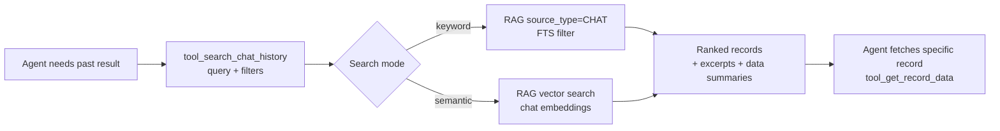
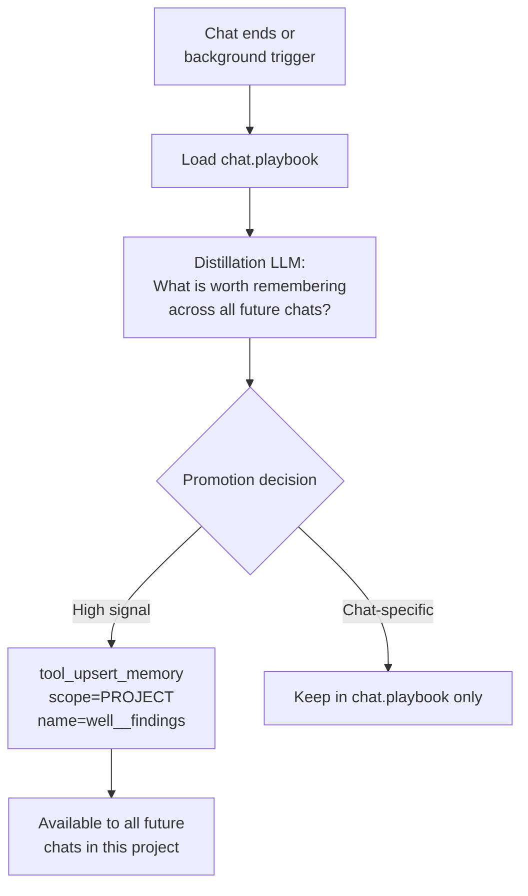
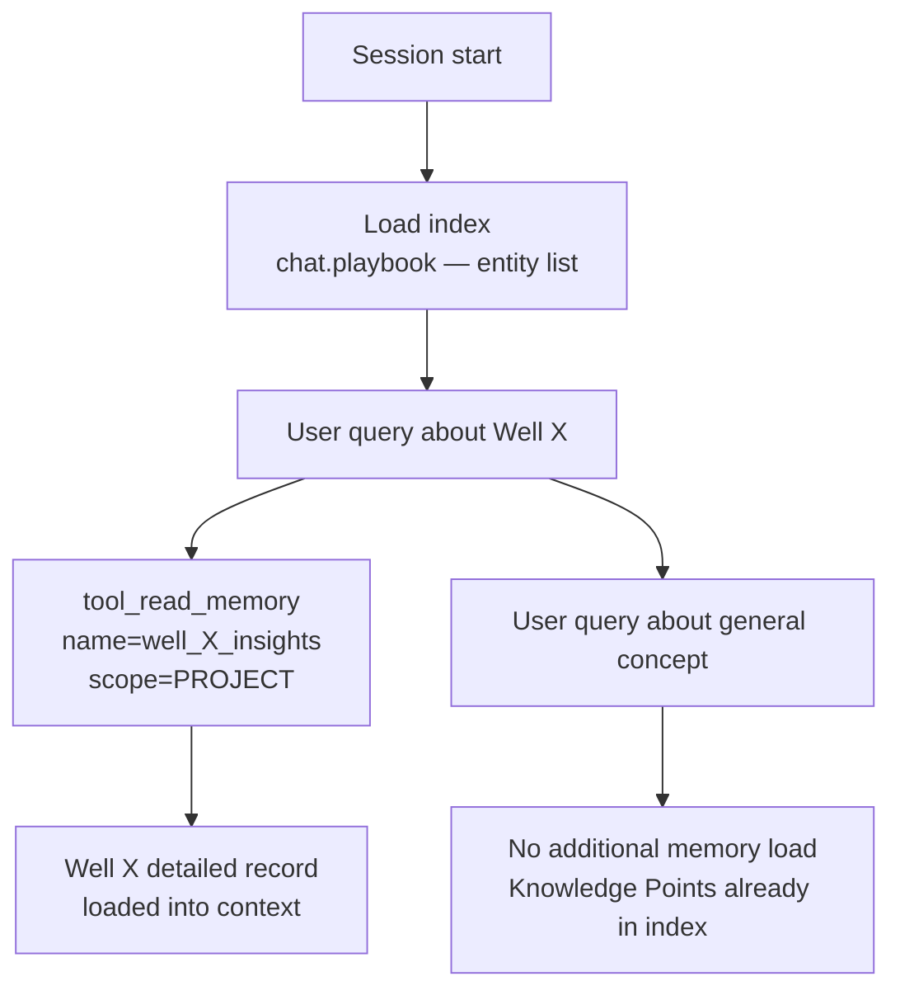
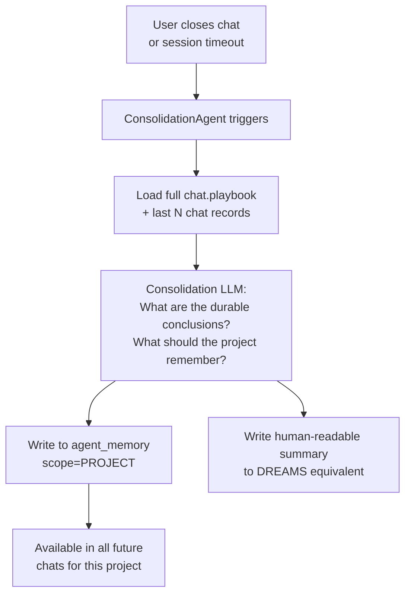
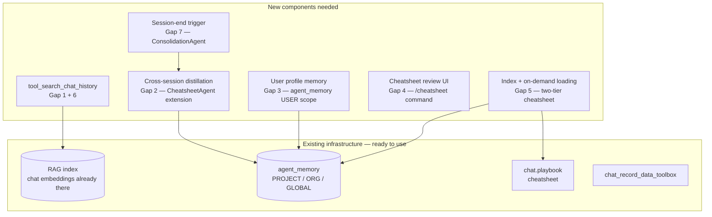

# IDA Memory Gap Analysis
*Against the External + Episodic memory patterns of Hermes, OpenClaw, and Claude Code*

---

## Current IDA Memory Architecture


**What works:**
- Cheatsheet (playbook) accumulates knowledge within a chat — curated by a dedicated LLM agent
- Chat record data toolbox provides structured access to staged results and visualizations
- ContextCompressor embeds chat history into RAG for text-based search
- `agent_memory` infrastructure exists with PROJECT / ORG / GLOBAL scopes

**What doesn't — seven identified gaps below.**

---

## Gap 1 — No Search Toolbox for Chat History

### Problem
Chat history is saved but not **searchable by need**. The only tools are:
- `tool_list_chat_data_records` — returns a metadata catalog (record IDs, timestamps, field summaries)
- `tool_get_record_data` — fetches a specific record by ID

There is no tool that lets an agent ask: *"what did we find about Well A's NPT in a previous turn?"*
or *"find the chart we created last week about drilling progress."*

The ContextCompressor embeds chat history into RAG, but this is only accessible via
`tool_search_documents` — which searches all documents indiscriminately and has no
chat-specific filtering, timestamp scoping, or structured data retrieval.

Compare to **Hermes**: `session_search` queries SQLite with FTS5 full-text search +
Gemini Flash summarization — the agent can recall specific past exchanges on demand.

### Impact
- Agents re-derive answers that were already computed in a prior turn
- Users must repeat context that was already established
- Large staged datasets from prior turns are unreachable unless the agent happens
  to scan the full record catalog

### Proposed Solution
Add a `tool_search_chat_history` to `chat_record_data_toolbox.py`:

```python
# Parameters
query: str           # natural language or keyword search
chat_id: int         # scope to current chat (optional — None = project-wide)
data_types: list     # filter: ["staged", "clean_viz", "message_text"]
start_date: str      # ISO date range filter
end_date: str
top_k: int = 10

# Returns: ranked list of matching records with relevance score,
#          message excerpt, and data field summaries
```

Implementation path:
1. Short-term: keyword search over `message` field + data field descriptions (already in RAG)
2. Medium-term: hybrid semantic + keyword via the existing RAG service with
   `source_type=CHAT` filter (ContextCompressor already embeds chat records)
3. Expose to agents via a dedicated tool — not through `tool_search_documents`
   which mixes document and chat results



---

## Gap 2 — Cheatsheet Does Not Distill Across Sessions

### Problem
The cheatsheet (`chat.playbook`) is **chat-scoped**. When a user starts a new chat
in the same project, they start with an empty cheatsheet. All accumulated knowledge
from previous chats — confirmed well data, data quality issues, lessons learned — is
lost for the new session.

There is no equivalent to:
- **OpenClaw's Dreaming** — promoting episodic daily notes into long-term `MEMORY.md`
- **Claude Code's auto memory** — agent writes learnings that persist to `~/.claude/projects/`
- **Hermes' MEMORY.md** — written by the agent and injected into every session

The `agent_memory` table exists with PROJECT scope but nothing writes to it.
The cheatsheet stays siloed in `chat.playbook`.

### Impact
- A drilling engineer who asked about Well A's NPT issues last week gets no
  continuity in a new chat — IDA starts from scratch
- Insights that required expensive multi-step analysis are never reused
- The same data quality issues get rediscovered repeatedly

### Proposed Solution

**Option A — Session-end distillation (OpenClaw Dreaming pattern):**

At session end (or on a background schedule), a distillation step promotes
high-value cheatsheet entries from `chat.playbook` into `agent_memory` (PROJECT scope).



**Option B — Incremental write (Hermes pattern):**

CheatsheetAgent writes to PROJECT-scoped `agent_memory` for each entity
(well/file) when a new Data Insight is added to the cheatsheet.

**Recommended:** Option A — less noise, more deliberate promotion.

**At session start:** The orchestrator reads PROJECT-scoped `agent_memory` via
`tool_read_memory` before answering the first query, injecting prior findings
into context.

---

## Gap 3 — No User Profile (USER.md)

### Problem
IDA has no persistent record of who the user is — their preferences, communication
style, units preference, operator conventions, or recurring workflows.

Compare to **Hermes**: `USER.md` (1,375 chars) is injected into every session with
user-specific context. **Claude Code**: user-level `~/.claude/CLAUDE.md` applies
personal preferences across all projects.

Every IDA session treats the user as a stranger. The agent cannot:
- Remember that this user prefers metric units
- Know that they always work with Well A and Well B
- Recall that they like concise tables, not long narratives
- Apply operator-specific terminology consistently

### Impact
- Repeated friction — user re-states the same preferences every session
- Inconsistent output format across sessions
- Generic responses when operator-specific context would be more useful

### Proposed Solution

Introduce a `user_memory` concept stored in `agent_memory` (ORG or GLOBAL scope,
keyed by `user_id`):

```python
# Written by agents when user preferences are expressed:
{
  "depth_unit": "m",
  "preferred_output": "concise_tables",
  "operator": "ENI Congo",
  "primary_wells": ["NNM-101", "NNM-102"],
  "terminology": {"NPT": "lost time", "ROP": "drilling speed"},
  "last_active_project": 42
}
```

**Trigger for writing:** When a user explicitly states a preference, or when the
agent detects a consistent pattern (e.g. always asks for metric units, always asks
for the same wells).

**Injection:** Load user memory at session start alongside project memory — a
lightweight profile block injected into the system prompt or as a plannable
`tool_read_memory` step.

**Ownership:** The user should be able to view and edit their profile — equivalent
to Hermes' `USER.md` being a visible, editable file.

---

## Gap 4 — Cheatsheet Accuracy Cannot Be Verified

### Problem
The cheatsheet is curated by an LLM (the `CheatsheetAgent` running `CURATOR_PROMPT`).
The curator can:
- Misinterpret a number and store it incorrectly
- Hallucinate an entity name
- Extract a value from a partial view and overwrite a correct aggregate

The prompt has strong guardrails (APPEND-ONLY rule, NUMERIC VALUE PRESERVATION,
entity validation), but these are LLM instructions — not enforced constraints.
Once wrong data enters the cheatsheet, the APPEND-ONLY rule makes it **harder**
to correct, not easier — a wrong value persists and conflicts with the correct
value in a later turn.

There is no human review layer. Compare to:
- **OpenClaw**: DREAMS.md is a human-reviewable consolidation log
- **Claude Code**: auto memory files are plain markdown the user can edit at any time

### Impact
- A wrong NPT total in the cheatsheet silently poisons all future analysis in
  that chat — the agent consults the cheatsheet before running tools
- Users have no visibility into what the cheatsheet contains or how to correct it
- Conflicting values (stored vs. re-derived) create confusing agent behavior

### Proposed Solution

**1. Expose the cheatsheet to the user:**
Add a UI panel (or `/cheatsheet` command) that shows the current cheatsheet
content and allows manual edits — equivalent to Claude Code's `/memory` command.

**2. Add a verification step for numeric values:**
When the curator adds a Data Insight with a numeric value, tag it with the source
record ID. If a later exchange produces a conflicting value for the same
entity+metric, surface both values to the user rather than silently resolving.

**3. Confidence-aware curation:**
The curator prompt should tag each entry with a confidence level:
- `[verified]` — value confirmed by a tool result with a clear source
- `[inferred]` — value derived from partial data or LLM reasoning
- `[conflicted]` — value conflicts with a prior entry; both shown

**4. Periodic human review prompt:**
After N exchanges or when conflicts accumulate, IDA asks: *"The cheatsheet has
accumulated some entries I'm less confident about. Would you like to review them?"*

---

## Gap 5 — Cheatsheet Has No Progressive Loading

### Problem
The full cheatsheet is injected into context at every session start, regardless
of what the user is asking about. As the cheatsheet grows (more wells, more data),
it consumes increasing context tokens on every turn — even when the query is about
a single well.

Compare to **Claude Code's** index + on-demand pattern: `MEMORY.md` is a concise
pointer index (200 lines max), and topic files load only when relevant.

### Impact
- Growing context cost per turn as the project accumulates history
- Irrelevant well data occupies context when the user is focused on one well
- No mechanism to prioritize recent or relevant entries

### Proposed Solution

Split the cheatsheet into a two-tier structure:

```
chat.playbook           → concise index: entity names + one-line summaries
agent_memory (PROJECT)  → per-entity detailed records (e.g. "well_NNM101_insights")
```

At session start: load the index only.
When the user asks about Well X: load Well X's detailed record on demand.



---

## Gap 6 — No Cross-Chat Retrieval

### Problem
Findings from a chat three weeks ago are permanently unreachable in a new chat,
even within the same project. The `chat_record_data_toolbox` can only access
records from the current or specified chat. There is no way to ask *"what did
we find about Well B in any previous analysis?"* across chat boundaries.

This is distinct from Gap 1 (search within a session) and Gap 2 (distillation):
even if distillation is implemented, raw historical records from past chats
remain inaccessible.

### Proposed Solution

Extend `tool_search_chat_history` (from Gap 1) with `chat_id=None` to search
project-wide. The ContextCompressor already embeds chat history into RAG — expose
this with a `source_type=CHAT` filter and a project-scoped search.

The distillation layer (Gap 2) handles the high-value summary path. Cross-chat
search handles the "I know we looked at this before" recall path.

---

## Gap 7 — No End-of-Session Consolidation Trigger

### Problem
The CheatsheetAgent runs continuously (polling every 20s), curating the cheatsheet
turn-by-turn. There is no session-end event that asks: *"given everything we
discussed today, what should be remembered permanently?"*

Turn-by-turn curation captures incremental facts well but misses:
- High-level session conclusions (e.g. "this well's NPT analysis is complete and
  confirmed")
- Decisions made across multiple turns that only make sense as a whole
- Explicit user instructions given during the session that should persist

Compare to **OpenClaw's Dreaming** (triggered at session end) and **Claude Code's**
end-of-session auto memory write.

### Proposed Solution

Add a session-close event hook that triggers a `ConsolidationAgent` (or extends
`CheatsheetAgent`):



---

## Summary Table

| Gap | Severity | Effort | Comparable pattern |
|---|---|---|---|
| 1. No chat history search | High | Medium | Hermes `session_search` |
| 2. No cross-session distillation | High | Medium | OpenClaw Dreaming |
| 3. No user profile | Medium | Low | Hermes `USER.md` |
| 4. Cheatsheet accuracy unverifiable | High | Medium | OpenClaw DREAMS.md review |
| 5. No progressive memory loading | Medium | Medium | Claude Code index + topics |
| 6. No cross-chat retrieval | Medium | Low | Extend Gap 1 solution |
| 7. No end-of-session consolidation | Medium | Low | OpenClaw Dreaming trigger |

### Priority order

```
1 → 2 → 7    (chain: search enables distillation; distillation + trigger = cross-session memory)
4            (independent: cheatsheet accuracy is a current data quality risk)
3            (independent: user profile, low effort, high daily value)
5 → 6        (progressive loading depends on distillation being in place first)
```

---

## What IDA Needs to Build



All seven gaps use **existing infrastructure**. No new DB tables or storage
backends are required. The work is toolbox tools, a new agent trigger, and
prompt additions to AGENT.md files.
