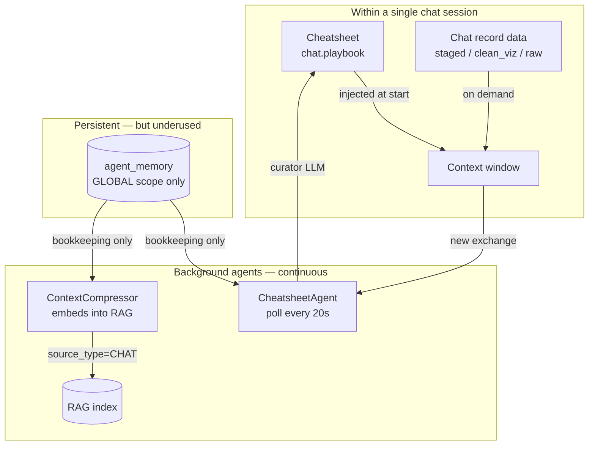
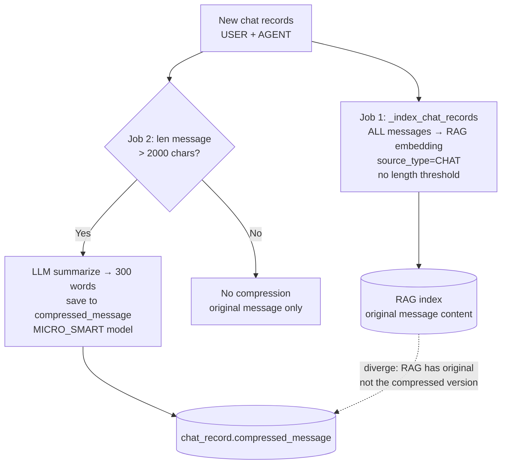
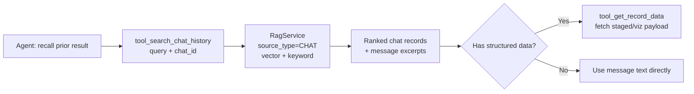
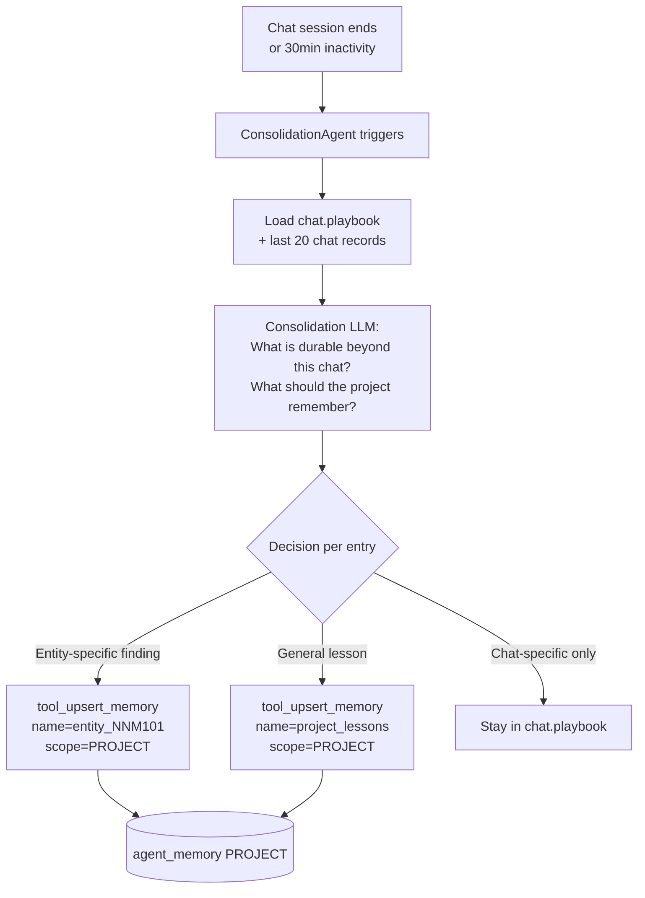
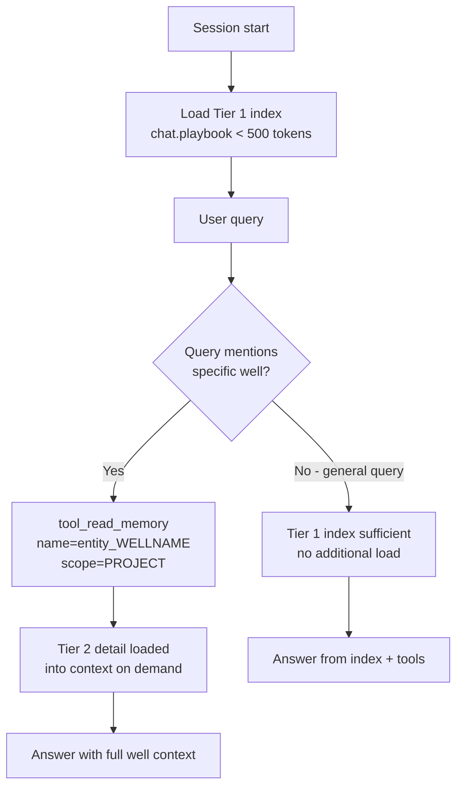
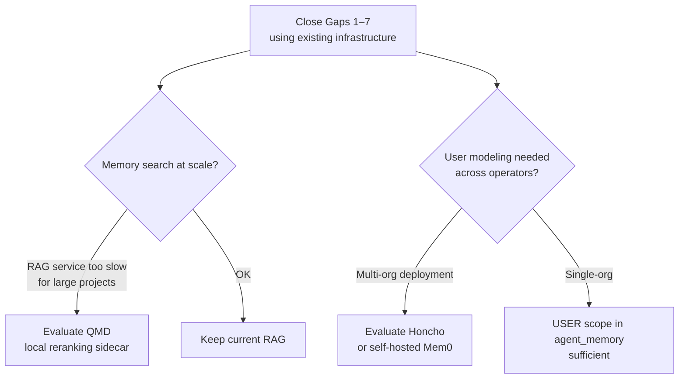

# IDA Memory Gap Analysis
*Against the External + Episodic memory patterns of Hermes, OpenClaw, and Claude Code*
*Revised: includes chat history architecture, agent_memory schema analysis, two-tier implementation, and backend evaluation*

---

## Current IDA Memory Architecture



**What works:**
- Cheatsheet accumulates knowledge within a chat via a dedicated curator LLM
- Chat record data toolbox provides structured access to staged results and visualizations
- ContextCompressor indexes all chat records into RAG and compresses long messages
- `agent_memory` infrastructure exists with PROJECT / ORG / GLOBAL scopes

---

## ContextCompressor — Detailed Analysis

The ContextCompressor is a continuous background agent (polls every 5s) that
does **two separate jobs** in one agent:



**Job 1 — RAG Indexing (all messages, no threshold):**
Every USER and AGENT message is embedded into the RAG index with
`source_type=CHAT`. This is the infrastructure that would power
`tool_search_chat_history` — the embeddings already exist.

**Job 2 — Compression (messages > 2000 chars only):**
Long messages are summarized to ~300 words and stored in
`compressed_message`. The orchestrator (`ida.py`) uses
`compressed_message or message` when loading history — so it
benefits automatically. Sub-agents (`datainsight.py`,
`simulator_agent.py` etc.) load raw `message` and **never see
the compressed version**.

### Known Issues in ContextCompressor

| Issue | Detail | Risk |
|---|---|---|
| **GLOBAL scope cursor is wrong** | `last_processed_chat_record_id` stored as GLOBAL scope — shared across all projects on the deployment. One project's cursor silently overwrites another's | High — multi-project deployments lose records |
| **RAG index diverges from compressed_message** | RAG embeds original message; compression writes to a separate field. The RAG index is never updated with the cleaner summary | Medium — search returns noisy original content |
| **No deduplication on indexing** | `add_document_batch` + `generate_embeddings` has no check for already-embedded records — restarts create duplicate RAG entries | Medium — degrades search quality |
| **Sub-agents don't use compressed_message** | Only `ida.py` reads `compressed_message or message`. All sub-agents read raw `message`, making compression invisible to them | Medium — wasted compression work for sub-agents |
| **Two jobs, one cursor** | Indexing and compression share one `last_processed_chat_record_id`. A compression failure still advances the cursor, so failed compressions are never retried | Low — silent data quality gap |

### What This Means for Gap 1

The RAG embeddings are already there — `_index_chat_records` runs on every
message. `tool_search_chat_history` does not need new embedding infrastructure.
It only needs a `source_type=CHAT` + `project_id` filter surfaced as a tool.

Fix the cursor scope bug **before** building on top of this infrastructure —
otherwise `tool_search_chat_history` will return incomplete results in
multi-project deployments.

---

## Gap 1 — No Search Toolbox for Chat History

### Current State — It's Already a General Pattern

Chat history loading is not a one-off — it is a pervasive pattern across all
sub-agents, each implementing it independently with different parameters:

| Agent | Load method | Depth | Truncation |
|---|---|---|---|
| `ida.py` (orchestrator) | `load_message_history()` | last 12 records | full (uses `compressed_message` when available) |
| `datainsight.py` | from LangGraph state `messages` | last 4 messages | 200 chars each |
| `simulator_agent.py` | `get_chat_records` | `chat_history_tail=5` | first 200 chars |
| `subject_matter_expert.py` | `get_chat_records` | `chat_history_tail=10` | — |
| `eowr_agent.py` | `get_chat_records` | hardcoded limit | — |
| `report_generator.py` | `get_chat_records` | — | — |

**Problems with this pattern:**
1. Each agent loads a different window — agents disagree on what "recent history" means
2. All approaches are **tail-based** (latest N records) — no retrieval by relevance
3. Truncation to 200 chars destroys useful context from long exchanges
4. No semantic search — "find the turn where we analyzed Well A's NPT" is impossible
5. Cross-chat retrieval is completely absent
6. No centralized abstraction — a change to history loading requires editing every agent

### What's Missing
The ContextCompressor already embeds every chat record into the RAG index with
`source_type=CHAT`. The embedding infrastructure exists. What's missing is a
**tool that queries it** with chat-specific filters.

### Proposed Solution

**A. Centralize history loading — `ChatHistoryService`**

Replace the per-agent ad-hoc loading with a shared service:

```python
class ChatHistoryService:
    def load_tail(self, chat_id, limit=12) -> List[BaseMessage]:
        """Current pattern — last N messages, uses compressed_message when available."""

    def search(self, query, project_id, chat_id=None,
               top_k=10, start_date=None, end_date=None) -> List[ChatRecord]:
        """New — semantic + keyword search over embedded chat history."""

    def load_relevant(self, query, chat_id, top_k=5) -> List[BaseMessage]:
        """New — retrieve by relevance, not recency."""
```

All agents call `ChatHistoryService` instead of `get_chat_records` directly.
This fixes the inconsistency and adds search as a first-class capability.

**B. Add `tool_search_chat_history` to `chat_record_data_toolbox.py`**

```python
def tool_search_chat_history(
    query: str,
    project_id: int,
    chat_id: Optional[int] = None,   # None = project-wide search
    data_types: Optional[List[str]] = None,  # ["staged", "clean_viz", "message"]
    top_k: int = 10,
    start_date: Optional[str] = None,
    end_date: Optional[str] = None,
) -> str:
    """Search chat history by semantic similarity or keyword.
    Use when you need to recall a prior result, chart, or analysis
    without knowing which turn it came from."""
```

Implementation uses `RagService` with `source_type=SourceType.CHAT` filter —
no new embedding infrastructure needed.



**C. Update sub-agent AGENT.md files**

Add a history consultation rule to each sub-agent's AGENT.md:
> Before asking the user to confirm data they've already provided, call
> `tool_search_chat_history` to check if it was established in a prior turn.

---

## Gap 2 — No Cross-Session Distillation into agent_memory

### Problem
The cheatsheet (`chat.playbook`) is chat-scoped. A new chat in the same project
starts blank. PROJECT-scoped `agent_memory` is never written by sub-agents.

### Proposed Solution

**Session-end distillation** (OpenClaw Dreaming pattern adapted for IDA):



**At session start:** orchestrator reads PROJECT-scoped memories for wells
mentioned in the query:

```python
# In ida_agent AGENT.md — plannable step:
# tool_read_memory(name="entity_<well>", scope="PROJECT", project_id=...)
```

---

## Gap 3 — No User Profile (USER.md)

### Problem
No persistent record of user preferences, units, operator conventions, or
recurring workflows. Every session treats the user as a stranger.

### Proposed Solution

Store user profile in `agent_memory` (USER scope — see Gap: Schema below for
the new scope). Written when the user states a preference or when the agent
detects a consistent pattern:

```python
# User profile structure — stored as agent_memory content_type="user_profile"
{
  "depth_unit": "m",
  "preferred_output": "concise_tables",
  "operator": "ENI Congo",
  "primary_wells": ["NNM-101", "NNM-102"],
  "terminology_overrides": {"NPT": "lost time"},
  "last_active_project": 42
}
```

Injected as a lightweight block at session start, alongside the project memory
index. User should be able to view and edit this profile (equivalent to Hermes'
`USER.md` being a visible file).

---

## Gap 4 — Cheatsheet Accuracy Cannot Be Verified

### Problem
The curator LLM can misinterpret data. Wrong values persist due to the
APPEND-ONLY rule. No human review layer. No confidence tagging.

### Proposed Solution

1. **Source tagging** — every Data Insight entry tagged with the chat record ID
   it was derived from. Enables tracing a suspect value back to the source turn.

2. **Confidence tiers** in the cheatsheet format:
   - `[tool-verified]` — value comes directly from a tool result
   - `[llm-inferred]` — derived by the curator from partial data
   - `[conflicted: see record #N]` — conflicts with a prior entry

3. **User-facing cheatsheet review** — a `/cheatsheet` UI command (or panel)
   showing current content with edit and delete capability, equivalent to
   Claude Code's `/memory` command.

4. **Conflict surfacing** — when the curator detects a value conflicts with a
   stored entry for the same entity+metric, it must surface both values with
   sources rather than resolving silently.

---

## Gap 5 — No Progressive Memory Loading (Two-Tier — Concrete Implementation)

### Problem
The full cheatsheet injects into context every turn. As wells accumulate, context
cost grows regardless of query scope.

### Two-Tier Implementation

**Tier 1 — Index (chat.playbook, always loaded):**

The playbook becomes a concise pointer index only — entity names +
one-line summaries. Target: under 500 tokens.

```markdown
### Active Wells
- NNM-101: 45 drilling days, NPT 12%, see agent_memory:entity_NNM101
- NNM-102: in progress, no NPT analysis yet

### Knowledge Points
- NPT threshold for this operator: >5% triggers review
- WellView exports use m not ft for this project

### Lessons Learned
- tool_retrieve_data must run before tool_analyze_data
```

**Tier 2 — Entity detail records (agent_memory PROJECT scope, on demand):**

Each well/entity gets its own memory record, written and updated by the
ConsolidationAgent or CheatsheetAgent:

```python
# agent_memory record for one well
name = "entity_NNM101"
scope = PROJECT
content_type = "entity_insight"   # new field — see Schema section
object = {
    "well": "NNM-101",
    "npt_total_hours": 54.2,
    "npt_pct": 12.1,
    "main_npt_causes": ["stuck pipe", "equipment failure"],
    "rop_by_section": {"26in": 13.9, "17.5in": 11.8, "12.25in": 10.3},
    "data_quality_notes": "WellView export missing mud log sheet",
    "last_updated_chat": 42
}
```

**Loading flow:**



**CheatsheetAgent changes:**

The CheatsheetAgent writes to both tiers:
- After each exchange: updates `chat.playbook` index (entity names only)
- After significant finding: upserts the entity's `agent_memory` record with
  updated detail. Only writes to Tier 2 when a Data Insight changes — not on
  every turn.

```python
# In CheatsheetAgent.curate() — after curator LLM runs:
if new_entity_data_detected:
    memory_service.set_object(
        agent_id="cheatsheet_agent",
        name=f"entity_{well_name.lower().replace('-','_')}",
        object=entity_detail,
        scope=AgentMemoryScope.PROJECT,
        project_id=project_id,
    )
    # Update playbook index with one-liner only
    update_playbook_index(chat_id, well_name, one_line_summary)
```

---

## Gap 6 — No Cross-Chat Retrieval

Extend `tool_search_chat_history` with `chat_id=None` for project-wide search.
The ContextCompressor already embeds all project chat records — scoping by
`project_id` without `chat_id` constraint gives cross-chat retrieval for free.

---

## Gap 7 — No End-of-Session Consolidation Trigger

ConsolidationAgent (extension of CheatsheetAgent) triggers on:
- Explicit session close
- 30-minute inactivity
- Chat record count crossing a threshold

Promotes durable findings from `chat.playbook` into PROJECT-scoped `agent_memory`.

---

## Analysis: agent_memory Schema — Is It Optimal?

### Current Schema

```python
AgentMemoryModel:
    id: int (PK)
    name: str (indexed)
    description: Optional[str]
    agent_id: str (FK → agent)
    scope: AgentMemoryScope  # GLOBAL / PROJECT / ORG
    project_id: Optional[int] (FK)
    org_id: Optional[int] (FK)
    object: JSONB             # ← everything goes here
    created_at: datetime
    updated_at: datetime
```

### Problems with the Current Schema

**1. No content_type differentiation**
User profiles, entity insights, bookkeeping counters, and lessons learned all
land in the same `object` JSONB blob. There is no way to query "give me all
user profiles" or "give me all entity insights for this project" without
scanning and inspecting JSON content.

**2. No full-text search on content**
Only `name` is indexed. To find a memory by content (e.g. "all entries mentioning
NNM-101") requires a full table scan with JSONB operators — slow at scale.

**3. No user scope**
The three scopes (GLOBAL / PROJECT / ORG) have no `user_id` dimension.
A user profile must be stored as GLOBAL with a name like `"user_42_profile"` —
a naming convention, not a schema constraint. Two users in the same project
can't have separate project-scoped memories.

**4. No versioning**
`updated_at` is overwritten on each `set_object` call. There is no history
of what the memory contained before the last update. If the curator writes
wrong data, the correct previous value is gone.

**5. No size tracking**
The `object` JSONB can grow unboundedly. No mechanism to enforce context budget
limits or warn when a memory entry is too large to inject efficiently.

### Proposed Schema Changes

```python
class AgentMemoryScope(StrEnum):
    GLOBAL = "GLOBAL"
    PROJECT = "PROJECT"
    ORG = "ORG"
    USER = "USER"           # ← new: per-user across projects


class AgentMemoryType(StrEnum):
    USER_PROFILE = "user_profile"       # USER scope — preferences, units, operator
    PROJECT_SUMMARY = "project_summary" # PROJECT scope — high-level project facts
    ENTITY_INSIGHT = "entity_insight"   # PROJECT scope — per-well / per-file findings
    LESSON_LEARNED = "lesson_learned"   # PROJECT / ORG scope — errors, mitigations
    BOOKKEEPING = "bookkeeping"         # GLOBAL — background agent state
    KNOWLEDGE = "knowledge"             # ORG / GLOBAL — domain facts


class AgentMemoryModel(SQLModel, table=True):
    __tablename__ = "agent_memory"

    id: int = Field(primary_key=True)
    name: str = Field(index=True)
    description: Optional[str]
    agent_id: str = Field(index=True, foreign_key="agent.id", ondelete="CASCADE")
    scope: AgentMemoryScope = Field(default=AgentMemoryScope.GLOBAL, index=True)
    memory_type: AgentMemoryType = Field(index=True)        # ← new
    project_id: Optional[int] = Field(default=None, foreign_key="project.id")
    org_id: Optional[int] = Field(default=None, foreign_key="organization.id")
    user_id: Optional[int] = Field(default=None, foreign_key="user.id")  # ← new
    content_text: Optional[str] = Field(default=None)  # ← new: FTS-indexed plain text
    object: Dict[str, Any] = Field(default={}, sa_column=Column(JSONB))
    confidence: Optional[float] = Field(default=None)  # ← new: 0.0–1.0
    size_chars: Optional[int] = Field(default=None)    # ← new: for context budget
    version: int = Field(default=1)                    # ← new: incremented on update
    created_at: datetime
    updated_at: datetime
```

**Migration approach:** additive — all new columns are nullable with defaults.
No existing data is broken. Backfill `memory_type="bookkeeping"` for all existing
records (they are all bookkeeping entries today).

**Benefit of `content_text`:** The `AgentMemoryService.set_object()` method
auto-populates `content_text` by serializing the `object` to a flat string at
write time. This enables PostgreSQL full-text search on memory content without
JSONB operators:

```sql
SELECT * FROM agent_memory
WHERE scope = 'PROJECT' AND project_id = 42
  AND to_tsvector('english', content_text) @@ plainto_tsquery('NNM-101 NPT');
```

**Separate tables vs. single table with type column:**

A single table with `memory_type` is the right call here. Memory entries share
the same retrieval pattern (lookup by scope + name + project), differ only in
content shape, and don't have different FK relationships. Separate tables would
duplicate indexes and complicate the `AgentMemoryService` API with no benefit.
The `memory_type` column + `content_text` FTS index is sufficient.

---

## Analysis: Should IDA Adopt QMD, Honcho, or Other Backends?

### What the alternatives offer

| Backend | What it adds over current IDA | Dependency |
|---|---|---|
| **QMD** | Local-first sidecar, reranking, query expansion | External process |
| **Honcho** | Cross-session user modeling, multi-agent awareness | Cloud service |
| **Mem0** | Semantic memory graph, automatic fact extraction | Cloud / self-hosted |
| **ChromaDB / Qdrant** | Dedicated vector DB, better ANN performance at scale | External process |

### Recommendation: Not yet — optimize what exists first

**Reason 1 — The RAG service already has what's needed.**
ContextCompressor already embeds chat history into the existing vector store.
The gap is a missing `source_type=CHAT` filter in the search tool, not the
absence of a vector backend. Adding QMD or Qdrant before fixing the filter
would be solving the wrong problem.

**Reason 2 — Drilling data is sensitive.**
Operators are often reluctant to send well data to external cloud services.
Honcho and Mem0 (in cloud mode) require sending memory content offsite.
Before adopting either, operator data policy must be confirmed.

**Reason 3 — IDA is already a multi-process system.**
Adding QMD as a sidecar or Honcho as a cloud dependency increases operational
complexity at a stage where the core memory gaps haven't been closed yet.

**What to re-evaluate after closing the core gaps:**



**Short-term recommendation:** Add `content_text` FTS index to `agent_memory`
and a `source_type=CHAT` filter to `RagService` search. These two changes
close 80% of the retrieval gap using existing PostgreSQL and the existing
vector store — no new backend needed.

---

## Summary: Gaps, Priorities, and Implementation Complexity

| Gap | Severity | What to build | Effort |
|---|---|---|---|
| 1. Chat history search | High | `tool_search_chat_history` + `ChatHistoryService` | Medium |
| 2. Cross-session distillation | High | ConsolidationAgent + PROJECT memory writes | Medium |
| 3. No user profile | Medium | USER scope + user profile writes on preference detection | Low |
| 4. Cheatsheet accuracy | High | Source tagging + confidence tiers + `/cheatsheet` UI | Medium |
| 5. No progressive loading | Medium | Two-tier cheatsheet (index + entity detail records) | Medium |
| 6. No cross-chat retrieval | Medium | `chat_id=None` in Gap 1 solution | Low |
| 7. No session consolidation | Medium | Session-end trigger on ConsolidationAgent | Low |
| Schema optimization | Medium | Add `memory_type`, `user_id`, `content_text`, `confidence` | Low |
| Backend evaluation | Low | QMD / Honcho — defer until Gaps 1–7 closed | — |

### Recommended build order

```
Phase 0 (fix before building on top):
  Fix ContextCompressor cursor scope: GLOBAL → PROJECT scope
  Fix ContextCompressor deduplication: check source_id before re-embedding
  Feed compressed_message back into RAG index when compression runs

Phase 1 (foundation):
  Schema migration → add memory_type, user_id, content_text, confidence
  ChatHistoryService → centralize all agent history loading
  tool_search_chat_history → Gaps 1 + 6
  Update sub-agents to use compressed_message via ChatHistoryService

Phase 2 (persistence):
  ConsolidationAgent → Gaps 2 + 7
  Two-tier cheatsheet → Gap 5
  User profile writes → Gap 3

Phase 3 (quality + UX):
  Source tagging + confidence tiers → Gap 4
  /cheatsheet UI review command → Gap 4

Phase 4 (evaluate externals):
  QMD / Honcho — only if Phase 1–3 reveal limitations
```

All phases use **existing infrastructure**. No new DB tables or external
backends are required in Phases 1–3.
