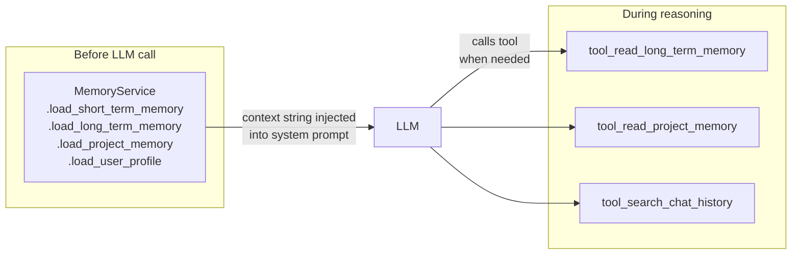
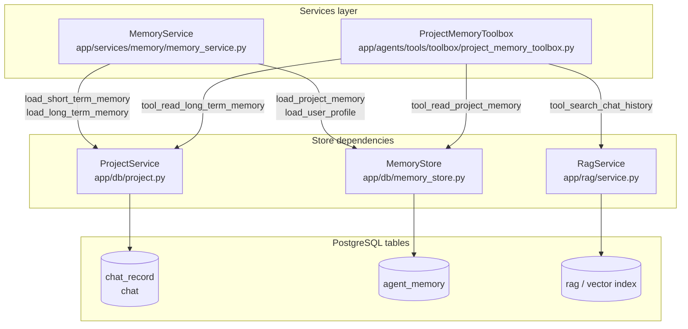
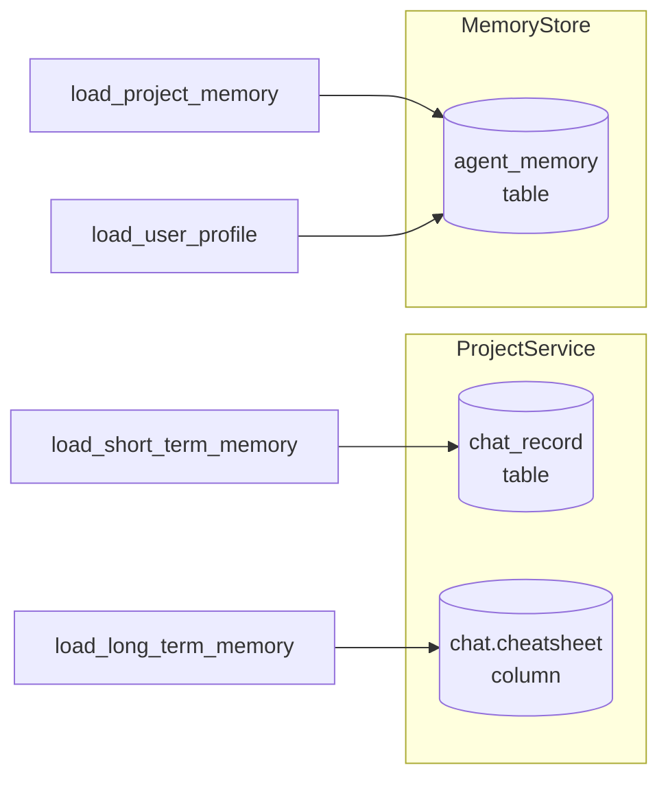
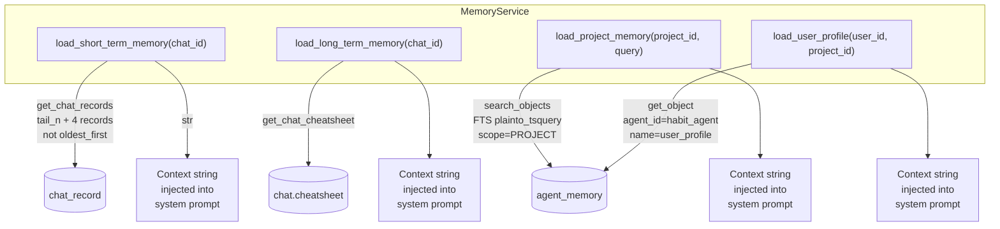
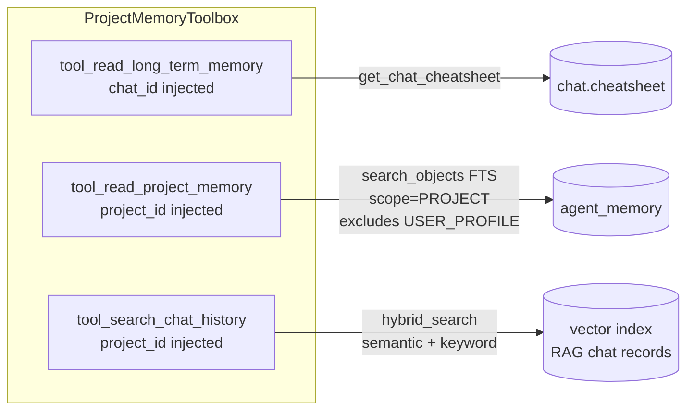

# Memory Service Guide

Practical reference for agent engineers. Covers what memory is available, which tool or service call to use, and how to wire everything up.

---

## Quick Decision Guide

| What you need | How to get it |
|---|---|
| Recent turns in the current chat | `MemoryService.load_short_term_memory(chat_id)` (context injection) |
| This session's curated findings | `MemoryService.load_long_term_memory(chat_id)` (context injection) or `tool_read_long_term_memory` (LLM on-demand) |
| Cross-session findings on this project | `MemoryService.load_project_memory(project_id, query)` (context injection) or `tool_read_project_memory` (LLM on-demand) |
| User habits and preferences for this project | `MemoryService.load_user_profile(user_id, project_id)` (context injection only) |
| Ad-hoc recall of a specific past exchange | `tool_search_chat_history` (LLM on-demand) |

**Rule of thumb:** `MemoryService` loaders assemble the initial context **before** the LLM is called. Tools are for on-demand retrieval **during** reasoning.



---

## Architecture Overview

`MemoryService` sits above two independent store dependencies and exposes four loaders. `ProjectMemoryToolbox` wraps three tools over the same stores for LLM-facing on-demand access.



---

## Part 0 — Dependencies

`MemoryService` has two injected dependencies: `ProjectService` and `MemoryStore`. They serve different memory stores and no loader can substitute one for the other.

---

### ProjectService

**Location:** `app/db/project.py`  
**Tables:** `chat_record`, `chat` (via `chat.cheatsheet` column)

`ProjectService` is the gateway to **episodic memory** — the raw conversation history and the session cheatsheet. It owns the `chat_record` table (every USER and AGENT message ever sent) and the `chat` table (which carries the `cheatsheet` and cursor columns written by CheatsheetAgent).

`MemoryService` uses it for two loaders:

| Loader | `ProjectService` calls used |
|---|---|
| `load_short_term_memory` | `get_chat_records(chat_id, sender_role_filter, oldest_first)` — fetches the last N USER + AGENT exchanges |
| `load_long_term_memory` | `get_chat_cheatsheet(chat_id)` — reads `chat.cheatsheet` JSON and renders it to markdown |

Neither loader can use `MemoryStore` instead — the cheatsheet and chat history live in the `chat` and `chat_record` tables, not in `agent_memory`.

**Key `ProjectService` methods relevant to memory:**

```python
get_chat_records(
    chat_id:              int,
    limit:                int                    = 1000,
    sender_role_filter:   Optional[list[Sender]] = None,
    oldest_first:         bool                   = False,
) -> list[ChatRecord]
```
Returns raw or compressed chat turns. `MemoryService` passes `sender_role_filter=[USER, AGENT]` and `oldest_first=False` (newest-first), with `limit=tail_n + 4` to allow for system/tool messages in the window. Records are iterated and formatted in the order returned — **newest-first** in the output string.

```python
get_chat_cheatsheet(chat_id: int) -> Optional[str]
```
Returns the raw JSON blob from `chat.cheatsheet`, or `None` if CheatsheetAgent has not yet written anything for this chat.

```python
get_user_id_from_chat(chat_id: int) -> Optional[int]
```
Derives the `user_id` for a chat by looking up the `sender_name` (user email) of the first USER record and joining to the `user` table. Used by callers of `load_user_profile` when only `chat_id` is available.

---

### MemoryStore

**Location:** `app/db/memory_store.py`  
**Table:** `agent_memory`

`MemoryStore` is the gateway to **semantic and procedural memory** — consolidated project findings and per-user profiles written by ConsolidationAgent and HabitAgent. It owns the `agent_memory` table, which holds named, scoped, versioned objects with a plain-text `content_text` field that is FTS-indexed in PostgreSQL.

`MemoryService` uses it for two loaders:

| Loader | `MemoryStore` calls used |
|---|---|
| `load_project_memory` | `search_objects(query, project_id, scope=PROJECT)` — FTS over `content_text` of all PROJECT-scoped entries |
| `load_user_profile` | `get_object(agent_id="habit_agent", name="user_profile", scope=PROJECT, project_id, user_id)` — point read of the user profile entry |

Neither loader can use `ProjectService` instead — consolidated semantic and procedural memory live in `agent_memory`, not in `chat_record`.

**`MemoryStore` enums:**

```python
class MemoryScope(StrEnum):
    GLOBAL   = "GLOBAL"    # background agent bookkeeping (cursors, last-processed IDs)
    PROJECT  = "PROJECT"   # project-scoped findings and user profiles
    ORG      = "ORG"       # org-scoped (reserved, not currently used)
    USER     = "USER"      # user-scoped across all projects (reserved, not currently used)

class MemoryType(StrEnum):
    DATA_INSIGHT    = "data_insight"     # per-entity numeric findings (entity_{well})
    KEY_FACTS       = "key_facts"        # non-quantitative context (project_facts)
    LESSON_LEARNED  = "lesson_learned"   # transferable insights (project_lessons)
    USER_PROFILE    = "user_profile"     # behavioural preferences (user_profile)
    BOOKKEEPING     = "bookkeeping"      # internal agent cursors (not surfaced to LLM)
```

**`MemoryStore` API:**

```python
# Upsert — creates on first call, increments version on subsequent calls
set_object(
    agent_id:     str,
    name:         str,
    object:       Dict[str, Any],
    scope:        MemoryScope              = MemoryScope.GLOBAL,
    memory_type:  Optional[MemoryType]    = None,
    project_id:   Optional[int]           = None,
    org_id:       Optional[int]           = None,
    user_id:      Optional[int]           = None,
    content_text: Optional[str]           = None,
    confidence:   Optional[float]         = None,
) -> Memory

# Point read by composite key
get_object(
    agent_id:   str,
    name:       str,
    scope:      MemoryScope = MemoryScope.GLOBAL,
    project_id: Optional[int] = None,
    org_id:     Optional[int] = None,
    user_id:    Optional[int] = None,
) -> Optional[Memory]

# Point read by primary key
get_object_by_id(memory_id: int) -> Optional[Memory]

# FTS over content_text (PostgreSQL plainto_tsquery, ranked by ts_rank)
search_objects(
    query:       str,
    project_id:  int,
    scope:       MemoryScope          = MemoryScope.PROJECT,
    memory_type: Optional[MemoryType] = None,
    limit:       int                  = 10,
) -> list[Memory]

# List all entries for an agent, with optional filters
list_objects(
    agent_id:    str,
    scope:       Optional[MemoryScope]  = None,
    memory_type: Optional[MemoryType]   = None,
    project_id:  Optional[int]          = None,
    org_id:      Optional[int]          = None,
    user_id:     Optional[int]          = None,
    limit:       int                    = 100,
    offset:      int                    = 0,
) -> list[Memory]

# Update by primary key (increments version)
update_object(
    memory_id:    int,
    object:       Dict[str, Any],
    description:  Optional[str]   = None,
    content_text: Optional[str]   = None,
    confidence:   Optional[float] = None,
) -> Optional[Memory]

# Delete by primary key
delete_object(memory_id: int) -> bool

# Delete all entries for an agent
delete_objects_by_agent_id(agent_id: str) -> bool
```

**`Memory` return type** (Pydantic model):

```python
class Memory(BaseModel):
    id:           int
    agent_id:     str
    name:         str
    scope:        MemoryScope
    memory_type:  Optional[MemoryType]
    project_id:   Optional[int]
    org_id:       Optional[int]
    user_id:      Optional[int]
    object:       Dict[str, Any]       # structured payload (JSONB)
    content_text: Optional[str]        # FTS surface — plain-text rendering of object
    confidence:   Optional[float]      # 0.0–1.0, written by ConsolidationAgent
    size_chars:   Optional[int]        # len(content_text), for context budget tracking
    version:      int                  # incremented on each set_object call
    created_at:   datetime
    updated_at:   datetime
```

**Primary key pattern:** `(agent_id, name, scope, project_id, org_id, user_id)`. `set_object` upserts on this composite key. Two entries with the same key but different `org_id` or `user_id` are distinct rows.

---

### Why two dependencies, not one

The split is a direct consequence of the memory type classification:

| Memory type | Where it lives | Which dependency |
|---|---|---|
| Episodic (chat history) | `chat_record` table | `ProjectService` |
| Semantic, pre-consolidation (cheatsheet) | `chat.cheatsheet` column | `ProjectService` |
| Semantic, consolidated (project memory) | `agent_memory` table | `MemoryStore` |
| Procedural (user profile) | `agent_memory` table | `MemoryStore` |



`ProjectService` manages the session lifecycle — it knows about chats, records, and cheatsheets. `MemoryStore` manages the persistent memory store — it knows about scoped, versioned, FTS-indexed objects. They are independent services over independent tables. `MemoryService` sits above both and assembles a complete context bundle from all four memory types.

---

## Part 1 — MemoryService

**Location:** `app/services/memory/memory_service.py`

Assembles context strings before each LLM call. All loaders return `str` — `"(none)"` on empty results, never `None` and never raises.

### Construction

```python
from app.services.memory.memory_service import MemoryService
from app.db.project import ProjectService
from app.db.memory_store import MemoryStore

MemoryService(
    project_service: Optional[ProjectService] = None,
    memory_store:    Optional[MemoryStore]     = None,
    tail_n:          int                        = 12,
    top_k:           int                        = 3,
) -> None
```

| Arg | Type | Default | Description |
|---|---|---|---|
| `project_service` | `Optional[ProjectService]` | `None` | Required for `load_short_term_memory` and `load_long_term_memory`. Without it those loaders return `"(none)"`. |
| `memory_store` | `Optional[MemoryStore]` | `None` | Required for `load_project_memory` and `load_user_profile`. Without it those loaders return `"(none)"`. |
| `tail_n` | `int` | `12` | Number of recent exchanges to include in `load_short_term_memory`. |
| `top_k` | `int` | `3` | Max FTS hits returned by `load_project_memory`. |

Both dependencies are optional so the service is safe to construct with no args (loaders degrade to `"(none)"` gracefully — useful in tests or background agents that don't need all loaders).

---

### Loaders



---

#### `load_short_term_memory`

```python
def load_short_term_memory(self, chat_id: int) -> str
```

Recent USER and AGENT turns as a plain-text transcript, **newest-first** (most recent turn at the top). Window size controlled by `tail_n` (default 12). Prefers `compressed_message` over raw `message`.

**Returns:** newline-joined `"Role: text"` pairs, or `"(none)"` if no records found.

```
User: what was the ROP on NNM-101?
Ida: ROP averaged 18 m/hr across the 12¼" section.
```

---

#### `load_long_term_memory`

```python
def load_long_term_memory(self, chat_id: int) -> str
```

Current session's curated findings rendered as markdown from `chat.cheatsheet`. Written incrementally by CheatsheetAgent as the session progresses; fully settled ~40 min after the last exchange. `[CONFLICTED]` entries are prefixed automatically.

**Returns:** markdown string, or `"(none)"` if the cheatsheet is empty or not yet written.

```
**Data Insights:**
  NNM-101:
    - [CONFLICTED] 14.5 ppg mud weight reported; also seen as 14.2 ppg
    - 12¼" section drilled 847–1203 m

**Key Facts:**
  - Casing set at 1203 m MD

**Lessons Learned:**
  - [NNM-101] DDR drilling hours often inflated — cross-check against WellView
```

---

#### `load_project_memory`

```python
def load_project_memory(self, project_id: int, query: str) -> str
```

FTS search over `agent_memory` (`scope=PROJECT`) — findings consolidated from prior sessions by ConsolidationAgent. Result count controlled by `top_k` (default 3). Does **not** filter by `memory_type` — `USER_PROFILE` entries can appear if they match the query. Use `load_user_profile` for an explicit profile read.

| Arg | Type | Description |
|---|---|---|
| `project_id` | `int` | Project to search within. |
| `query` | `str` | Keywords or phrase; passed to PostgreSQL `plainto_tsquery` against `content_text`. |

**Returns:** `"\n\n"`-joined formatted hits, or `"(none)"` if nothing matches.

```
[data_insight] entity_nnm101
Well: NNM-101
- 14½" casing shoe at 1203 m
- Average ROP 18 m/hr in 12¼" section
```

---

#### `load_user_profile`

```python
def load_user_profile(self, user_id: int, project_id: int) -> str
```

Per-project user profile from `agent_memory` (`scope=PROJECT`, keyed by `user_id`), written by HabitAgent after sessions go idle (~1 hour). One profile per `(user_id, project_id)` pair.

| Arg | Type | Description |
|---|---|---|
| `user_id` | `int` | Must be non-zero; returns `"(none)"` otherwise. |
| `project_id` | `int` | Must be non-zero; returns `"(none)"` otherwise. |

**Returns:** `content_text` of the `user_profile` memory entry, or `"(none)"` for new users or before HabitAgent has first run.

```
QUERY STYLE: prefers concise answers with numeric precision
OUTPUT PREFERENCES: markdown tables over prose for multi-well comparisons
DOMAIN FOCUS: offset well benchmarking, torque & drag analysis
```

Callers that only have `chat_id` must resolve `user_id` first:

```python
user_id = project_service.get_user_id_from_chat(chat_id)
memory_service.load_user_profile(user_id, project_id)
```

---

## Part 2 — LLM-Callable Tools

### `ProjectMemoryToolbox`

**Location:** `app/agents/tools/toolbox/project_memory_toolbox.py`

```python
from app.agents.tools.toolbox.project_memory_toolbox import ProjectMemoryToolbox

toolbox = ProjectMemoryToolbox()
toolbox.setup_dependencies(
    memory_store:    MemoryStore,
    project_service: ProjectService,
    rag_service:     RagService,
)
```

All three dependencies are required. `setup_dependencies` calls `register_tools()` internally — do not call it separately.

Three tools are registered:



---

#### `tool_read_long_term_memory`

Read the current session's curated findings (cheatsheet). No agent-supplied parameters — `chat_id` is injected as a passthrough param.

```
Input:  (none — chat_id injected)
Output: str — markdown-rendered cheatsheet (data insights, key facts, lessons learned),
              or "(none)" if empty
```

Use this to read what has been accumulated so far this session before answering. The current session cheatsheet is usually already in the agent's context; call this tool when a skill explicitly requests a fresh read mid-reasoning.

---

#### `tool_read_project_memory`

FTS search over consolidated PROJECT-scoped memories — verified findings promoted by ConsolidationAgent from prior sessions.

```
Input:  query (str)    — required — keywords or phrase to search
        top_k (int)    — optional — max results (default 5, max 20)
        project_id     — injected passthrough
Output: str — formatted hits "[type] name\ncontent_text", separated by "---",
              or "No consolidated memories matched: {query}"
```

| Param | Type | Required | Default | Notes |
|---|---|---|---|---|
| `query` | `str` | Yes | — | Passed to FTS; short keyword phrases work best |
| `top_k` | `int` | No | `5` | Hard-capped at `20` |

`USER_PROFILE` entries are **explicitly excluded** from results — the tool filters them after the FTS query. Use `load_user_profile` via `MemoryService` for those.

---

#### `tool_search_chat_history`

Hybrid (semantic + keyword) search over all RAG-indexed chat exchanges on this project, cross-chat.

```
Input:  query (str)    — required — what to search for
        top_k (int)    — optional — max results (default 8, max 20)
        project_id     — injected passthrough
Output: str — "[record_id=N]\ncontent" excerpts, separated by "---",
              or "No matching chat history found."
```

| Param | Type | Required | Default | Notes |
|---|---|---|---|---|
| `query` | `str` | Yes | — | Semantic + keyword hybrid search via pgvector |
| `top_k` | `int` | No | `8` | Hard-capped at `20` |

Use when:
- The user references something from an earlier session or a different chat
- `tool_read_project_memory` returns empty and the information may be in a raw exchange
- The user asks to confirm what was established in a prior turn outside the current context window

`[record_id=N]` headers in the output can be cross-referenced with `tool_get_record_data` for structured data.
