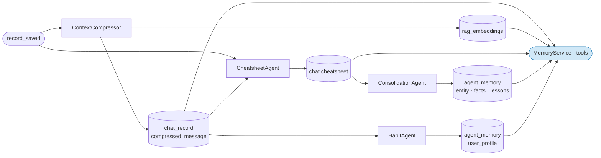

# Memory Service

**Location:** `backend/app/services/memory/memory_service.py`

---

## Motivation

The capture pipeline produces memory artifacts in four different stores: compressed chat records in `chat_record`, embeddings in `rag_embeddings`, curated findings in `chat.cheatsheet`, and distilled cross-session knowledge in `agent_memory`. Each store has different retrieval semantics — tail window, FTS, vector search, point read — and each artifact needs different formatting before it can be injected into a prompt.

Without a coordinator, every agent would need to know where each artifact lives, how to query it, and how to render it. The memory design needs a single retrieval interface that abstracts all of that: given a request context, assemble the relevant memory and return it as formatted strings ready for injection. `MemoryService` is that interface.

---

## Role in the Memory Pipeline

`MemoryService` is the retrieve layer. It reads from all memory stores and never writes. It is invoked at prompt build time, before the LLM is called.



Each loader maps to one memory artifact and one store:

| Loader | Source | Store |
|---|---|---|
| `load_short_term_memory` | Recent exchanges | `chat_record` |
| `load_long_term_memory` | Session findings | `chat.cheatsheet` |
| `load_project_memory` | Cross-session findings | `agent_memory` PROJECT |
| `load_user_profile` | User preferences | `agent_memory` PROJECT + `user_id` |

---

## Implementation

**Construction:**

```python
svc = MemoryService(project_service=ps, memory_store=ms, tail_n=12, top_k=3)
```

`project_service` and `memory_store` are optional. All loaders return `None` when their dependency is absent — callers decide whether to include the section. No loader ever raises.

### `load_short_term_memory(chat_id)`

Fetches the last `tail_n + 4` records (buffer for system and tool messages), filters to USER and AGENT records, formats as `"Role: text"` pairs in chronological order. Prefers `compressed_message or message` per record.

```python
text_ = (r.compressed_message or r.message or "").strip()
lines.append(f"{'User' if r.sender_role == Sender.USER else 'Ida'}: {text_}")
```

Returns `None` if no records exist.

### `load_long_term_memory(chat_id)`

Reads `chat.cheatsheet`, parses with `parse_cheatsheet`, renders with `render_to_markdown`. Conflicted entries are prefixed `[CONFLICTED]`. Returns `None` for empty cheatsheets.

```python
raw = self._project_service.get_chat_cheatsheet(chat_id)
result = render_to_markdown(parse_cheatsheet(raw))
```

### `load_project_memory(project_id, query)`

FTS search (PostgreSQL `plainto_tsquery`) over `content_text` of all PROJECT-scoped `agent_memory` records. Returns the top `top_k` hits formatted as `"[{memory_type}] {name}\n{content_text}"`, joined by `"\n\n"`. Returns `None` on no results.

```python
results = self._memory_store.search_objects(
    query=query, project_id=project_id, scope=MemoryScope.PROJECT, limit=top_k
)
```

The `query` argument should be the user's question or a topic summary — FTS ranks hits by relevance to it.

### `load_user_profile(user_id, project_id)`

Point read by `(agent_id="habit_agent", name="user_profile", scope=PROJECT, project_id, user_id)`. Returns `content_text` directly. Returns `None` if no profile exists or if `user_id` or `project_id` is falsy.

```python
mem = self._memory_store.get_object(
    agent_id="habit_agent", name="user_profile",
    scope=MemoryScope.PROJECT, project_id=project_id, user_id=user_id
)
return mem.content_text if mem else None
```

---

## Consumption

`MemoryService` is injected at agent construction and called once per request before the LLM is invoked. The returned strings are inserted into the system prompt as named sections. A `None` return means the section is omitted — the agent sees no placeholder or error.

```
[Short-term memory]        load_short_term_memory  →  last N exchanges
[Session findings]         load_long_term_memory   →  cheatsheet markdown
[Project memory]           load_project_memory     →  top-K FTS hits
[User profile]             load_user_profile       →  habit profile text
```

`load_project_memory` is the only loader that takes a query argument. It should be called with the current user question so FTS retrieves the most relevant cross-session findings for the request at hand, not a generic snapshot.
