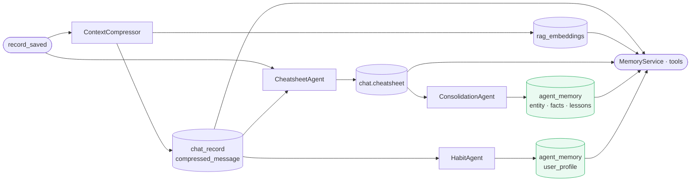

# Memory Store

**Location:** `backend/app/db/memory_store.py`

---

## Motivation

The capture pipeline produces three categories of persistent knowledge: per-entity data findings, non-quantitative project facts, and user behavioral profiles. These need to survive across sessions, be retrievable by scope and type, and support both point reads (fetch a known record) and keyword search (find relevant records given a query). The memory design needs a dedicated store for this persistent layer — separate from `chat_record` (which holds raw history) and `chat.cheatsheet` (which is per-session and ephemeral).

`MemoryStore` is that store: a scoped, versioned, FTS-capable persistence layer for all cross-session knowledge written by the capture agents and read by the retrieve layer.

---

## Role in the Memory Pipeline

`MemoryStore` is the persistence layer for `agent_memory`. It is written by `ConsolidationAgent` and `HabitAgent`, and read by `MemoryService` and `ProjectMemoryToolbox`.



---

## Schema

**Table:** `agent_memory`

| Column | Type | Purpose |
|---|---|---|
| `agent_id` | TEXT | Writing agent (`"consolidation_agent"`, `"habit_agent"`, …) |
| `name` | TEXT | Record name (`"entity_nnm101"`, `"project_facts"`, `"user_profile"`) |
| `scope` | ENUM | `GLOBAL` / `ORG` / `PROJECT` / `USER` |
| `memory_type` | ENUM | `DATA_INSIGHT` / `KEY_FACTS` / `LESSON_LEARNED` / `USER_PROFILE` / `BOOKKEEPING` |
| `project_id` | INT | Required for `PROJECT` scope |
| `user_id` | INT | Required for `user_profile` entries |
| `object` | JSONB | Structured payload (`{"insights": [...]}`, `{"facts": [...]}`, …) |
| `content_text` | TEXT | Plain-text rendering of `object` — FTS-indexed |
| `confidence` | FLOAT | 0.0–1.0; written by `ConsolidationAgent` |
| `size_chars` | INT | `len(content_text)` — context budget tracking |
| `version` | INT | Incremented on every upsert |

`content_text` is the FTS surface. It must be a human-readable rendering of `object` — not raw JSON. Writers are responsible for keeping `content_text` in sync with `object`.

---

## Scopes and types in use

| Scope | Type | Writer | Name pattern |
|---|---|---|---|
| `PROJECT` | `DATA_INSIGHT` | `ConsolidationAgent` | `entity_{key}` |
| `PROJECT` | `KEY_FACTS` | `ConsolidationAgent` | `project_facts` |
| `PROJECT` | `LESSON_LEARNED` | `ConsolidationAgent` | `project_lessons` |
| `PROJECT` | `USER_PROFILE` | `HabitAgent` | `user_profile` |
| `GLOBAL` | `BOOKKEEPING` | Background agents | cursor tracking |

`ORG` and `USER` scopes exist in the schema but are not currently used.

---

## API

**Primary key for upsert:** `(agent_id, name, scope, project_id, org_id, user_id)`. All reads and writes use this composite key. Two records with the same name but different `scope` or `project_id` are independent.

### `set_object` — upsert

Creates the record if none matches the composite key; updates and increments `version` if one exists.

```python
memory_store.set_object(
    agent_id="consolidation_agent",
    name="entity_nnm101",
    scope=MemoryScope.PROJECT,
    memory_type=MemoryType.DATA_INSIGHT,
    project_id=42,
    object={"entity": "nnm101", "insights": ["NPT: 54.2 hrs", "ROP: 13.2 m/hr"]},
    content_text="Entity: nnm101\n- NPT: 54.2 hrs\n- ROP: 13.2 m/hr",
    confidence=1.0,
)
```

`content_text` and `confidence` are only updated when explicitly passed — omitting them leaves the existing values unchanged.

### `get_object` — point read

```python
memory_store.get_object(
    agent_id="consolidation_agent",
    name="entity_nnm101",
    scope=MemoryScope.PROJECT,
    project_id=42,
) → Memory | None
```

### `search_objects` — FTS

PostgreSQL `plainto_tsquery` over `content_text`, ranked by `ts_rank`. Scoped to `project_id` and `scope`.

```python
memory_store.search_objects(
    query="NNM-101 NPT",
    project_id=42,
    scope=MemoryScope.PROJECT,
    limit=5,
) → list[Memory]
```

No index is created automatically on `content_text` — a GIN index on `to_tsvector('english', content_text)` is required in production for acceptable FTS performance at scale.

### `list_objects`

Enumerate all records for an agent, optionally filtered by `scope`, `memory_type`, `project_id`.

### `update_object` / `delete_object`

Update or delete by `id`. `update_object` increments `version`.

---

## Versioning

Every `set_object` or `update_object` call increments `version`. This tracks how many times a record has been synthesised — an `entity_nnm101` record with `version=5` has been merged across five consolidation runs. Readers can use `version` to assess staleness, though no automated eviction or expiry is implemented.
