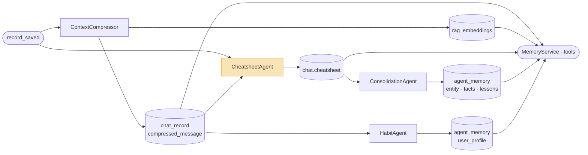
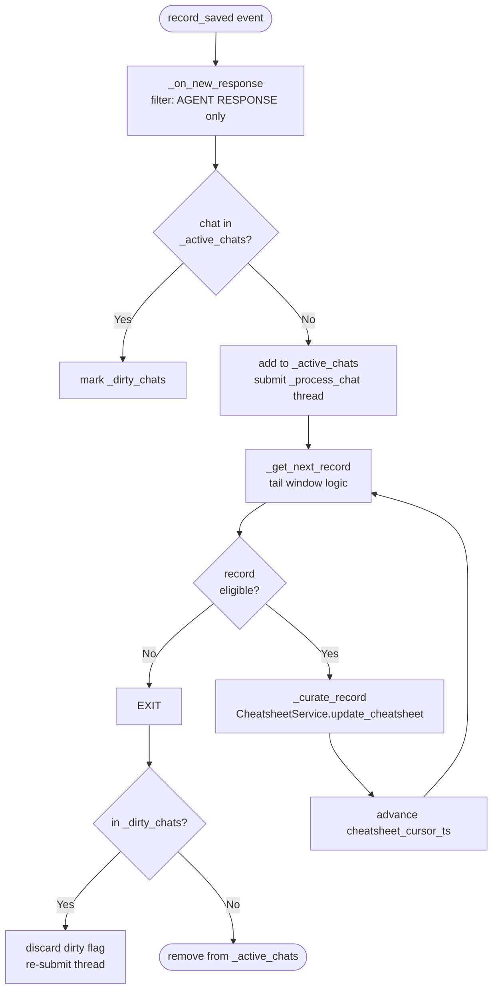
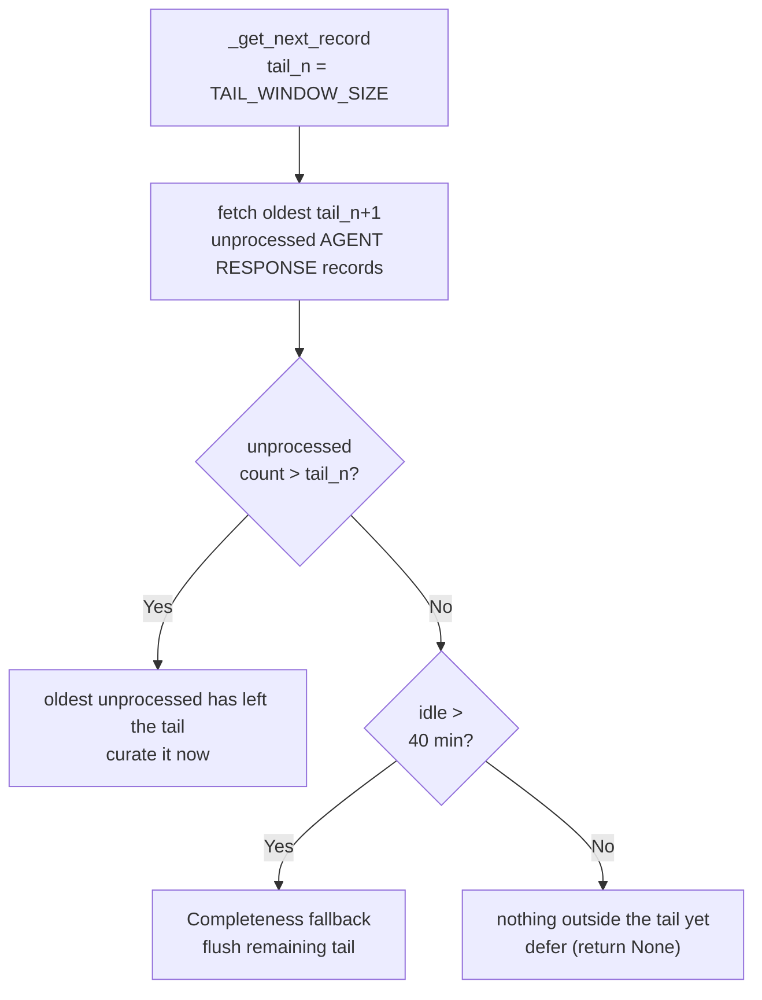

# Cheatsheet

**Location:** `backend/app/agents/workers/cheatsheet_agent.py`, `backend/app/services/cheatsheet/`

---

## Motivation

Within a session, the agent needs to remember what was established in earlier turns. The short-term window covers only the tail of the conversation — findings confirmed in turn 3 are gone from context by turn 15. Injecting the full transcript is not a solution: it grows without bound and is dominated by reasoning steps, tool outputs, and intermediate text that carry no durable signal.

What is needed is a representation that accumulates only the confirmed findings — stripped of the surrounding conversation — and stays compact regardless of how long the session runs. The cheatsheet is that representation: a typed, incrementally updated record of verified data points, data quality observations, and operational insights, injected at bounded cost into every subsequent turn.

---

## Role in the Memory Pipeline

`CheatsheetAgent` is the second capture stage. It fires on AGENT RESPONSE records, reads each exchange, and updates the per-chat cheatsheet.



`chat.cheatsheet` is consumed by the sub-agents via `CheatsheetService.get_cheatsheet` (tail-filtered, appended to their system prompt), `MemoryService.load_long_term_memory` and `tool_read_long_term_memory` (full render, on-demand during reasoning), and `ConsolidationAgent` (source for cross-session promotion). See [Consumption](#consumption).

---

## Schema

The cheatsheet is a JSON blob stored on the `chat` row. Three typed buckets:

```json
{
  "data_insights":   [{"content": "NPT: 54.2 hrs (12.1%)", "confidence": "verified", "entity": "NNM-101", "record_id": 847}],
  "key_facts":       [{"id": "kf_3a1b2c", "content": "WellView export truncated at 3200m", "confidence": "inferred", "record_id": 801}],
  "lessons_learned": [{"id": "ll_9f8e7d", "content": "Pre-treat with LCM before depleted zones", "confidence": "inferred", "entity": "NNM-101"}]
}
```

| Bucket | Contents | Keyed by |
|---|---|---|
| `data_insights` | Per-entity numeric findings: NPT, ROP, depth, cost | `entity` + metric — no stable `id` |
| `key_facts` | Data quality gaps, user knowledge gaps, workflow context | Stable `id` (`kf_*`) |
| `lessons_learned` | Actionable operational insights | Stable `id` (`ll_*`) |

**Confidence model:**

| Value | Meaning |
|---|---|
| `verified` | Value appears verbatim in a tool result block |
| `inferred` | Derived from agent narrative, not a tool result |
| `conflicted` | Same entity + metric has two different values; both entries preserved |

`data_insights` entries are keyed by entity + metric — the curator updates them in-place. `key_facts` and `lessons_learned` entries carry a stable `id` stamped by `CheatsheetService`, never by the LLM, enabling in-place updates (Replace) and removals (Delete) across turns without duplication.

Every entry also carries a `record_id` (the `chat_record.id` of the agent response it was distilled from), stamped by `CheatsheetService`. Besides letting the curator detect conflicts against existing entries, `record_id` drives tail filtering on read (see [Tail filtering on read](#tail-filtering-on-read)).

`user_habits` are intentionally **absent** from the schema — `HabitAgent` owns per-session habit learning at session end, where the full-session view it needs is available (per-exchange extraction is unreliable).

The data is stored on `chat.cheatsheet` as a JSON string via `CheatsheetData.to_storage_json()`, which excludes the transient `legacy_text` field. A pre-migration plain-text cheatsheet is read back into `CheatsheetData.legacy_text` and rendered verbatim, so old chats keep working without a data migration.

---

## Implementation

### Trigger

`CheatsheetAgent` subscribes to `system.historian.record_saved` and fires only on AGENT RESPONSE records (`sender_role=AGENT`, `msg_type=RESPONSE`). A 120-second fallback poll covers records missed across restarts.

Each eligible event spawns a per-chat thread. If a new response arrives while a thread is already running for the same chat, the chat is marked in `_dirty_chats` and the thread re-submits itself on exit. No events are dropped.



### Tail window

The cheatsheet is a curated summary, not a log. Curating an exchange the moment it arrives is wasted work: it is still present verbatim in the LLM's raw chat history, and the [injection side hides its cheatsheet entries anyway](#tail-filtering-on-read-the-second-scd2-boundary) while it sits in the tail. So curation is deferred until a record leaves the tail.

This is **one rule**, plus a completeness fallback:

> **Curate a record once it leaves the tail** — i.e. once `tail_n` newer responses exist after it (`unprocessed > tail_n`).

A young or still-accumulating chat is not a special case — it simply has nothing outside the tail yet, the empty case of the same rule. There are no separate "phases".



| Case | Condition | Action |
|---|---|---|
| **Outside the tail** | `unprocessed > tail_n` | Oldest unprocessed has left the tail — curate it now |
| **Inside the tail** | `unprocessed ≤ tail_n` | Defer — still covered by raw chat history |
| **Completeness fallback** | `unprocessed ≤ tail_n` and last response > 40 min ago | Flush the remaining tail |

The completeness fallback exists because a chat that ends with `≤ tail_n` trailing records would otherwise leave them inside the tail forever, never curated. After `IDLE_BYPASS_THRESHOLD` (40 min) of inactivity the remaining tail is flushed so the cheatsheet is complete.

`tail_n` is fixed at **6** by the `TAIL_WINDOW_SIZE` constant in `cheatsheet_service.py`. This is a single source of truth, **not** an agent-config knob: the curation side (`CheatsheetAgent`) and the injection side (`CheatsheetService.get_cheatsheet`) must use the same boundary, and the consumers that inject the cheatsheet build their own `CheatsheetService` and cannot see the agent's config. The agent imports the constant rather than defining its own copy.

The 40-minute idle flush is also what lets `ConsolidationAgent` (which fires at 60 minutes idle) always read a fully settled cheatsheet.

### Tail filtering on read (the second SCD2 boundary)

The tail window has two matched halves around the same `TAIL_WINDOW_SIZE` boundary:

- **Curation side** — `CheatsheetAgent` leaves the most recent `TAIL_WINDOW_SIZE` agent responses uncurated (the one rule above).
- **Injection side** — when the cheatsheet is rendered for context, entries distilled from those same recent records are hidden, because those exchanges are still present verbatim in the raw chat history already in the prompt. Surfacing them again would duplicate signal.

The mechanism: `CheatsheetService.get_cheatsheet` computes `_get_tail_start_record_id(chat_id)` — the oldest `record_id` among the last `TAIL_WINDOW_SIZE` agent RESPONSE records — and passes it to `DynamicCheatsheet.consult` as `min_record_id`. `render_to_markdown` then drops any entry whose `record_id >= min_record_id`. Entries with no `record_id` (e.g. legacy or unstamped) are always shown.

The two boundaries stay aligned because both derive from the one `TAIL_WINDOW_SIZE`: a record is either inside the tail (uncurated, but in raw history) or outside it (curated, and surfaced from the cheatsheet) — never both, never neither.

### Curation

`CheatsheetService.update_cheatsheet` runs one LLM call per eligible exchange:

1. Load the current cheatsheet via `DynamicCheatsheet.load`. It is handed to the curator as the raw storage JSON (`to_storage_json`) so the curator can see existing `record_id`s for conflict detection and carry entries forward; a legacy plain-text cheatsheet is passed as-is, an empty cheatsheet as `{}`.
2. LLM call (`DynamicCheatsheet.curate`) with `[[QUESTION]]`, `[[MODEL_ANSWER]]`, `[[PREVIOUS_CHEATSHEET]]` substituted into the curator prompt → response with the new cheatsheet wrapped in `<cheatsheet>…</cheatsheet>` tags, extracted by `extract_cheatsheet`.
3. Parse with `parse_cheatsheet`. If the output was unparseable JSON it comes back as `legacy_text` — log an error and keep the previous cheatsheet unchanged.
4. Stamp stable `id` on new `key_facts` and `lessons_learned` entries (`kf_*`, `ll_*`); `data_insights` get no `id` (keyed by entity + metric).
5. Stamp `record_id` on every new entry; existing entries keep the `record_id` the curator carried forward.
6. Save via `DynamicCheatsheet.save` → `project_service.update_chat_cheatsheet`.

The curator reads `record.compressed_message or record.message` — it uses the compressor's summary when available. After the service call returns, `CheatsheetAgent._curate_record` advances `cheatsheet_cursor_ts`; on a curator exception the cursor is advanced anyway so a permanently-failing record can't wedge the chat.

Model: `CONTEXT_MASTER`. Curation requires understanding the full exchange in context of the existing cheatsheet; a reasoning-capable model is appropriate here.

### Cursor

`cheatsheet_cursor_ts` is a per-chat timestamp column on the `chat` row. It advances to the processed record's timestamp after each successful curation. The fallback poll queries for chats where the most recent AGENT RESPONSE is newer than `cheatsheet_cursor_ts`.

---

## Consumption

There are two read paths, and they differ in one important way — whether tail filtering is applied.

### Sub-agent prompt injection — `CheatsheetService.get_cheatsheet` (tail-filtered)

The sub-agents (`data_insight_agent`, `sme_agent`, `viz_agent`, `report_generator_agent`) call `CheatsheetService.get_cheatsheet` while building their system prompt and append the result under a `CHEATSHEET:` heading. This is the [tail-filtered](#tail-filtering-on-read-the-second-scd2-boundary) path: entries from records still inside the tail window are hidden, because those exchanges are already present verbatim in the raw chat history in the same prompt.

All settled session findings — from turn 1 up to the tail boundary — are available in ~2 KB regardless of session length. Conflicted entries are prefixed `[CONFLICTED]` so the agent knows the value is contested.

### `MemoryService.load_long_term_memory` (not tail-filtered)

```python
raw = self._project_service.get_chat_cheatsheet(chat_id)
result = render_to_markdown(parse_cheatsheet(raw))  # no min_record_id
```

Renders the full cheatsheet — including tail-window entries — with no `min_record_id`. Returns `None` on an empty or `(empty)` cheatsheet.

### `ConsolidationAgent`

Reads `chat.cheatsheet` after the session goes idle (60 min) or the cursor gap exceeds 3 hours. Promotes entries by confidence filter:

| Bucket | Filter | Target |
|---|---|---|
| `data_insights` | `confidence == "verified"` | `entity_{key}` in `agent_memory` |
| `key_facts` | `confidence in ("verified", "inferred")` | `project_facts` in `agent_memory` |
| `lessons_learned` | all entries | `project_lessons` in `agent_memory` |

The cheatsheet is the only input `ConsolidationAgent` reads — no direct access to `chat_record`.

### `tool_read_long_term_memory`

On-demand tool (`project_memory_toolbox`) available during agent reasoning. Renders the full cheatsheet with `render_to_markdown(parse_cheatsheet(raw))` — like `load_long_term_memory`, it is **not** tail-filtered. Used when an agent needs to re-check session findings mid-chain without relying on what was injected at prompt build time.
