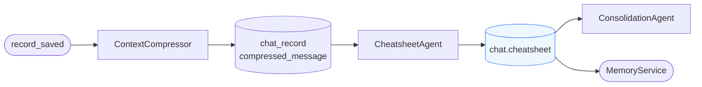

# Cheatsheet Agent

**Location:** `backend/app/agents/cheatsheet_agent.py`

---

## Purpose

`CheatsheetAgent` builds a compact project cheatsheet from compressed chat records. It extracts durable project context, recurring operational facts, and high-signal reference material that should be easy to retrieve later.

The output is stored on `chat.cheatsheet` and acts as a structured intermediate artifact between compression and longer-lived project memory.

---

## Role in the Pipeline

`CheatsheetAgent` runs after chat records have been compressed. It reads `chat_record.compressed_message` and produces a normalized cheatsheet payload for downstream consumers.

---

## Responsibilities

- Read compressed chat history for a project
- Distill repeated or durable project context
- Preserve concise high-value reference notes
- Emit a cheatsheet that downstream agents can reuse
- Avoid storing raw conversational clutter

---

## Output shape

Typical cheatsheet content includes:

- project summary points
- important entities and terminology
- recurring operating constraints
- active workstreams or concerns
- stable reference notes for future runs

The exact payload may evolve, but it should stay compact, structured, and human-readable.

---

## Downstream usage

The cheatsheet is primarily consumed by `ConsolidationAgent`, which merges it into durable project memory such as:

- entity insights
- project facts
- lessons learned

It may also be surfaced by memory retrieval paths when concise project context is needed.

---

## Design notes

- Cheatsheets are intermediate memory, not the final durable store
- The goal is compression with usefulness, not exhaustiveness
- Content should be stable enough to help later agents, but cheap to regenerate
- A cheatsheet should privilege signal over completeness
