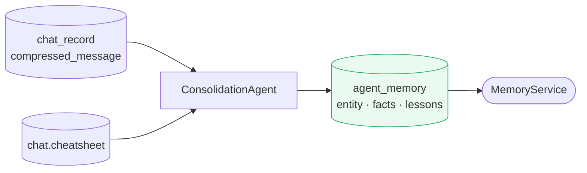

# Consolidation Agent

**Location:** `backend/app/agents/consolidation_agent.py`

---

## Purpose

`ConsolidationAgent` converts intermediate project memory into durable structured records in `agent_memory`.

It synthesizes information from compressed chat context and project cheatsheets, then writes high-value persistent knowledge such as per-entity insights, project facts, and lessons learned.

---

## Role in the Memory Pipeline

`ConsolidationAgent` is the main writer of project-scoped durable memory.

---

## Writes produced

`ConsolidationAgent` typically writes the following record classes into `agent_memory`:

| Scope | Type | Name pattern |
|---|---|---|
| `PROJECT` | `DATA_INSIGHT` | `entity_{key}` |
| `PROJECT` | `KEY_FACTS` | `project_facts` |
| `PROJECT` | `LESSON_LEARNED` | `project_lessons` |

These records are written through `MemoryStore` using scoped upserts.

---

## Responsibilities

- Read compressed project conversation context
- Read current project cheatsheet state
- Merge repeated findings across runs
- Synthesize durable structured insights
- Upsert project memory records with incremented versions
- Maintain readable `content_text` alongside structured `object`
- Attach confidence when appropriate

---

## Typical outputs

### Entity insight record

Tracks durable facts for a specific entity, often using a name like `entity_{key}`.

Example themes:

- performance metrics
- anomalies
- repeated observations
- operational constraints

### Project facts record

Captures stable project-wide factual context.

Example themes:

- field names and terminology
- system constraints
- environment or workflow assumptions
- recurring reference facts

### Project lessons record

Captures learned heuristics or patterns that should influence future reasoning.

Example themes:

- what tends to go wrong
- what signals are most predictive
- what mitigations have worked before

---

## Relationship to MemoryStore

`ConsolidationAgent` is a writer, not the database abstraction itself. It relies on `MemoryStore` to:

- address records by composite key
- increment versions on rewrite
- preserve FTS-ready `content_text`
- keep memory scoped to the relevant project

---

## Design notes

- Consolidation should favor synthesis over duplication
- Durable memory should outlive any single conversation
- Output should be structured enough for programmatic retrieval and readable enough for search
- Records should converge over time rather than grow as append-only chat logs
