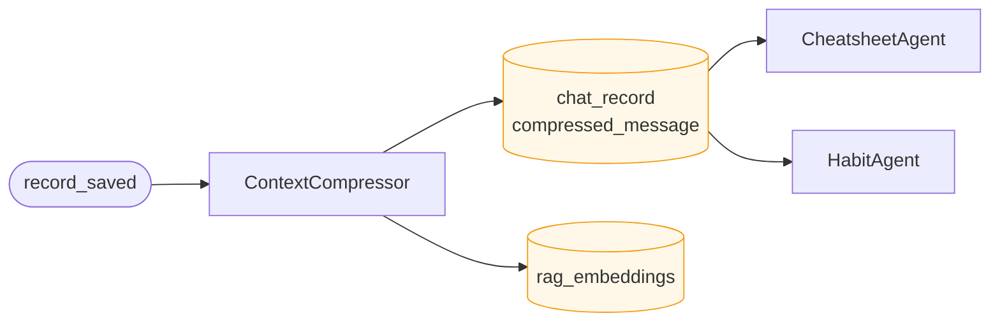

# Context Compressor

**Location:** `backend/app/agents/context_compressor.py`

---

## Purpose

`ContextCompressor` transforms raw chat records into compressed representations that are cheaper to store, index, and reuse. It is one of the earliest post-capture stages in the memory pipeline.

Its output feeds both retrieval-oriented storage and downstream memory-building agents.

---

## Role in the Pipeline

When a chat record is saved, `ContextCompressor` processes it into compressed message content and embeddings-oriented artifacts.

---

## Responsibilities

- Read newly saved chat records
- Compress conversational content into compact reusable summaries
- Produce text suitable for downstream semantic retrieval or embedding pipelines
- Reduce prompt bloat while preserving high-value meaning
- Provide a stable intermediate representation for later agents

---

## Outputs

### `chat_record.compressed_message`

A concise representation of the original chat record that preserves important meaning while removing unnecessary verbosity.

Used by:

- `CheatsheetAgent`
- `HabitAgent`
- potentially other downstream summarization or memory logic

### `rag_embeddings`

A retrieval-oriented artifact used to support semantic lookup and context recall.

---

## Design notes

- Compression should preserve actionable meaning, not every token
- The compressed output should be robust enough for multiple downstream consumers
- This stage improves both storage efficiency and later retrieval quality
- It acts as a bridge between raw conversational events and structured memory formation
