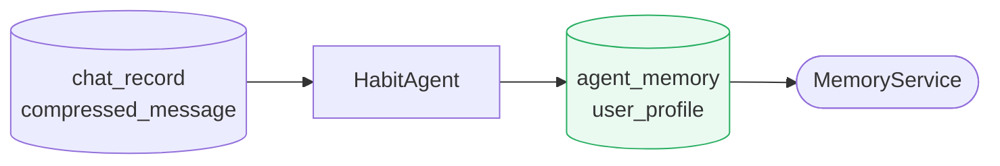

# Habit Agent

**Location:** `backend/app/agents/habit_agent.py`

---

## Purpose

`HabitAgent` derives user behavioral patterns and preference-level memory from compressed chat history. Its job is to maintain a lightweight cross-session profile that helps the system respond in a way that is better tailored to the user over time.

---

## Role in the Memory Pipeline

`HabitAgent` is the writer responsible for `USER_PROFILE`-type memory in `agent_memory`.

---

## Responsibilities

- Read compressed user/project interaction history
- Infer stable user preferences or habits
- Update user profile memory across sessions
- Avoid encoding transient or overly speculative traits
- Keep the stored profile concise and useful

---

## Memory written

Typical write pattern:

| Scope | Type | Name |
|---|---|---|
| `PROJECT` | `USER_PROFILE` | `user_profile` |

Although the schema supports broader `USER` scope, the current documented usage is project-scoped `USER_PROFILE` written by `HabitAgent`.

---

## Examples of profile content

A user profile may capture patterns such as:

- preferred response style
- recurring task preferences
- formatting tendencies
- favored workflows or tools
- repeated behavioral signals that improve future assistance

The profile should remain practical and bounded. It is not intended to become a full narrative biography.

---

## Relationship to retrieval

`MemoryService` and memory-aware tools can read `user_profile` memory to adapt future interactions. This makes `HabitAgent` an important bridge between past usage and future personalization.

---

## Design notes

- Prefer stable patterns over one-off behavior
- Keep confidence calibrated to evidence in the history
- Store useful adaptation hints, not unnecessary personal detail
- Update iteratively as new interaction evidence arrives
