# IDA Memory System

## Memory Architecture Framework

Memory is a **plugin service**, not a property of any individual agent. The same store, loaders, and tools are available to every agent — new agents call the existing API; they do not own storage.

IDA separates **what to remember** (four layers) from **how it is produced and consumed** (three planes). Capture runs asynchronously and never blocks a user request. Retrieve assembles context per request and never invokes Capture directly. **Store** is the only shared boundary between them.

### Four memory layers

Each layer has a different lifetime and cognitive role. Upper layers are hotter and more volatile; lower layers are distilled and persistent.

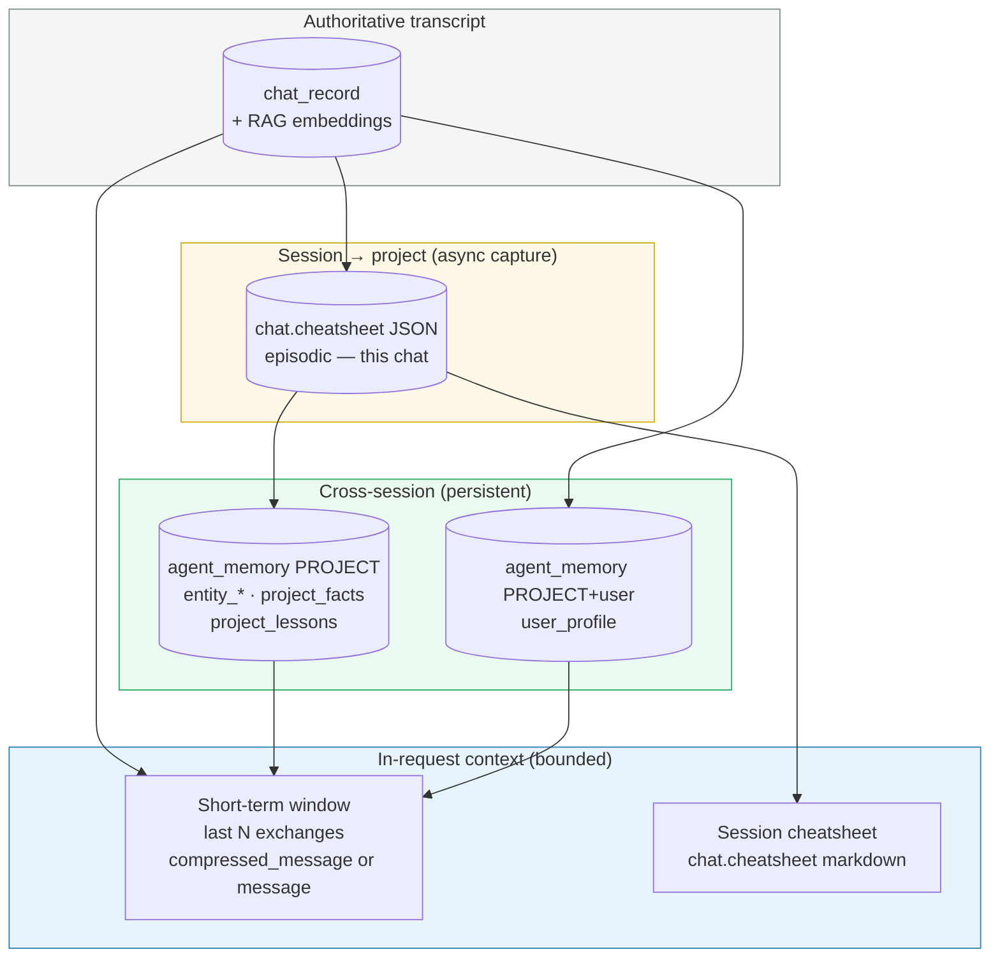

| Layer | Contents | Lifetime | Store | Analogy |
|---|---|---|---|---|
| **Chat history** | Raw or compressed exchanges | Session window | `chat_record`, RAG | Working memory |
| **Cheatsheet** | Structured session findings | Per chat | `chat.cheatsheet` | Episodic |
| **Project memory** | Verified entities, facts, lessons | Per project | `agent_memory` PROJECT | Semantic |
| **User profile** | Style and workflow preferences | Per user+project | `agent_memory` + `user_id` | Procedural |

### Three planes (Capture · Store · Retrieve)

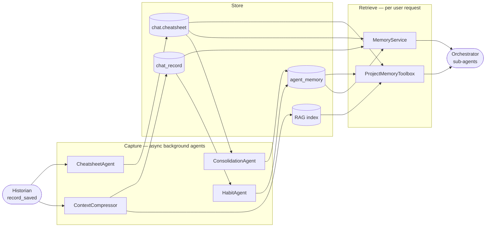

| Plane | Responsibility | Never does |
|---|---|---|
| **Capture** | Distil conversations into store artifacts | Block the request path |
| **Store** | Persist and index by scope/type | Choose what agents say |
| **Retrieve** | Load and format memory for prompts/tools | Write memory directly |

### Pipeline goal

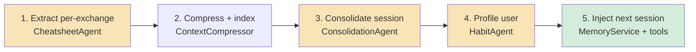

---

## Main Components

All capture agents subscribe to or poll the same conversation stream. Only **ContextCompressor** and **CheatsheetAgent** react to every new message in real time; **ConsolidationAgent** and **HabitAgent** run on idle or cursor-gap schedules.

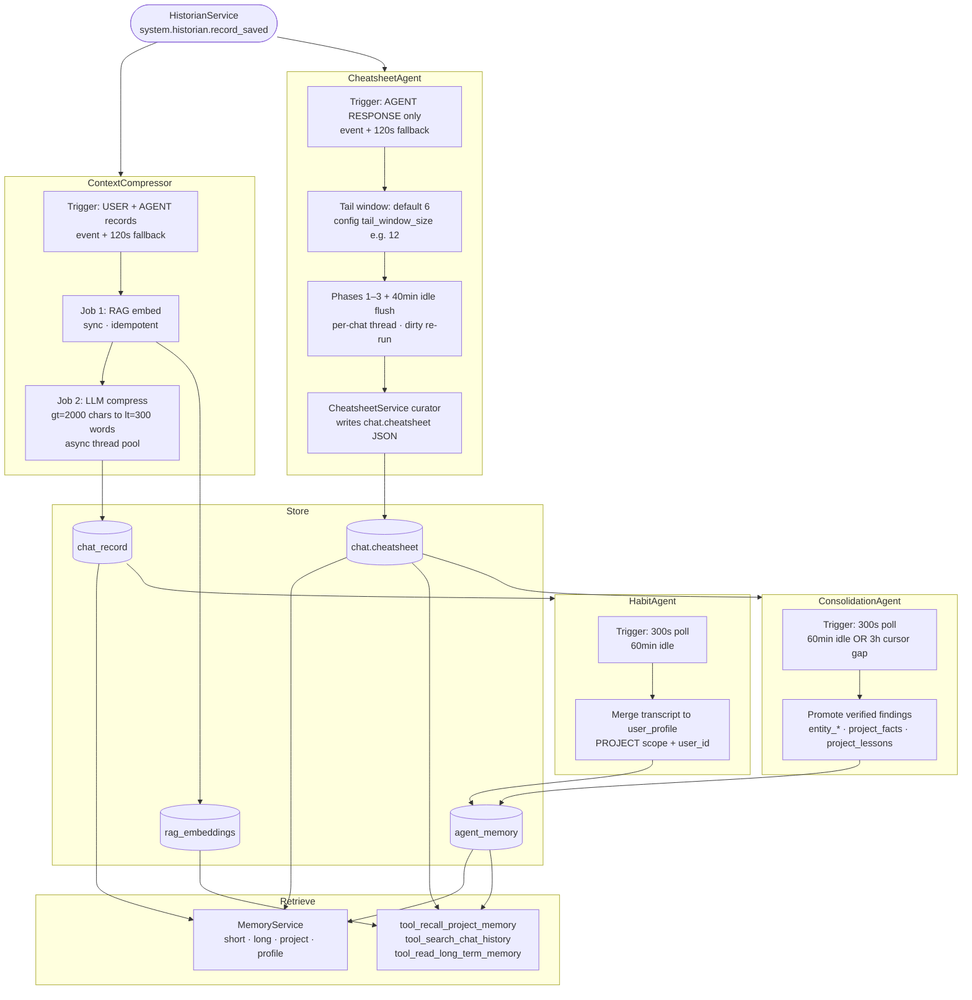

| Component | Plane | Location | Trigger summary |
|---|---|---|---|
| `ContextCompressor` | Capture | `workers/context_compressor.py` | `record_saved` (USER/AGENT); 120s fallback |
| `CheatsheetAgent` | Capture | `workers/cheatsheet_agent.py` | `record_saved` (AGENT RESPONSE); 120s fallback |
| `CheatsheetService` | Capture | `services/cheatsheet/cheatsheet_service.py` | Called by CheatsheetAgent per exchange |
| `ConsolidationAgent` | Capture | `workers/consolidation_agent.py` | 300s poll; idle 60 min or cheatsheet cursor gap 3 h |
| `HabitAgent` | Capture | `workers/habit_agent.py` | 300s poll; idle 60 min |
| `MemoryStore` | Store | `db/memory_store.py` | CRUD + FTS on `agent_memory` |
| RAG index | Store | `rag/service.py` | Vector + keyword over chat embeddings |
| `MemoryService` | Retrieve | `services/memory/memory_service.py` | Injected at agent start / prompt build |
| `ProjectMemoryToolbox` | Retrieve | `tools/toolbox/project_memory_toolbox.py` | On-demand during tool loops |

---

## Component Map (detail)

| Component | Plane | Location | What it does |
|---|---|---|---|
| `ContextCompressor` | Capture | `workers/context_compressor.py` | Embeds every message into the RAG index; compresses long messages to ≤300 words |
| `CheatsheetAgent` | Capture | `workers/cheatsheet_agent.py` | Extracts structured findings from each exchange into `chat.cheatsheet` |
| `CheatsheetService` | Capture | `services/cheatsheet/cheatsheet_service.py` | Orchestrates the LLM curator for a single update |
| `ConsolidationAgent` | Capture | `workers/consolidation_agent.py` | Promotes verified cheatsheet entries to PROJECT-scoped `agent_memory` |
| `HabitAgent` | Capture | `workers/habit_agent.py` | Extracts per-user behavioral patterns at session end into `agent_memory` |
| `MemoryStore` | Store | `db/memory_store.py` | CRUD + FTS over the `agent_memory` table |
| RAG index | Store | `rag/service.py` | Vector + keyword search over embedded `chat_record` messages |
| `chat_record` | Store | `db/project.py` | Raw message history; holds `compressed_message` after compressor runs |
| `chat.cheatsheet` | Store | `db/project.py` (chat row) | Per-chat JSON: curated session findings |
| `MemoryService` | Retrieve | `services/memory/memory_service.py` | Assembles memory strings for LLM prompt injection |
| `ProjectMemoryToolbox` | Retrieve | `tools/toolbox/project_memory_toolbox.py` | Agent-callable tools over memory and chat history |

---

## Memory Layers

See [Four memory layers](#four-memory-layers) for the stack diagram. Layer details below.

### Chat history

`chat_record` stores every USER and AGENT message. The short-term window (last 12–16 exchanges) is the primary continuity mechanism within a request. Each row has:
- `message` — original text
- `compressed_message` — ≤300-word summary (written by ContextCompressor when `len(message) ≥ 2000`)

Retrieval always prefers `compressed_message or message`. The raw message is retained for audit; the compressed version is what enters the context window.

### Cheatsheet

`chat.cheatsheet` is a per-chat JSON blob written incrementally by CheatsheetAgent. It holds structured findings in three buckets:

```json
{
  "data_insights":   [{"entity": "NNM-101", "content": "NPT 54h during 8½\" section", "confidence": "verified", "record_id": 847}],
  "key_facts":       [{"id": "kf_3a1b2c",  "content": "WellView export truncated at 3200m", "confidence": "inferred", "record_id": 801}],
  "lessons_learned": [{"id": "ll_9f8e7d",  "content": "Pre-treat with LCM before depleted zones", "confidence": "inferred"}]
}
```

**Confidence model:**
- `verified` — value appears verbatim in a tool result block
- `inferred` — derived from narrative, not directly confirmed by data
- `conflicted` — same metric has two different values; both entries preserved, neither dropped

`data_insights` entries are keyed by entity (well, formation, BHA) — no stable `id`. `key_facts` and `lessons_learned` entries carry a stable `id` (`kf_*`, `ll_*`) so the curator can update them across turns rather than duplicate.

### Project memory

`agent_memory` rows with `scope=PROJECT` hold distilled cross-session knowledge. Three named slots:

| Name pattern | Type | Contents |
|---|---|---|
| `entity_{well}` | `DATA_INSIGHT` | Merged, deduplicated per-entity numeric findings |
| `project_facts` | `KEY_FACTS` | Non-quantitative session findings: data gaps, user knowledge gaps, naming conventions |
| `project_lessons` | `LESSON_LEARNED` | Transferable operational insights |

Each record has a `content_text` field (plain-text rendering) that is FTS-indexed in PostgreSQL, enabling keyword retrieval via `MemoryStore.search_objects`.

### User profile

`agent_memory` rows with `scope=PROJECT` and a `user_id`. Name: `user_profile`. Type: `USER_PROFILE`. Written by HabitAgent after sessions go idle.

Five dimensions captured: query style, interaction style, output preferences, domain focus, expertise signals. Free-form text; no schema enforcement. FTS-indexed.

> **Scope:** `USER_PROFILE` uses `scope=PROJECT` with `project_id + user_id` to keep preferences project-contextual. A user's preferences on a shallow gas project may differ from a deep HP/HT project.

---

## Capture Layer

Background agents and how they connect to the store (detail flows below).

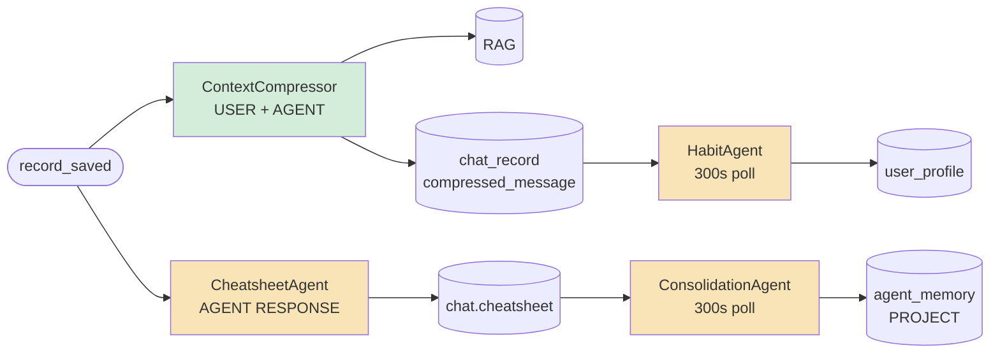

### ContextCompressor

**Location:** `workers/context_compressor.py`

**Trigger:** subscribes to `system.historian.record_saved` bus event; 120s fallback poll catches records missed across restarts. The fallback cursor is in-memory only — restarts re-scan from 0, but both jobs are idempotent.

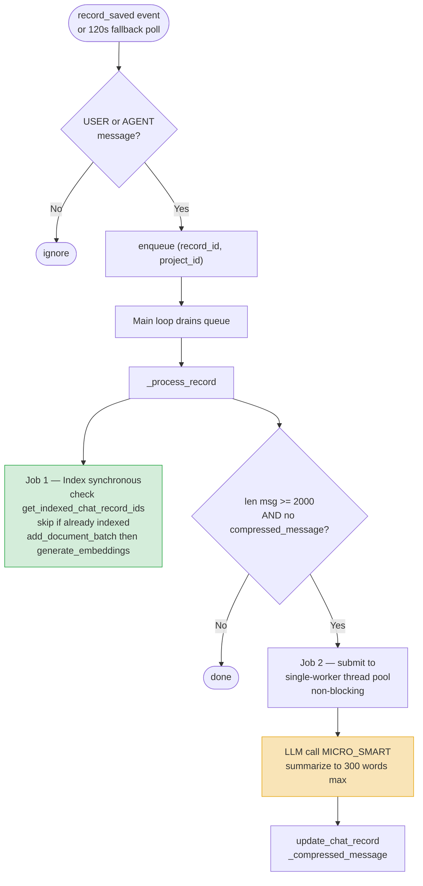

Job 1 (indexing) runs immediately so the RAG index is always fresh. Job 2 (compression) is submitted to a single-worker thread pool so the main loop is never blocked by an LLM call.

**Idempotency:** indexing checks `get_indexed_chat_record_ids` before embedding. Compression skips records with `compressed_message` already set.

---

### CheatsheetAgent + CheatsheetService

**Location:** `workers/cheatsheet_agent.py`, `services/cheatsheet/cheatsheet_service.py`

**Trigger:** same `system.historian.record_saved` bus event; 120s fallback poll. Only fires on AGENT RESPONSE records.

**Per-chat threading:** each chat gets its own thread. A `_dirty_chats` flag handles the race: if a new response arrives while the thread is running, the thread re-submits itself on exit. No events are dropped.

#### Tail window logic

The cheatsheet is a curated summary, not a log. The last `tail_n` exchanges are kept as a **working window** (default **6** in code; set `tail_window_size: 12` in agent config for long drilling Q&A sessions). The tail logic controls when each record becomes eligible for curation:

| Phase | Condition | Action |
|---|---|---|
| **Phase 1 — young** | total records ≤ `tail_n` | Curate each exchange immediately |
| **Phase 2 — accumulating** | total > `tail_n`, unprocessed ≤ `tail_n` | Defer — wait for the tail to fill |
| **Phase 3 — sliding window** | unprocessed > `tail_n` | Oldest unprocessed scrolled past tail — curate immediately |
| **Idle bypass** | last exchange > 40 min ago | Flush all remaining tail records regardless of phase |

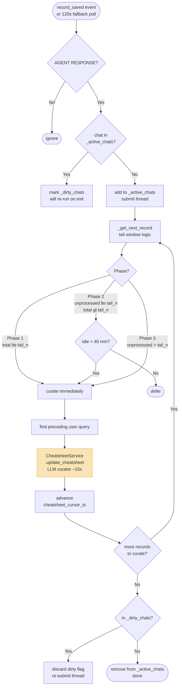

#### Curation

`CheatsheetService.update_cheatsheet` runs one LLM curator call per eligible exchange:

1. Load current cheatsheet JSON (or `{}` if empty)
2. LLM call: `[user_query, agent_response, current_cheatsheet]` → updated cheatsheet JSON
3. Parse and validate with `parse_cheatsheet`
4. Stamp `id` on new `key_facts` / `lessons_learned` entries (`kf_*`, `ll_*`)
5. Stamp `record_id` on all new entries (existing entries carry their `record_id` forward unchanged)
6. Save via `project_service.save_chat_cheatsheet`
7. Advance `cheatsheet_cursor_ts`

---

### Compressor + Cheatsheet: context window management

These two capture jobs solve the same problem from different angles: as a session grows, the raw transcript eventually exceeds the context window.

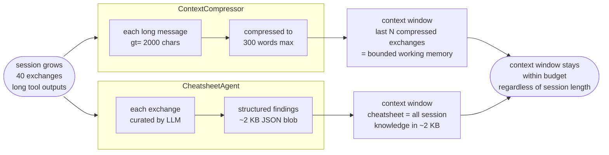

Without the compressor, long tool outputs overflow the chat history window. Without the cheatsheet, recovering facts from turn 3 requires injecting the full transcript. Together: the context window always holds the last N compressed exchanges and the cheatsheet. Neither grows unboundedly.

---

### ConsolidationAgent

**Location:** `workers/consolidation_agent.py`

**Trigger:** polls every 300s. Fires on a chat when:
- `cheatsheet_cursor_ts > consolidation_cursor_ts` (new cheatsheet content exists), AND
- Either idle > 60 min OR cursor gap > 3h (for long active sessions)

The 60-minute threshold is 20 minutes after the cheatsheet idle flush (40 min), giving CheatsheetAgent time to fully settle before Consolidation reads it.

**What gets promoted:**

| Cheatsheet bucket | Promotion filter | Target memory |
|---|---|---|
| `data_insights` | `confidence == "verified"` | `entity_{key}` per entity (merged) |
| `key_facts` | `confidence in ("verified", "inferred")` | `project_facts` (merged) |
| `lessons_learned` | all entries | `project_lessons` (merged) |

`inferred` key_facts are included because they represent user knowledge gaps and data quality observations — valuable even without direct tool confirmation. `inferred` data_insights are excluded because numeric claims without tool grounding should not enter permanent memory.

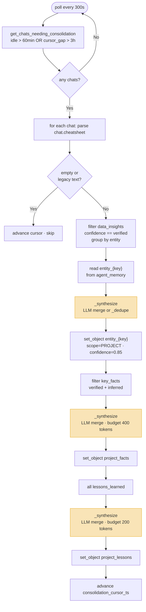

**Entity key normalization:** `NNM-101`, `NNM_101`, `NNM 101` → `nnm101`. Separators stripped, lowercased.

**LLM synthesis:** existing memory + new candidates → synthesis LLM (MICRO_SMART). Merge duplicates (keep most specific), resolve numerical conflicts (append "values vary: X, Y" when unresolvable), drop subsumed entries, preserve every distinct fact. Returns a JSON array of strings. Falls back to case-insensitive `_dedupe` if LLM is unavailable.

Token budgets (400 / 200 tokens) are hints in the synthesis prompt — the LLM is trusted to stay within them. No post-synthesis trimming.

---

### HabitAgent

**Location:** `workers/habit_agent.py`

**Trigger:** polls every 300s. Fires when `max(response_ts) < now - 60min` AND `max(response_ts) > habit_cursor_ts` — i.e., the session is idle but has unprocessed exchanges since the last run.

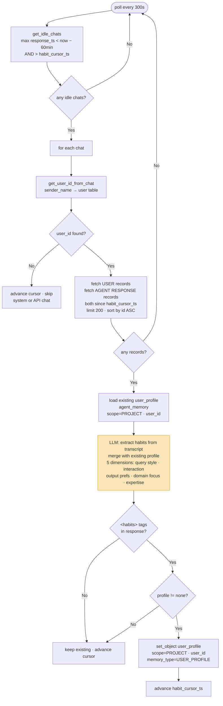

**Profile update strategy:** existing pattern confirmed → unchanged; confirmed multiple times → append "(confirmed)"; new evidence contradicts it → soften; new pattern → append. One line per observation. Five dimensions: query style, interaction style, output preferences, domain focus, expertise signals.

**`get_user_id_from_chat`** derives the user ID by looking up `sender_name` (user email) from USER records and joining to the `user` table. System or API chats with no USER records get `user_id=None` — cursor is advanced and the chat is silently skipped.

---

## Storage Layer

### MemoryStore

**Location:** `db/memory_store.py`

CRUD service over the `agent_memory` PostgreSQL table. Stateless — takes an `Engine` at construction.

**Primary key pattern:** `(agent_id, name, scope, project_id, org_id, user_id)`. `set_object` upserts on this composite key, incrementing `version` on each update.

**API surface:**

```python
# Upsert — creates or updates, increments version
memory_store.set_object(agent_id, name, object, scope, memory_type,
                        project_id, user_id, content_text, confidence)

# Point read
memory_store.get_object(agent_id, name, scope, project_id, user_id) → Memory | None

# FTS search (PostgreSQL plainto_tsquery, ranked by ts_rank)
memory_store.search_objects(query, project_id, scope, memory_type, limit) → list[Memory]

# List all for an agent
memory_store.list_objects(agent_id, scope, memory_type, project_id, limit) → list[Memory]
```

**Schema:**

```
agent_memory
  agent_id      TEXT        — "consolidation_agent", "habit_agent", ...
  name          TEXT        — "entity_nnm101", "project_facts", "user_profile"
  scope         ENUM        — GLOBAL / ORG / PROJECT / USER
  memory_type   ENUM        — DATA_INSIGHT / KEY_FACTS / LESSON_LEARNED / USER_PROFILE / BOOKKEEPING
  project_id    INT         — required for scope=PROJECT
  user_id       INT         — required for user_profile entries
  object        JSONB       — structured payload ({"insights": [...], "facts": [...], ...})
  content_text  TEXT        — plain-text rendering of object, FTS-indexed
  confidence    FLOAT       — 0.0–1.0 (written by ConsolidationAgent for data insights)
  version       INT         — incremented on each upsert
  size_chars    INT         — len(content_text), for context budget tracking
```

`content_text` is the FTS surface — always a human-readable rendering of `object`. For entity memories: `"Entity: nnm101\n- NPT 54h\n- ROP 13 m/hr"`. For user_profile: the raw profile text. FTS queries operate on content, not JSONB keys.

**Scopes:** `GLOBAL` for bookkeeping cursors (background agents tracking last-processed IDs); `PROJECT` for entity memories, facts, lessons, and user profiles; `ORG` and `USER` scopes exist but are not currently used.

---

## Retrieval Layer

### MemoryService

**Location:** `services/memory/memory_service.py`

Coordinator for in-context memory assembly. Takes `project_service` and `memory_store` as injected dependencies — works with null dependencies (returns `"(none)"` safely). Never raises.

**Four loaders:**

```python
svc = MemoryService(project_service=ps, memory_store=ms, tail_n=12, top_k=3)

# Last tail_n exchanges as "User: ... / Ida: ..." pairs (chronological ASC)
svc.load_short_term_memory(chat_id) → str

# Current session's cheatsheet rendered as markdown
svc.load_long_term_memory(chat_id) → str

# Top-K PROJECT-scoped memories matching query via FTS
svc.load_project_memory(project_id, query) → str

# user_profile from agent_memory (PROJECT scope, project_id + user_id)
svc.load_user_profile(user_id, project_id) → str
```

**`load_short_term_memory`:** fetches `tail_n + 4` records (buffer for system/tool messages), iterates ASC (records return oldest-first). Formats as `Role: text` pairs. Prefers `compressed_message or message`.

**`load_long_term_memory`:** fetches `chat.cheatsheet` JSON, parses with `parse_cheatsheet`, renders via `render_to_markdown`. Returns `"(none)"` for empty cheatsheets.

**`load_project_memory`:** calls `MemoryStore.search_objects(scope=PROJECT, limit=top_k)`. Formats each hit as `[{memory_type}] {name}\n{content_text}`. Returns `"(none)"` on no results.

**`load_user_profile`:** calls `MemoryStore.get_object(agent_id="habit_agent", name="user_profile", scope=PROJECT, project_id, user_id)`. Returns `content_text` directly.

---

### ProjectMemoryToolbox

**Location:** `tools/toolbox/project_memory_toolbox.py`

Agent-callable tools for on-demand memory access during LLM execution. Three tools:

#### `tool_recall_project_memory`

```
Search PROJECT-scoped agent_memory via FTS.
Input:  query (str), top_k (int, default 5, max 20)
Output: formatted hits "[{type}] {name}\n{content_text}", separated by "---"
Filter: USER_PROFILE entries excluded (preferences must not pollute analytical results)
Passthrough: project_id
```

#### `tool_search_chat_history`

```
Hybrid (semantic + keyword) search over RAG-indexed chat records.
Input:  query (str), top_k (int, default 8, max 20)
Output: "[record_id={id}]\n{content}" excerpts, separated by "---"
Filter: source_type=CHAT, project_id (cross-chat within project)
Passthrough: project_id
```

#### `tool_read_long_term_memory`

```
Read current session's cheatsheet as markdown.
Input:  (none)
Output: render_to_markdown(parse_cheatsheet(raw)) or "(none)"
Passthrough: chat_id
```

---

## Session Boundary Timeline

Capture agents use **staggered idle thresholds** so each stage reads settled upstream data.

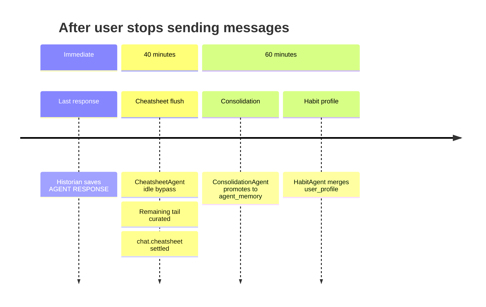

The **20-minute gap** between cheatsheet flush (40 min) and consolidation/habit (60 min) is intentional: ConsolidationAgent must read a fully settled cheatsheet.

For **long active sessions** (no 60 min idle), ConsolidationAgent also fires when `cheatsheet_cursor_ts − consolidation_cursor_ts > 3 hours`, so project memory does not stall mid-session.
