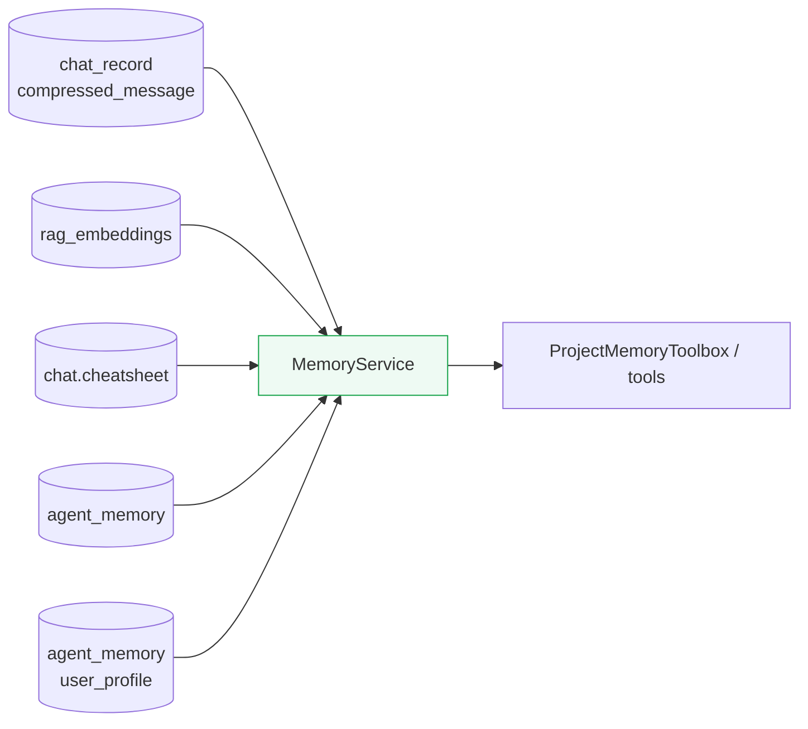

# Memory Service

**Location:** `backend/app/services/memory_service.py`

---

## Purpose

`MemoryService` is the read-layer entry point for persisted memory. It gathers relevant cross-session knowledge from multiple memory artifacts and makes that knowledge available to tools and higher-level application flows.

---

## Role in the Memory Pipeline

`MemoryService` sits on the retrieval side of the pipeline. It reads from compressed records, embeddings, cheatsheets, and durable `agent_memory` records.

---

## Responsibilities

- Read memory from the different persistence layers
- Combine short-form and durable memory sources
- Retrieve project-scoped memory for downstream tools
- Expose memory in a form useful for prompt assembly or tool use
- Support search and relevance filtering over stored knowledge

---

## Inputs it consumes

### Compressed chat records

Used as lightweight historical context.

### RAG embeddings

Used for semantic retrieval of relevant prior content.

### Cheatsheets

Used as concise project reference summaries.

### Durable `agent_memory`

Used for long-lived project and user memory, including:

- entity insights
- project facts
- lessons learned
- user profile signals

---

## Relationship to MemoryStore

`MemoryStore` is the persistence abstraction for durable `agent_memory`; `MemoryService` is one of its major readers.

In practice, `MemoryService` is responsible for deciding what memory to fetch and assemble, while `MemoryStore` is responsible for how durable records are stored and queried.

---

## Downstream consumers

Documented consumers include `ProjectMemoryToolbox` and other tool-oriented retrieval flows that need relevant historical context without reprocessing all prior chats.

---

## Design notes

- Retrieval should balance completeness with prompt budget
- Durable memory and recent compressed context serve different roles and should complement each other
- The service should prefer useful, scoped, high-signal memory over indiscriminate history replay
