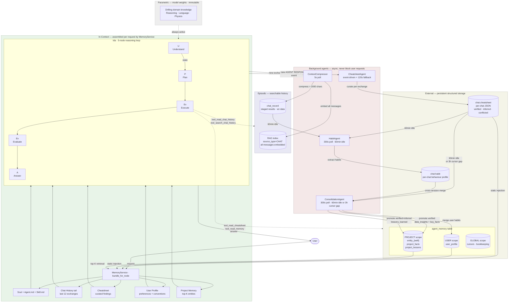
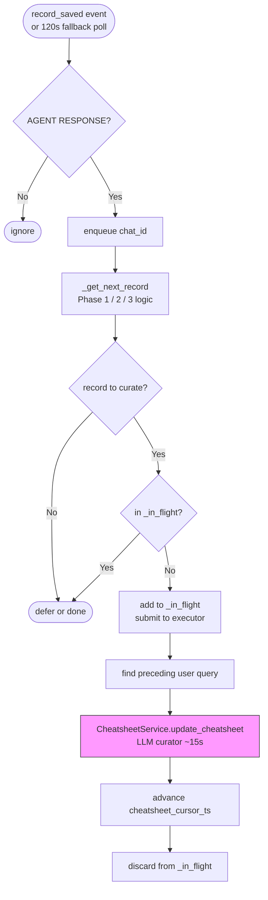
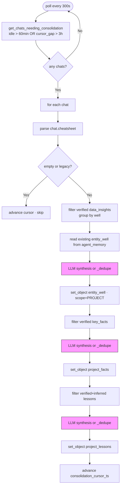
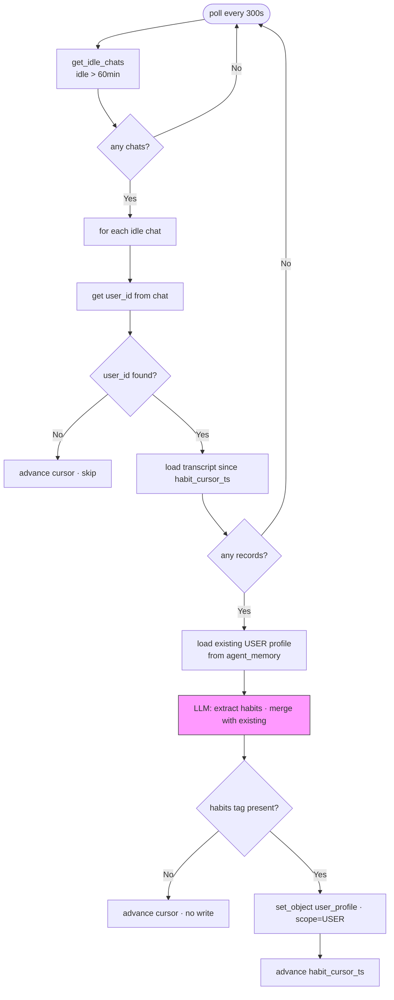

# IDA Memory Architecture

## Four-Layer Model

Ida's memory system is organised across four layers. Each layer has a defined scope, lifetime, and mechanism. They are not interchangeable.

| Layer | Scope | Lifetime | Mechanism | Written by |
|---|---|---|---|---|
| **Parametric** | Universal | Permanent (immutable) | Model weights | Anthropic training |
| **In-Context** | One request | Duration of LLM call | Prompt assembly (MemoryService) | Framework |
| **Episodic** | Searchable history | Persistent, per-chat / per-project | RAG index + raw records | ContextCompressor |
| **External** | Cross-session | Persistent, scoped | DB tables (`agent_memory`, `chat.*`) | Background agents |

---

## Big Picture



---

## Layer 1: Parametric

**What it is:** knowledge baked into Claude's model weights — drilling terminology, physics, general reasoning, language understanding. Always active. Ida cannot modify this layer.

**What Ida uses it for:** baseline domain competence that does not need to be injected. Universal concepts (NPT, ROP, BHA, stuck pipe) are parametric knowledge — they do not need to be explained in every prompt. Operator-specific conventions, well-specific findings, and user preferences are *not* parametric — they must be injected from External or In-Context.

**Design implication:** do not inject what Claude already knows. Reserve prompt budget for what is project-specific, session-specific, or user-specific.

---

## Layer 2: In-Context

**What it is:** everything loaded into the active context window for a single request. Assembled by `MemoryService` before each LLM node call. Discarded after the response — nothing in this layer survives to the next request without being written to Episodic or External first.

### Memory sources and injection map

| Source | Typical size | U | P | Ex | Ev | A |
|---|---|:---:|:---:|:---:|:---:|:---:|
| Soul + Agent.md | ~2–3k | ✓ | ✓ | ✓ | ✓ | — |
| Skill.md | ~1–2k | — | ✓ | ✓ | — | — |
| Chat History tail (last 12) | ~4–6k | ✓ | ✓ | ◌ | — | — |
| Cheatsheet | ~1–3k | ✓ | ✓ | ◌ | — | — |
| User Profile | ~0.5–1k | ✓ | — | — | ✓ | — |
| Project Memory (top-K) | ~1–2k | ↑ | — | ◌ | — | — |
| U's state output | ~1–2k | — | ✓ | — | — | — |
| **Total (U)** | **~9–15k** | | | | | |
| **Total (P)** | **~8–14k** | | | | | |

**✓** static injection · **↑** top-K retrieval by entity at node start · **◌** on demand via tool during execution · **—** not loaded

### Why each node gets what it gets

**Understand (U):** full picture — Soul, CH, CS, User Profile, top-K Project Memory retrieved by entity match. U synthesizes the query, identifies the relevant wells, recalls what is already known, and produces a structured state (intent, entities, known facts) for the rest of the loop.

**Plan (P):** Soul + Skill.md + CH + CS + U's state. The planner needs the raw conversation and established findings to write a non-redundant execution plan. PM is the exception — P receives the relevant entries via U's state, so no direct PM injection at P.

**Execute (Ex):** Soul + Skill.md + P's execution plan (as state). Most skills don't need CH/CS/PM injected — U and P already synthesized them. Tools cover on-demand access for the rare skill that needs to look something up mid-execution.

**Evaluate (Ev):** Soul + User Profile + Ex's results (as state). Evaluates factual correctness *and* persona fit — did the answer match this user's detail level, domain knowledge, and output preferences?

**Answer (A):** formats and returns Ex/Ev's output. No separate LLM call needed in the current design.

### MemoryService

`MemoryService` (`app/services/memory/memory_service.py`) assembles the in-context bundle before each node call. It is the Python-layer counterpart to the tools — the service runs before the LLM; tools run inside the LLM's execution loop.

```python
@dataclass
class NodeContext:
    system: str    # Soul + Agent.md (+ Skill.md for P and Ex)
    context: str   # CH, CS, User Profile, retrieved PM
    state: str     # structured output from the prior node

class MemoryService:
    def bundle_for_node(self, node: str, **kwargs) -> NodeContext: ...
```

```
User request
  └─ MemoryService.bundle_for_node("U", entities=[...])
  └─ LLM call: Understand → produces u_state
  └─ MemoryService.bundle_for_node("P", skill_name=..., u_state=...)
  └─ LLM call: Plan → produces p_state
  └─ MemoryService.bundle_for_node("Ex", skill_name=..., p_state=...)
  └─ LLM call: Execute
       ├─ tool_read_cheatsheet(...)     ← on demand
       ├─ tool_read_memory(query=...)   ← on demand
       └─ produces ex_state
  └─ MemoryService.bundle_for_node("Ev", ex_state=...)
  └─ LLM call: Evaluate
```

**Caching:** `soul`, `agent_md`, and `skill` files cached per request (disk reads). DB-backed loaders (`chat_history`, `cheatsheet`, `user_profile`, `retrieve_project_memory`) are not cached — they must reflect current DB state.

### Tools for on-demand access during Execute

Three tools support context loading mid-execution without pre-injecting:

**`tool_read_cheatsheet(confidence, well)`** — reads `chat.cheatsheet`, optionally filtered. Primary use: verify a fact before running an expensive DDR/WellView retrieval — if `confidence="verified"` returns complete data, skip the query.

**`tool_read_chat_history(n, before_record_id, oldest_first)`** — reads N raw exchanges beyond the injected tail. Primary use: report and reconciliation skills referencing exchanges from earlier than the current window.

**`tool_read_memory(name, query, top_k)`** — reads from `agent_memory` by exact name or keyword match. Primary use in Execute: look up a specific entity not covered by the top-K injected at U.

### Current vs target state

| Source | Write path | Read path |
|---|---|---|
| Soul.md + Agent.md | Manual (checked in) | Injected at all nodes ✓ |
| Skill.md | Manual (checked in) | Loaded on demand in P and Ex ✓ |
| Chat History tail | Framework | Injected at U and P ✓ |
| Cheatsheet | CheatsheetAgent ✓ | **Not yet injected** — target: U, P via MemoryService |
| User Profile | HabitAgent ✓ | **Not yet read** — target: U and Ev via MemoryService |
| Project Memory | ConsolidationAgent ✓ | **Not yet retrieved** — target: top-K at U via MemoryService |

The write infrastructure is complete. The activation gap is MemoryService wiring (see Implementation Plan).

---

## Layer 3: Episodic

**What it is:** a searchable record of past events — conversations, tool results, and staged visualisations. Survives across sessions and can be retrieved by content query, not just recency.

### ContextCompressor

Runs continuously (5s poll). Performs two jobs per chat record:

```
Job 1 — Embed:   ALL USER + AGENT messages → RAG index (source_type=CHAT)
Job 2 — Compress: messages > 2000 chars → 300-word summary → chat_record.compressed_message
```

**Effect:** every message is searchable via `tool_search_chat_history`. Long messages are compressed so the in-context tail uses `compressed_message or message` — the cleanest available version.

**Known issue:** after Job 2 runs, the RAG entry still holds the noisy original. Task 2.1 fixes this by re-indexing with `compressed_message` after compression.

### Chat record data

`chat_record` rows hold full message history, staged tool results, and visualisation payloads. The Chat Record Data toolbox provides structured access: `tool_list_chat_data_records`, `tool_get_record_data`. These are the mechanism for cross-turn data continuity within a session (e.g. chart data from turn 3 used in turn 7).

### Episodic retrieval tools

**`tool_search_chat_history(query, chat_id, top_k)`** — semantic search over the RAG index (`source_type=CHAT`). Returns ranked excerpts. `chat_id=None` searches project-wide (cross-chat retrieval). Already implemented; used by the orchestrator to avoid re-asking the user to confirm established data.

**`tool_read_chat_history(n, before_record_id)`** — paginated raw access for skills that need chronological history beyond the injected tail (e.g. report generation, reconciliation).

---

## Layer 4: External

**What it is:** persistent structured storage that survives across sessions and projects. Written by background agents asynchronously; read at session start via MemoryService or on demand via tools. This is what makes Ida remember.

### Per-chat storage

**`chat.cheatsheet` (JSON):** curated findings from the current session. Three buckets:

```json
{
  "data_insights":   [{"content": "...", "confidence": "verified|inferred|conflicted", "well": "NNM-101", "record_id": 847}],
  "key_facts":       [{"content": "...", "confidence": "verified|inferred|conflicted", "record_id": 801}],
  "lessons_learned": [{"content": "...", "confidence": "verified|inferred", "well": "NNM-101", "record_id": 912}]
}
```

Confidence rules: `verified` = value appears verbatim in a tool result block · `inferred` = derived from narrative · `conflicted` = same metric has two values; both entries preserved, neither silently dropped.

**`chat.habit` (text):** per-session user behaviour profile extracted by HabitAgent. Five dimensions: query style, interaction style, output preferences, domain focus, expertise signals. Structured with `## DIMENSION` headers.

### Cross-session storage (`agent_memory` table)

| Scope | Key pattern | Written by | Content |
|---|---|---|---|
| PROJECT | `entity_{well}` | ConsolidationAgent | Per-well data insights (merged, deduped) |
| PROJECT | `project_facts` | ConsolidationAgent | Data quality gaps, confirmed characteristics |
| PROJECT | `project_lessons` | ConsolidationAgent | Transferable operational insights |
| USER | `user_profile` | ConsolidationAgent (from `chat.habit`) | Persistent user preferences across all projects |
| GLOBAL | `*_cursor` | All background agents | Bookkeeping: last processed record IDs |

Schema: `agent_id`, `name`, `scope`, `project_id`, `user_id`, `object` (JSONB), `content_text` (FTS-indexed), `memory_type`, `confidence`, `version`.

### Background agents

Three agents run continuously alongside the main application. They never block a user request.

#### CheatsheetAgent

Maintains `chat.cheatsheet`. Event-driven: wakes immediately on `system.historian.record_saved` (AGENT RESPONSE); 120s fallback poll catches missed events.

**3-phase tail logic:**
- **Phase 1 (young chat, total ≤ tail_n):** curate immediately after each exchange
- **Phase 2 (mature, unprocessed ≤ tail_n):** accumulate — defer until enough unprocessed records exist
- **Phase 3 (sliding window, unprocessed > tail_n):** oldest unprocessed has scrolled past tail boundary — curate immediately
- **Idle bypass (> 40 min):** flush all remaining tail records regardless of phase



#### ConsolidationAgent

Promotes verified cheatsheet findings to PROJECT-scoped `agent_memory`. Fires when `cheatsheet_cursor_ts > consolidation_cursor_ts` AND (idle > 60 min OR cursor gap > 3h).

**Promotion rules:**

| Bucket | What gets promoted |
|---|---|
| `data_insights` | `confidence == "verified"` only |
| `key_facts` | `confidence == "verified"` only |
| `lessons_learned` | `confidence in ("verified", "inferred")` |



**LLM synthesis prompt:** merges existing + new facts, deduplicates, resolves numerical conflicts (appends "values vary: X, Y" when unresolvable), returns a clean JSON array. Falls back to case-insensitive `_dedupe` if LLM is unavailable.

#### HabitAgent

Extracts per-user behavioural patterns at session end. Fires when a chat has been idle for 60 minutes with unprocessed records since `habit_cursor_ts`.



---

## Session Boundary Model

Three idle thresholds govern when each memory layer flushes or promotes:

```
Active session
  └─ exchanges scroll out of TAIL_WINDOW (12) → CheatsheetAgent curates (Phase 3)
  └─ every 3h of cursor gap → ConsolidationAgent fires mid-session

t=0       user stops
t=40 min  IDLE_BYPASS_THRESHOLD → CheatsheetAgent flushes remaining tail records
t=60 min  ConsolidationAgent → promotes verified cheatsheet entries to PROJECT memory
t=60 min  HabitAgent → extracts habits from transcript → USER memory
```

The 20-minute gap between cheatsheet flush (40 min) and consolidation (60 min) is intentional: ConsolidationAgent reads the cheatsheet, so it must be fully settled first.

**Long active sessions:** ConsolidationAgent also fires when the gap between `cheatsheet_cursor_ts` and `consolidation_cursor_ts` exceeds 3 hours, regardless of session activity. An 8-hour working session triggers mid-session consolidation at least twice. Subsequent runs process only new entries — no duplication.

---

## What Works Well

**Incrementality.** All three background agents use per-chat cursor timestamps. Restarts, crashes, and slow LLM calls are safe — work resumes from where it left off, never reprocessed.

**Clean confidence model.** The `verified / inferred / conflicted` distinction is enforced end-to-end: only `verified` entries reach `agent_memory`. Conflicted entries are preserved in full — both values kept, neither silently dropped.

**Correct FIFO ordering.** `oldest_first=True` on `get_chat_records` ensures FIFO processing. Before this fix, DESC LIMIT caused the oldest records to be permanently skipped when 4+ exchanges accumulated.

**Non-blocking.** All curation, consolidation, and habit extraction happen in background threads. The user never waits for memory work.

**Session boundary coherence.** The 40/60-minute thresholds have a 20-minute safety margin — ConsolidationAgent cannot race ahead of CheatsheetAgent.

---

## Honest Problems

### 1. In-context injection not yet wired (the biggest gap)

The External layer write infrastructure is complete. MemoryService is not yet wired into Ida. The PROJECT-scoped memories written by ConsolidationAgent and the USER-scoped profiles written by HabitAgent are never loaded into the LLM context. **Impact:** Ida forgets everything between sessions.

### 2. Cheatsheet injected without confidence filtering

The injection design passes all confidence levels to the reasoning nodes. `conflicted` entries — two contradictory values for the same metric — can mislead U or P, which may pick one value arbitrarily. Fix: prefix `conflicted` entries with `[CONFLICTED — two values reported: X, Y]` in `MemoryService.load_cheatsheet()`.

### 3. Evaluate node lacks a quality rubric

User Profile is injected at Ev (persona-aware evaluation), but explicit quality criteria are missing — Ev can only check factual surface correctness without them. Fix: add a rubric to the Evaluate section of AGENT.md (every numerical claim must cite a tool result; conflicted entries must be flagged; response depth must match user profile).

### 4. Cheatsheet curation lags during fast sessions

Each curator LLM call takes ~15s. During fast interactions (15–20s between exchanges), the cheatsheet can fall several exchanges behind. The gap closes at idle flush (40 min) — no fix needed short-term, but worth monitoring during soak.

### 5. Simple dedup fallback is not semantic

When the LLM is unavailable, `_dedupe` falls back to case-insensitive string equality. "NPT: 54.2 hrs" and "NPT was 54 hours" are treated as different facts and both promoted. The LLM synthesis prompt handles this correctly; the fallback does not.

### 6. No cross-session conflict resolution

If chat A reports NPT = 54h and chat B reports NPT = 71h for the same well, both are promoted to `entity_nnm101.insights`. The LLM synthesis prompt is designed to detect this ("values vary: X, Y"), but is not guaranteed to catch all cases.

### 7. Well key normalisation is lossy

`_normalize_entity_key("NNM-101")` → `"nnm101"`. Works for current naming conventions; not robust to arbitrary schemes.

---

## Implementation Plan

Two parallel tracks: (1) tools for on-demand context access during Execute; (2) MemoryService for static injection before each node. These are complementary.

```
Before LLM call (MemoryService)    During LLM execution (tools)
────────────────────────────────   ─────────────────────────────
bundle_for_node:                   tool_read_cheatsheet (upgrade)
  Soul + Agent.md + Skill.md       tool_read_chat_history (new)
  CH tail (12 exchanges)           tool_read_memory top-K (upgrade)
  CS (confidence-filtered)
  User Profile
  PM top-K entities
```

### Step 1 — Upgrade `tool_read_cheatsheet` with `confidence` / `well` filters
Tool already exists. Add filter params; parse with `parse_cheatsheet()`; return markdown per bucket. Unfiltered call unchanged. **Risk: low.**

### Step 2 — New `tool_read_chat_history`
`get_chat_records(chat_id, limit=n*2, before_record_id=..., oldest_first=...)` → paired transcript with `[User]` / `[Ida]` prefixes. Prefers `compressed_message or message`. **Risk: low.**

### Step 3 — Upgrade `tool_read_memory` with `query` / `top_k`
Add keyword match over `name` + `content_text` for PROJECT-scoped entries. Existing name-lookup unchanged when `query` absent. Phase 2 (Q3): pgvector cosine similarity. **Risk: low.**

### Step 4 — `MemoryService`
New `app/services/memory/memory_service.py`. `bundle_for_node` assembles `NodeContext(system, context, state)` per the injection map. File-backed loaders (`soul`, `agent_md`, `skill`) cached per request; DB-backed loaders not cached. Unit tests mock `project_service` and `agent_memory_service`. **Risk: medium.**

### Step 5 — Wire into Ida
Instantiate `MemoryService` at request entry. Replace manual prompt construction with `bundle_for_node`. Pass state through U→P→Ex→Ev. Update AGENT.md for all five nodes. Feature flag `IDA_MEMORY_SERVICE=true` until validated on two live sessions. **Risk: high.**

### Step 6 — Confidence filtering + Ev rubric
In `MemoryService.load_cheatsheet()`: prefix `conflicted` entries with `[CONFLICTED — ...]`. Add Ev quality rubric to `AGENT.md` Evaluate section. **Risk: low.**

### Sequencing

| Step | Dependency | Risk |
|---|---|---|
| 1–3 (tool upgrades) | None — parallel | Low |
| 4 (MemoryService) | 1–3 for internal loaders | Medium |
| 5 (wire into Ida) | 4 | High |
| 6 (filtering + rubric) | 4 | Low |

---

## Appendix: DB Schema (relevant columns)

```
chat
  cheatsheet              TEXT         — JSON CheatsheetData, written by CheatsheetAgent
  cheatsheet_cursor_ts    TIMESTAMP    — last exchange processed by CheatsheetAgent
  consolidation_cursor_ts TIMESTAMP    — last cheatsheet state consolidated to agent_memory
  habit                   TEXT         — per-session user behaviour profile (HabitAgent)
  habit_cursor_ts         TIMESTAMP    — last exchange processed by HabitAgent

agent_memory
  agent_id     TEXT        — "consolidation_agent", "habit_agent", etc.
  name         TEXT        — "entity_nnm101", "project_facts", "user_profile", ...
  scope        ENUM        — GLOBAL / ORG / PROJECT / USER
  memory_type  ENUM        — DATA_INSIGHT / KEY_FACTS / LESSON_LEARNED / USER_PROFILE / BOOKKEEPING
  project_id   INT         — set when scope=PROJECT
  user_id      INT         — set when scope=USER
  object       JSONB       — structured payload
  content_text TEXT        — plain-text rendering for FTS
  confidence   FLOAT       — 0–1, written by ConsolidationAgent
  version      INT         — incremented on each upsert
```
