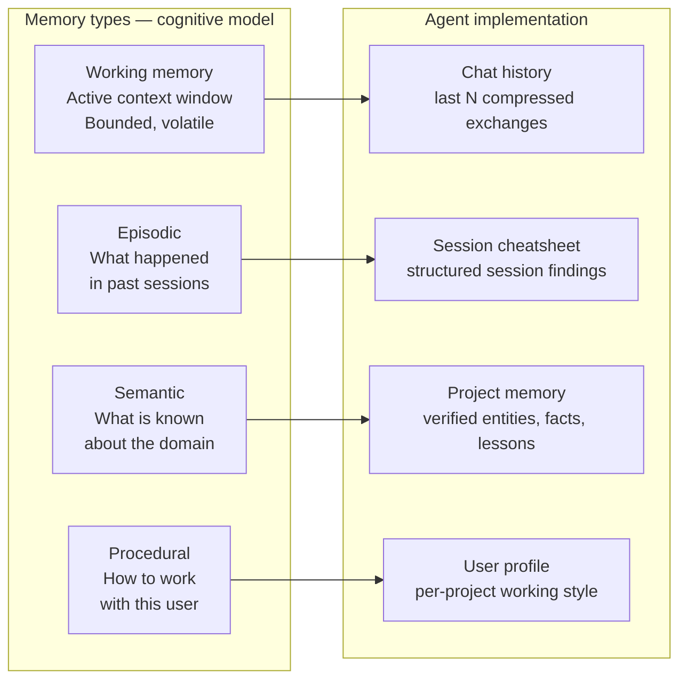
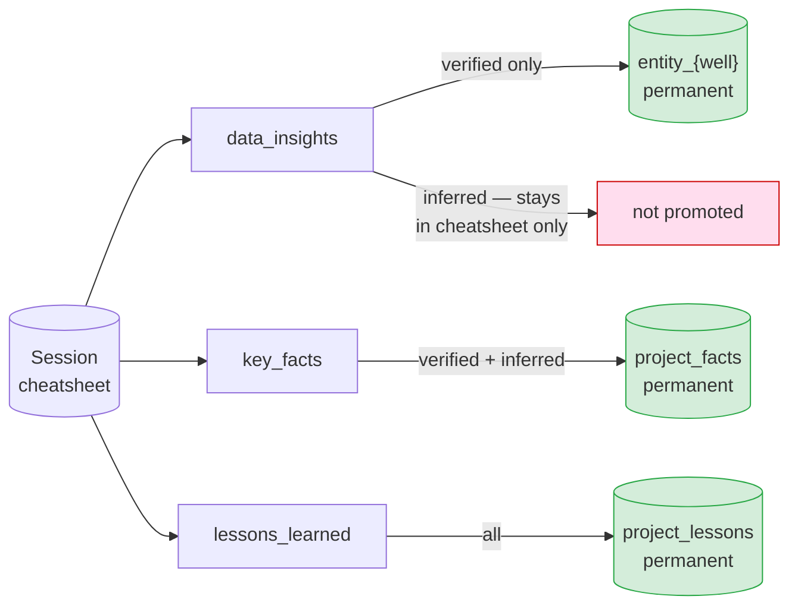
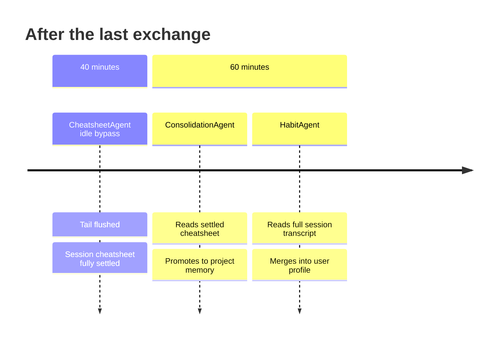

# Designing Memory for a Domain-Expert AI Agent

*How we built persistent memory for IDA — a digital drilling engineer — and why general-purpose approaches weren't enough.*

---

## What Is Memory?

In human cognition, memory is what separates a person who has to be told everything every time from a person who has learned. A junior engineer needs the context explained. A senior engineer already knows which wells in the field have problematic TVD data, how this operator labels their formations, and what has been tried before.

For AI agents, the parallel is exact. A **stateless agent** answers each request from scratch using only what is in the prompt. A **memory-equipped agent** enters each conversation already knowing what was established before — and builds on it.

But memory is not simply "store everything and retrieve by similarity." The wrong memory is worse than no memory. An agent that confidently cites an unverified estimate as established fact, or surfaces preferences from a different project as if they apply here, is more dangerous than one that admits it doesn't know.

The design question is not *whether* to add memory. It is *what to remember, at what confidence, for how long, and in what scope*.

---

## Classifying Memory for Agents

Before choosing a technical approach, we need a vocabulary. Memory in cognitive science is typically divided into four types. We find this classification directly useful for agent design.



| Cognitive type | What it holds | Agent implementation | Lifetime |
|---|---|---|---|
| **Working** | Active context — what we are reasoning about right now | Chat history window | Within session |
| **Episodic** | What happened — specific past events and their outcomes | Session cheatsheet | Per conversation |
| **Semantic** | What is known — distilled facts about the world | Project memory | Persistent, per project |
| **Procedural** | How to act — learned patterns of effective behaviour | User profile | Persistent, per user + project |

This classification drives our architecture directly. Each type has different **latency requirements** (working memory must be instant; semantic memory can be async), different **confidence requirements** (semantic facts must be verified; procedural patterns can be inferred from behaviour), and different **scope requirements** (procedural preferences are project-contextual, not global).

### The additional axis: trust

Beyond lifetime and scope, memory entries differ in epistemic status. Not all things an agent observes are equally trustworthy:

- **Verified** — a value that appeared verbatim in a tool result. The database said so.
- **Inferred** — a conclusion the agent reached by reasoning. Probably right.
- **Conflicted** — the same metric appears with two different values. Neither is safe to assert.

General-purpose memory systems ignore this axis entirely. For a domain-expert agent working with real engineering data, it is the most important axis of all.

---

## Design Principles

From the classification above, we derived seven principles that constrain how IDA's memory is built.

### Principle 1 — Capture is async. Always.

Working memory is in-request. Everything else is not. Episodic, semantic, and procedural memory are all built in the background by independent agents that subscribe to the conversation stream. They never block a user request.

This is not a performance optimisation. It is a correctness boundary. A memory write that could slow down or fail a user response would make the system less reliable, not more useful.

### Principle 2 — Trust is a gate, not a label.

Confidence is not cosmetic metadata to display in the UI. It is the filter that controls what persists.

Verified findings can enter permanent project memory. Inferred findings can persist as context and lessons, but not as numeric facts. Conflicted findings are preserved in full — both values, with their source records — and never promoted until the conflict is resolved.

The trust axis is enforced structurally, not by convention.

### Principle 3 — Live context must be protected.

An agent's reasoning about a topic evolves within a session. The answer at turn 3 may be revised by turn 9. Curating turn 3 before the conversation settles bakes in a premature conclusion.

A well-designed memory system must distinguish between **in-flight reasoning** and **settled findings**. The former should not be committed. The latter should be.

### Principle 4 — Upstream stages must settle before downstream stages read.

Memory is a pipeline. If stage N reads from stage N-1, and stage N-1 is still writing, stage N will see a partial view. This produces silent errors — not crashes, but subtly wrong memory that looks correct.

Settlement must be explicit. Downstream stages wait for upstream stages to reach a stable state before running. This should be encoded as threshold design, not left to timing luck.

### Principle 5 — Domain entities are first-class keys.

In a domain-expert agent, the real-world objects the agent reasons about — wells, formations, BHA configurations — are the natural primary keys for semantic memory. Flat text retrieval treats all findings as interchangeable. Entity-keyed memory treats findings about NNM-101 as structurally separate from findings about NNM-102, enabling precise retrieval and structured deduplication.

### Principle 6 — User preferences are scoped to context, not to identity.

A person's preferred working style is not fixed across all contexts. How an engineer wants to interact with IDA on a routine shallow well is not the same as on a complex HP/HT operation. Preferences learned in one project context should not bleed into another.

Procedural memory must be scoped to the unit where the preferences apply.

### Principle 7 — Memory is infrastructure, not agent state.

Agents that own their own memory create coupling. Adding a new agent means building new memory logic. Memory schemas diverge. Retrieval becomes inconsistent.

Memory should be a shared service with a stable API. Every agent writes to and reads from the same store. The store does not know or care which agent is calling. Agents are memory clients, not memory owners.

---

## Techniques We Built

Each principle maps to a concrete technical pattern in IDA's implementation.

### Technique 1 — Three-plane architecture

*Principle: capture is async; memory is infrastructure.*

We separated the system into three completely decoupled planes:


**Capture** writes asynchronously and never touches the request path. **Store** is the only shared boundary. **Retrieve** reads from the store and assembles context per request — it never calls Capture directly. No plane knows about the internal workings of the others.

### Technique 2 — Confidence-gated promotion pipeline

*Principle: trust is a gate.*

Every finding extracted from a session carries a confidence label (`verified`, `inferred`, `conflicted`). Promotion to permanent project memory is gated:



Numeric claims that were not directly confirmed by a tool result never leave the session boundary. Key facts and operational lessons — which are valuable even as inferences — can cross the boundary because they are context, not calculations. `conflicted` entries are preserved in full with both source records, and surface both values when queried.

This is the mechanism that keeps IDA from confidently asserting unverified numbers in permanent memory.

### Technique 3 — Sliding tail window

*Principle: live context must be protected.*

CheatsheetAgent does not curate every exchange immediately. It maintains a **tail window** of the last N exchanges that are protected from curation while the conversation is active. An exchange becomes eligible only when it scrolls past the tail boundary — meaning at least N newer exchanges have arrived, confirming the agent has moved on.

```
exchanges:   1   2   3   4   5   6   7   8   9  10  11  12
                                     ├─── tail window ────┤
curate now:  1   2   3   4   5   6
defer:                               7   8   9  10  11  12
```

Three phases govern the behaviour:

| Phase | Condition | Action |
|---|---|---|
| Young chat | Total exchanges <= tail_n | Curate each exchange immediately — tail has no effect yet |
| Accumulating | Unprocessed <= tail_n, total > tail_n | Defer — wait for the tail to fill |
| Sliding window | Unprocessed > tail_n | Oldest has scrolled out — curate immediately |
| Idle bypass | Last exchange > 40 min ago | Flush all tail records regardless of phase |

The tail window size is configurable (`tail_window_size`, default 6; production drilling sessions use 12).

### Technique 4 — Staggered idle cascade

*Principle: upstream stages must settle before downstream stages read.*

Capture agents run on deliberately staggered thresholds:



The 20-minute gap between cheatsheet settlement and consolidation is not an accident. ConsolidationAgent must read the cheatsheet *after* CheatsheetAgent has finished writing it. This is expressed as explicit threshold design, not runtime synchronisation.

For long active sessions without a 60-minute idle gap, ConsolidationAgent also fires when the cheatsheet cursor has run more than 3 hours ahead of the consolidation cursor — preventing memory from going stale mid-session.

### Technique 5 — Entity-keyed semantic memory

*Principle: domain entities are first-class keys.*

Project memory is not a flat bag of text chunks. It is structured around the entities IDA reasons about:

```
agent_memory
  entity_nnm101  →  ["TD 2630 m MD", "NPT 54 h in 8.5in section", "ROP avg 18 m/hr"]
  entity_nnm102  →  ["max TVD 2562 m", "MD at TD 3845 m", "deviated well — use MD as primary"]
  project_facts  →  ["WellView export NNM-103 truncated at 3200 m", ...]
  project_lessons → ["Recompute ROP from delta-MD/time when DDR avg_rop shows repeated values", ...]
```

Entity key normalisation (`NNM-101`, `NNM_101`, `NNM 101` → `nnm101`) ensures that organic variation in how users refer to the same well does not create fragmented memory.

When new findings arrive, they are not appended blindly. They are merged into the existing slot via an LLM synthesis step: duplicates are collapsed, the most specific version of each fact is kept, numerical conflicts are flagged with both values, and subsumed entries are dropped.

### Technique 6 — Per-project user profiles

*Principle: user preferences are scoped to context.*

User profiles are stored with a composite key of `(user_id, project_id)`. Preferences learned on a routine gas well do not transfer to a complex HP/HT project. IDA builds separate profiles per project.

HabitAgent observes five dimensions — query style, interaction style, output preferences, domain focus, expertise signals — and updates each dimension by evidence accumulation, not replacement:

| New observation | Update |
|---|---|
| Consistent with existing | Unchanged |
| Repeated across sessions | Marked "(confirmed)" |
| Contradicts existing | Softened ("sometimes prefers…") |
| Not previously seen | Appended as new observation |

The profile is always injected in full at session start — not retrieved by search. It is small by design (free-form text, five dimensions, one line each) and its value is in being always present, not in being searched.

### Technique 7 — Hybrid retrieval (FTS + vector)

*Principle: memory is infrastructure.*

Project memory entries are retrieved via PostgreSQL full-text search (`plainto_tsquery`, ranked by `ts_rank`) against the `content_text` field — a plain-text rendering of the structured `object` payload. This gives fast, auditable, keyword-aware retrieval without the overhead of vector similarity for short structured entries.

For deeper conversational recall ("did we see this before?"), a separate RAG index backed by pgvector provides hybrid semantic + keyword search across all indexed chat records — cross-chat, within project.

The two retrieval mechanisms serve different use cases and are exposed as separate tools:

| Tool | Index | Use case |
|---|---|---|
| `tool_recall_project_memory` | FTS on `agent_memory.content_text` | Known distilled facts, always injected at session start |
| `tool_search_chat_history` | pgvector + keyword on `rag_embeddings` | Ad-hoc recall — "did we discuss this before?" |

---

## Comparison With Common Approaches

| Approach | Strength | Limitation vs. IDA's design |
|---|---|---|
| **Flat file memory** (e.g. Hermes) | Predictable, prefix-cache friendly, agent-curated | No confidence tiers, flat namespace, no entity keys |
| **Vector-only RAG** | Scales well, fuzzy recall | No trust boundary, no structured entities, expensive at injection time |
| **Graph memory** (e.g. Mem0) | Rich relational structure | Complex to maintain, harder to audit, schema drift over sessions |
| **Per-session summarisation** | Simple and bounded | Loses cross-session continuity, no entity consolidation |
| **IDA's pipeline** | Confidence-gated, entity-keyed, staggered, domain-structured | More components to operate; 40–60 min settling latency before full persistence |

The trade-off IDA makes is explicit: operational complexity in exchange for **epistemic correctness** — which matters more for a domain expert agent where a wrong fact is worse than no fact.

---

## What We Would Do Differently

**Shorter settling time.** 40 minutes for cheatsheet settlement was conservative. A smarter idle detector — one that triggers on session pause patterns rather than fixed elapsed time — would let the cheatsheet settle in minutes for short sessions and still protect long ones.

**Exchange pairing by `trace_id`.** CheatsheetAgent currently pairs an agent response with "the most recent USER message before this record ID." The right fix is to pair by `trace_id`, the ID that already links REQUEST and RESPONSE in our schema. This eliminates mis-pairing in rapid multi-well sessions.

**Evidence accumulation for inferred findings.** Today, `inferred` numeric claims never reach project memory. A future improvement would let them graduate to `verified` when the same value is independently confirmed in a later session — accumulating evidence across turns rather than requiring single-session confirmation.

**Memory expiry.** A verified well TD from six months ago on an outdated dataset should decay in confidence. Project memory currently has no TTL and no confidence decay. Adding time-weighted confidence would make the system more honest about the freshness of what it knows.

---

## Closing Thought

The right mental model for agent memory is not a database. It is a **colleague who pays attention**.

A good colleague remembers confirmed facts, keeps uncertain conclusions provisional, surfaces conflicts rather than resolving them silently, does not carry assumptions from one project into another, and adjusts how they communicate based on how you work. They do all of this without being asked, without slowing you down, and without claiming to know more than they do.

That is the standard we designed to. The classification, the principles, and the techniques are all in service of that standard.

---

*IDA is an AI digital drilling engineer built on a multi-agent LLM backend. The memory system described here is in active use across real well datasets.*
