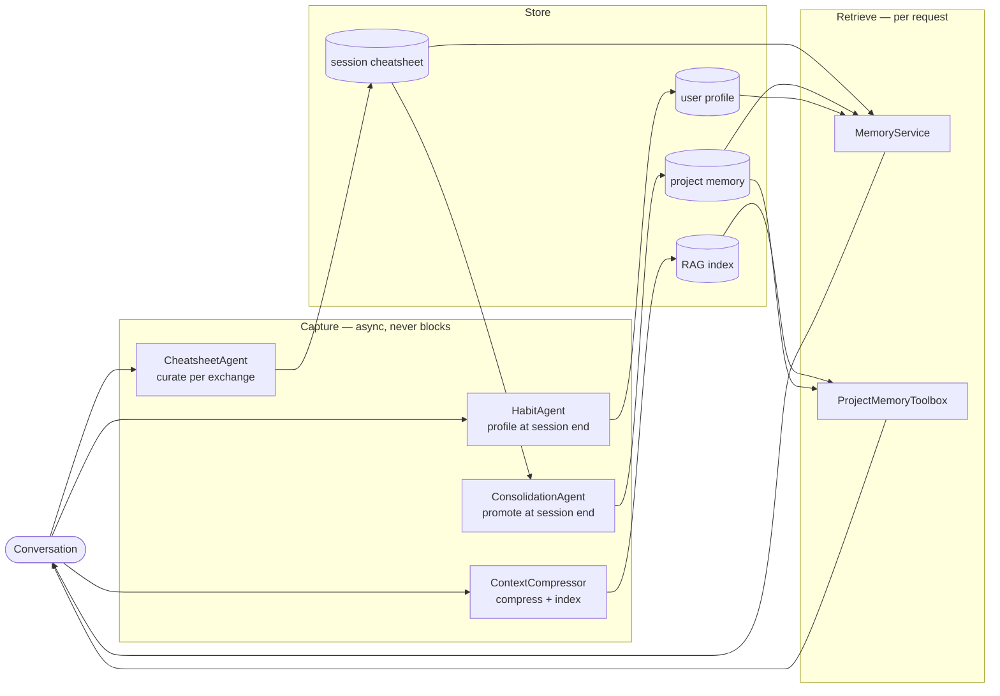

# Designing Memory for a Domain-Expert AI Agent

*How we built persistent memory for IDA — a digital drilling engineer — and why general-purpose approaches weren't enough.*

---

## The Problem With "Just Add a Vector Store"

When teams start adding memory to LLM agents, the default move is to reach for a vector database. Embed the conversation, store it, retrieve the top-K chunks at query time. Fast, easy, good enough for demos.

It falls apart in production for domain-expert agents.

A drilling engineer doesn't need a fuzzy semantic recall of what happened last Tuesday. She needs to know, with certainty, that the TD of NNM-101 is 2,630 m MD — not a probable guess, not a paraphrase, the actual confirmed number. She needs to know that the WellView export for NNM-103 is truncated at 3,200 m before she tries to analyse it, not discover it mid-answer. She needs to remember that this particular user prefers one-well-at-a-time answers with data quality flags surfaced up front.

This is the difference between **episodic retrieval** ("I seem to recall something about NNM-101") and **working knowledge** ("I know the following confirmed facts about this well"). For a domain expert, working knowledge is the product. Episodic retrieval is a fallback.

We built IDA's memory system around that distinction. This document explains the design principles and the patterns we landed on.

---

## Design Principles

### 1. Capture is async. Always.

Memory writes must never be in the critical path of a user request. A drilling engineer asking "what's the ROP on NNM-102?" should not wait for an LLM to update a memory store before getting an answer.

In IDA, all four capture agents — ContextCompressor, CheatsheetAgent, ConsolidationAgent, HabitAgent — run as independent background services. They subscribe to a message bus or poll on a schedule. The request path touches none of them. From the user's perspective, memory "just gets better" between sessions.

> **Pattern: Event-driven capture with async fallback poll.** Subscribe to `record_saved` for low-latency capture; poll on a 120-second fallback to recover events missed across restarts. Both paths are idempotent.

### 2. Not all findings deserve the same permanence.

The biggest mistake we see in agent memory systems is treating all observations as equal. Store everything, retrieve by relevance, trust the LLM to sort it out. This produces confident hallucination: the agent "remembers" something that was a guess and presents it as established fact.

We built a **confidence-gated promotion pipeline**. Every finding in IDA's session cheatsheet carries one of three labels:

- `verified` — the value appears verbatim in a tool result block. IDA pulled it from the database. It's a fact.
- `inferred` — IDA reasoned to this conclusion from context. Probably right. Not guaranteed.
- `conflicted` — two different values for the same metric appeared in the data. Neither is dropped. Neither is promoted until resolved.

Promotion to permanent project memory is gated by confidence:

```
data_insights:   verified only → entity_{well} slots
key_facts:       verified + inferred → project_facts (context, not calculations)
lessons_learned: all → project_lessons (operational patterns, not numbers)
```

Numeric claims that were not directly confirmed by tool data never leave the session cheatsheet. They are available within the session but do not pollute permanent memory with unverified numbers.

> **Pattern: Confidence-gated promotion.** The persistence boundary is a trust boundary. Only findings that pass the confidence filter cross it.

### 3. Respect the tail. The agent is still thinking.

A naive cheatsheet system curates every exchange immediately. This creates a subtle problem: the agent's understanding of a topic evolves over a conversation. The answer to turn 3 might be revised by turn 7 when more data is pulled. If you curate turn 3 before the conversation settles, you bake in an outdated finding.

We protect the last N exchanges as a **tail window** — a live working context where the agent can still revise conclusions before anything is committed to the cheatsheet. Only when an exchange scrolls past the tail boundary does it become eligible for curation.

```
exchanges:  1  2  3  4  5  6  7  8  9  10  11  12
                                ↑─── tail window (6) ───↑
curate now:  1  2  3  4  5  6
defer:                         7  8  9  10  11  12
```

For long sessions or when the user stops, an idle bypass flushes the tail so the cheatsheet fully settles before consolidation reads it.

> **Pattern: Sliding tail window.** Commit findings only after the active reasoning window has moved on. Protect in-flight context from premature extraction.

### 4. Stagger your settlement thresholds.

Memory stages depend on each other. Consolidation reads the cheatsheet. If consolidation runs while the cheatsheet is still mid-curation, it will promote a partial view of the session.

We use deliberately staggered idle thresholds:

```
t =  0 min   User stops sending messages
t = 40 min   CheatsheetAgent idle bypass — tail flushed, session cheatsheet settled
t = 60 min   ConsolidationAgent fires — reads a fully settled cheatsheet
t = 60 min   HabitAgent fires — reads the full session transcript
```

The 20-minute gap between cheatsheet settlement and consolidation is a **mandatory settling window**. It is not a polling artifact — it is intentional design.

> **Pattern: Staggered cascade.** Upstream stages must settle before downstream stages read them. Express this as explicit idle thresholds, not as a single pipeline trigger.

### 5. Domain entities are first-class keys.

General-purpose memory systems store flat text or embeddings. For a domain agent, the entities *are* the schema.

In IDA, project memory is keyed by drilling entity: `entity_nnm101`, `entity_nnm102`. Each slot holds all verified numeric findings for that well — TD, TVD, ROP, NPT, BHA configuration — merged and deduplicated across sessions. When IDA answers a question about NNM-101, she retrieves one slot, not a bag of loosely ranked chunks.

Entity key normalization (`NNM-101`, `NNM_101`, `NNM 101` → `nnm101`) ensures that organic variation in how users refer to the same well doesn't create fragmented memory.

> **Pattern: Entity-keyed memory slots.** For domain agents, the real-world entities in your domain are the natural primary keys. Design your memory schema around them, not around free-form text retrieval.

### 6. User preferences are project-contextual, not global.

Most agent memory systems store user preferences globally. One profile per user.

This is wrong for expert users working across different contexts. A drilling engineer's preferred communication style when doing a quick ROP check on a routine well is not the same as when she is debugging a complex NPT event on a high-risk well. The context shapes the preference.

IDA's user profile is scoped to `(user_id, project_id)`. Preferences learned on a shallow gas campaign do not transfer to a deep HP/HT project. IDA starts fresh per project — but within a project, she accumulates a refined understanding of how this user works in this context.

> **Pattern: Project-scoped user preferences.** User style is context-dependent. Scope profiles to the relevant domain unit, not globally to the user account.

### 7. Memory is a plugin service, not agent state.

Early in the design we faced a choice: should each agent own its memory, or should memory be a shared infrastructure layer?

We chose infrastructure. Every agent calls the same `MemoryStore` API, the same `MemoryService` loaders, the same `ProjectMemoryToolbox` tools. Adding a new agent that needs to remember something does not require changes to the memory system — it calls the existing API with its `agent_id`.

This also means capture and retrieval are fully decoupled. CheatsheetAgent writes. MemoryService reads. They never call each other. The store is the only shared boundary.

> **Pattern: Memory as infrastructure.** Agents are memory clients, not memory owners. The store is a shared service with a stable API.

---

## Architecture Summary

Three planes. Four layers. One pipeline.



**Four memory layers** — from volatile to persistent:

| Layer | What it holds | Cognitive role |
|---|---|---|
| Chat history | Last N compressed exchanges | Working memory |
| Session cheatsheet | Structured findings from this chat | Episodic |
| Project memory | Verified entities, facts, lessons | Semantic |
| User profile | Working style, per project | Procedural |

---

## Comparison With Common Approaches

| Approach | What it gets right | What it misses |
|---|---|---|
| **Flat file memory** (e.g. Hermes MEMORY.md) | Predictable, prefix-cache friendly, agent-curated | No confidence tiers, no entity keys, single flat namespace |
| **Vector-only RAG** | Scales, fuzzy recall | No trust boundary, no entity structure, expensive at injection |
| **Graph memory** (e.g. Mem0) | Rich relationships | Complex to maintain, harder to audit, schema drift |
| **Per-session summarisation** | Simple, bounded | Loses cross-session continuity, no entity consolidation |
| **IDA's pipeline** | Confidence-gated, entity-keyed, staggered cascade, async capture | More components to operate; settling latency (40–60 min) before full persistence |

No approach is universally right. IDA's design trades operational simplicity (more moving parts) for **epistemic correctness** — which matters more for a domain expert agent where wrong facts are worse than no facts.

---

## What We Would Do Differently

**Shorter settling time.** 40 minutes for cheatsheet settlement is long for fast-moving sessions. We would reduce this with a smarter idle detector — one that responds to session pause patterns rather than a fixed threshold.

**`trace_id`-based exchange pairing.** Today, CheatsheetAgent pairs an agent response with "the most recent USER message before this record ID." For rapid multi-well sessions, this can mis-pair a question with the wrong answer. The right fix is to pair by `trace_id` — the ID that already links REQUEST and RESPONSE in the database.

**Verified promotion for inferred data_insights.** Currently `inferred` numeric claims never reach project memory. A future improvement would allow them to graduate to `verified` when the same value is independently confirmed in a later session — accumulating evidence across turns rather than requiring single-turn confirmation.

**Memory expiry.** Project memory currently has no TTL. A well TD established six months ago on an old dataset should decay in confidence over time, not persist indefinitely at `0.85`.

---

## Closing Thought

The right mental model for agent memory is not a database. It is a **colleague who pays attention**.

A good colleague remembers the confirmed facts, keeps the uncertain ones provisional, notices when something conflicts with what they knew before, and does not burden every conversation with things they learned on a different project. They update their model of how you work over time, without you asking them to.

That is the standard we designed to. The architecture is the mechanism. The standard is the goal.

---

*IDA is an AI digital drilling engineer built on a multi-agent LLM backend. The memory system described here is in active use across real well datasets.*
