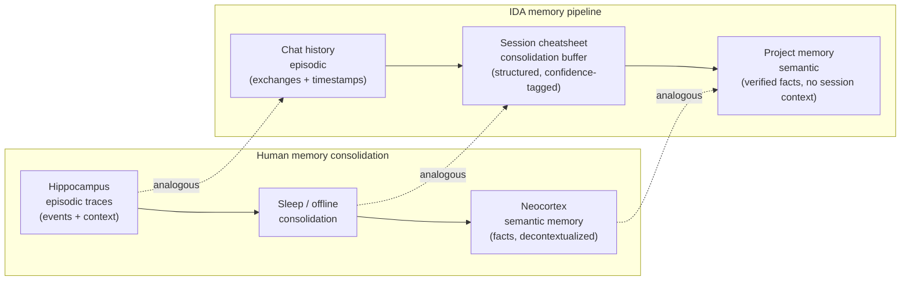
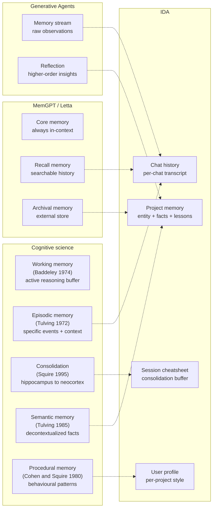
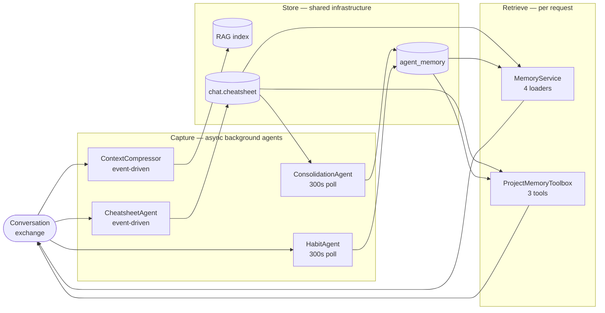
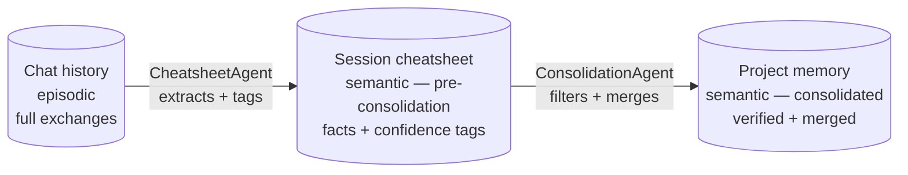
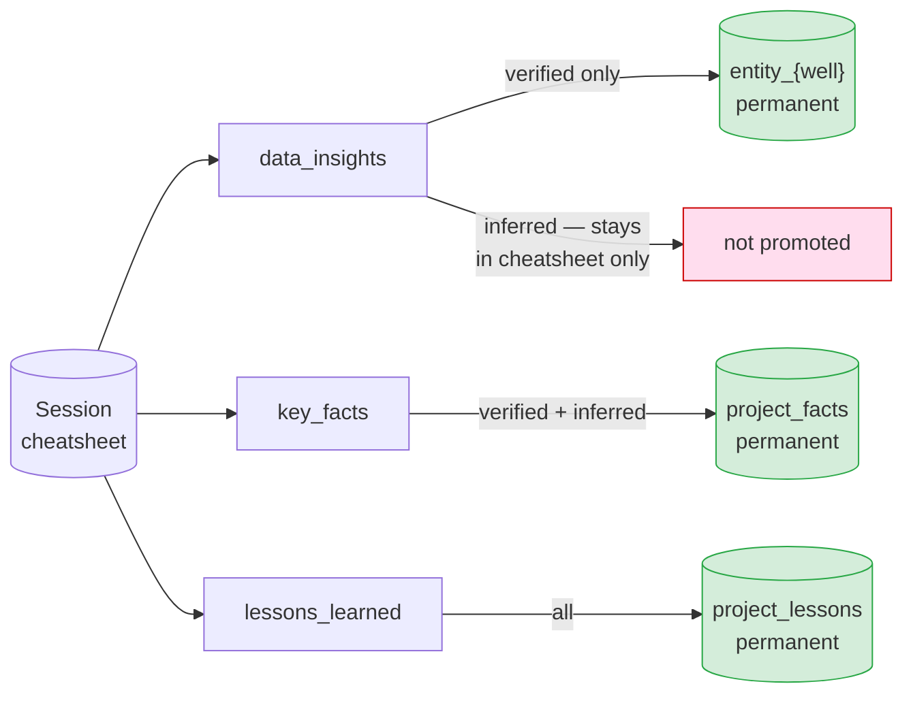
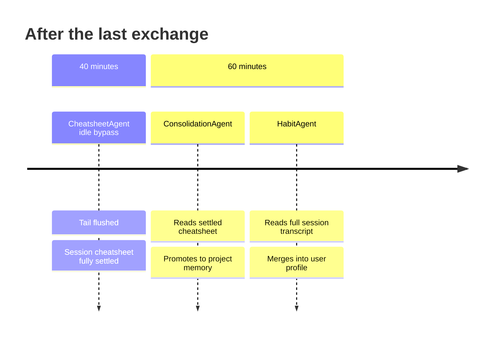

# Designing Memory for a Domain-Expert AI Agent

*How we built persistent memory for IDA — a digital drilling engineer — and why general-purpose approaches weren't enough.*

---

## What Is Memory?

In human cognition, memory is what separates a person who has to be told everything every time from a person who has learned. A junior engineer needs the context explained. A senior engineer already knows which wells in the field have problematic TVD data, how this operator labels their formations, and what has been tried before.

For AI agents, the parallel is exact. A **stateless agent** answers each request from scratch using only what is in the prompt. A **memory-equipped agent** enters each conversation already knowing what was established before — and builds on it.

But memory is not simply "store everything and retrieve by similarity." The wrong memory is worse than no memory. An agent that confidently cites an unverified estimate as established fact, or surfaces preferences from a different project as if they apply here, is more dangerous than one that admits it doesn't know.

The design question is not *whether* to add memory. It is *what to remember, at what confidence, for how long, and in what scope*.

---

## Classifying Memory for Agents

Before choosing a technical approach, we need a shared vocabulary. Several industry frameworks have converged on a useful taxonomy. We review three, then show how IDA's design maps to and extends them.

### Industry frameworks

**Cognitive science (multi-author).** The field converged on four memory types across several decades of research. Tulving (1972, 1985) introduced the *episodic* vs. *semantic* distinction within long-term memory. Cohen & Squire (1980) separated *declarative* (episodic + semantic) from *procedural* memory. Baddeley & Hitch (1974) replaced the earlier short-term memory concept with *working memory* — a bounded, active buffer with multiple components (central executive, phonological loop, visuospatial sketchpad, and an episodic buffer added by Baddeley in 2000). Together these form the standard taxonomy the field has used ever since.

**MemGPT / Letta (2023).** The first widely-cited agent memory architecture in the LLM era. Defines three stores: *core memory* (always in-context, like working memory + a persistent scratchpad), *recall memory* (searchable conversation history), and *archival memory* (unlimited external storage). Explicit context-window management with `memory_edit`, `recall_search`, and `archival_search` tools.

**Generative Agents (Park et al., 2023).** Introduces the *memory stream* — a flat log of all observations — plus *retrieval* (recency + importance + relevance scoring), *reflection* (LLM synthesises higher-order insights from the stream), and *planning* (projecting intentions forward). The reflection mechanism — extracting durable insights from raw events — is the direct ancestor of our ConsolidationAgent.

### How IDA maps to these frameworks

A careful reading of Tulving reveals something important: **chat history is episodic, not working memory**. Tulving's episodic memory is defined by its contextual grounding — specific events, temporally ordered, tied to when and where they occurred. A chat transcript is exactly that: a record of what was said, by whom, and in what sequence. Working memory (Baddeley) is the *active reasoning buffer* — the context window IDA holds during a single request, not the stored transcript.

The more interesting observation is what the **session cheatsheet** actually is. Applying Tulving's test: episodic memory lets you mentally travel back to the original event — it preserves *who said what, when, in what context*. The cheatsheet does none of this. A cheatsheet entry is `{"entity": "NNM-101", "content": "TD 2630 m MD", "confidence": "verified", "record_id": 847}` — a decontextualized fact. The `record_id` is a provenance pointer for conflict detection, not episodic context. You cannot reconstruct the conversation from a cheatsheet entry.

**The cheatsheet is semantic in content type** — it holds the same kind of decontextualized factual knowledge as project memory. The difference between them is not type but *consolidation stage*:

- **Session cheatsheet** = session-scoped semantic memory — facts abstracted from this session's exchanges, still being updated, not yet filtered and promoted
- **Project memory** = consolidated semantic memory — verified facts that have survived the promotion filter, been merged across sessions, and are stable

Both cheatsheet and project memory are semantic. The pipeline from chat history → cheatsheet → project memory is the episodic-to-semantic abstraction process itself — which McClelland et al. (1995) showed is not instantaneous but requires a gradual consolidation stage to avoid catastrophic interference with existing knowledge.

This maps precisely to how human memory consolidation works (Squire & Alvarez, 1995): the hippocampus holds episodic traces; offline consolidation (during sleep) gradually transfers verified knowledge to the neocortex as semantic memory, stripping the temporal and contextual metadata.



The staggered idle thresholds (40 min cheatsheet settlement, 60 min consolidation) are not arbitrary — they are IDA's "sleep window." CheatsheetAgent is the hippocampus, holding and refining the episodic session record. ConsolidationAgent is the offline consolidation process, transferring verified findings into semantic memory while discarding unverified ones.



| IDA memory store | Cognitive science | MemGPT / Letta | Generative Agents | Lifetime | Scope |
|---|---|---|---|---|---|
| **Chat history** | Episodic (Tulving) | Recall memory | Memory stream | Per conversation | Per chat |
| **Session cheatsheet** | Semantic — pre-consolidation (Squire) | — | Reflection (partial) | Per conversation | Per chat |
| **Project memory** | Semantic — consolidated (Tulving) | Archival memory | Reflection output | Persistent | Per project |
| **User profile** | Procedural (Cohen & Squire) | Core memory (persona) | — | Persistent | Per user + project |

### Where IDA extends the frameworks

The three industry frameworks are designed for general-purpose agents. IDA adds three dimensions they do not address:

**1. The consolidation buffer as a first-class component.** MemGPT has no equivalent of the session cheatsheet. Generative Agents' *reflection* is the closest analogue, but it is a single LLM call, not a staged pipeline with confidence filtering and a settlement window. IDA makes consolidation explicit: CheatsheetAgent accumulates the episodic buffer; ConsolidationAgent promotes verified findings to semantic memory after a deliberate settling period. The two-stage pipeline mirrors human memory consolidation more faithfully than any existing agent framework.

**2. The trust axis.** No existing framework has a first-class concept of epistemic confidence per memory entry. All treat memory entries as equally trustworthy. IDA introduces three confidence tiers:

| Tier | Meaning | Promoted to semantic memory? |
|---|---|---|
| `verified` | Value appears verbatim in a tool result | Yes — all slots |
| `inferred` | Agent's reasoned conclusion from context | Context and lessons only — not numeric facts |
| `conflicted` | Same metric, two different values in data | Both preserved; neither promoted |

This is the mechanism that prevents unverified numbers from entering permanent memory. For a domain-expert agent, wrong facts are worse than no facts.

**3. Entity-keyed semantic memory.** General frameworks store semantic memory as flat text or embeddings. IDA's semantic memory is structured around domain entities: `entity_nnm101`, `entity_nnm102`. Each entity is a named slot that accumulates verified findings across sessions and merges them via LLM synthesis. Retrieval is precise and structured, not probabilistically ranked.

**4. Project-scoped procedural memory.** Hermes and MemGPT store user preferences globally. IDA scopes procedural memory to `(user_id, project_id)` — because how an engineer works on a routine shallow well is not the same as on a complex HP/HT project.

### The full classification

Each IDA memory component is described by three axes: cognitive type, scope, and trust level.

| Memory store | Cognitive type | Consolidation stage | Scope | Trust filter |
|---|---|---|---|---|
| Chat history | Episodic | Raw | Per chat | None — full transcript |
| Session cheatsheet | Semantic | Pre-consolidation | Per chat | All tiers captured |
| Project memory | Semantic | Consolidated | Per project | Verified + selective inferred |
| User profile | Procedural | Consolidated | Per user + project | Inferred from behaviour |

Two orthogonal axes — **cognitive type** and **consolidation stage** — describe what each store holds and how far it has been distilled. The **trust filter** determines what survives promotion between stages. Without it, the episodic-to-semantic pipeline would carry unverified claims into permanent memory — which is the failure mode of every general-purpose memory system we reviewed.

---

## Design Principles

These principles are not aspirational statements — each one is a decision IDA's architecture had to make explicitly, with a concrete consequence if it had gone the other way.

### Principle 1 — Separate capture, store, and retrieve into three independent planes

IDA's first architectural decision was to treat memory as three fully decoupled concerns. **Capture** agents write asynchronously in the background — they subscribe to the conversation stream and never touch the request path. **Store** is shared infrastructure with a stable API that every agent calls equally. **Retrieve** assembles context per request and never writes.

Without this separation, the alternatives are: agents that own their memory (schema fragmentation, coupling), or writes in the request path (latency, reliability failure). The three-plane model makes memory a platform, not a feature of individual agents.

### Principle 2 — Treat episodic and semantic memory as structurally distinct stores

This follows directly from Tulving. Episodic memory (chat history) is contextually grounded — who said what, in what sequence. Semantic memory (project memory) is decontextualized — facts about the world, independent of when or how they were learned. Conflating them into a single retrieval index loses the structural distinction.

IDA stores them separately: `chat_record` for episodic, `agent_memory` for semantic. Queries against each use different retrieval mechanisms (full-text + vector for episodic search; FTS on distilled entities for semantic recall). The cheatsheet sits between them as the consolidation stage — session-scoped semantic, not yet promoted.

### Principle 3 — Confidence is a structural gate, not a label

The single most consequential design decision. Confidence (`verified`, `inferred`, `conflicted`) is not metadata displayed in the UI — it is the filter that controls what crosses the boundary from session-scoped to persistent semantic memory.

Every `inferred` numeric claim — something IDA reasoned to rather than read from a tool result — stays in the session cheatsheet and never enters project memory. Every `conflicted` entry is preserved in full with both source records and neither value is asserted. Only `verified` data insights — values that appeared verbatim in a tool result — are promoted.

This is enforced in ConsolidationAgent's code, not by convention. For a domain-expert agent, a wrong fact in permanent memory is worse than no fact — it generates confident errors on every future query.

### Principle 4 — Do not curate what the agent is still reasoning about

IDA's reasoning about a topic evolves within a session. The answer at turn 3 may be revised by turn 9 as more data is pulled. Committing turn 3 to the cheatsheet before the session settles bakes in a premature conclusion.

CheatsheetAgent maintains a sliding tail window of the last N exchanges. Exchanges are not eligible for curation until they have scrolled past the tail boundary — meaning N newer exchanges have arrived and the agent's working context has moved on. The tail window is the mechanism for distinguishing in-flight reasoning from settled findings.

### Principle 5 — Upstream stages must settle before downstream stages read

Memory in IDA is a pipeline: episodic → session-scoped semantic → consolidated semantic. Each stage reads from the previous one. If ConsolidationAgent reads the cheatsheet while CheatsheetAgent is still curating, it promotes a partial view of the session into permanent memory — a silent error, not a crash.

IDA encodes settlement as explicit idle thresholds: CheatsheetAgent flushes its tail at 40 minutes of inactivity; ConsolidationAgent runs at 60 minutes. The 20-minute gap is the deliberate settling window. These thresholds are not polling intervals — they are the designed sequencing mechanism.

### Principle 6 — Domain entities are the primary key of semantic memory

General-purpose memory systems store semantic knowledge as flat text or embedding vectors — a bag of facts retrieved by similarity. For a domain-expert agent, the real-world entities being reasoned about are the natural organizing unit.

IDA's semantic memory is keyed by drilling entity: `entity_nnm101`, `entity_nnm102`. Each entity has a named slot that accumulates verified findings across sessions and merges them via LLM synthesis — deduplicating, resolving conflicts, and dropping subsumed entries. This produces retrieval that is precise and structured, not probabilistically ranked across an undifferentiated corpus.

### Principle 7 — Procedural memory is scoped to where the preferences apply

Most agent systems store user preferences globally: one profile per user account. This assumes preferences are stable across contexts. For a drilling engineer, they are not — working style on a routine well differs from a complex operation; terminology expectations differ between projects.

IDA scopes the user profile to `(user_id, project_id)`. Preferences learned on one project do not transfer to another. HabitAgent builds a separate profile per project context, using evidence accumulation (not replacement) to update each dimension as sessions accumulate.

---

## Techniques We Built

Each principle maps directly to a technical pattern. The table below shows the correspondence before diving into each technique.

| Principle | Technique |
|---|---|
| Separate capture, store, retrieve | Three-plane architecture |
| Episodic and semantic are distinct | Two-stage semantic pipeline (cheatsheet → project memory) |
| Confidence is a structural gate | Confidence-gated promotion |
| Protect in-flight reasoning | Sliding tail window |
| Upstream stages settle first | Staggered idle cascade |
| Entities are the primary key | Entity-keyed semantic memory with LLM synthesis |
| Procedural memory is context-scoped | Per-project user profiles |
| Distinct types need distinct retrieval | Hybrid FTS + vector retrieval |

### Technique 1 — Three-plane architecture

*Principle: separate capture, store, and retrieve.*

We separated the system into three completely decoupled planes:



**Capture** writes asynchronously and never touches the request path. **Store** is the only shared boundary. **Retrieve** reads from the store and assembles context per request — it never calls Capture directly. No plane knows about the internal workings of the others.

### Technique 2 — Two-stage semantic pipeline

*Principle: episodic and semantic are structurally distinct.*

Chat history (episodic) feeds the session cheatsheet (session-scoped semantic), which feeds project memory (consolidated semantic). The episodic-to-semantic transformation happens at the cheatsheet stage — CheatsheetAgent strips conversational context and extracts decontextualized facts. The semantic-to-consolidated promotion happens at the consolidation stage — ConsolidationAgent filters by confidence and merges into stable cross-session slots.



These are three different stores with different schemas and different access patterns. Treating them as one retrieval problem (e.g. a flat RAG over all memory) would erase the structural distinctions that make each layer trustworthy.

### Technique 3 — Confidence-gated promotion

*Principle: confidence is a structural gate.*

Every finding extracted from a session carries a confidence label (`verified`, `inferred`, `conflicted`). Promotion to permanent project memory is gated:



Numeric claims that were not directly confirmed by a tool result never leave the session boundary. Key facts and operational lessons — which are valuable even as inferences — can cross the boundary because they are context, not calculations. `conflicted` entries are preserved in full with both source records, and surface both values when queried.

This is the mechanism that keeps IDA from confidently asserting unverified numbers in permanent memory.

### Technique 4 — Sliding tail window

*Principle: do not curate what the agent is still reasoning about.*

CheatsheetAgent does not curate every exchange immediately. It maintains a **tail window** of the last N exchanges that are protected from curation while the conversation is active. An exchange becomes eligible only when it scrolls past the tail boundary — meaning at least N newer exchanges have arrived, confirming the agent has moved on.

```
exchanges:   1   2   3   4   5   6   7   8   9  10  11  12
                                     ├─── tail window ────┤
curate now:  1   2   3   4   5   6
defer:                               7   8   9  10  11  12
```

Three phases govern the behaviour:

| Phase | Condition | Action |
|---|---|---|
| Young chat | Total exchanges <= tail_n | Curate each exchange immediately — tail has no effect yet |
| Accumulating | Unprocessed <= tail_n, total > tail_n | Defer — wait for the tail to fill |
| Sliding window | Unprocessed > tail_n | Oldest has scrolled out — curate immediately |
| Idle bypass | Last exchange > 40 min ago | Flush all tail records regardless of phase |

The tail window size is configurable (`tail_window_size`, default 6; production drilling sessions use 12).

### Technique 5 — Staggered idle cascade

*Principle: upstream stages must settle before downstream stages read.*

Capture agents run on deliberately staggered thresholds:



The 20-minute gap between cheatsheet settlement and consolidation is not an accident. ConsolidationAgent must read the cheatsheet *after* CheatsheetAgent has finished writing it. This is expressed as explicit threshold design, not runtime synchronisation.

For long active sessions without a 60-minute idle gap, ConsolidationAgent also fires when the cheatsheet cursor has run more than 3 hours ahead of the consolidation cursor — preventing memory from going stale mid-session.

### Technique 6 — Entity-keyed semantic memory with LLM synthesis

*Principle: domain entities are the primary key of semantic memory.*

Project memory is not a flat bag of text chunks. It is structured around the entities IDA reasons about:

```
agent_memory
  entity_nnm101  →  ["TD 2630 m MD", "NPT 54 h in 8.5in section", "ROP avg 18 m/hr"]
  entity_nnm102  →  ["max TVD 2562 m", "MD at TD 3845 m", "deviated well — use MD as primary"]
  project_facts  →  ["WellView export NNM-103 truncated at 3200 m", ...]
  project_lessons → ["Recompute ROP from delta-MD/time when DDR avg_rop shows repeated values", ...]
```

Entity key normalisation (`NNM-101`, `NNM_101`, `NNM 101` → `nnm101`) ensures that organic variation in how users refer to the same well does not create fragmented memory.

When new findings arrive, they are not appended blindly. They are merged into the existing slot via an LLM synthesis step: duplicates are collapsed, the most specific version of each fact is kept, numerical conflicts are flagged with both values, and subsumed entries are dropped.

### Technique 7 — Per-project user profiles

*Principle: procedural memory is scoped to where the preferences apply.*

User profiles are stored with a composite key of `(user_id, project_id)`. Preferences learned on a routine gas well do not transfer to a complex HP/HT project. IDA builds separate profiles per project.

HabitAgent observes five dimensions — query style, interaction style, output preferences, domain focus, expertise signals — and updates each dimension by evidence accumulation, not replacement:

| New observation | Update |
|---|---|
| Consistent with existing | Unchanged |
| Repeated across sessions | Marked "(confirmed)" |
| Contradicts existing | Softened ("sometimes prefers…") |
| Not previously seen | Appended as new observation |

The profile is always injected in full at session start — not retrieved by search. It is small by design (free-form text, five dimensions, one line each) and its value is in being always present, not in being searched.

### Technique 8 — Hybrid retrieval (FTS + vector)

*Principle: episodic and semantic are distinct — so are their retrieval mechanisms.*

Project memory entries are retrieved via PostgreSQL full-text search (`plainto_tsquery`, ranked by `ts_rank`) against the `content_text` field — a plain-text rendering of the structured `object` payload. This gives fast, auditable, keyword-aware retrieval without the overhead of vector similarity for short structured entries.

For deeper conversational recall ("did we see this before?"), a separate RAG index backed by pgvector provides hybrid semantic + keyword search across all indexed chat records — cross-chat, within project.

The two retrieval mechanisms serve different use cases and are exposed as separate tools:

| Tool | Index | Use case |
|---|---|---|
| `tool_recall_project_memory` | FTS on `agent_memory.content_text` | Known distilled facts, always injected at session start |
| `tool_search_chat_history` | pgvector + keyword on `rag_embeddings` | Ad-hoc recall — "did we discuss this before?" |

---

## Comparison With Common Approaches

| Approach | Strength | Limitation vs. IDA's design |
|---|---|---|
| **Flat file memory** (e.g. Hermes) | Predictable, prefix-cache friendly, agent-curated | No confidence tiers, flat namespace, no entity keys |
| **Vector-only RAG** | Scales well, fuzzy recall | No trust boundary, no structured entities, expensive at injection time |
| **Graph memory** (e.g. Mem0) | Rich relational structure | Complex to maintain, harder to audit, schema drift over sessions |
| **Per-session summarisation** | Simple and bounded | Loses cross-session continuity, no entity consolidation |
| **IDA's pipeline** | Confidence-gated, entity-keyed, staggered, domain-structured | More components to operate; 40–60 min settling latency before full persistence |

The trade-off IDA makes is explicit: operational complexity in exchange for **epistemic correctness** — which matters more for a domain expert agent where a wrong fact is worse than no fact.

---

## What We Would Do Differently

**Shorter settling time.** 40 minutes for cheatsheet settlement was conservative. A smarter idle detector — one that triggers on session pause patterns rather than fixed elapsed time — would let the cheatsheet settle in minutes for short sessions and still protect long ones.

**Exchange pairing by `trace_id`.** CheatsheetAgent currently pairs an agent response with "the most recent USER message before this record ID." The right fix is to pair by `trace_id`, the ID that already links REQUEST and RESPONSE in our schema. This eliminates mis-pairing in rapid multi-well sessions.

**Evidence accumulation for inferred findings.** Today, `inferred` numeric claims never reach project memory. A future improvement would let them graduate to `verified` when the same value is independently confirmed in a later session — accumulating evidence across turns rather than requiring single-session confirmation.

**Memory expiry.** A verified well TD from six months ago on an outdated dataset should decay in confidence. Project memory currently has no TTL and no confidence decay. Adding time-weighted confidence would make the system more honest about the freshness of what it knows.

---

## Closing Thought

The right mental model for agent memory is not a database. It is a **colleague who pays attention**.

A good colleague remembers confirmed facts, keeps uncertain conclusions provisional, surfaces conflicts rather than resolving them silently, does not carry assumptions from one project into another, and adjusts how they communicate based on how you work. They do all of this without being asked, without slowing you down, and without claiming to know more than they do.

That is the standard we designed to. The classification, the principles, and the techniques are all in service of that standard.

---

*IDA is an AI digital drilling engineer built on a multi-agent LLM backend. The memory system described here is in active use across real well datasets.*
