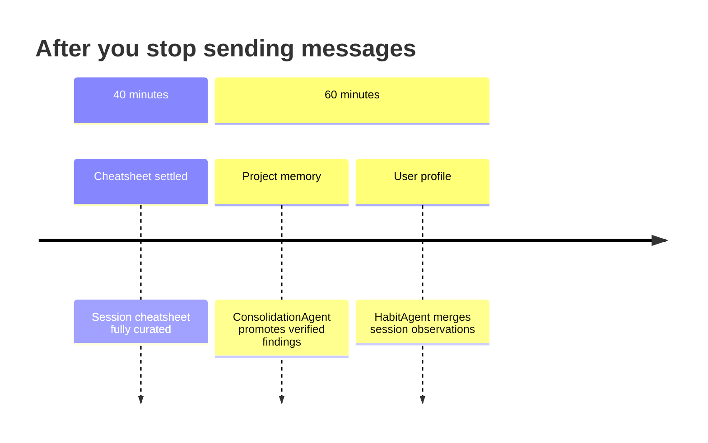

# Persistent Memory

IDA has bounded, curated memory that persists across sessions. This lets her remember well characteristics, data quality observations, operational lessons, and your working preferences — so you don't have to repeat context every time you open a new chat.

---

## How It Works

Memory is built up automatically in the background. You never need to ask IDA to "remember" something — she distils each conversation and loads relevant memory at the start of every session.

Two persistent stores survive across sessions:

| Store | Purpose | Lifetime |
|---|---|---|
| **Project memory** | Cross-session entities, facts, and lessons | Persistent, per project |
| **User profile** | Your preferred working style and communication preferences | Persistent, per user + project |

---

## Project Memory — what is known about this project

After a session ends, IDA's **ConsolidationAgent** promotes verified findings into permanent project memory. Three named slots:

| Memory slot | Type | Contents |
|---|---|---|
| `entity_{well}` | Data insight | Merged, deduplicated per-entity numeric findings for each well/BHA/formation |
| `project_facts` | Key facts | Non-quantitative context: data gaps, naming conventions, data coverage |
| `project_lessons` | Lessons learned | Actionable operational insights from prior sessions |

> When you return to a project, IDA loads relevant project memory before answering. She knows what was established about NNM-101 last week without you having to re-explain it.

### What gets saved

IDA saves when she learns:

| What | Slot | Example |
|---|---|---|
| Numeric well findings confirmed by tool data | `entity_{well}` | `NNM-102 max TVD = 2562 m, MD = 3845 m` |
| Data quality issues, gaps, anomalies | `project_facts` | `NNM-104 TVD non-monotonic near TD — survey inconsistency suspected` |
| Operational lessons, workflow patterns | `project_lessons` | `Recompute ROP from delta-MD/delta-time when DDR avg_rop shows repeated values` |

### What does not get saved

- IDA's base drilling knowledge (NPT definition, what ROP means)
- Single-turn ephemera with no reuse value
- Numeric claims that were not directly confirmed by tool data — these stay in the session cheatsheet but are not promoted to project memory

### Confidence model

Every finding carries a confidence label. IDA uses this to decide what to promote.

| Confidence | Meaning | Promoted to project memory? |
|---|---|---|
| `verified` | Value appears verbatim in a tool result block | Yes — all three slots |
| `inferred` | Derived from IDA's reasoning or context | `project_facts` and `project_lessons` only |
| `conflicted` | Same metric has two different values in the data | Both entries kept; neither promoted until resolved |

> If you ask about a metric where IDA has a `conflicted` entry, she will surface both values and the source records, rather than picking one silently.

### How project memory is retrieved

Project memory is retrieved on-demand via full-text search (FTS) against the question being asked. Only the most relevant entries (top-K hits) are injected into the context — so token cost scales with relevance, not with how much IDA has learned.

```
PROJECT MEMORY
[DATA_INSIGHT] entity_nnm101
- TD 2630 m MD
- NPT 54 h in 8.5 in section
- ROP avg 18 m/hr

[KEY_FACTS] project_facts
- WellView export for NNM-103 truncated at 3200 m
- NNM-104 TVD reporting inconsistent near TD

[LESSON_LEARNED] project_lessons
- Recompute ROP from delta-MD/time when DDR avg_rop shows repeated values
```

---

## User Profile — how you like to work

IDA's **HabitAgent** observes each session and builds a profile of your working style. Five dimensions:

- **Query style** — how you frame questions (concise commands vs. open exploration)
- **Interaction style** — how much explanation you want in responses
- **Output preferences** — tables, narrative, bullet points, or charts
- **Domain focus** — which well systems, metrics, or workflows you care most about
- **Expertise signals** — your familiarity with drilling concepts and terminology

The profile is per-project: your preferences on a shallow gas project may differ from a deep HP/HT well, and IDA keeps them separate.

### How the profile is updated

At session end (after ~1 hour of inactivity), HabitAgent reads the session transcript and merges new observations into the existing profile:

| Observation | Update |
|---|---|
| Pattern confirmed again | Unchanged (reinforced internally) |
| Pattern confirmed multiple times | Appended with "(confirmed)" |
| New evidence contradicts existing | Softened ("sometimes prefers...") |
| New pattern not seen before | Appended as new line |

Changes take effect in the next session.

### How the profile is used

The full profile is injected into every session start — not searched, always present. IDA reads it before answering so she can calibrate output format, depth of explanation, and terminology without you asking.

```
USER PROFILE
Prefers tabular output for depth/ROP comparisons.
Asks follow-up questions per well rather than batching.
Comfortable with drilling terminology — skip basic definitions.
Focuses on data quality flags; always wants anomalies surfaced.
```

---

## When Persistent Memory Is Written

Memory capture is staggered so consolidation reads a fully settled cheatsheet.



The 20-minute gap between cheatsheet settlement (40 min) and consolidation (60 min) is intentional — ConsolidationAgent reads the cheatsheet, so it waits for it to finish.

For long active sessions (no 60-minute gap), ConsolidationAgent also fires when the cheatsheet has run more than 3 hours ahead of the last consolidation — so project memory does not go stale mid-session.

---

## Searching Past Conversations

Beyond the injected project memory, IDA can search past conversations on demand. This performs hybrid semantic + keyword search over all indexed messages within the project — across all chats.

| | Project memory | Chat history search |
|---|---|---|
| **Capacity** | 3 named slots, distilled | All indexed messages |
| **Speed** | Fast (FTS on pre-distilled text) | ~100 ms hybrid search |
| **Always injected?** | Top-K relevant hits at session start | No — retrieved on demand |
| **Use case** | Known findings from prior sessions | "Did we see this before?" ad-hoc recall |

**Project memory** holds distilled facts that should always be in context. **Chat history search** is for tracing specific past exchanges or re-finding data from earlier sessions.
