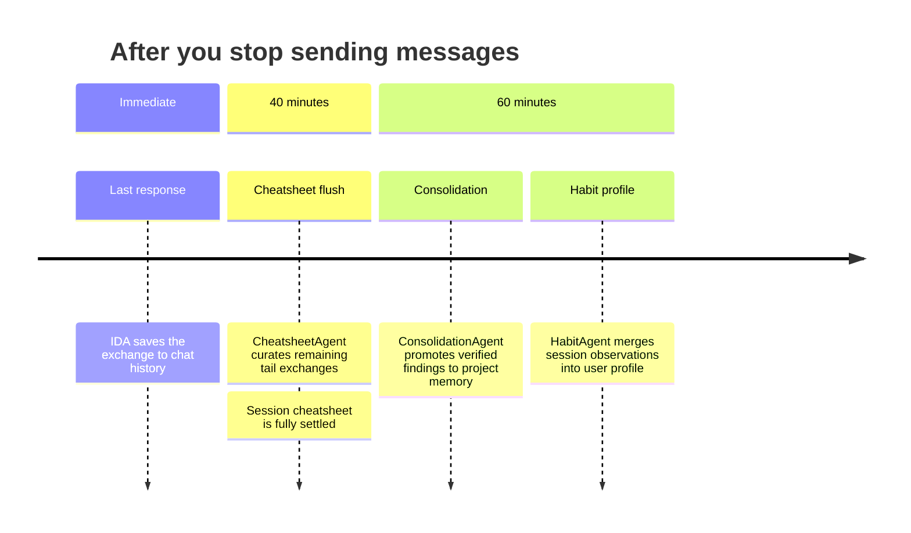

# Persistent Memory

IDA has bounded, curated memory that persists across sessions. This lets her remember well characteristics, data quality observations, operational lessons, and your working preferences — so you don't have to repeat context every time you open a new chat.

---

## How It Works

Memory is built up automatically in the background. You never need to ask IDA to "remember" something — she distils each conversation into structured memory as it progresses, and loads relevant memory at the start of every session.

Four stores make up IDA's memory:

| Store | Purpose | Lifetime |
|---|---|---|
| **Chat history** | Recent exchanges, compressed for token efficiency | Session window |
| **Session cheatsheet** | Structured findings from this conversation | Per chat |
| **Project memory** | Cross-session entities, facts, and lessons | Persistent, per project |
| **User profile** | Your preferred working style and communication preferences | Persistent, per user + project |

The first two are session-scoped. The last two survive across sessions — IDA brings them into every new conversation on the same project.

---

## What IDA Remembers

### Session cheatsheet — what happened in this session

As you work through a conversation, IDA's **CheatsheetAgent** reads each exchange and extracts structured findings into three buckets:

| Bucket | Contents | Example |
|---|---|---|
| `data_insights` | Numeric well findings, keyed by entity | `NNM-101: NPT 54 h during 8½" section` |
| `key_facts` | Data gaps, naming conventions, user knowledge gaps | `WellView export for NNM-103 truncated at 3200 m` |
| `lessons_learned` | Transferable operational insights | `Pre-treat with LCM before entering depleted zones` |

Each finding carries a **confidence** label:
- `verified` — value appears verbatim in a tool result
- `inferred` — derived from narrative or context, not directly confirmed by data
- `conflicted` — same metric has two different values; both entries are preserved, neither dropped

> **Timing note:** IDA keeps the last 6–12 exchanges as a live "working window" and curates older turns as they scroll out. The cheatsheet fully settles within 40 minutes of your last message.

### Project memory — what is known about this project

After a session ends, IDA's **ConsolidationAgent** promotes verified cheatsheet findings into permanent project memory. Three named slots:

| Memory slot | Type | Contents |
|---|---|---|
| `entity_{well}` | Data insight | Merged, deduplicated per-entity numeric findings for each well/BHA/formation |
| `project_facts` | Key facts | Non-quantitative context: data gaps, naming conventions, data coverage |
| `project_lessons` | Lessons learned | Actionable operational insights from prior sessions |

Only `verified` data insights are promoted to permanent memory — numeric claims without direct data grounding stay in the cheatsheet but do not enter project memory. `inferred` key facts and all lessons are promoted because they represent context that is valuable even without tool confirmation.

> When you return to a project, IDA loads relevant project memory into her context before answering. She knows what was established about NNM-101 last week without you having to re-explain it.

### User profile — how you like to work

IDA's **HabitAgent** observes each session and builds a profile of your working style. Five dimensions:

- **Query style** — how you frame questions (concise commands vs. open exploration)
- **Interaction style** — how much explanation you want in responses
- **Output preferences** — tables, narrative, bullet points, or charts
- **Domain focus** — which well systems, metrics, or workflows you care most about
- **Expertise signals** — your familiarity with drilling concepts and terminology

The profile is per-project: your preferences on a shallow gas project may differ from a deep HP/HT well, and IDA keeps them separate.

> The user profile is updated at session end (after ~1 hour of inactivity). Changes take effect in the next session.

---

## How Memory Appears in a Session

At the start of a session, IDA assembles a **context bundle** from all four stores:

```
SHORT-TERM MEMORY
Last N exchanges (compressed) — immediate conversation continuity

SESSION CHEATSHEET
## Data Insights
- NNM-101: TD 2630 m MD (verified)
- NNM-102: max TVD 2562 m (verified)

## Key Facts
- WellView export for NNM-103 truncated at 3200 m (inferred)

## Lessons Learned
- TVD reporting inconsistent near TD on NNM-104 — use MD as primary depth reference (inferred)

PROJECT MEMORY (via tool_recall_project_memory)
[DATA_INSIGHT] entity_nnm101
- NPT 54h in 8.5in section
- ROP avg 18 m/hr

USER PROFILE
Prefers tabular output for depth/ROP comparisons.
Asks follow-up questions per well rather than batching.
```

This bundle is what IDA sees before forming her answer. The cheatsheet keeps session knowledge compact (~2 KB). Project memory is retrieved on-demand via full-text search against the question being asked.

---

## Memory vs. Chat History

| | Chat history | Session cheatsheet | Project memory |
|---|---|---|---|
| **Scope** | Last N turns | Full session | All sessions |
| **Form** | Raw or compressed messages | Structured JSON buckets | Distilled text entries |
| **Updated** | Every exchange | Async, as turns scroll out | After session end |
| **Queried** | Window load | Always injected | FTS on question text |
| **Token cost** | Fixed (last N × compressed) | Fixed (~2 KB) | On-demand (top-K hits) |

---

## Session Boundary Timeline

Memory capture is staggered so each stage reads settled upstream data.



The 20-minute gap between cheatsheet flush and consolidation is intentional — ConsolidationAgent reads the cheatsheet, so it waits for CheatsheetAgent to finish.

For long active sessions (no 60-minute gap), ConsolidationAgent also fires when the cheatsheet cursor has run more than 3 hours ahead of the consolidation cursor — so project memory does not stall mid-session.

---

## What IDA Saves Automatically

You do not need to ask. IDA saves when she learns:

| What | Where | Example |
|---|---|---|
| Numeric well findings confirmed by tool data | `data_insights` | `NNM-102 max TVD = 2562 m, MD = 3845 m` |
| Data quality issues, gaps, anomalies | `key_facts` | `NNM-104 TVD non-monotonic near TD — survey inconsistency suspected` |
| Operational lessons, workflow patterns | `lessons_learned` | `Recompute ROP from delta-MD/delta-time when DDR avg_rop shows repeated values` |
| User style and output preferences | `user_profile` | `Prefers one-well-at-a-time answers with a data quality flag section` |

### What IDA does not save

- Data already obvious from IDA's base drilling knowledge (NPT definition, what ROP means)
- Single-turn ephemera with no reuse value ("what is 2+2")
- `inferred` numeric claims — these live in the cheatsheet but are not promoted to project memory without tool confirmation

---

## Confidence Model

Every cheatsheet finding and project memory entry carries a confidence label. IDA uses this to decide what to promote and how to phrase answers.

| Confidence | Meaning | Promoted to project memory? |
|---|---|---|
| `verified` | Value appears verbatim in a tool result block | Yes (data_insights + key_facts) |
| `inferred` | Derived from IDA's reasoning or narrative context | key_facts and lessons only |
| `conflicted` | Same metric has two different values in the data | Both entries kept; neither promoted until resolved |

> If you ask about a metric where IDA has a `conflicted` entry, she will surface both values and the record IDs, rather than picking one silently.

---

## Searching Past Conversations

Beyond memory injection, IDA can search past conversations on demand using `tool_search_chat_history`. This performs hybrid semantic + keyword search over all RAG-indexed messages within the project — across all chats.

| | Project memory | Chat history search |
|---|---|---|
| **Capacity** | 3 named slots per project | All indexed messages |
| **Speed** | Fast (FTS on pre-distilled text) | ~100 ms hybrid search |
| **Use case** | Known findings, loaded every session | "Did we see this before?" ad-hoc recall |
| **Written by** | ConsolidationAgent (async) | ContextCompressor (on every message) |

**Project memory** holds distilled facts that should always be available. **Chat history search** is for tracing specific past exchanges or re-finding data from earlier sessions.

---

## Configuration

Tail window size (number of live exchanges protected before curating) can be tuned per agent config:

```json
{
  "tail_window_size": 12
}
```

Default is `6`. For long drilling Q&A sessions with many sequential well queries, `12` gives the cheatsheet more working context before committing findings.
