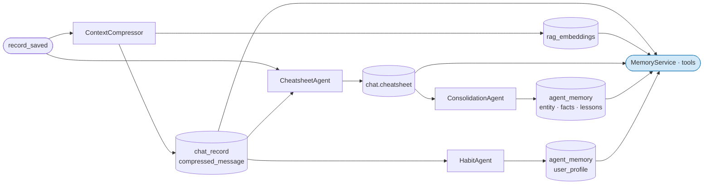

# Project Memory Toolbox

**Location:** `backend/app/agents/tools/toolbox/project_memory_toolbox.py`

---

## Motivation

`MemoryService` assembles memory at prompt build time, before the agent starts reasoning. That is sufficient for context the agent can anticipate needing. But during a multi-step reasoning chain, the agent may discover it needs memory it did not have at the start — a reference to a prior session, a specific past exchange, or a re-check of the current session's findings at a point where the injected snapshot may already be stale.

The memory design needs a second retrieval path: on-demand access to the same memory stores, callable as tools during LLM execution. `ProjectMemoryToolbox` provides that path — the same three memory surfaces as `MemoryService`, but available mid-chain without a new request.

---

## Role in the Memory Pipeline

`ProjectMemoryToolbox` is the on-demand retrieval layer. It reads from the same stores as `MemoryService` but is invoked by the agent during reasoning rather than at prompt build time.



`MemoryService` and `ProjectMemoryToolbox` share the same highlight — they are the two faces of the retrieve layer, differing only in when they are called.

---

## Tools

### `tool_read_project_memory`

FTS search over PROJECT-scoped `agent_memory` — the consolidated findings promoted by `ConsolidationAgent` from prior sessions.

```
Input:  query (str), top_k (int, default 5, max 20)
Output: "[{memory_type}] {name}\n{content_text}" blocks, separated by "---"
Filter: scope=PROJECT, USER_PROFILE entries excluded
Passthrough: project_id
```

USER_PROFILE entries are excluded so user preferences do not appear in analytical result sets. Falls back to `json.dumps(mem.object)` if `content_text` is absent.

Use when: the agent needs cross-session findings that were not injected at prompt build time, or needs to search with a more specific query than the one available at session start.

---

### `tool_search_chat_history`

Hybrid (semantic + keyword) search over RAG-indexed `chat_record` rows — every USER and AGENT message that `ContextCompressor` has embedded.

```
Input:  query (str), top_k (int, default 8, max 20)
Output: "[record_id={id}]\n{content}" blocks, separated by "---"
Filter: source_type=CHAT, project_id
Passthrough: project_id
```

Searches across the full project history — not just the current chat. Results include `record_id` so the agent can correlate a hit with a specific exchange if needed.

Use when: the user references something from an earlier session or from further back in the current conversation than the short-term window covers — e.g. *"what did we find about NNM-102 last week"* or *"what was the ROP issue we discussed earlier"*.

---

### `tool_read_long_term_memory`

Point read of the current session's `chat.cheatsheet`, rendered as markdown — the same output as `MemoryService.load_long_term_memory`.

```
Input:  (none)
Output: render_to_markdown(parse_cheatsheet(raw)) or "(none)"
Passthrough: chat_id
```

Use when: the agent needs to re-check session findings mid-chain and the injected snapshot at session start may be stale — i.e. the cheatsheet has been updated by `CheatsheetAgent` since the prompt was built.

---

## Relationship to MemoryService

`MemoryService` and `ProjectMemoryToolbox` cover the same memory surfaces through different access patterns:

| | `MemoryService` | `ProjectMemoryToolbox` |
|---|---|---|
| **When called** | Prompt build time, before LLM | Mid-chain, by the LLM as a tool call |
| **Who calls it** | Agent framework / orchestrator | The LLM itself |
| **Query** | Fixed at session start | Formed dynamically during reasoning |
| **Cost** | Always paid, even if unused | Paid only when the agent decides it needs it |

Both read the same stores and return the same content. The choice between them is a question of when the need for memory is known — anticipated needs go into `MemoryService`, discovered needs go through the toolbox.
