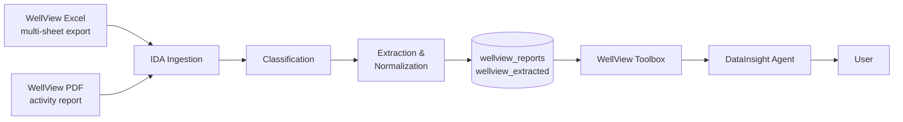
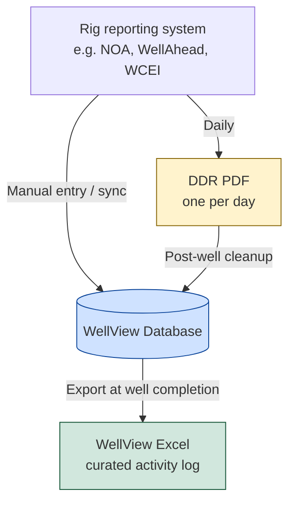
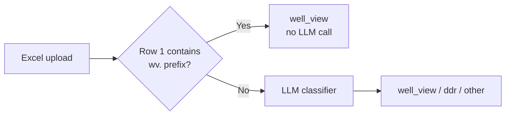
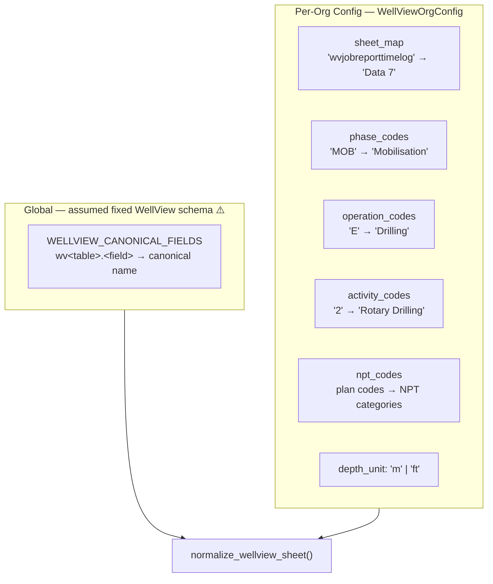
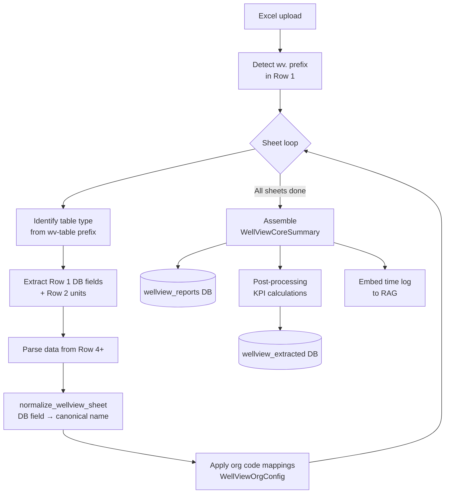
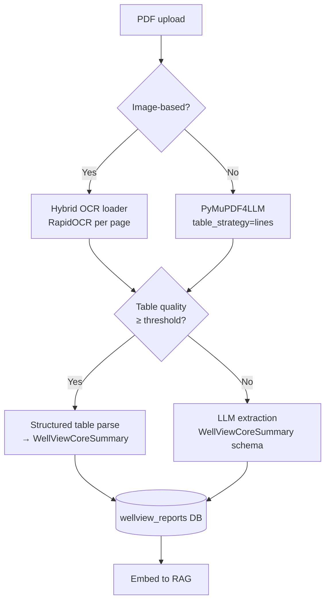
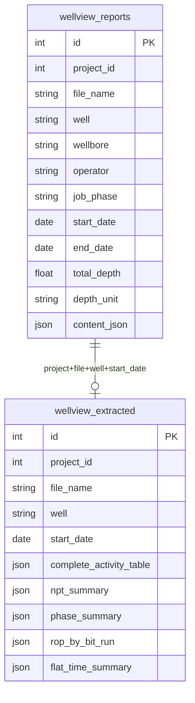
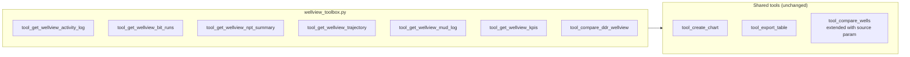
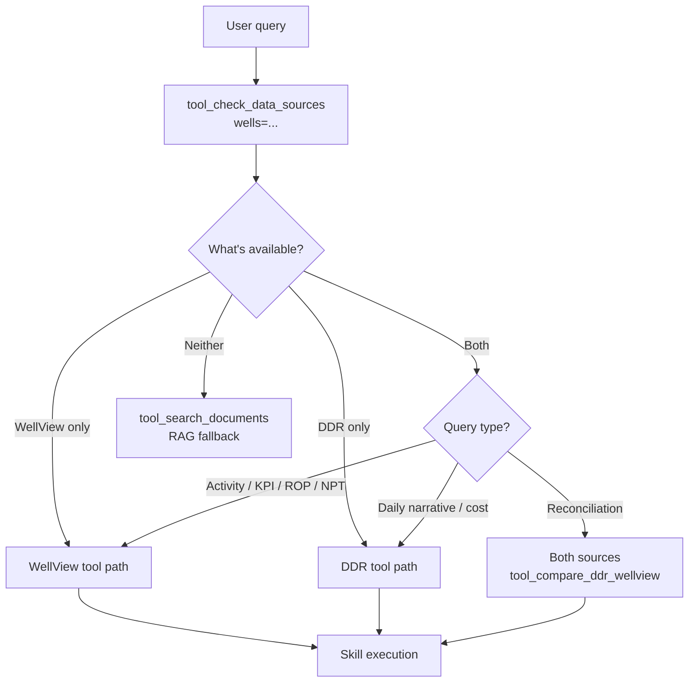

# WellView Data Onboarding — Solution Plan

---

## Overview

WellView (Halliburton/Landmark) is a well data management database used by operators to curate the complete lifecycle record of a well. IDA already classifies WellView documents correctly. This plan covers everything downstream: parsing, schema, storage, analytics, tooling, and agent integration.



---

## 1. Data Sources & Formats

WellView data enters IDA in two forms:

| Format | Typical Source | Structure |
|--------|---------------|-----------|
| **Excel** | Direct WellView DB export template | Multi-sheet workbook — each sheet is a distinct data domain |
| **PDF** | WellView report module / operator export | Header metadata + formatted activity table |

### The Excel Export is a Multi-Sheet Database Dump

A WellView Excel export is **not** a single activity table. It is a structured dump of the WellView database across multiple sheets. Aan Eni example of 10-sheet export covers:

| Sheet (name varies) | WellView Table | Content |
|--------------------|----------------|---------|
| Time Log | `wvjobreporttimelog` | Full activity log — Phase / Operation / Activity codes, timestamps, depths |
| Bit Record | `wvjobdrillstring` | BHA run summary: depth in/out, drilling hours, ROP |
| BHA Components | `wvjobdrillstringcomp` | Component-level BHA: type, OD, length, make/model |
| Directional Survey | `wvwellboredirsurveydata` | MD, inclination, azimuth per survey station |
| Casing | `wvcas` | Casing strings: OD, depth, landing date |
| Mud Log | `wvjobreportmudchk` | Mud check data: density, rheology, depth, date |
| Cementing | `wvcementstage` | Cement stage details per casing string |
| Well Program Phases | `wvjobprogramphase` | Planned vs actual phases: dates, depths, diameter |
| Lithology | `wvgeoevallith` | Formation descriptions by depth interval |
| Well Header | `wvwellheader` | Well name, location, coordinates, permit |

### Consistent Sheet Structure — The Key to Normalization

Sheet names vary per operator export template, but the internal layout is always the same:

```
Row 1 │ wvjobreporttimelog.dttmstartcalc │ wvjobreporttimelog.dttmendcalc │ ...  ← DB field names (STABLE)
Row 2 │ hr                               │ hr                             │ ...  ← Units
Row 3 │ Start Date                       │ End Date                       │ ...  ← Display names (VARY per org)
Row 4 │ 2024-03-22 00:00                 │ 2024-03-22 01:00               │ ...  ← Data
```

The `wv<table>.<field>` names in **Row 1 are identical across all organizations** — they are the WellView product schema. This is the normalization anchor.

---

## 2. DDR & WellView — Source Relationship

> **Do DDRs and WellView come from the same system? Not necessarily — and this matters.**

### WellView is a database. DDRs are reports.

**WellView** stores the curated, long-term well record. It is a product (Halliburton/Landmark) with a fixed database schema.

**DDRs** can be generated from many independent systems:
- Directly from WellView (WellView has a DDR report module)
- From separate rig reporting tools: NOA, WellAhead, ProNova, DIMS, company-internal systems
- Manually authored in Word or Excel

### The typical real-world data flow



**Consequence:** for the same well, DDR PDFs may come from a system that never touched WellView. The WellView Excel is assembled from those daily reports — with corrections, gap-fills, and reclassifications applied post-hoc. **The two records should agree but often diverge.**

### The shared taxonomy

Despite different source systems, DDR time logs and WellView time logs use **the same activity code taxonomy** — Phase / Operation / Activity / Plan codes. This is an operator convention, not a system constraint. It is what makes cross-source reconciliation meaningful.

| Field | DDR Time Log | WellView Time Log |
|-------|-------------|-------------------|
| Phase | `Phase` (MOB, DRILL…) | `code1` |
| Operation | `Opr.` (E, A, D…) | `code2` |
| Activity | `Act.` (1–11) | `code3` |
| Plan | `Plan` (P / NP) | `code4` |

| Scenario | Interpretation |
|----------|---------------|
| **DDR only** | Real-time records; narrative-rich; may have gaps or inconsistencies |
| **WellView only** | Curated post-op log; clean codes; no daily narrative |
| **Both** | WellView = "as-built" record; DDR = real-time source; independent, often diverge |

**IDA must not assume DDR data was ever in WellView.** Always treat them as independent sources.

---

## 3. Classification

The LLM classifier already produces `well_view` correctly. One improvement needed:

### Heuristic Pre-Check for Excel (no LLM needed)

Scan Row 1 for the `wv*.` prefix. If found, classify as `well_view` immediately — no LLM call needed. This is a near-perfect, near-zero-cost signal unique to WellView exports.



---

## 4. Organization-Level Schema Mapping

> **Key principle: normalize on DB field names (Row 1), not display names (Row 3).**

`"Start Date"`, `"Start Time"`, `"Dttm Start"` all map to `wvjobreporttimelog.dttmstartcalc`. The DB field name is stable; the display name is not.

### What varies per org vs what is global



This design **assumes** `wv<table>.<field>` names are identical across all organizations and WellView versions — observed in one ENI Congo export. Whether this holds across operators, WellView versions, and custom configurations needs validation. See Open Questions.

Org-level config handles:
- Which sheet holds which table (sheet names vary by export template)
- Activity/operation/phase code dictionaries (same taxonomy as DDR)
- Unit preference

```python
WELLVIEW_CANONICAL_FIELDS = {
    "start_time":     "wvjobreporttimelog.dttmstartcalc",
    "end_time":       "wvjobreporttimelog.dttmendcalc",
    "duration_hours": "wvjobreporttimelog.duration",
    "phase":          "wvjobreporttimelog.code1",
    "operation":      "wvjobreporttimelog.code2",
    "activity":       "wvjobreporttimelog.code3",
    "plan":           "wvjobreporttimelog.code4",
    "from_depth":     "wvjobreporttimelog.depthstart",
    "to_depth":       "wvjobreporttimelog.depthend",
    "description":    "wvjobreporttimelog.actdes",
    "bha_no":         "wvjobdrillstring.stringno",
    "depth_in":       "wvjobdrillstring.depthincalc",
    "depth_out":      "wvjobdrillstring.depthoutcalc",
    # ... etc per table
}
```

---

## 5. Processing Pipelines

### 5.1 Excel WellView — Direct Pandas Parsing (No LLM)

Excel exports are already structured. LLM extraction is unnecessary and fragile here.



### 5.2 PDF WellView — Table Extraction with LLM Fallback



PDF exports typically contain only the time log (no multi-sheet structure).

---

## 6. Schema Design

New file: `backend/app/agents/utils/wellview_extraction.py`

```python
class WellViewActivity(BaseModel):
    phase: Optional[str]             # code1: "DRILL", "MOB", "MOVING"
    operation: Optional[str]         # code2: "E", "A", "D", "G"
    activity: Optional[str]          # code3: numeric activity code
    plan: Optional[str]              # code4: "P" (productive) / "NP" (non-productive)
    description: Optional[str]
    start_time: Optional[datetime]
    end_time: Optional[datetime]
    duration_hours: Optional[float]
    cum_duration_hours: Optional[float]
    from_depth: Optional[float]
    to_depth: Optional[float]
    depth_unit: Optional[str]

class WellViewBitRun(BaseModel):
    bha_no: int
    drill_string_name: Optional[str]
    bit_description: Optional[str]
    depth_in: Optional[float]
    depth_out: Optional[float]
    depth_drilled: Optional[float]
    drilling_hours: Optional[float]
    rop: Optional[float]
    date_in: Optional[date]
    date_out: Optional[date]

class WellViewSurveyPoint(BaseModel):
    md: float
    inclination: Optional[float]
    azimuth: Optional[float]
    date: Optional[date]

class WellViewCoreSummary(BaseModel):
    well: str
    wellbore: Optional[str]
    operator: Optional[str]
    job_phase: Optional[str]        # "DRILLING", "COMPLETION"
    start_date: Optional[date]
    end_date: Optional[date]
    total_depth: Optional[float]
    depth_unit: Optional[str]
    activities: List[WellViewActivity]
    bit_runs: List[WellViewBitRun]
    survey: List[WellViewSurveyPoint]
```

Register in `document_schema_registry.py` alongside the existing DDR schema.

---

## 7. Database Storage

New file: `backend/app/db/wellview.py`, mirroring the `ddr.py` / `ddr_extracted.py` pattern.



**Deduplication key:** `project_id + file_name + well + start_date` — same pattern as DDR.

---

## 8. Post-Processing Analytics

Computed at ingestion time and stored in `wellview_extracted`. Uses the same org-level code mapping system as DDR (`map_activity_codes_to_sub_activity`).

| Field | Computed From | Purpose |
|-------|--------------|---------|
| `complete_activity_table` | Time log + org code mappings | Normalized, human-readable activity log |
| `npt_summary` | `plan="NP"` rows + activity codes | NPT hours by category |
| `phase_summary` | `wvjobprogramphase` sheet or inferred from depth | Time & depth per drilling section |
| `rop_by_bit_run` | Bit record sheet | ROP per BHA run |
| `flat_time_summary` | Non-drilling activity aggregation | Breakdown of non-productive time categories |

---

## 9. WellView Toolbox

**A dedicated `wellview_toolbox.py` is the right call.** The existing `data_insight_toolbox.py` is DDR-centric; WellView has a fundamentally different data contract (depth-indexed, multi-domain, no cost data).



| Tool | Data Source | Purpose |
|------|------------|---------|
| `tool_get_wellview_activity_log` | `wellview_extracted.complete_activity_table` | Full activity log with optional phase/date/depth filters |
| `tool_get_wellview_bit_runs` | `wellview_extracted.rop_by_bit_run` | BHA run summary with ROP |
| `tool_get_wellview_npt_summary` | `wellview_extracted.npt_summary` | NPT by category, section, or date range |
| `tool_get_wellview_trajectory` | `wellview_reports.content_json.survey` | Survey data for directional plots |
| `tool_get_wellview_mud_log` | `wellview_reports.content_json` (mud sheet) | Mud properties over time/depth |
| `tool_get_wellview_kpis` | `wellview_extracted` | Pre-computed KPIs |
| `tool_compare_ddr_wellview` | Both DBs | Cross-source reconciliation |

---

## 10. DataInsight Agent — Extend, Not Replace

**The DataInsight agent should be extended to cover WellView — not replaced or split.** Users ask the same operational questions regardless of data source. Forcing them to choose an agent based on data type is a bad experience.

### Source Detection First

Before any skill execution, the agent checks what structured data exists for the requested wells:



### Updated Data Source Priority

| Priority | Source | When |
|----------|--------|------|
| 1 | WellView tools | WellView data exists AND query is activity/KPI-based |
| 2 | DDR tools | No WellView available; or query needs daily narrative or cost |
| 3 | Both | Reconciliation request; or WellView exists but DDR narrative adds context |
| 4 | `tool_search_documents` | No structured data; or document content query |

### Skill Changes

Existing skills need only a small **Source Routing** section added at the top. Output format, domain heuristics, and do-not rules are data-source-agnostic and stay unchanged.

```markdown
## Source Routing
- WellView available → use tool_get_wellview_npt_summary / tool_get_wellview_kpis
- DDR only → existing DDR tool path unchanged
- Both → WellView as primary; DDR for narrative context on "why" questions
```

**`cost-analysis` stays DDR-only** — WellView exports contain no cost data.

**`bha-casing-mud` gains a WellView path** — WellView has dedicated casing and mud sheets.

### New WellView-Only Skills

| New Skill | Triggered by |
|-----------|-------------|
| `wellview-activity-log` | "Show full activity log", Gantt timeline requests |
| `wellview-trajectory` | "Plot the well path", directional survey requests |
| `wellview-reconciliation` | "Compare DDR vs WellView", data quality queries |

### Mixed-Source Well Comparisons

When comparing wells where some have WellView and others have DDR only, the comparison table must flag the data source per well. WellView-sourced metrics are more reliable (curated); DDR-sourced metrics are real-time and may have gaps.

### Agent Changes Summary

| Component | Change |
|-----------|--------|
| `AGENT.md` | Broaden description; add source detection step; update priority table |
| `npt-analysis` | + Source Routing section |
| `drilling-progress` | + Source Routing section |
| `well-comparison` | + Source Routing section; mixed-source note |
| `cost-analysis` | + Source Routing section (DDR only — no WellView cost data) |
| `bha-casing-mud` | + Source Routing section (WellView casing + mud path) |
| New: `wellview-activity-log` | Full timeline / Gantt queries |
| New: `wellview-trajectory` | Directional survey queries |
| New: `wellview-reconciliation` | DDR vs WellView cross-check |

---

## 11. User Interaction

### Supported Query Patterns

| User Question | Data Path | Visualization |
|--------------|-----------|--------------|
| "Show the full activity log for NNM-101" | `tool_get_wellview_activity_log` | Gantt / table |
| "What was ROP per section?" | `tool_get_wellview_bit_runs` | Bar chart |
| "Show NPT breakdown" | `tool_get_wellview_npt_summary` | Pie / stacked bar |
| "Plot the well trajectory" | `tool_get_wellview_trajectory` | 2D inclination / 3D path |
| "How did mud weight change?" | `tool_get_wellview_mud_log` | Scatter vs depth |
| "Compare WellView vs DDR time logs" | `tool_compare_ddr_wellview` | Diff table |
| "Compare NPT across 3 wells" | `tool_compare_wells(source="auto")` | Grouped bar |
| "Show casing program" | `tool_get_wellview_activity_log(phase="casing")` | Table |
| "What was the flat time?" | `tool_get_wellview_kpis` | Waterfall |

---

## 12. Implementation Roadmap

```mermaid
gantt
    title WellView Onboarding — Implementation Phases
    dateFormat  YYYY-MM-DD
    section Phase 1 · Foundation
    WellViewCoreSummary schema + wellview_extraction.py   :p1a, 2025-05-01, 5d
    wellview DB tables + WellViewManager                  :p1b, after p1a, 4d
    WellViewOrgConfig + code mapping system               :p1c, after p1a, 4d
    Register schema in document_schema_registry.py        :p1d, after p1b, 1d

    section Phase 2 · Ingestion
    Excel parser — wv. detection + sheet identification   :p2a, after p1d, 5d
    normalize_wellview_sheet() on DB field names          :p2b, after p2a, 3d
    PDF extraction prompt for WellView                    :p2c, after p2a, 3d
    Hook into document_processing_toolbox.py              :p2d, after p2b, 2d
    wellview_extracted post-processing (KPI + NPT)        :p2e, after p2d, 4d

    section Phase 3 · Toolbox & Query
    wellview_toolbox.py — all 7 tools                     :p3a, after p2e, 6d
    Extend tool_compare_wells with source routing         :p3b, after p3a, 2d
    tool_compare_ddr_wellview reconciliation              :p3c, after p3a, 3d

    section Phase 4 · Agent Integration
    Source detection + AGENT.md update                   :p4a, after p3a, 2d
    Source Routing sections in existing skills            :p4b, after p4a, 3d
    New skills: activity-log, trajectory, reconciliation  :p4c, after p4b, 4d
    Cross-reference detection at ingestion time           :p4d, after p4c, 3d
```

---

## 13. Open Questions

### For drilling engineers

| # | Question | Why it matters |
|---|----------|---------------|
| 1 | **Are `wv<table>.<field>` DB field names identical across all WellView installations and versions?** | The entire normalization strategy depends on this. Observed in one ENI Congo export — needs confirmation across operators and WellView versions. If field names vary, org-level config must also cover field name mappings, not just sheet location. |
| 2 | **Do all operators export WellView using the same multi-row header convention (Row 1 = DB fields, Row 2 = units, Row 3 = display names)?** | This is the detection and parsing foundation. If some orgs export without DB field names in Row 1, the heuristic pre-check fails. |
| 3 | **Is the Phase/Operation/Activity/Plan code taxonomy truly consistent between DDR systems and WellView across operators?** | Shared codes are what make DDR↔WellView reconciliation meaningful. If operators use different code sets in each system, reconciliation degrades to timestamp-only alignment. |
| 4 | **How complete and reliable are WellView exports in practice?** | Are there commonly missing sheets? Are timestamps always populated? Are depth values in consistent units within a single export? |
| 5 | **Which sheets are most commonly included in a WellView export?** | Helps prioritize Phase 1 ingestion scope — time log is assumed universal, but trajectory, mud, and casing inclusion may vary. |

### Design decisions (internal)

| # | Question | Options |
|---|----------|---------|
| 6 | **All sheets vs time log only in Phase 1?** | Phase 1: time log only (fastest to value). Phase 2: add trajectory, mud, BHA. |
| 7 | **NPT code mapping** | Share the org-level code config with DDR, or maintain separate WellView mappings? |
| 8 | **Phase detection** | Use `wvjobprogramphase` sheet when present; infer from depth + activity codes when absent. |
